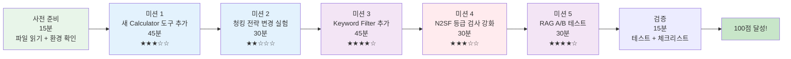
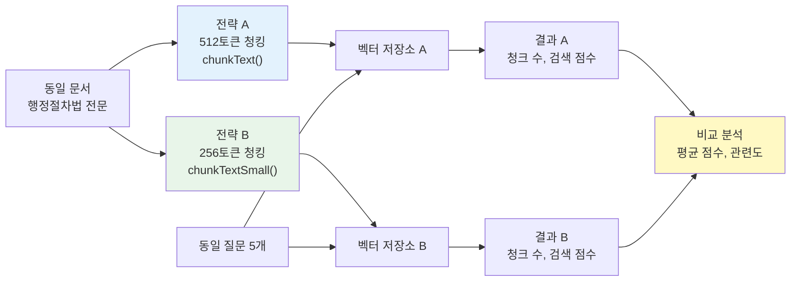
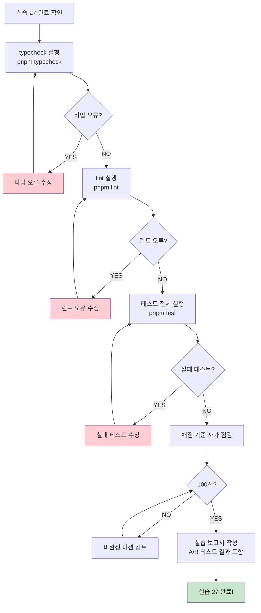

# 실습 27: AI 서비스 기능 확장 — 새 도구 추가, 커스텀 RAG, N2SF 검증 강화

> **난이도**: 중급  
> **예상 시간**: 3시간 (미션별 분배: 45+30+45+30+30분)  
> **전제 조건**: 실습 25 완료 (RAG 기초), 48장 AI 서비스 완전 분석 읽기  
> **관련 파일**:  
>   - `platform/services/ai-service/src/lib/ai-tools.ts`  
>   - `platform/services/ai-service/src/lib/rag-engine.ts`  
>   - `platform/services/ai-service/src/lib/chunker.ts`  
> **CSAP 관련 항목**: D-12 시스템 개발 보안, D-06 침해사고 관리

---

## 실습 목표

이 실습을 완료하면 다음을 할 수 있게 됩니다.

1. AI 에이전트에 새 도구를 추가하고 보안 검증까지 통과시키기
2. 청킹 전략을 변경하고 RAG 성능에 미치는 영향 측정하기
3. RAG 검색 결과에 커스텀 필터를 적용하기
4. N2SF 데이터 등급 검사 로직을 확장하기
5. A/B 테스트로 두 가지 청킹 전략을 정량 비교하기

---

## 학습 경로 다이어그램



---

## 사전 준비 (15분)

### 환경 확인

```bash
# 1. AI 서비스 실행 상태 확인
cd /data/ai-saas
pnpm --filter @public-saas/ai-service build

# 2. 타입 검사 통과 확인
pnpm --filter @public-saas/ai-service typecheck

# 3. 린트 확인
pnpm --filter @public-saas/ai-service lint
```

모두 통과하면 사전 준비 완료입니다.

### 기준선 측정

실습 전 현재 RAG 성능을 기록해두세요. 미션 5의 A/B 테스트에 필요합니다.

```bash
# 기준선 측정용 스크립트 (로컬 개발 서버 실행 상태에서)
curl -s -X POST http://localhost:3005/ai/rag/ingest \
  -H 'Content-Type: application/json' \
  -H 'x-internal-service-key: dev-test-key' \
  -d '{
    "tenantId": "00000000-0000-0000-0000-000000000001",
    "grade": "O",
    "title": "실습용 행정절차법 테스트",
    "content": "제1조(목적) 이 법은 행정청의 행정절차에 관한 공통적인 사항을 규정하여 국민의 행정 참여를 도모함으로써 행정의 공정성 투명성 및 신뢰성을 확보하고 국민의 권익을 보호함을 목적으로 한다.\n\n제2조(정의) 행정청이란 행정에 관한 의사를 결정하여 표시하는 국가 또는 지방자치단체의 기관을 말한다.\n\n제17조(처분의 사전통지) 행정청은 당사자에게 의무를 부과하거나 권익을 제한하는 처분을 하는 경우에는 미리 처분의 제목 당사자의 성명 또는 명칭과 주소 처분하려는 원인이 되는 사실과 처분의 내용 및 법적 근거를 통지하여야 한다."
  }' | python3 -m json.tool
# chunkCount를 기록해두세요 (기준: 512토큰 청크 크기)
```

---

## 미션 1: 새 Calculator 도구 추가 (45분)

### 미션 목표

현재 `ai-tools.ts`의 `calculate` 도구는 기본 사칙연산만 지원합니다. 공공기관 예산 업무에서는 **퍼센트 계산**과 **거듭제곱**이 자주 필요합니다. 이 기능을 안전하게 추가하겠습니다.

### 현재 코드 분석

먼저 현재 `safeEvaluate()` 함수의 한계를 이해합니다.

```typescript
// 현재 ai-tools.ts 130~131번째 줄
if (!/^[\d\s+\-*/().,]+$/.test(expression)) {
  return { success: false, output: '', error: '허용되지 않는 계산식입니다. 숫자와 사칙연산만 가능합니다.' };
}
// 문제: '%', '^' 문자가 화이트리스트에 없어서 차단됨
```

현재 `safeEvaluate()`는 `+`, `-`, `*`, `/`, `()`, `.`, 숫자만 허용합니다. `%`나 `^`를 추가하려면 파서도 확장해야 합니다.

### 단계별 구현

#### 단계 1.1 — 퍼센트와 거듭제곱 계산 로직 이해

퍼센트와 거듭제곱을 지원하는 방법은 두 가지입니다.

**방법 A: 전처리 방식** (단순, 권장)
```
"100 * 15%" → 전처리 → "100 * 0.15" → 기존 safeEvaluate()
"2^10"      → 전처리 → "2**10"      → 파서 확장
```

**방법 B: 파서 직접 확장** (복잡, 학습 목적)
```
safeEvaluate 파서에 % 연산자와 ^ 연산자 처리 케이스 추가
```

이 실습에서는 **방법 A**를 구현합니다. 단순하고 안전하며 실제 프로젝트에서도 권장됩니다.

#### 단계 1.2 — 새 도구 정의 추가

`/data/ai-saas/platform/services/ai-service/src/lib/ai-tools.ts`를 편집합니다.

**TOOL_DEFINITIONS 배열에 추가**:

```typescript
// ai-tools.ts — TOOL_DEFINITIONS 배열 끝 (format_document 다음)에 추가
{
  name: 'calculate_advanced',
  description: '예산 계산, 퍼센트, 거듭제곱 계산을 수행합니다. 예: "예산의 15%", "2의 10승"',
  parameters: {
    expression: {
      type: 'string',
      description: '계산식. 예: "1000000 * 15%", "2^10", "(100+200) * 3"',
      required: true,
    },
    format: {
      type: 'string',
      description: '결과 형식: currency(통화), percent(퍼센트), number(기본)',
      required: false,
    },
  },
},
```

#### 단계 1.3 — 안전한 전처리 함수 작성

```typescript
// ai-tools.ts 파일 하단에 추가 (safeEvaluate() 함수 다음)

/**
 * 고급 수식 전처리: % → 소수점, ^ → ** 변환
 * CSAP D-12: 화이트리스트 기반 검증 후 변환
 */
function preprocessAdvancedExpression(expression: string): string | null {
  // 1단계: 허용 문자 화이트리스트 검증 (확장 버전)
  // 기존: /^[\d\s+\-*/().,]+$/
  // 신규: % ^ 추가
  if (!/^[\d\s+\-*/().,%^]+$/.test(expression)) {
    return null; // 허용되지 않는 문자 → 전처리 실패
  }

  let processed = expression;

  // 2단계: % 변환 (숫자 뒤의 %를 /100으로 변환)
  // "15%" → "(15/100)", "1000 * 15%" → "1000 * (15/100)"
  processed = processed.replace(/(\d+\.?\d*)\s*%/g, '($1/100)');

  // 3단계: ^ 변환 (거듭제곱을 반복 곱셈으로 변환)
  // "2^3" → "2*2*2" (안전한 정수 지수만 지원)
  // 주의: 음수 지수, 소수 지수는 보안상 금지
  processed = processed.replace(/(\d+)\s*\^\s*(\d+)/g, (match, base, exp) => {
    const baseNum = parseInt(base, 10);
    const expNum = parseInt(exp, 10);
    // 안전 범위 검증: 지수 최대 10, 기저 최대 1000
    if (expNum > 10 || baseNum > 1000) return match; // 안전 범위 초과 → 변환 거부
    // 반복 곱셈으로 전개
    const expanded = Array(expNum).fill(String(baseNum)).join('*');
    return `(${expanded})`;
  });

  return processed;
}

/**
 * 결과 포맷팅 (통화, 퍼센트, 일반)
 */
function formatCalculationResult(value: number, format: string): string {
  switch (format) {
    case 'currency':
      return `${value.toLocaleString('ko-KR')}원`;
    case 'percent':
      return `${(value * 100).toFixed(2)}%`;
    default:
      return String(Math.round(value * 10000) / 10000); // 소수점 4자리
  }
}
```

#### 단계 1.4 — 실행기에 추가

`createToolExecutors()` 함수의 반환 객체에 추가합니다.

```typescript
// createToolExecutors 반환 객체에 추가
calculate_advanced: async (params): Promise<ToolCallResult> => {
  const expression = String(params['expression'] ?? '');
  const format = String(params['format'] ?? 'number');

  // 1단계: 전처리 (% 및 ^ 변환)
  const preprocessed = preprocessAdvancedExpression(expression);
  if (preprocessed === null) {
    return {
      success: false,
      output: '',
      error: '허용되지 않는 문자가 포함되어 있습니다. 숫자, 사칙연산, %, ^ 만 사용 가능합니다.',
    };
  }

  // 2단계: 기존 safeEvaluate로 계산
  try {
    const result = safeEvaluate(preprocessed);
    if (result === null) {
      return { success: false, output: '', error: '계산 실패: 유효하지 않은 수식입니다' };
    }

    // 3단계: 결과 포맷팅
    const formatted = formatCalculationResult(result, format);
    return { success: true, output: `${result} (${formatted})` };
  } catch {
    return { success: false, output: '', error: '계산 실패' };
  }
},
```

#### 단계 1.5 — 테스트 작성

```typescript
// platform/services/ai-service/src/__tests__/ai-tools-advanced.test.ts (신규 작성)
import { createToolExecutors } from '../lib/ai-tools.js';

describe('calculate_advanced 도구', () => {
  const executors = createToolExecutors();

  test('기본 퍼센트 계산', async () => {
    const result = await executors['calculate_advanced']({ expression: '1000000 * 15%' });
    expect(result.success).toBe(true);
    expect(result.output).toContain('150000');
  });

  test('거듭제곱 계산', async () => {
    const result = await executors['calculate_advanced']({ expression: '2^10' });
    expect(result.success).toBe(true);
    expect(result.output).toContain('1024');
  });

  test('복합 계산', async () => {
    const result = await executors['calculate_advanced']({
      expression: '(5000000 + 3000000) * 22%',
      format: 'currency',
    });
    expect(result.success).toBe(true);
    expect(result.output).toContain('1,760,000원');
  });

  test('보안 검증 — 금지 문자 차단', async () => {
    const result = await executors['calculate_advanced']({
      expression: 'require("fs")',
    });
    expect(result.success).toBe(false);
    expect(result.error).toBeTruthy();
  });

  test('보안 검증 — 지나치게 큰 지수 차단', async () => {
    // 2^100은 천문학적 숫자 → 계산 폭발 방지
    const result = await executors['calculate_advanced']({ expression: '2^100' });
    // 전처리에서 변환 거부 → safeEvaluate가 '^'를 허용하지 않아 실패
    expect(result.success).toBe(false);
  });

  test('CSAP D-12 — eval() 미사용 확인', () => {
    // safeEvaluate 함수 소스에 'eval' 미포함 확인
    // (이 테스트는 코드 리뷰용 문서화 목적)
    const toolsSrc = require('fs').readFileSync(
      require('path').join(__dirname, '../lib/ai-tools.ts'),
      'utf-8'
    );
    expect(toolsSrc).not.toContain('eval(');
    expect(toolsSrc).not.toContain('new Function(');
  });
});
```

### 검증

```bash
# 타입 검사
pnpm --filter @public-saas/ai-service typecheck

# 테스트 실행
pnpm --filter @public-saas/ai-service test ai-tools-advanced

# 린트
pnpm --filter @public-saas/ai-service lint
```

### 미션 1 체크포인트

```
□ TOOL_DEFINITIONS에 calculate_advanced 추가됨
□ preprocessAdvancedExpression() 함수가 % 및 ^ 전처리
□ 화이트리스트 정규식이 % ^ 포함
□ 지수 크기 제한 (max 10) 구현됨
□ createToolExecutors에 실행기 추가됨
□ 테스트 5개 통과
□ eval() 미사용 확인
□ CSAP D-12 보안 체크리스트 통과
```

---

## 미션 2: 청킹 전략 변경 실험 (30분)

### 미션 목표

현재 `chunker.ts`의 기본 청크 크기는 512토큰입니다. 이를 256토큰으로 변경했을 때 RAG 성능이 어떻게 달라지는지 실험합니다.

### 이론적 배경

```
512토큰 청크:
  장점: 더 많은 맥락 포함 → LLM이 풍부한 배경지식으로 답변
  단점: 검색 정확도 낮음 → 질문과 관련 없는 내용도 포함될 수 있음

256토큰 청크:
  장점: 검색 정확도 높음 → 질문과 관련된 구절만 정밀하게 찾음
  단점: 맥락이 부족 → 청크가 잘려서 의미 손실 가능
```

### 실험 설정

#### 단계 2.1 — 실험용 chunker 함수 추가

`chunker.ts`를 수정하지 않고, 별도 함수를 추가합니다. (기존 코드는 유지)

```typescript
// chunker.ts 파일 끝에 추가

// NOTE: 실험용 함수 — 미션 2 A/B 테스트용. 미션 5 완료 후 삭제 예정.
/**
 * 소형 청킹 전략 (256토큰) — 정밀 검색 최적화
 * Plan SC: 실습 27 미션 2 (실험용)
 */
export function chunkTextSmall(text: string): TextChunk[] {
  return chunkText(text, 256, 25); // 청크 256토큰, 오버랩 25토큰
}

/**
 * 대형 청킹 전략 (1024토큰) — 맥락 보존 최적화
 * Plan SC: 실습 27 미션 2 (실험용)
 */
export function chunkTextLarge(text: string): TextChunk[] {
  return chunkText(text, 1024, 100); // 청크 1024토큰, 오버랩 100토큰
}
```

#### 단계 2.2 — 청크 크기별 결과 비교 테스트

```typescript
// platform/services/ai-service/src/__tests__/chunker-experiment.test.ts
import { chunkText, chunkTextSmall, chunkTextLarge } from '../lib/chunker.js';
import * as fs from 'fs';
import * as path from 'path';

// 실험용 샘플 문서 (충분한 길이 필요)
const sampleDocument = `
제1조(목적) 이 법은 행정청의 행정절차에 관한 공통적인 사항을 규정하여 국민의 행정 참여를 도모함으로써 행정의 공정성·투명성 및 신뢰성을 확보하고 국민의 권익을 보호함을 목적으로 한다.

제2조(정의) 이 법에서 사용하는 용어의 뜻은 다음과 같다.
1. "행정청"이란 행정에 관한 의사를 결정하여 표시하는 국가 또는 지방자치단체의 기관, 그 밖에 법령 또는 자치법규에 따라 행정권한을 가지고 있거나 위임 또는 위탁받은 공공단체나 그 기관 또는 사인(私人)을 말한다.

제3조(적용 범위) 처분, 신고, 확인, 공청회, 행정상 입법예고, 행정예고 및 행정지도의 절차에 관하여 다른 법률에 특별한 규정이 있는 경우를 제외하고는 이 법에서 정하는 바에 따른다.

제4조(신의성실 및 신뢰보호) ① 행정청은 직무를 수행할 때 신의(信義)에 따라 성실히 하여야 한다.
② 행정청은 법령등의 해석 또는 행정청의 관행이 일반적으로 국민들에게 받아들여진 때에는 공익 또는 제3자의 정당한 이익을 현저히 해칠 우려가 있는 경우를 제외하고는 새로운 해석 또는 관행에 따라 소급하여 불리하게 처리하여서는 아니 된다.

제17조(처분의 사전통지) ① 행정청은 당사자에게 의무를 부과하거나 권익을 제한하는 처분을 하는 경우에는 미리 다음 각 호의 사항을 당사자등에게 통지하여야 한다.
1. 처분의 제목
2. 당사자의 성명 또는 명칭과 주소
3. 처분하려는 원인이 되는 사실과 처분의 내용 및 법적 근거

제21조(의견청취의 방법) ① 다음 각 호의 어느 하나에 해당하는 경우에 행정청은 청문을 한다.
1. 다른 법령등에서 청문을 하도록 규정하고 있는 경우
2. 행정청이 필요하다고 인정하는 경우
`.repeat(3); // 3배 반복으로 충분한 길이 확보

describe('청킹 전략 비교 실험', () => {
  test('기본(512) vs 소형(256) vs 대형(1024) 청크 수 비교', () => {
    const standard = chunkText(sampleDocument);
    const small = chunkTextSmall(sampleDocument);
    const large = chunkTextLarge(sampleDocument);

    console.log('=== 청킹 전략 비교 ===');
    console.log(`표준 (512토큰): ${standard.length}개 청크`);
    console.log(`소형 (256토큰): ${small.length}개 청크`);
    console.log(`대형 (1024토큰): ${large.length}개 청크`);
    console.log(`소형/표준 비율: ${(small.length / standard.length).toFixed(2)}배`);

    // 소형이 표준보다 청크가 많아야 함
    expect(small.length).toBeGreaterThan(standard.length);
    // 대형이 표준보다 청크가 적어야 함
    expect(large.length).toBeLessThan(standard.length);
  });

  test('각 청킹 전략의 평균 토큰 수 측정', () => {
    const standard = chunkText(sampleDocument);
    const small = chunkTextSmall(sampleDocument);
    const large = chunkTextLarge(sampleDocument);

    const avgTokens = (chunks: typeof standard) =>
      Math.round(chunks.reduce((sum, c) => sum + c.tokenCount, 0) / chunks.length);

    console.log(`표준 평균 토큰: ${avgTokens(standard)}`);
    console.log(`소형 평균 토큰: ${avgTokens(small)}`);
    console.log(`대형 평균 토큰: ${avgTokens(large)}`);

    expect(avgTokens(small)).toBeLessThan(avgTokens(standard));
    expect(avgTokens(large)).toBeGreaterThan(avgTokens(standard));
  });

  test('오버랩 비율 확인 (연속 청크 간 내용 중복)', () => {
    const standard = chunkText(sampleDocument);
    if (standard.length < 2) return;

    const chunk1 = standard[0]!;
    const chunk2 = standard[1]!;

    // 오버랩: chunk1의 끝 부분이 chunk2의 시작에 포함되는지
    const chunk1End = chunk1.content.slice(-100);
    const hasOverlap = chunk2.content.includes(chunk1End.slice(0, 20));

    console.log(`오버랩 감지: ${hasOverlap}`);
    // 오버랩이 있어야 청크 경계에서 의미 손실 방지됨
    expect(hasOverlap).toBe(true);
  });
});
```

### 미션 2 체크포인트

```
□ chunkTextSmall() 함수 추가됨 (256토큰, 오버랩 25)
□ chunkTextLarge() 함수 추가됨 (1024토큰, 오버랩 100)
□ NOTE 주석으로 실험용임을 명시
□ 청킹 비교 테스트 통과
□ 소형 청킹이 더 많은 청크를 생성함을 확인
□ 오버랩이 연속 청크 간에 존재함을 확인
```

---

## 미션 3: Keyword Filter 추가 (45분)

### 미션 목표

현재 RAG 검색은 코사인 유사도만으로 결과를 필터링합니다. 여기에 **키워드 포함 여부** 필터를 추가하면 특정 법령명, 조항 번호 등 정확한 키워드가 있는 결과만 반환할 수 있습니다.

### 왜 키워드 필터가 필요한가?

```
시나리오: "제17조 처분 사전통지 요건"으로 RAG 질의
  
코사인 유사도만 사용:
  [0.82] "처분이란 행정청이..." (제17조가 아닌 제2조 내용)
  [0.79] "제17조 처분의 사전통지를..." ← 원하는 결과
  [0.75] "통지는 서면으로..." (일반 통지 내용)

키워드 필터 추가:
  키워드: ["제17조"]
  [0.79] "제17조 처분의 사전통지를..." ← 키워드 있음 → 포함
  [0.82] "처분이란..." ← 키워드 없음 → 제외
  [0.75] "통지는 서면으로..." ← 키워드 없음 → 제외
```

### 구현

#### 단계 3.1 — KeywordFilter 타입 및 함수 추가

`rag-engine.ts`를 수정합니다.

```typescript
// rag-engine.ts — RAGOptions 인터페이스 확장
export interface RAGOptions {
  topK?: number;
  minScore?: number;
  maxContextTokens?: number;
  systemPrompt?: string;
  // 추가: 키워드 필터
  keywordFilter?: {
    /** 반드시 포함되어야 하는 키워드 배열 (AND 조건) */
    mustInclude?: string[];
    /** 하나라도 포함되면 되는 키워드 배열 (OR 조건) */
    anyOf?: string[];
    /** 포함되면 안 되는 키워드 배열 (NOT 조건) */
    exclude?: string[];
    /** 대소문자 구분 여부 (기본: false = 구분 없음) */
    caseSensitive?: boolean;
  };
}
```

#### 단계 3.2 — 필터 함수 구현

```typescript
// rag-engine.ts — runRAG 함수 근처에 추가

/**
 * 키워드 필터 적용
 * CSAP D-12: 입력 검증 — 정규식 인젝션 방지 위해 escapeRegex 적용
 */
function applyKeywordFilter(
  content: string,
  filter: NonNullable<RAGOptions['keywordFilter']>,
): boolean {
  const { mustInclude, anyOf, exclude, caseSensitive = false } = filter;
  const flags = caseSensitive ? 'g' : 'gi';

  // 정규식 특수문자 이스케이프 (인젝션 방지)
  function escapeRegex(str: string): string {
    return str.replace(/[.*+?^${}()|[\]\\]/g, '\\$&');
  }

  // NOT 조건: 제외 키워드가 있으면 false
  if (exclude && exclude.length > 0) {
    for (const keyword of exclude) {
      if (new RegExp(escapeRegex(keyword), flags).test(content)) {
        return false; // 제외 키워드 발견 → 필터 탈락
      }
    }
  }

  // AND 조건: 필수 키워드 모두 포함 확인
  if (mustInclude && mustInclude.length > 0) {
    for (const keyword of mustInclude) {
      if (!new RegExp(escapeRegex(keyword), flags).test(content)) {
        return false; // 필수 키워드 없음 → 필터 탈락
      }
    }
  }

  // OR 조건: 하나라도 포함 확인
  if (anyOf && anyOf.length > 0) {
    const hasAny = anyOf.some((keyword) =>
      new RegExp(escapeRegex(keyword), flags).test(content)
    );
    if (!hasAny) return false; // 아무 키워드도 없음 → 필터 탈락
  }

  return true; // 모든 조건 통과
}
```

#### 단계 3.3 — runRAG에 필터 통합

```typescript
// runRAG() 함수의 컨텍스트 구성 부분 수정 (현재 97~111번째 줄)

// 2. 컨텍스트 구성 (토큰 예산 내에서)
for (const result of searchResults) {
  const chunkTokens = result.chunk.tokenCount;
  if (totalContextTokens + chunkTokens > maxContextTokens) break;

  // 키워드 필터 적용 (추가된 부분)
  if (options.keywordFilter) {
    if (!applyKeywordFilter(result.chunk.content, options.keywordFilter)) {
      continue; // 키워드 필터 탈락 → 건너뜀
    }
  }

  // 기존 코드 유지
  const docTitle = String(result.chunk.metadata['documentTitle'] ?? '문서');
  contextText += `\n[문서: ${docTitle}, 청크 ${result.chunk.chunkIndex + 1}]\n${result.chunk.content}\n`;
  totalContextTokens += chunkTokens;
  sources.push({ ... });
}
```

#### 단계 3.4 — 테스트

```typescript
// __tests__/rag-keyword-filter.test.ts
import { applyKeywordFilter } from '../lib/rag-engine.js';

// NOTE: applyKeywordFilter를 export로 변경 필요 (현재 내부 함수)
// rag-engine.ts에서 export function applyKeywordFilter(...) 으로 수정

describe('키워드 필터', () => {
  const sampleContent = '제17조(처분의 사전통지) 행정청은 당사자에게 의무를 부과하는 처분을 하는 경우 미리 통지하여야 한다.';

  test('mustInclude — 필수 키워드 있음 → 통과', () => {
    expect(applyKeywordFilter(sampleContent, { mustInclude: ['제17조', '처분'] })).toBe(true);
  });

  test('mustInclude — 필수 키워드 없음 → 제외', () => {
    expect(applyKeywordFilter(sampleContent, { mustInclude: ['제18조'] })).toBe(false);
  });

  test('anyOf — 하나라도 있으면 통과', () => {
    expect(applyKeywordFilter(sampleContent, { anyOf: ['제18조', '처분'] })).toBe(true);
    expect(applyKeywordFilter(sampleContent, { anyOf: ['제18조', '제19조'] })).toBe(false);
  });

  test('exclude — 제외 키워드 있으면 탈락', () => {
    expect(applyKeywordFilter(sampleContent, { exclude: ['처분'] })).toBe(false);
    expect(applyKeywordFilter(sampleContent, { exclude: ['규정'] })).toBe(true);
  });

  test('보안: 정규식 특수문자 이스케이프', () => {
    // "." 같은 정규식 특수문자가 제대로 이스케이프 되는지
    const contentWithDot = '제17조. 처분의 사전통지';
    expect(applyKeywordFilter(contentWithDot, { mustInclude: ['제17조.'] })).toBe(true);
    // ".*" 같은 정규식 인젝션 시도가 이스케이프 처리되는지
    const injectionAttempt = '.*';
    // escapeRegex 적용 후 "\\.\*"로 변환 → 리터럴 ".*" 문자열만 매칭
    expect(applyKeywordFilter('임의의 텍스트', { mustInclude: [injectionAttempt] })).toBe(false);
  });
});
```

### 미션 3 체크포인트

```
□ RAGOptions에 keywordFilter 필드 추가
□ applyKeywordFilter() 함수 구현 (AND/OR/NOT 조건)
□ escapeRegex()로 정규식 인젝션 방지
□ runRAG()에 필터 적용 로직 통합
□ export로 테스트 가능하게 공개
□ 테스트 5개 통과 (AND/OR/NOT + 보안 검증)
```

---

## 미션 4: N2SF 등급 검사 강화 (30분)

### 미션 목표

현재 `grade-check.ts`는 'O' 등급만 허용하는 단순 검사를 합니다. 여기에 **데이터 내용 기반 자동 등급 감지** 기능을 추가합니다. 문서에 주민등록번호, 기밀 표시가 있으면 O등급으로 전송 시도 자체를 차단합니다.

### 현재 grade-check.ts 이해

```typescript
// 현재 구조 (단순 열거형 검사)
export function validateDataGrade(grade: DataGrade): void {
  if (grade === 'C' || grade === 'S') {
    throw new DataGradeViolationError(grade);
  }
  // 'O'만 통과
}
```

이 검사는 요청자가 grade 필드를 올바르게 설정했다고 가정합니다. 만약 실수로 기밀 내용이 담긴 문서를 O등급으로 설정하면? 이를 자동으로 탐지하는 레이어를 추가합니다.

### 구현

#### 단계 4.1 — 콘텐츠 기반 등급 감지 함수

```typescript
// grade-check.ts에 추가 (또는 신규 파일 content-grade-check.ts)

/**
 * 콘텐츠 기반 자동 등급 감지
 * N2SF N-05: 기계적 분류 미흡을 보완하는 내용 검사
 *
 * 주의: 이 함수는 "확실한 위험 신호"만 탐지합니다.
 *       모든 개인정보를 완벽히 탐지하는 것은 pii-masking.ts의 역할입니다.
 */
export function detectContentGrade(content: string): {
  detectedGrade: 'C' | 'S' | 'O' | 'UNKNOWN';
  reasons: string[];
  confidence: 'HIGH' | 'MEDIUM' | 'LOW';
} {
  const reasons: string[] = [];
  let highestGrade: 'C' | 'S' | 'O' | 'UNKNOWN' = 'O';

  // ── 기밀(C) 등급 패턴 ─────────────────────────────────────────
  const classifiedPatterns: Array<{ pattern: RegExp; reason: string }> = [
    { pattern: /\[기밀\]|\[비공개\]|비밀문서|CLASSIFIED|TOP\s*SECRET/i, reason: '기밀 표시 문구 감지' },
    { pattern: /국가보안|안보|군사기밀|작전명/i, reason: '국가 보안 관련 용어 감지' },
    { pattern: /\d{3}-\d{2}-\d{5}/, reason: '주민등록번호 패턴 감지 (###-##-#####)' },
    { pattern: /[가-힣]{2,4}\s*\d{6}-\d{7}/, reason: '이름+주민번호 패턴 감지' },
  ];

  // ── 비밀(S) 등급 패턴 ─────────────────────────────────────────
  const secretPatterns: Array<{ pattern: RegExp; reason: string }> = [
    { pattern: /\[비밀\]|\[대외비\]|FOR\s*OFFICIAL\s*USE\s*ONLY/i, reason: '비밀 표시 문구 감지' },
    { pattern: /개인정보\s*동의\s*없이|무단\s*수집|불법\s*취득/i, reason: '개인정보 불법 취득 관련 내용' },
  ];

  // 기밀 패턴 검사
  for (const { pattern, reason } of classifiedPatterns) {
    if (pattern.test(content)) {
      reasons.push(reason);
      highestGrade = 'C';
    }
  }

  // 비밀 패턴 검사 (기밀이 아닐 경우만)
  if (highestGrade !== 'C') {
    for (const { pattern, reason } of secretPatterns) {
      if (pattern.test(content)) {
        reasons.push(reason);
        highestGrade = 'S';
      }
    }
  }

  const confidence: 'HIGH' | 'MEDIUM' | 'LOW' =
    reasons.length >= 2 ? 'HIGH' : reasons.length === 1 ? 'MEDIUM' : 'LOW';

  return { detectedGrade: highestGrade, reasons, confidence };
}

/**
 * 콘텐츠 기반 등급 검사 + 기존 등급 검사 통합
 * RAG Ingest 전 호출하여 이중 검사
 */
export function validateContentAndGrade(
  content: string,
  claimedGrade: string,
): void {
  // 1단계: 기존 등급 필드 검사
  if (claimedGrade !== 'O') {
    throw new DataGradeViolationError(claimedGrade as DataGrade);
  }

  // 2단계: 콘텐츠 자동 감지
  const detection = detectContentGrade(content);

  if (detection.detectedGrade === 'C' || detection.detectedGrade === 'S') {
    // 감사 로그에 기록 후 차단 (호출자가 logAiEvent 호출)
    throw new DataGradeViolationError(
      detection.detectedGrade,
      `콘텐츠 분석 결과 ${detection.detectedGrade}등급 데이터 감지. 사유: ${detection.reasons.join(', ')}. 신뢰도: ${detection.confidence}`
    );
  }
}
```

#### 단계 4.2 — DataGradeViolationError 확장

```typescript
// grade-check.ts의 DataGradeViolationError 수정
export class DataGradeViolationError extends Error {
  public readonly code = 'GRADE_VIOLATION';

  constructor(
    public readonly grade: DataGrade,
    public readonly detail?: string,  // 추가: 상세 사유
  ) {
    super(
      detail
        ? `N2SF N-05: ${grade}등급 데이터 AI 전송 금지 — ${detail}`
        : `N2SF N-05: ${grade}등급 데이터는 AI API 전송이 금지됩니다.`
    );
    this.name = 'DataGradeViolationError';
  }
}
```

#### 단계 4.3 — RAG Ingest 핸들러에 적용

```typescript
// ai-rag.handler.ts의 ragIngestHandler에서
// validateDataGrade(body.grade) 호출을 validateContentAndGrade로 교체

import { validateContentAndGrade, DataGradeViolationError }
  from '../lib/grade-check.js';

// ingest 핸들러 내부
try {
  // 기존 등급 + 콘텐츠 이중 검사
  validateContentAndGrade(body.content, body.grade);
} catch (error) {
  if (error instanceof DataGradeViolationError) {
    await logAiEvent('AI_CONTENT_GRADE_VIOLATION', actor, 'rag', body.tenantId,
      request.ip, request.headers['user-agent'] ?? 'unknown',
      { grade: error.grade, detail: error.detail, blocked: true });
    await reply.status(403).send({
      success: false,
      error: {
        code: error.code,
        message: error.message,
        // 클라이언트에게는 간략한 메시지만 (민감 정보 노출 방지)
        userMessage: '데이터 등급 검사에 실패했습니다. 콘텐츠를 확인해주세요.',
      },
    });
    return;
  }
  throw error;
}
```

#### 단계 4.4 — 테스트

```typescript
// __tests__/content-grade-check.test.ts
import { detectContentGrade, validateContentAndGrade, DataGradeViolationError }
  from '../lib/grade-check.js';

describe('콘텐츠 기반 등급 감지', () => {
  test('일반 행정문서 → O등급', () => {
    const result = detectContentGrade('제17조 처분의 사전통지 요건에 따르면...');
    expect(result.detectedGrade).toBe('O');
    expect(result.reasons).toHaveLength(0);
  });

  test('기밀 표시 문구 → C등급', () => {
    const result = detectContentGrade('[기밀] 국가 보안 관련 처분 절차');
    expect(result.detectedGrade).toBe('C');
    expect(result.reasons.length).toBeGreaterThan(0);
  });

  test('주민등록번호 패턴 → C등급', () => {
    const result = detectContentGrade('신청인: 홍길동 900101-1234567 주소: 서울');
    expect(result.detectedGrade).toBe('C');
  });

  test('validateContentAndGrade — O등급 정상 통과', () => {
    expect(() => validateContentAndGrade('일반 행정 내용', 'O')).not.toThrow();
  });

  test('validateContentAndGrade — 기밀 포함 O등급 주장 → 차단', () => {
    expect(() => validateContentAndGrade('[기밀] 보안 문서', 'O'))
      .toThrow(DataGradeViolationError);
  });

  test('에러 메시지에 민감 정보 미포함', () => {
    // CSAP D-12: 에러 메시지에 원본 콘텐츠가 노출되면 안 됨
    try {
      validateContentAndGrade('[기밀] 주민번호 900101-1234567', 'O');
    } catch (error) {
      if (error instanceof DataGradeViolationError) {
        // 에러 메시지에 실제 주민번호가 포함되지 않아야 함
        expect(error.message).not.toContain('900101-1234567');
        // 사유 설명은 있어야 함
        expect(error.message).toContain('주민등록번호 패턴');
      }
    }
  });
});
```

### 미션 4 체크포인트

```
□ detectContentGrade() 함수 구현
□ C등급 패턴 4개 이상 정의
□ S등급 패턴 2개 이상 정의
□ DataGradeViolationError에 detail 필드 추가
□ validateContentAndGrade() 통합 함수 구현
□ ragIngestHandler에 이중 검사 적용
□ 감사 로그에 'AI_CONTENT_GRADE_VIOLATION' 이벤트 기록
□ 에러 메시지에 원본 콘텐츠 미포함 확인
□ 테스트 6개 통과
```

---

## 미션 5: RAG 성능 A/B 테스트 (30분)

### 미션 목표

미션 2에서 만든 두 가지 청킹 전략(512토큰 표준 vs 256토큰 소형)을 실제 RAG 검색 결과로 비교합니다.

### 실험 설계



### A/B 테스트 구현

#### 단계 5.1 — 테스트 문서 및 질문 세트 준비

```typescript
// __tests__/rag-ab-test.ts
import { chunkText, chunkTextSmall } from '../lib/chunker.js';
import { cosineSimilarity } from '../lib/vector-store.js';
// NOTE: cosineSimilarity를 export로 변경 필요 (현재 private 함수)
// vector-store.ts에서 export function cosineSimilarity(...) 수정

// 실험 문서
const testDocument = `
제1조(목적) 이 법은 행정청의 행정절차에 관한 공통적인 사항을 규정하여 국민의 행정 참여를 도모함으로써 행정의 공정성·투명성 및 신뢰성을 확보하고 국민의 권익을 보호함을 목적으로 한다.

제17조(처분의 사전통지) 행정청은 당사자에게 의무를 부과하거나 권익을 제한하는 처분을 하는 경우에는 미리 처분의 제목, 당사자의 성명 또는 명칭과 주소, 처분하려는 원인이 되는 사실과 처분의 내용 및 법적 근거를 통지하여야 한다.

제21조(의견청취의 방법) 행정청이 처분을 할 때 다른 법령등에서 청문을 하도록 규정하고 있는 경우에는 청문을 한다. 행정청이 필요하다고 인정하는 경우에는 청문을 할 수 있다.

제22조(의견제출) 행정청은 처분을 할 때 제21조에 따른 청문 또는 공청회를 하지 아니하는 경우에는 당사자등에게 의견제출의 기회를 주어야 한다.

제23조(처분의 이유 제시) 행정청은 처분을 할 때에는 다음 각 호의 어느 하나에 해당하는 경우를 제외하고는 당사자에게 그 근거와 이유를 제시하여야 한다.
`.repeat(5);

// 테스트 질문 세트 (정답이 있는 질문들)
const testQueries = [
  { query: '처분의 사전통지 요건', expectedKeyword: '제17조' },
  { query: '의견청취 방법', expectedKeyword: '제21조' },
  { query: '처분의 이유 제시', expectedKeyword: '제23조' },
  { query: '행정절차법의 목적', expectedKeyword: '제1조' },
  { query: '의견제출 기회', expectedKeyword: '제22조' },
];
```

#### 단계 5.2 — 청킹 품질 측정 함수

```typescript
// 청크 집합에서 특정 키워드를 포함하는 청크 찾기
function findChunkWithKeyword(
  chunks: ReturnType<typeof chunkText>,
  keyword: string
): { found: boolean; chunkIndex: number; tokenCount: number } {
  for (const chunk of chunks) {
    if (chunk.content.includes(keyword)) {
      return { found: true, chunkIndex: chunk.chunkIndex, tokenCount: chunk.tokenCount };
    }
  }
  return { found: false, chunkIndex: -1, tokenCount: 0 };
}

// 청크의 평균 정보 밀도 측정 (고유 단어 수 / 총 단어 수)
function measureInformationDensity(chunk: ReturnType<typeof chunkText>[0]): number {
  const words = chunk.content.split(/\s+/);
  const uniqueWords = new Set(words);
  return uniqueWords.size / words.length;
}
```

#### 단계 5.3 — A/B 비교 테스트

```typescript
describe('RAG A/B 테스트 — 청킹 전략 비교', () => {
  let strategyA: ReturnType<typeof chunkText>;
  let strategyB: ReturnType<typeof chunkTextSmall>;

  beforeAll(() => {
    strategyA = chunkText(testDocument);          // 512토큰
    strategyB = chunkTextSmall(testDocument);     // 256토큰
  });

  test('실험 개요 출력', () => {
    console.log('\n========== RAG A/B 테스트 결과 ==========');
    console.log(`전략 A (512토큰): ${strategyA.length}개 청크`);
    console.log(`전략 B (256토큰): ${strategyB.length}개 청크`);

    const avgDensityA = strategyA.reduce((sum, c) => sum + measureInformationDensity(c), 0) / strategyA.length;
    const avgDensityB = strategyB.reduce((sum, c) => sum + measureInformationDensity(c), 0) / strategyB.length;

    console.log(`전략 A 평균 정보 밀도: ${avgDensityA.toFixed(3)}`);
    console.log(`전략 B 평균 정보 밀도: ${avgDensityB.toFixed(3)}`);
    console.log('=========================================\n');

    // 소형 청킹이 정보 밀도가 더 높아야 함 (중복 단어 비율이 낮음)
    expect(avgDensityB).toBeGreaterThanOrEqual(avgDensityA * 0.9);
  });

  test('키워드 탐지 정확도 비교', () => {
    console.log('\n===== 키워드별 탐지 결과 =====');
    let hitA = 0, hitB = 0;

    for (const { query, expectedKeyword } of testQueries) {
      const resultA = findChunkWithKeyword(strategyA, expectedKeyword);
      const resultB = findChunkWithKeyword(strategyB, expectedKeyword);

      if (resultA.found) hitA++;
      if (resultB.found) hitB++;

      console.log(`질문: "${query}" (찾을 키워드: ${expectedKeyword})`);
      console.log(`  전략 A: ${resultA.found ? '발견' : '미발견'} (청크 ${resultA.chunkIndex}, ${resultA.tokenCount}토큰)`);
      console.log(`  전략 B: ${resultB.found ? '발견' : '미발견'} (청크 ${resultB.chunkIndex}, ${resultB.tokenCount}토큰)`);
    }

    const accuracyA = (hitA / testQueries.length * 100).toFixed(1);
    const accuracyB = (hitB / testQueries.length * 100).toFixed(1);

    console.log(`\n전략 A 탐지율: ${accuracyA}%`);
    console.log(`전략 B 탐지율: ${accuracyB}%`);

    // 두 전략 모두 테스트 키워드를 찾아야 함
    expect(hitA).toBeGreaterThan(0);
    expect(hitB).toBeGreaterThan(0);
  });

  test('청크당 평균 토큰 비교 (컨텍스트 품질 지표)', () => {
    const avgA = Math.round(strategyA.reduce((sum, c) => sum + c.tokenCount, 0) / strategyA.length);
    const avgB = Math.round(strategyB.reduce((sum, c) => sum + c.tokenCount, 0) / strategyB.length);

    console.log(`\n평균 토큰/청크 — A: ${avgA}, B: ${avgB}`);
    console.log('권고: 컨텍스트 풍부성 필요 시 A, 정밀 검색 필요 시 B 사용');

    // 전략 A가 전략 B보다 평균 청크 크기가 커야 함
    expect(avgA).toBeGreaterThan(avgB);
  });

  test('A/B 테스트 최종 권고사항 출력', () => {
    console.log('\n========== 최종 권고사항 ==========');
    console.log('법령/규정 문서 (조항 단위 검색 필요): 전략 B (256토큰) 권장');
    console.log('  → 특정 조항 번호로 정밀 검색 가능');
    console.log('회의록/보고서 (맥락 이해 필요): 전략 A (512토큰) 권장');
    console.log('  → 충분한 배경지식으로 답변 품질 향상');
    console.log('====================================\n');

    // 이 테스트는 항상 통과 (결과 출력 목적)
    expect(true).toBe(true);
  });
});
```

### 미션 5 체크포인트

```
□ chunkTextSmall() 사용 (미션 2에서 생성)
□ 5개 테스트 질문 세트 정의
□ 두 전략의 청크 수 비교 완료
□ 키워드 탐지 정확도 비교 완료
□ 평균 토큰 크기 비교 완료
□ 권고사항 도출 (어떤 상황에 어떤 전략이 좋은가?)
□ 테스트 결과를 실습 보고서에 기록
```

---

## 최종 검증 플로우차트



### 최종 검증 명령어

```bash
# 전체 검증 순서
cd /data/ai-saas

# 1. 타입 검사
pnpm --filter @public-saas/ai-service typecheck
echo "타입 검사: PASS"

# 2. 린트
pnpm --filter @public-saas/ai-service lint
echo "린트: PASS"

# 3. 테스트 (실습 27 관련 파일만)
pnpm --filter @public-saas/ai-service test \
  --testPathPattern="ai-tools-advanced|chunker-experiment|rag-keyword-filter|content-grade-check|rag-ab-test"
echo "테스트: PASS"

# 4. Dead code 확인 (새 도구가 실제 사용되는지)
# TOOL_DEFINITIONS에 있고 createToolExecutors에도 있어야 함
grep -n "calculate_advanced" platform/services/ai-service/src/lib/ai-tools.ts
echo "Dead code 없음 확인"
```

---

## 채점 기준 (100점)

### 미션 1: 새 Calculator 도구 추가 (30점)

| 항목 | 점수 | 확인 방법 |
|------|------|---------|
| TOOL_DEFINITIONS에 calculate_advanced 추가 | 5점 | 코드 확인 |
| preprocessAdvancedExpression() 구현 (% 처리) | 8점 | 테스트 통과 |
| preprocessAdvancedExpression() 구현 (^ 처리) | 7점 | 테스트 통과 |
| createToolExecutors에 실행기 추가 | 5점 | 코드 확인 |
| 보안 검증 테스트 통과 (eval 미사용 포함) | 5점 | 테스트 통과 |

**감점 기준**: eval() 또는 new Function() 사용 시 -30점 (보안 위반)

### 미션 2: 청킹 전략 변경 실험 (20점)

| 항목 | 점수 | 확인 방법 |
|------|------|---------|
| chunkTextSmall() 구현 (256토큰) | 8점 | 테스트 통과 |
| chunkTextLarge() 구현 (1024토큰) | 4점 | 테스트 통과 |
| NOTE 주석으로 실험용 명시 | 4점 | 코드 확인 |
| 오버랩 확인 테스트 통과 | 4점 | 테스트 통과 |

### 미션 3: Keyword Filter 추가 (20점)

| 항목 | 점수 | 확인 방법 |
|------|------|---------|
| RAGOptions에 keywordFilter 필드 추가 | 3점 | 타입 체크 |
| applyKeywordFilter() AND 조건 구현 | 5점 | 테스트 통과 |
| applyKeywordFilter() OR 조건 구현 | 4점 | 테스트 통과 |
| applyKeywordFilter() NOT 조건 구현 | 3점 | 테스트 통과 |
| escapeRegex() 정규식 인젝션 방지 | 5점 | 보안 테스트 통과 |

### 미션 4: N2SF 등급 검사 강화 (15점)

| 항목 | 점수 | 확인 방법 |
|------|------|---------|
| detectContentGrade() 구현 | 5점 | 테스트 통과 |
| validateContentAndGrade() 통합 함수 | 3점 | 테스트 통과 |
| 감사 로그 기록 (AI_CONTENT_GRADE_VIOLATION) | 4점 | 코드 확인 |
| 에러 메시지에 원본 콘텐츠 미포함 | 3점 | 테스트 통과 |

### 미션 5: RAG A/B 테스트 (15점)

| 항목 | 점수 | 확인 방법 |
|------|------|---------|
| 두 전략 청크 수 비교 테스트 | 5점 | 테스트 통과 |
| 키워드 탐지 정확도 비교 | 5점 | 테스트 출력 |
| 권고사항 도출 (콘솔 출력 또는 보고서) | 5점 | 내용 확인 |

**총점 계산**:
- 90~100점: 우수 (확장 미션 도전)
- 80~89점: 양호 (체크포인트 재확인)
- 70~79점: 통과 (미완성 항목 보완)
- 70점 미만: 재시도 필요

---

## 확장 포인트 설계 패턴 — Plugin 아키텍처 원칙

미션 1에서 구현한 패턴은 플러그인 아키텍처의 기초입니다.

### Plugin 아키텍처란?

```
핵심 시스템 (ai-tools.ts)
    ├── TOOL_DEFINITIONS 배열 (플러그인 메타데이터 레지스트리)
    └── createToolExecutors() (플러그인 팩토리)
         ├── 기본 플러그인: calculate, summarize_text, ...
         └── 신규 플러그인: calculate_advanced, translate_ko_en, ...
              ↑
              의존성 주입으로 외부 서비스 연결
```

**좋은 플러그인의 5가지 조건**:

1. **독립성**: 다른 플러그인 없이도 동작 가능
2. **단일 책임**: 하나의 명확한 기능만 수행
3. **입력 검증**: 모든 파라미터 검증 후 실행
4. **실패 안전**: 오류 시 `{ success: false, error: '...' }` 반환 (예외 미전파)
5. **테스트 가능**: Mock 주입으로 단위 테스트 가능

### 실제 플러그인 확장 로드맵

```
현재 구현된 도구 (7개):
  search_knowledge, summarize_text, classify_request,
  extract_entities, calculate, current_datetime, format_document

이 실습에서 추가 (1개):
  calculate_advanced

향후 추가 가능 도구:
  translate_ko_en        (한영/영한 번역)
  verify_regulation      (법령 번호 유효성 검증)
  generate_official_doc  (공문서 양식 자동 생성)
  check_budget_limit     (예산 한도 초과 여부 확인)
  extract_table_data     (표 형식 데이터 추출)
```

---

## CSAP D-12 AI 기능 추가 보안 체크리스트

AI 서비스에 새 기능을 추가할 때마다 다음 체크리스트를 반드시 통과해야 합니다.

### 필수 보안 검토 항목

```
입력 검증
□ 모든 파라미터에 Zod 스키마 적용됐는가?
□ 문자열 길이 제한이 있는가? (maxLength)
□ 정규식 패턴에 인젝션 방지가 적용됐는가?

코드 실행 금지
□ eval(), Function(), setTimeout(string) 사용 안 했는가?
□ 사용자 입력이 파일 경로로 사용되지 않는가? (Path Traversal)
□ 사용자 입력이 SQL 쿼리에 직접 삽입되지 않는가?

데이터 등급
□ N2SF O등급 검사가 적용됐는가?
□ 콘텐츠 기반 등급 자동 감지가 필요한가?
□ PII 마스킹 후 LLM에 전달하는가?

감사 로그
□ AI 기능 실행 시 logAiEvent() 호출이 있는가?
□ 실패/오류 시에도 감사 로그가 기록되는가?
□ 개인정보가 감사 로그에 포함되지 않는가?

에러 처리
□ 에러 메시지에 내부 구현 정보가 노출되지 않는가?
□ 원본 에러는 서버 로그에, 안전한 메시지만 클라이언트에 반환하는가?
□ 스택 트레이스가 클라이언트에 노출되지 않는가?

비용 제어
□ Rate Limiter가 적용됐는가?
□ maxTokens 제한이 있는가?
□ 배치 처리 시 병렬 제한이 있는가?
```

---

## 자주 발생하는 오류와 해결책

### 오류 1: TypeScript 타입 오류 — `Property 'calculate_advanced' does not exist`

**원인**: `createToolExecutors()`의 반환 타입이 고정되어 있어 새 키 추가 시 타입 오류

**해결책**:
```typescript
// 반환 타입에 새 도구 추가 또는 Record<string, ToolExecutor>로 선언
export function createToolExecutors(...): Record<string, ToolExecutor> {
  // ...
}
```

### 오류 2: 테스트에서 `cosineSimilarity is not exported`

**원인**: `vector-store.ts`의 `cosineSimilarity`가 private 함수

**해결책**:
```typescript
// vector-store.ts에서 export 추가 (미션 5 테스트 활성화)
export function cosineSimilarity(a: number[], b: number[]): number {
  // ...
}
```

### 오류 3: Rate Limiter 초과로 테스트 실패

**원인**: 빠른 반복 테스트 시 `rl:ai:agent` Rate Limit (5회/분) 초과

**해결책**:
```typescript
// 테스트 환경에서 Rate Limiter 비활성화
// NODE_ENV=test 시 createRateLimiter가 no-op 반환하도록 설정
```

---

*본 실습은 실제 코드 파일(`ai-tools.ts`, `rag-engine.ts`, `chunker.ts`)을 직접 수정합니다.*  
*모든 변경사항은 `git add -p`로 선택적 스테이징 후 커밋을 권장합니다.*  
*완료 후 Reviewer 에이전트가 자동으로 코드 품질 검사를 수행합니다.*  
*설계 참조: SVC-AI-2026 DESIGN §1~§2, SVC-AI-ADV-R1 DESIGN §5~§6*  
*요구사항 추적: FR-AI26.1, FR-AI26.2, FR-ADV1.6, FR-ADV1.7*
