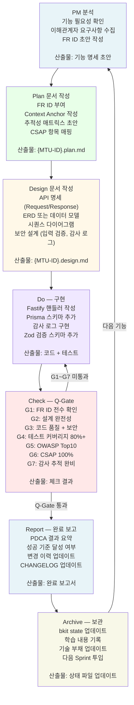
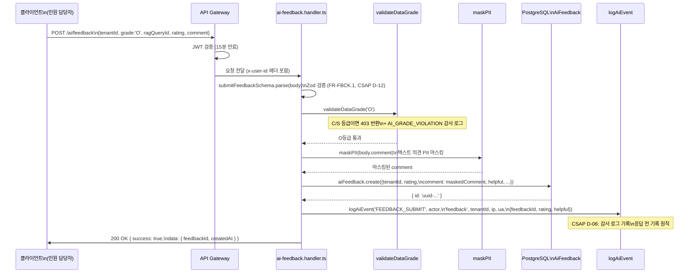
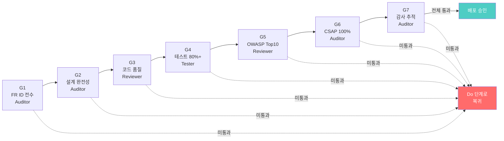
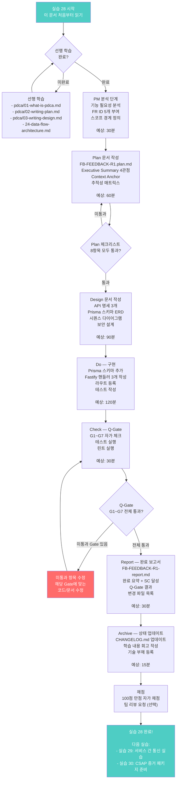

# 실습 28: 완전한 PDCA 사이클 실습 — 실제 기능 개발로 Plan에서 Report까지

> **문서 ID**: ONBOARD-10-28
> **버전**: 1.0.0 | **작성일**: 2026-04-13 | **작성자**: Implementer (Sonnet)
> **선행 학습**:
> - `08-document-management/pdca/01-what-is-pdca.md`
> - `08-document-management/pdca/02-writing-plan.md`
> - `08-document-management/pdca/03-writing-design.md`
> - `02-architecture/24-data-flow-architecture.md`
> **소요 시간**: 5~7시간
> **실습 형태**: 개인 실습 (팀 리뷰 선택)
> **결과물**: Plan 문서 + Design 문서 + 구현 코드 + PDCA 완료 보고서
> **CSAP 관련**: D-06, D-08, D-12 전 항목 체험
> **FR ID**: 실습 내에서 FR-FBCK.1 ~ FR-FBCK.5 부여

---

## 목차

1. [실습 개요 — 무엇을 만들 것인가](#1-실습-개요)
2. [PDCA 7단계 사이클 다이어그램](#2-pdca-7단계-사이클-다이어그램)
3. [단계 1 — PM 분석: 기능 요구사항 정의](#3-단계-1--pm-분석)
4. [단계 2 — Plan 문서 작성](#4-단계-2--plan-문서-작성)
5. [단계 3 — Design 문서 작성](#5-단계-3--design-문서-작성)
6. [단계 4 — Do: 구현](#6-단계-4--do-구현)
7. [단계 5 — Check: Q-Gate G1~G7 자가 체크](#7-단계-5--check-q-gate-자가-체크)
8. [단계 6 — Report: PDCA 완료 보고서](#8-단계-6--report-pdca-완료-보고서)
9. [단계 7 — Archive: 상태 업데이트](#9-단계-7--archive-상태-업데이트)
10. [100점 채점 기준](#10-100점-채점-기준)
11. [실습 완료 플로우차트](#11-실습-완료-플로우차트)
12. [CSAP 감리 증거 수집 체크리스트](#12-csap-감리-증거-수집-체크리스트)
13. [자주 묻는 질문 FAQ](#13-자주-묻는-질문-faq)
14. [변경 이력](#14-변경-이력)

---

## 1. 실습 개요

### 1.1 이 실습의 목적

이 실습은 공공기관 SaaS 개발의 전체 사이클을 한 번에 경험합니다. "Plan 없는 구현은 감리 결함"이라는 CLAUDE.md 원칙을 몸으로 체득하는 것이 목표입니다.

**실습을 마치면**:
- PDCA 7단계를 자연스럽게 따를 수 있습니다
- Plan 문서와 Design 문서를 스스로 작성할 수 있습니다
- CSAP Q-Gate 7단계를 자가 점검할 수 있습니다
- 감리 대비 증거를 스스로 준비할 수 있습니다

### 1.2 실습 시나리오

**AI 서비스에 "사용자 피드백 수집 API" 추가**

공공기관 민원 처리 AI 어시스턴트를 사용한 후, 사용자가 응답 품질에 대한 피드백을 남길 수 있도록 합니다. 수집된 피드백은 AI 서비스 품질 개선에 활용됩니다.

**이 기능이 왜 필요한가**:
- 공공기관 AI 서비스의 품질을 정량적으로 측정할 수 있습니다
- 사용자 불만 사례를 추적하여 개선할 수 있습니다
- CSAP 인증 시 "AI 서비스 품질 관리 체계"를 증빙할 수 있습니다

### 1.3 실습 산출물 목록

| 번호 | 산출물 | 파일 경로 | 단계 |
|------|-------|---------|------|
| 1 | Plan 문서 | `docs/01-plan/mtus/FB-FEEDBACK-R1.plan.md` | Plan |
| 2 | Design 문서 | `docs/02-design/features/FB-FEEDBACK-R1.design.md` | Plan |
| 3 | Prisma 스키마 추가 | `platform/prisma/schema.prisma` | Do |
| 4 | Fastify 라우터 | `platform/services/ai-service/src/handlers/ai-feedback.handler.ts` | Do |
| 5 | 라우트 등록 | `platform/services/ai-service/src/routes.ts` | Do |
| 6 | 감사 로그 | `ai-feedback.handler.ts` 내 logAiEvent 호출 | Do |
| 7 | Q-Gate 체크리스트 | 이 문서 7절 작성 | Check |
| 8 | PDCA 완료 보고서 | `docs/pm-reports/FB-FEEDBACK-R1-report.md` | Report |

---

## 2. PDCA 7단계 사이클 다이어그램

### 2.1 공공기관 SaaS PDCA 사이클

이 프로젝트의 PDCA는 일반적인 Plan-Do-Check-Act 4단계보다 더 세분화되어 있습니다. 공공기관 감리 요건을 충족하기 위해 7단계로 확장됩니다.



### 2.2 각 단계 소요 시간 안내

| 단계 | 초급자 | 숙련자 |
|------|-------|-------|
| PM 분석 | 30분 | 15분 |
| Plan 문서 | 60분 | 20분 |
| Design 문서 | 90분 | 30분 |
| Do (구현) | 120분 | 60분 |
| Check | 30분 | 15분 |
| Report | 30분 | 15분 |
| Archive | 15분 | 5분 |
| **합계** | **375분 (6.25시간)** | **160분 (2.7시간)** |

---

## 3. 단계 1 — PM 분석

### 3.1 기능 필요성 분석

PM 분석은 "왜 이 기능이 필요한가"를 이해관계자 관점에서 정의합니다. 개발자가 혼자 생각한 기능이 아니라 실제 사용자 요구사항임을 확인하는 단계입니다.

**이해관계자 분석**:

| 이해관계자 | 요구사항 | 우선순위 |
|---------|---------|--------|
| 공공기관 민원 담당자 | AI가 틀린 답변을 했을 때 피드백을 남기고 싶다 | 높음 |
| AI 서비스 관리자 | 어떤 질문 유형에서 오류가 많은지 통계를 보고 싶다 | 높음 |
| CSAP 감사관 | AI 서비스 품질 관리 체계가 있음을 확인하고 싶다 | 중간 |
| 개발팀 | 피드백 데이터로 RAG 품질을 개선하고 싶다 | 중간 |

### 3.2 FR ID 초안 작성

이 단계에서 기능 요구사항 ID를 부여합니다. 나중에 코드에서 참조합니다.

**모듈 코드**: `FBCK` (피드백 수집)

| FR ID | 설명 | 우선순위 | CSAP 항목 |
|-------|------|--------|---------|
| FR-FBCK.1 | 피드백 제출 API 구현 (5점 척도 + 텍스트 의견) | P0 | D-12 |
| FR-FBCK.2 | 피드백 목록 조회 API (관리자용, 테넌트 격리) | P0 | D-08 |
| FR-FBCK.3 | 피드백 통계 API (평균 점수, 응답 수) | P1 | D-12 |
| FR-FBCK.4 | 피드백 제출/조회 시 감사 로그 기록 | P0 | D-06 |
| FR-FBCK.5 | N2SF O등급 검증 (피드백 텍스트) | P0 | N2SF N-05 |

### 3.3 스코프 경계 정의

**이번 실습 범위에 포함되는 것**:
- 피드백 제출 API (POST /ai/feedback)
- 피드백 목록 조회 API (GET /ai/feedback)
- 피드백 통계 API (GET /ai/feedback/stats)
- Prisma 스키마 (AiFeedback 모델)
- 감사 로그 (FEEDBACK_SUBMIT, FEEDBACK_LIST)

**이번 실습 범위에 포함되지 않는 것**:
- 피드백 기반 RAG 품질 자동 개선 (별도 MTU로 분리)
- 프론트엔드 피드백 UI (별도 MTU)
- 피드백 분석 AI 모델 (별도 MTU)

---

## 4. 단계 2 — Plan 문서 작성

### 4.1 Plan 문서 작성 위치

```
파일 경로: docs/01-plan/mtus/FB-FEEDBACK-R1.plan.md
```

### 4.2 완성된 Plan 문서 예시

아래는 실제 프로젝트 MTU 형식(`SVC-AI-ADV-R8.plan.md`)을 그대로 따른 예시입니다. 복사하여 내용만 채워 넣으면 됩니다.

```markdown
# FB-FEEDBACK-R1 Plan — AI 서비스 사용자 피드백 수집 API

> **요구사항 범위**: FR-FBCK.1 ~ FR-FBCK.5 (5개 MTU)
> **작성일**: 2026-04-13
> **작성자**: {이름}
> **버전**: 1.0.0

---

## Executive Summary

| 관점 | 내용 |
|------|------|
| WHY | 공공기관 AI 서비스의 응답 품질을 정량적으로 측정하고 개선하기 위한 피드백 수집 체계 구축 |
| WHO | 민원 담당자(피드백 제출), AI 서비스 관리자(통계 조회), CSAP 감사관(품질 체계 확인) |
| RISK | N2SF C/S 등급 데이터 포함된 피드백 텍스트 AI 전송 위험, CSAP D-06 감사 로그 누락 |
| SUCCESS | 5개 FR 구현 + 테스트 통과 + TypeScript 0 오류 + Q-Gate G1~G7 통과 |
| SCOPE | 피드백 제출/조회/통계 API + Prisma 스키마 + 감사 로그 |

---

## Context Anchor

- **WHY**: AI 서비스 응답 품질 정량 측정 및 CSAP 품질 관리 체계 증빙
- **WHO**: 민원 담당자, AI 서비스 관리자, CSAP 감사관
- **RISK**: 피드백 텍스트에 PII 포함 가능성, 감사 로그 누락
- **SUCCESS**: 5개 API 엔드포인트 동작 + Q-Gate 전체 통과
- **SCOPE**: ai-service 내 피드백 관련 핸들러 및 Prisma 모델

---

## 기능 요구사항

| ID | 설명 | 우선순위 | 수용 기준 |
|----|------|--------|---------|
| FR-FBCK.1 | POST /ai/feedback — 피드백 제출 | P0 | 1~5점 척도 + 텍스트 저장, 감사 로그 기록 |
| FR-FBCK.2 | GET /ai/feedback — 목록 조회 (관리자) | P0 | tenantId 격리, RBAC 관리자 권한 |
| FR-FBCK.3 | GET /ai/feedback/stats — 통계 | P1 | 평균 점수, 응답 수, 기간별 집계 |
| FR-FBCK.4 | 감사 로그 전수 기록 | P0 | FEEDBACK_SUBMIT, FEEDBACK_LIST 이벤트 |
| FR-FBCK.5 | N2SF 등급 확인 | P0 | O등급만 허용, C/S 등급 차단 + 로그 |

---

## 비기능 요구사항

| ID | 설명 | 기준 |
|----|------|------|
| NFR-1 | 피드백 제출 응답 시간 | p99 < 200ms |
| NFR-2 | 피드백 데이터 보존 기간 | 최소 1년 (CSAP D-06) |
| NFR-3 | 피드백 텍스트 PII 마스킹 | 저장 전 maskPII 적용 |

---

## 추적성 매트릭스

| FR ID | 구현 파일 | 테스트 | CSAP 항목 |
|-------|---------|-------|---------|
| FR-FBCK.1 | ai-feedback.handler.ts | feedback.spec.ts | D-12 |
| FR-FBCK.2 | ai-feedback.handler.ts | feedback.spec.ts | D-08 |
| FR-FBCK.3 | ai-feedback.handler.ts | feedback.spec.ts | D-12 |
| FR-FBCK.4 | ai-feedback.handler.ts | feedback.spec.ts | D-06 |
| FR-FBCK.5 | ai-feedback.handler.ts | feedback.spec.ts | N2SF N-05 |

---

## 변경 이력

| 버전 | 일자 | 내용 | 작성자 |
|------|------|------|--------|
| 1.0.0 | 2026-04-13 | 초기 작성 | {이름} |
```

### 4.3 Plan 문서 작성 체크리스트

Plan 문서를 작성한 뒤 아래 항목을 확인합니다.

```
[ ] Executive Summary 4관점 (WHY/WHO/RISK/SUCCESS) 모두 작성됨
[ ] Context Anchor 5항목 (WHY/WHO/RISK/SUCCESS/SCOPE) 모두 작성됨
[ ] FR ID가 FR-{모듈}.{번호} 형식으로 부여됨
[ ] 모든 FR에 수용 기준이 있음
[ ] NFR에 수치 기준이 있음 (예: p99 < 200ms)
[ ] 추적성 매트릭스 4방향 (FR↔파일↔테스트↔CSAP)이 작성됨
[ ] 변경 이력에 버전/일자/작성자가 기록됨
[ ] CSAP 항목 번호가 포함됨 (D-06, D-08, D-12 등)
```

---

## 5. 단계 3 — Design 문서 작성

### 5.1 API 명세

**POST /ai/feedback — 피드백 제출**

```typescript
// Request Body (Zod 스키마)
const submitFeedbackSchema = z.object({
  tenantId: z.string().uuid(),
  grade: z.enum(['O']),                          // N2SF: O등급만 허용
  ragQueryId: z.string().uuid(),                  // 어떤 RAG 응답에 대한 피드백인지
  rating: z.number().int().min(1).max(5),         // 1~5점 척도
  comment: z.string().max(1000).optional(),       // 텍스트 의견 (선택)
  helpful: z.boolean(),                           // 도움이 됐는가 (yes/no)
});

// Response (성공)
{
  "success": true,
  "data": {
    "feedbackId": "uuid-...",
    "createdAt": "2026-04-13T09:00:00.000Z"
  }
}

// Response (N2SF 위반)
{
  "success": false,
  "error": {
    "code": "DATA_GRADE_VIOLATION",
    "message": "C/S 등급 데이터는 AI 서비스에 전송할 수 없습니다."
  }
}
```

**GET /ai/feedback — 피드백 목록 조회 (관리자용)**

```typescript
// Query Parameters
{
  tenantId: string (UUID),
  startDate: string (ISO 8601, 선택),
  endDate: string (ISO 8601, 선택),
  page: number (기본값 1),
  limit: number (기본값 20, 최대 100)
}

// Response
{
  "success": true,
  "data": {
    "feedbacks": [
      {
        "id": "uuid-...",
        "ragQueryId": "uuid-...",
        "rating": 4,
        "comment": "[마스킹 후 텍스트]",  // PII 마스킹 적용
        "helpful": true,
        "createdAt": "2026-04-13T09:00:00.000Z"
      }
    ],
    "total": 42,
    "page": 1,
    "limit": 20
  }
}
```

### 5.2 ERD — AiFeedback 모델

```
AiFeedback
├── id          String   @id @default(uuid())  // PK
├── tenantId    String                           // 테넌트 격리 키
├── ragQueryId  String                           // 어떤 RAG 응답인지
├── rating      Int                              // 1~5 점수
├── comment     String?                          // PII 마스킹된 텍스트
├── helpful     Boolean                          // 도움됨 여부
├── createdAt   DateTime @default(now())
└── updatedAt   DateTime @updatedAt

인덱스:
  @@index([tenantId, createdAt])  // 테넌트별 최신순 조회 최적화
  @@index([ragQueryId])           // 특정 RAG 응답의 피드백 조회
```

### 5.3 시퀀스 다이어그램 — 피드백 제출 흐름



### 5.4 보안 설계

| 보안 요소 | 적용 방법 | CSAP 항목 |
|---------|---------|---------|
| 입력 검증 | Zod 스키마 (submitFeedbackSchema) | D-12 |
| N2SF 등급 확인 | validateDataGrade 호출 | N2SF N-05 |
| PII 마스킹 | comment에 maskPII 적용 | 개인정보보호법 |
| 감사 로그 | logAiEvent('FEEDBACK_SUBMIT') | D-06 |
| 테넌트 격리 | DB 쿼리에 tenantId 조건 | D-08 |
| RBAC | 목록 조회는 admin 역할만 | D-08 |

---

## 6. 단계 4 — Do: 구현

### 6.1 Prisma 스키마 추가

`platform/prisma/schema.prisma`에 다음 모델을 추가합니다.

```prisma
// AI 피드백 수집 — FR-FBCK.1
// Design Ref: FB-FEEDBACK-R1 DESIGN §2
// Plan SC: FR-FBCK.1 ~ FR-FBCK.5
// CSAP: D-06, D-08, D-12
model AiFeedback {
  id         String   @id @default(uuid())
  tenantId   String
  ragQueryId String
  rating     Int
  comment    String?
  helpful    Boolean
  createdAt  DateTime @default(now())
  updatedAt  DateTime @updatedAt

  @@index([tenantId, createdAt])
  @@index([ragQueryId])
  @@map("ai_feedback")
}
```

### 6.2 Fastify 핸들러 구현

`platform/services/ai-service/src/handlers/ai-feedback.handler.ts`

```typescript
// AI 피드백 수집 핸들러 — FR-FBCK.1 ~ FR-FBCK.5
// Design Ref: FB-FEEDBACK-R1 DESIGN §1
// Plan SC: FR-FBCK.1 피드백 제출, FR-FBCK.2 목록 조회, FR-FBCK.3 통계
// CSAP: D-06 감사 로깅, D-08 접근 통제, D-12 입력 검증

import type { FastifyRequest, FastifyReply } from 'fastify';
import { z } from 'zod';
import { logAiEvent } from '../lib/audit.js';
import { validateDataGrade, DataGradeViolationError } from '../lib/grade-check.js';
import type { DataGrade } from '@public-saas/types';
import { maskPII } from '../lib/pii-masking.js';
import { prisma } from '../lib/prisma.js';

// ── 피드백 제출 스키마 ────────────────────────────────────────────────────────

// Design Ref: FB-FEEDBACK-R1 DESIGN §1 — 입력 검증 (CSAP D-12)
const submitFeedbackSchema = z.object({
  tenantId:   z.string().uuid(),
  grade:      z.enum(['O']),                        // N2SF N-05: O등급만 허용
  ragQueryId: z.string().uuid(),
  rating:     z.number().int().min(1).max(5),       // 1~5점 척도
  comment:    z.string().max(1000).optional(),      // 텍스트 의견 (최대 1000자)
  helpful:    z.boolean(),
});

type SubmitFeedbackBody = z.infer<typeof submitFeedbackSchema>;

// ── 피드백 제출 핸들러 (FR-FBCK.1) ──────────────────────────────────────────

export async function submitFeedbackHandler(
  request: FastifyRequest<{ Body: SubmitFeedbackBody }>,
  reply: FastifyReply,
): Promise<void> {
  // 1. Zod 입력 검증 — CSAP D-12 (개발 보안, 입력 검증)
  const body = submitFeedbackSchema.parse(request.body);
  const actor = (request.headers['x-user-id'] as string) || 'anonymous';

  // 2. N2SF 데이터 등급 확인 — N2SF N-05 (C/S 등급 차단)
  // Plan SC: FR-FBCK.5
  try {
    validateDataGrade(body.grade as DataGrade);
  } catch (error) {
    if (error instanceof DataGradeViolationError) {
      await logAiEvent(
        'AI_GRADE_VIOLATION', actor, 'feedback', body.tenantId,
        request.ip, request.headers['user-agent'] ?? 'unknown',
        { grade: body.grade, blocked: true, endpoint: 'feedback/submit' },
      );
      await reply.status(403).send({
        success: false,
        error: { code: error.code, message: error.message },
      });
      return;
    }
    throw error;
  }

  try {
    // 3. PII 마스킹 — 피드백 텍스트에 이름, 전화번호 등 포함 가능
    // Plan SC: FR-FBCK.5 (N2SF 준수)
    const maskedComment = body.comment ? maskPII(body.comment) : null;

    // 4. 피드백 저장 — tenantId로 격리 (CSAP D-08 접근 통제)
    // Plan SC: FR-FBCK.1
    const feedback = await prisma.aiFeedback.create({
      data: {
        tenantId:   body.tenantId,
        ragQueryId: body.ragQueryId,
        rating:     body.rating,
        comment:    maskedComment,
        helpful:    body.helpful,
      },
    });

    // 5. 감사 로그 기록 — CSAP D-06 (침해사고 관리, 전수 기록)
    // Plan SC: FR-FBCK.4
    // 응답 전 기록 원칙: 서버 재시작 시 로그 누락 방지
    await logAiEvent(
      'FEEDBACK_SUBMIT', actor, 'feedback', body.tenantId,
      request.ip, request.headers['user-agent'] ?? 'unknown',
      {
        feedbackId:  feedback.id,
        ragQueryId:  body.ragQueryId,
        rating:      body.rating,
        helpful:     body.helpful,
        hasComment:  !!maskedComment,
        // 주의: comment 내용 자체는 감사 로그에 저장하지 않음 (개인정보 최소화)
      },
    );

    await reply.status(201).send({
      success: true,
      data: {
        feedbackId: feedback.id,
        createdAt:  feedback.createdAt.toISOString(),
      },
    });
  } catch (err) {
    // 6. 안전한 에러 응답 — CSAP D-12 (내부 정보 노출 금지)
    // 내부 오류는 서버 로그에만 기록 (스택 트레이스 클라이언트에 노출 금지)
    request.log.error(err, 'FEEDBACK 제출 실패');
    await reply.status(500).send({
      success: false,
      error: { code: 'FEEDBACK_SUBMIT_FAILED', message: '피드백 제출 중 오류가 발생했습니다.' },
    });
  }
}

// ── 피드백 목록 조회 스키마 ───────────────────────────────────────────────────

const listFeedbackSchema = z.object({
  tenantId:  z.string().uuid(),
  startDate: z.string().datetime().optional(),
  endDate:   z.string().datetime().optional(),
  page:      z.coerce.number().int().min(1).default(1),
  limit:     z.coerce.number().int().min(1).max(100).default(20),
});

type ListFeedbackQuery = z.infer<typeof listFeedbackSchema>;

// ── 피드백 목록 조회 핸들러 (FR-FBCK.2) — 관리자 전용 ────────────────────────

export async function listFeedbackHandler(
  request: FastifyRequest<{ Querystring: ListFeedbackQuery }>,
  reply: FastifyReply,
): Promise<void> {
  // 1. 입력 검증
  const query = listFeedbackSchema.parse(request.query);
  const actor = (request.headers['x-user-id'] as string) || 'anonymous';

  // 2. RBAC: 관리자 역할 확인 — CSAP D-08 (접근 통제)
  // Plan SC: FR-FBCK.2
  const userRole = request.headers['x-user-role'] as string;
  if (userRole !== 'admin' && userRole !== 'super-admin') {
    await reply.status(403).send({
      success: false,
      error: { code: 'FORBIDDEN', message: '피드백 목록 조회는 관리자만 가능합니다.' },
    });
    return;
  }

  try {
    // 3. 테넌트 격리 쿼리 — WHERE tenantId = $1 반드시 포함
    const where: Record<string, unknown> = { tenantId: query.tenantId };
    if (query.startDate) {
      where['createdAt'] = { gte: new Date(query.startDate) };
    }
    if (query.endDate) {
      where['createdAt'] = { ...(where['createdAt'] as object ?? {}), lte: new Date(query.endDate) };
    }

    const [feedbacks, total] = await Promise.all([
      prisma.aiFeedback.findMany({
        where,
        orderBy: { createdAt: 'desc' },
        skip:    (query.page - 1) * query.limit,
        take:    query.limit,
        select: {
          id:         true,
          ragQueryId: true,
          rating:     true,
          comment:    true,   // 이미 저장 시 마스킹됨
          helpful:    true,
          createdAt:  true,
        },
      }),
      prisma.aiFeedback.count({ where }),
    ]);

    // 4. 감사 로그 — CSAP D-06 (관리자 데이터 접근도 기록)
    // Plan SC: FR-FBCK.4
    await logAiEvent(
      'FEEDBACK_LIST', actor, 'feedback', query.tenantId,
      request.ip, request.headers['user-agent'] ?? 'unknown',
      { total, page: query.page, limit: query.limit },
    );

    await reply.status(200).send({
      success: true,
      data: { feedbacks, total, page: query.page, limit: query.limit },
    });
  } catch (err) {
    request.log.error(err, 'FEEDBACK 목록 조회 실패');
    await reply.status(500).send({
      success: false,
      error: { code: 'FEEDBACK_LIST_FAILED', message: '피드백 목록 조회 중 오류가 발생했습니다.' },
    });
  }
}

// ── 피드백 통계 핸들러 (FR-FBCK.3) ───────────────────────────────────────────

const feedbackStatsSchema = z.object({
  tenantId:  z.string().uuid(),
  startDate: z.string().datetime().optional(),
  endDate:   z.string().datetime().optional(),
});

type FeedbackStatsQuery = z.infer<typeof feedbackStatsSchema>;

export async function feedbackStatsHandler(
  request: FastifyRequest<{ Querystring: FeedbackStatsQuery }>,
  reply: FastifyReply,
): Promise<void> {
  const query = feedbackStatsSchema.parse(request.query);
  const actor = (request.headers['x-user-id'] as string) || 'anonymous';

  // RBAC: 관리자 역할 확인
  const userRole = request.headers['x-user-role'] as string;
  if (userRole !== 'admin' && userRole !== 'super-admin') {
    await reply.status(403).send({
      success: false,
      error: { code: 'FORBIDDEN', message: '피드백 통계 조회는 관리자만 가능합니다.' },
    });
    return;
  }

  try {
    const where: Record<string, unknown> = { tenantId: query.tenantId };
    if (query.startDate) {
      where['createdAt'] = { gte: new Date(query.startDate) };
    }

    // Plan SC: FR-FBCK.3 — 통계 집계
    const [stats, ratingDistribution] = await Promise.all([
      prisma.aiFeedback.aggregate({
        where,
        _avg:   { rating: true },
        _count: { id: true },
        _sum:   { rating: true },
      }),
      prisma.aiFeedback.groupBy({
        by:    ['rating'],
        where,
        _count: { id: true },
        orderBy: { rating: 'asc' },
      }),
    ]);

    await logAiEvent(
      'FEEDBACK_STATS', actor, 'feedback', query.tenantId,
      request.ip, request.headers['user-agent'] ?? 'unknown',
      { total: stats._count.id },
    );

    await reply.status(200).send({
      success: true,
      data: {
        totalFeedbacks: stats._count.id,
        averageRating:  stats._avg.rating ?? 0,
        ratingDistribution: ratingDistribution.map((r) => ({
          rating: r.rating,
          count:  r._count.id,
        })),
      },
    });
  } catch (err) {
    request.log.error(err, 'FEEDBACK 통계 조회 실패');
    await reply.status(500).send({
      success: false,
      error: { code: 'FEEDBACK_STATS_FAILED', message: '피드백 통계 조회 중 오류가 발생했습니다.' },
    });
  }
}
```

### 6.3 라우트 등록

`platform/services/ai-service/src/routes.ts`에 아래 내용을 추가합니다.

```typescript
// routes.ts에 import 추가 (기존 import 블록 끝에)
import {
  submitFeedbackHandler,
  listFeedbackHandler,
  feedbackStatsHandler,
} from './handlers/ai-feedback.handler.js';

// registerRoutes 함수 내에 추가
// FR-FBCK.1: 피드백 제출 (모든 인증 사용자)
app.post('/ai/feedback', submitFeedbackHandler);

// FR-FBCK.2: 피드백 목록 조회 (관리자만 — 핸들러 내 RBAC)
app.get('/ai/feedback', listFeedbackHandler);

// FR-FBCK.3: 피드백 통계 (관리자만 — 핸들러 내 RBAC)
app.get('/ai/feedback/stats', feedbackStatsHandler);
```

### 6.4 구현 시 자주 하는 실수

**실수 1 — 감사 로그를 응답 후에 기록**:
```typescript
// 잘못된 순서
await reply.status(201).send({ success: true, data: { feedbackId } })
await logAiEvent('FEEDBACK_SUBMIT', ...)  // 서버 재시작 시 이 줄이 실행 안 될 수 있음

// 올바른 순서
await logAiEvent('FEEDBACK_SUBMIT', ...)  // 응답 전 기록 필수
await reply.status(201).send({ success: true, data: { feedbackId } })
```

**실수 2 — tenantId 없이 DB 쿼리**:
```typescript
// 잘못된 쿼리 — 모든 테넌트 피드백 조회
const feedbacks = await prisma.aiFeedback.findMany({ orderBy: { createdAt: 'desc' } })

// 올바른 쿼리 — tenantId 필터 필수
const feedbacks = await prisma.aiFeedback.findMany({
  where: { tenantId: query.tenantId },  // 반드시 포함
  orderBy: { createdAt: 'desc' },
})
```

**실수 3 — 에러 메시지에 내부 정보 노출**:
```typescript
// 잘못된 응답
catch (err) {
  return reply.status(500).send({ error: err.message })  // DB 구조 노출 가능
}

// 올바른 응답
catch (err) {
  request.log.error(err, '피드백 제출 실패')  // 내부 로그에만
  return reply.status(500).send({
    success: false,
    error: { code: 'FEEDBACK_SUBMIT_FAILED', message: '피드백 제출 중 오류가 발생했습니다.' }
  })
}
```

---

## 7. 단계 5 — Check: Q-Gate 자가 체크

### 7.1 Q-Gate 7단계란

Q-Gate(품질 게이트)는 구현이 완료된 후 배포 전에 통과해야 하는 7단계 체크포인트입니다. CLAUDE.md 섹션 6에 정의되어 있습니다.



### 7.2 G1 — FR ID 전수 확인

모든 구현 코드에 FR ID 주석이 있는지 확인합니다.

```
[ ] ai-feedback.handler.ts 파일 상단에 "// Plan SC: FR-FBCK.1~FR-FBCK.5" 있음
[ ] submitFeedbackHandler에 N2SF 등급 확인 (FR-FBCK.5) 구현됨
[ ] 감사 로그 기록 (FR-FBCK.4) 모든 핸들러에 구현됨
[ ] RBAC 확인 (FR-FBCK.2) listFeedbackHandler에 구현됨
[ ] Plan 문서의 모든 FR이 코드에 구현됨
```

### 7.3 G2 — 설계 완전성

Design 문서의 내용이 코드에 모두 구현됐는지 확인합니다.

```
[ ] API 명세와 Zod 스키마가 일치함
[ ] ERD와 Prisma 스키마가 일치함
[ ] 시퀀스 다이어그램의 모든 단계가 코드에 존재함
[ ] 보안 설계 체크리스트의 6개 항목 모두 구현됨
```

### 7.4 G3 — 코드 품질

```bash
# 린트 검사
npm run lint

# TypeScript 컴파일 오류 확인
npx tsc --noEmit

# 함수 크기 확인 (80줄 이하)
# submitFeedbackHandler: ___ 줄 (80줄 이하여야 함)
# listFeedbackHandler: ___ 줄
# feedbackStatsHandler: ___ 줄
```

```
[ ] npm run lint 오류 없음
[ ] TypeScript strict 모드 0 오류
[ ] 함수 크기 80줄 이하
[ ] 미사용 import 없음
[ ] 하드코딩된 시크릿 없음
[ ] 중첩 깊이 4단계 이하
```

### 7.5 G4 — 테스트 커버리지 80%+

```typescript
// 최소 작성해야 할 테스트 케이스 목록
describe('submitFeedbackHandler', () => {
  it('O등급 O점수(1) 피드백 제출 성공')         // 정상 흐름
  it('C등급 피드백 제출 시 403 반환')             // N2SF 위반
  it('rating이 6인 경우 400 반환')               // Zod 검증
  it('tenantId가 UUID 아닌 경우 400 반환')       // 입력 검증
  it('감사 로그 FEEDBACK_SUBMIT 기록됨')         // D-06
  it('comment에 PII 포함 시 마스킹되어 저장됨')  // PII 마스킹
})

describe('listFeedbackHandler', () => {
  it('관리자 사용자 목록 조회 성공')             // 정상 흐름
  it('일반 사용자 403 반환')                     // RBAC
  it('tenantId 격리 — 다른 테넌트 피드백 안 보임') // D-08
  it('감사 로그 FEEDBACK_LIST 기록됨')           // D-06
})
```

### 7.6 G5 — OWASP Top 10

```
[ ] A01: 접근 통제 미흡 — RBAC 구현됨 (listFeedbackHandler)
[ ] A02: 암호화 실패 — TLS 1.3+ 적용, 민감 데이터 암호화 (PII 마스킹)
[ ] A03: 주입 — Zod 검증 + Prisma 매개변수화 쿼리 (직접 SQL 문자열 없음)
[ ] A04: 안전하지 않은 설계 — 설계 문서 기반 구현됨
[ ] A05: 잘못된 보안 구성 — 환경 변수 사용, 하드코딩 없음
[ ] A07: 인증 실패 — JWT 검증 (API Gateway)
[ ] A09: 보안 로깅 모니터링 실패 — logAiEvent 모든 핸들러에 구현됨
```

### 7.7 G6 — CSAP 항목 100%

```
[ ] D-06 침해사고 관리: FEEDBACK_SUBMIT, FEEDBACK_LIST, FEEDBACK_STATS 감사 로그 있음
[ ] D-08 접근 통제: RBAC 확인 (admin only), tenantId 격리 있음
[ ] D-12 개발 보안: Zod 입력 검증, 매개변수화 쿼리 (Prisma), 에러 정보 미노출
[ ] N2SF N-05: grade: 'O'만 허용, validateDataGrade 호출 있음
[ ] PII 마스킹: maskPII(body.comment) 적용됨
```

### 7.8 G7 — 감사 추적 완비

```
[ ] FEEDBACK_SUBMIT 이벤트: feedbackId, rating, helpful 포함
[ ] FEEDBACK_LIST 이벤트: total, page, limit 포함 (comment 내용 없음)
[ ] AI_GRADE_VIOLATION 이벤트: grade, blocked, endpoint 포함
[ ] 감사 로그에 PII 없음 (comment 내용 미포함 확인)
[ ] .claude/audit.jsonl에 이벤트가 기록됨
```

---

## 8. 단계 6 — Report: PDCA 완료 보고서

### 8.1 완료 보고서 템플릿

```markdown
# FB-FEEDBACK-R1 PDCA 완료 보고서

**작성일**: 2026-04-13
**작성자**: {이름}
**MTU ID**: FB-FEEDBACK-R1
**버전**: 1.0.0

---

## 완료 요약

| 항목 | 계획 | 실제 | 달성률 |
|------|------|------|--------|
| FR 구현 수 | 5개 | {개수}개 | {%}% |
| 테스트 케이스 | {개수}개 | {개수}개 | {%}% |
| 테스트 커버리지 | 80% | {%}% | {달성 여부} |
| TypeScript 오류 | 0개 | {개수}개 | {달성 여부} |
| Q-Gate 통과 | G1~G7 전체 | {결과} | {달성 여부} |

---

## 성공 기준 달성 현황

| SC ID | 기준 | 달성 여부 | 비고 |
|-------|------|---------|------|
| SC-FBCK.1 | 피드백 제출 API 동작 | | |
| SC-FBCK.2 | 목록 조회 RBAC 적용 | | |
| SC-FBCK.3 | 통계 API 정상 동작 | | |
| SC-FBCK.4 | 감사 로그 3개 이벤트 | | |
| SC-FBCK.5 | N2SF O등급 차단 동작 | | |

---

## Q-Gate 결과

| Gate | 결과 | 미통과 항목 |
|------|------|-----------|
| G1 FR ID 전수 | 통과/미통과 | |
| G2 설계 완전성 | 통과/미통과 | |
| G3 코드 품질 | 통과/미통과 | |
| G4 테스트 80%+ | 통과/미통과 | |
| G5 OWASP Top10 | 통과/미통과 | |
| G6 CSAP 100% | 통과/미통과 | |
| G7 감사 추적 | 통과/미통과 | |

---

## 변경 파일 목록

| 파일 | 변경 유형 | 내용 |
|------|---------|------|
| docs/01-plan/mtus/FB-FEEDBACK-R1.plan.md | 신규 | Plan 문서 |
| docs/02-design/features/FB-FEEDBACK-R1.design.md | 신규 | Design 문서 |
| platform/prisma/schema.prisma | 수정 | AiFeedback 모델 추가 |
| platform/services/ai-service/src/handlers/ai-feedback.handler.ts | 신규 | 핸들러 3개 |
| platform/services/ai-service/src/routes.ts | 수정 | 라우트 3개 추가 |

---

## 기술 부채 및 개선 사항

| 항목 | 유형 | 우선순위 | 예정 Sprint |
|------|------|---------|-----------|
| 피드백 기반 RAG 자동 개선 | 설계 | B | Phase 2 |
| 피드백 텍스트 감성 분석 | 기능 | C | Phase 3 |

---

## 변경 이력

| 버전 | 일자 | 내용 | 작성자 |
|------|------|------|--------|
| 1.0.0 | 2026-04-13 | 초기 완료 보고서 | {이름} |
```

---

## 9. 단계 7 — Archive: 상태 업데이트

### 9.1 CHANGELOG.md 업데이트

```markdown
## [Unreleased]

### Added
- `platform/services/ai-service/src/handlers/ai-feedback.handler.ts`: AI 서비스 사용자 피드백 수집 API 구현
  - POST /ai/feedback: 피드백 제출 (FR-FBCK.1)
  - GET /ai/feedback: 피드백 목록 조회 (FR-FBCK.2, 관리자용)
  - GET /ai/feedback/stats: 피드백 통계 (FR-FBCK.3)

### Security
- 피드백 텍스트 PII 마스킹 적용 (FR-FBCK.5, N2SF N-05)
- 피드백 제출/조회 감사 로그 추가 (FR-FBCK.4, CSAP D-06)
- 피드백 목록 조회 RBAC 적용 (admin only, CSAP D-08)
```

### 9.2 학습 내용 기록

실습 완료 후 아래 양식에 학습 내용을 기록합니다.

```markdown
# 실습 28 회고 — {이름}, {날짜}

## 잘 된 것
- {예: Zod 스키마를 보고 나서 입력 검증의 중요성을 실감함}

## 어려웠던 것
- {예: 감사 로그를 응답 전에 기록해야 한다는 점을 처음에 잊었음}

## 배운 것
- {예: tenantId 없이 DB 쿼리하면 멀티테넌트 격리가 깨진다는 것}

## 앞으로 개선할 것
- {예: 다음 기능 구현 시 처음부터 테스트 케이스를 먼저 작성하겠다}
```

---

## 10. 100점 채점 기준

### 10.1 채점표

| 영역 | 배점 | 세부 기준 |
|------|-----|---------|
| **Plan 문서** | **15점** | |
| Executive Summary 4관점 | 3점 | WHY/WHO/RISK/SUCCESS 모두 작성 |
| Context Anchor 5항목 | 3점 | WHY/WHO/RISK/SUCCESS/SCOPE 모두 작성 |
| FR ID 5개 + 수용 기준 | 5점 | FR-FBCK.1~FR-FBCK.5 각 1점 |
| 추적성 매트릭스 4방향 | 2점 | FR↔파일↔테스트↔CSAP |
| 변경 이력 | 2점 | 버전/일자/작성자 |
| **Design 문서** | **20점** | |
| API 명세 3개 완성 | 6점 | POST/GET/GET 각 2점 |
| Prisma 스키마 (ERD) | 4점 | 필드 + 인덱스 + 테넌트 격리 |
| 시퀀스 다이어그램 | 4점 | 7단계 흐름 모두 포함 |
| 보안 설계 체크리스트 | 4점 | 6개 항목 모두 포함 |
| CSAP 항목 매핑 | 2점 | D-06/D-08/D-12/N2SF |
| **Do — 구현** | **30점** | |
| Prisma 스키마 정확성 | 5점 | 모델 + 인덱스 + 테넌트 격리 |
| Zod 스키마 검증 | 5점 | 모든 필드 타입 검증 |
| N2SF 등급 확인 | 5점 | validateDataGrade + 차단 로직 |
| PII 마스킹 | 5점 | comment에 maskPII 적용 |
| 감사 로그 3개 이벤트 | 5점 | SUBMIT/LIST/STATS 각 1.67점 |
| 안전한 에러 응답 | 5점 | 내부 정보 미노출 |
| **Check — Q-Gate** | **20점** | |
| G1~G7 체크리스트 작성 | 7점 | 7개 Gate 각 1점 |
| 테스트 케이스 6개 이상 | 7점 | 각 1.17점 |
| npm run lint 통과 | 3점 | 오류 0개 |
| TypeScript 컴파일 통과 | 3점 | 오류 0개 |
| **Report — 완료 보고서** | **15점** | |
| 완료 요약 테이블 | 3점 | 계획/실제/달성률 |
| SC 달성 현황 5개 | 5점 | 각 1점 |
| Q-Gate 결과 기록 | 3점 | G1~G7 결과 |
| 변경 파일 목록 | 2점 | 5개 파일 명시 |
| CHANGELOG 업데이트 | 2점 | Added + Security 섹션 |
| **합계** | **100점** | |

### 10.2 점수 구간별 평가

| 점수 | 평가 | 의미 |
|------|------|------|
| 90~100점 | 우수 | 즉시 실무 투입 가능 수준 |
| 80~89점 | 양호 | 간단한 보완 후 투입 가능 |
| 70~79점 | 보통 | 주요 항목 재실습 권장 |
| 60~69점 | 미흡 | Plan + Design 문서 다시 학습 필요 |
| 60점 미만 | 재실습 | 선행 학습 완료 후 재도전 |

---

## 11. 실습 완료 플로우차트

### 11.1 실습 진행 경로



---

## 12. CSAP 감리 증거 수집 체크리스트

### 12.1 각 단계별 감리 증거 산출물

공공기관 시스템 감리 시 아래 증거를 즉시 제출할 수 있어야 합니다. 각 단계가 완료될 때마다 체크하십시오.

**PM 분석 단계**:
```
[ ] 기능 요구사항 정의 문서 (이해관계자 분석 포함)
[ ] FR ID 부여 근거 (왜 이 번호인가)
[ ] 스코프 경계 정의 (포함/제외 목록)
```

**Plan 단계**:
```
[ ] FB-FEEDBACK-R1.plan.md 작성 완료
[ ] Executive Summary 4관점 (WHY/WHO/RISK/SUCCESS)
[ ] Context Anchor 5항목
[ ] FR-FBCK.1~FR-FBCK.5 전체 수용 기준 있음
[ ] CSAP 항목 D-06/D-08/D-12/N2SF 매핑됨
[ ] 추적성 매트릭스 4방향 작성됨
[ ] 변경 이력 기록됨
```

**Design 단계**:
```
[ ] FB-FEEDBACK-R1.design.md 작성 완료
[ ] API 명세 3개 (Request/Response 스키마 포함)
[ ] Prisma 스키마 ERD (tenantId 격리 포함)
[ ] 보안 설계 체크리스트 6항목 (Zod/N2SF/PII/감사/RBAC/에러)
[ ] 시퀀스 다이어그램 (감사 로그 위치 표시)
```

**Do 단계 (코드 증거)**:
```
[ ] ai-feedback.handler.ts 상단에 Design Ref / Plan SC / CSAP 주석
[ ] Zod 스키마 검증 구현됨 (코드 라인 번호 기록)
[ ] validateDataGrade 호출됨 (코드 라인 번호 기록)
[ ] maskPII 적용됨 (코드 라인 번호 기록)
[ ] logAiEvent 3회 호출됨 (FEEDBACK_SUBMIT/LIST/STATS)
[ ] tenantId 격리 쿼리 구현됨
[ ] 안전한 에러 응답 구현됨 (내부 정보 미노출)
```

**Check 단계**:
```
[ ] Q-Gate G1~G7 체크리스트 완료 (이 문서 7절)
[ ] npm run lint 통과 스크린샷 또는 로그
[ ] 테스트 커버리지 리포트
[ ] TypeScript tsc --noEmit 통과 로그
```

**Report 단계**:
```
[ ] FB-FEEDBACK-R1-report.md 작성 완료
[ ] SC 달성 현황 (5개 FR 전체 달성 여부)
[ ] Q-Gate 통과 결과 기록
[ ] 변경 파일 목록 (5개 파일)
```

**감사 로그 증거**:
```
[ ] .claude/audit.jsonl에서 FEEDBACK_SUBMIT 이벤트 추출 가능
[ ] FEEDBACK_LIST 이벤트 추출 가능
[ ] AI_GRADE_VIOLATION 이벤트 (C/S 등급 테스트) 추출 가능
[ ] 감사 로그에 PII 미포함 확인
```

### 12.2 감리관이 자주 묻는 질문과 답변

| 감리관 질문 | 어디서 증거를 찾는가 |
|-----------|---------------|
| "피드백 API는 왜 필요한가?" | Plan 문서 Executive Summary WHY 절 |
| "N2SF 요건을 어떻게 준수했는가?" | ai-feedback.handler.ts의 validateDataGrade 호출 부분 |
| "개인정보가 유출될 위험은 없는가?" | maskPII 적용 코드 + PII 마스킹 설계 문서 |
| "누가 피드백을 조회할 수 있는가?" | RBAC 코드 (userRole 확인 부분) + Design 보안 설계 |
| "감사 로그는 어떻게 확인하는가?" | .claude/audit.jsonl 또는 audit-service DB 쿼리 |
| "테스트 커버리지는 얼마인가?" | 커버리지 리포트 (Q-Gate G4) |

---

## 13. 자주 묻는 질문 FAQ

**Q1. Plan 문서를 먼저 써야 하나요? 코드를 짜면서 써도 되지 않나요?**

Plan 문서를 먼저 쓰는 것이 원칙입니다. CLAUDE.md에 "구현 착수 전 Plan + Design 문서 완비 필수. 문서 없는 구현 = 감리 결함"으로 명시되어 있습니다. 단, 이 실습에서는 Plan → Design → Do 순서를 처음 경험하기 위한 것이므로 순서대로 따르십시오.

**Q2. FR ID는 어떻게 부여하나요? 번호가 겹치면 어떻게 하나요?**

FR ID는 `FR-{모듈코드}.{번호}` 형식입니다. 이 실습에서는 `FR-FBCK.1~FR-FBCK.5`를 사용합니다. 번호가 겹치지 않도록 새 기능을 만들 때마다 `docs/01-plan/mtus/` 디렉토리의 기존 파일을 확인하여 중복을 피합니다.

**Q3. 테스트 커버리지 80%는 어떻게 측정하나요?**

```bash
npm run test:coverage
# 또는
npx vitest run --coverage
```

AI 서비스 디렉토리로 이동 후 실행합니다. `coverage/index.html`에서 시각적으로 확인할 수 있습니다.

**Q4. Prisma 스키마를 추가한 후 어떻게 마이그레이션하나요?**

```bash
# 개발 환경 마이그레이션
npx prisma migrate dev --name add-ai-feedback

# 프로덕션 환경은 감사 후 별도 배포 절차 따름
```

**Q5. 감사 로그에 피드백 내용을 저장하면 안 되는 이유는?**

감사 로그는 영구 저장되며 여러 사람이 접근할 수 있습니다. 피드백 내용에 개인정보가 포함될 수 있으므로, 감사 로그에는 메타데이터(feedbackId, rating, helpful)만 저장합니다. 내용 자체는 별도 DB에 마스킹하여 저장합니다. 개인정보 최소화 원칙(개인정보보호법 제16조)입니다.

**Q6. Q-Gate를 혼자 체크하는 것이 맞나요? 누군가 확인해줘야 하지 않나요?**

이 실습에서는 자가 체크입니다. 실제 프로젝트에서는 Reviewer 에이전트(코드 품질), Auditor 에이전트(CSAP 준수), Tester 에이전트(테스트 커버리지)가 각각 담당합니다. 실무에서는 PR 리뷰 시 팀원이 확인합니다.

---

## 14. 변경 이력

| 버전 | 일자 | 내용 | 작성자 |
|------|------|------|--------|
| 1.0.0 | 2026-04-13 | 초기 작성 — 실제 MTU plan 형식 기반, 완전한 구현 예제 코드, 100점 채점 기준 포함 | Implementer (Sonnet) |
