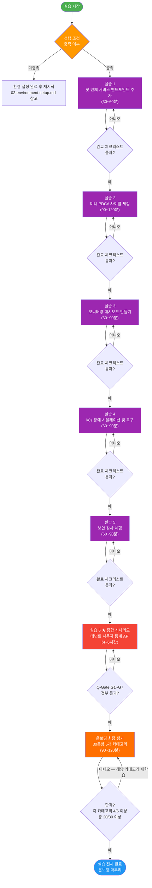

# 10장: 실습 과제 모음

> **문서 ID**: ONBOARD-10-INDEX
> **버전**: 1.0.0 | **작성일**: 2026-04-12 | **작성자**: Implementer (Sonnet)
> **목적**: 신규 팀원이 이론 학습 후 직접 손으로 실습하여 개념을 내재화하도록 지원
> **선행 문서**: 가이드북 0장~7장 학습 완료 권장

---

## 목차

1. [실습 과제 개요](#1-실습-과제-개요)
2. [실습 전 필수 확인사항](#2-실습-전-필수-확인사항)
3. [실습 목록 및 개요](#3-실습-목록-및-개요)
4. [실습 완료 체크리스트](#4-실습-완료-체크리스트)
5. [실습 진행 흐름도](#5-실습-진행-흐름도)
6. [변경 이력](#6-변경-이력)

---

## 1. 실습 과제 개요

이 장은 총 5개의 실습 과제로 구성됩니다. 각 실습은 이론 학습만으로는 익히기 어려운 내용을 **직접 타이핑하고 실행하며** 체득하도록 설계되었습니다.

실습은 난이도 순서로 배치되어 있습니다. 실습 1은 30분 이내에 완료할 수 있는 간단한 엔드포인트 추가 과제이며, 실습 5는 실제 보안 취약점을 찾고 수정하는 심화 과제입니다.

**이 실습들을 마치면 다음을 할 수 있습니다**:
- 새로운 API 엔드포인트를 추가하고 테스트까지 작성할 수 있습니다.
- PDCA 사이클에 따른 미니 기능 개발을 경험할 수 있습니다.
- Grafana 대시보드 패널을 직접 만들고 알림을 설정할 수 있습니다.
- k8s Pod 장애를 시뮬레이션하고 복구하는 과정을 경험할 수 있습니다.
- 코드에서 CSAP 위반 보안 취약점을 직접 찾고 수정할 수 있습니다.

---

## 2. 실습 전 필수 확인사항

실습을 시작하기 전에 아래 항목이 모두 충족되어 있어야 합니다.

### 2.1 공통 선행 조건

```bash
# 1. 프로젝트 클론 및 의존성 설치 완료
cd /data/ai-saas
pnpm install --frozen-lockfile

# 2. 빌드 성공 확인
pnpm run build

# 3. 로컬 k3s 클러스터 접근 가능 확인
kubectl get nodes
# NAME        STATUS   ROLES                  AGE   VERSION
# saas-node   Ready    control-plane,master   ...   v1.29.x

# 4. auth-service가 로컬에서 실행 가능한지 확인
cd platform/services/auth-service
pnpm run dev
# 오류 없이 "Listening on 0.0.0.0:3001" 출력되면 정상
```

### 2.2 실습별 추가 선행 조건

| 실습 | 추가 선행 조건 |
|------|--------------|
| 실습 1 | 없음 (공통 조건만 충족하면 됨) |
| 실습 2 | 1장(문서 관리·PDCA) 학습 완료 |
| 실습 3 | 5장(모니터링) 학습 완료, Grafana 접근 가능 |
| 실습 4 | 4장(인프라·k3s) 학습 완료, kubectl 사용 가능 |
| 실습 5 | 7장(보안·컴플라이언스) 학습 완료 |

### 2.3 실습 전 브랜치 생성

모든 실습은 별도 브랜치에서 진행합니다. 실습 코드를 main/stg에 직접 푸시하면 안 됩니다.

```bash
# 실습 브랜치 생성 예시
git checkout stg
git checkout -b feat/exercise-01-hello-service-{본인이름}
```

---

## 3. 실습 목록 및 개요

| 번호 | 제목 | 파일 | 예상 시간 | 난이도 | 관련 장 |
|------|------|------|---------|--------|--------|
| 실습 1 | 첫 번째 서비스 엔드포인트 추가 | [01-hello-service.md](01-hello-service.md) | 30~60분 | 초급 | 2장, 7장 |
| 실습 2 | 미니 PDCA 사이클 체험 | [02-pdca-mini.md](02-pdca-mini.md) | 90~120분 | 초중급 | 1장, 7장 |
| 실습 3 | 모니터링 대시보드 만들기 | [03-monitoring-lab.md](03-monitoring-lab.md) | 60~90분 | 초중급 | 5장 |
| 실습 4 | k8s 장애 시뮬레이션 및 복구 | [04-k8s-debug.md](04-k8s-debug.md) | 60~90분 | 중급 | 4장 |
| 실습 5 | 보안 감사 체험 | [05-security-audit.md](05-security-audit.md) | 60~90분 | 중급 | 7장 |
| 실습 6 | **종합 시나리오 — 테넌트 통계 API** | [06-end-to-end-scenario.md](06-end-to-end-scenario.md) | 4~6시간 | **고급** | 전 장 |
| **평가** | **온보딩 최종 평가 (30문항)** | [07-assessment.md](07-assessment.md) | 90~120분 | **종합** | 전 장 |

### 실습 1: 첫 번째 서비스 엔드포인트 추가

**목표**: auth-service에 `/health/ping` 엔드포인트를 추가하고, 테스트를 작성하고, 올바른 커밋 메시지로 커밋합니다.

**배우는 것**: Fastify 라우트 추가 방법, 테스트 작성, Conventional Commits 형식, Claude Code로 코드 리뷰받기

**핵심 파일**: `platform/services/auth-service/src/routes.ts`

---

### 실습 2: 미니 PDCA 사이클 체험

**목표**: "사용자 프로필 조회 API" 기능을 위한 미니 Plan 문서와 Design 문서를 작성하고, 코드 스캐폴드를 구현합니다.

**배우는 것**: PDCA 사이클의 흐름, Plan/Design 문서 작성법, 감리 기준에 맞는 문서 형식

**핵심 파일**: `docs/01-plan/mtus/` 하위 새 파일 생성

---

### 실습 3: 모니터링 대시보드 만들기

**목표**: auth-service의 로그인 성공/실패율을 보여주는 Grafana 패널을 만들고, 알림 임계값을 설정합니다.

**배우는 것**: PromQL 쿼리 작성, Grafana 패널 생성, 알림(Alert) 설정

**핵심 도구**: Prometheus, Grafana

---

### 실습 4: k8s 장애 시뮬레이션 및 복구

**목표**: auth-service Pod을 의도적으로 실패시키고, 장애 원인을 kubectl로 분석하여 복구합니다.

**배우는 것**: OOMKilled 원인 분석, kubectl describe/logs 활용, 리소스 제한 설정

**핵심 도구**: kubectl, k3s

---

### 실습 5: 보안 감사 체험

**목표**: 의도적으로 취약점을 심어둔 코드를 보고 CSAP D-08/D-09/D-12 기준으로 문제를 찾고 수정합니다.

**배우는 것**: SQL 인젝션, 하드코딩 시크릿, RBAC 누락 등 실제 보안 취약점 식별 및 수정

**핵심 규칙**: CSAP D-08, D-09, D-12

---

### 실습 6: 종합 시나리오 — 테넌트 사용자 통계 API

**목표**: `GET /api/v1/admin/tenants/:tenantId/stats` API를 Plan 문서 작성부터 PR 제출까지 처음부터 끝까지 구현합니다.

**배우는 것**: PDCA 전 사이클 (Plan → Design → 구현 → 테스트 → 보안 검토 → PR), Q-Gate G1~G7 독립 통과, Redis 캐시 + 감사 로그 + RBAC 통합 구현

**예상 시간**: 4~6시간

**핵심 파일**: `platform/services/tenant-service/src/handlers/tenant-stats.handler.ts`, `platform/services/tenant-service/src/lib/tenant-stats.service.ts`

---

### 최종 평가: 온보딩 완료 검증 (30문항)

**목표**: 실습 1~6을 마치고 가이드북 전 장을 학습한 후, 30개 문항을 통해 온보딩 완료 수준을 검증합니다.

**배우는 것**: 아키텍처 이해, 보안/CSAP, 개발 실무, 인프라/운영, PDCA/문서 5개 카테고리에 걸친 지식 종합 점검

**예상 시간**: 90~120분

**합격 기준**: 각 카테고리 4문제 이상 정답 + 총 20/30 이상

**핵심 파일**: [`07-assessment.md`](07-assessment.md)

---

## 4. 실습 완료 체크리스트

각 실습을 마친 후 아래 체크리스트를 확인하십시오.

### 실습 1 완료 체크리스트

```
[ ] /health/ping 엔드포인트가 200 OK를 반환하는지 확인
[ ] 응답 본문에 status, timestamp, version 필드가 포함되어 있는지 확인
[ ] 단위 테스트가 작성되어 있고 통과하는지 확인: pnpm test
[ ] Claude Code로 코드 리뷰를 받고 지적 사항을 수정했는지 확인
[ ] Conventional Commits 형식으로 커밋했는지 확인
[ ] feat/exercise-01 브랜치에서 작업했는지 확인
```

### 실습 2 완료 체크리스트

```
[ ] Plan 문서가 docs/01-plan/mtus/ 하위에 생성되어 있는지 확인
[ ] Plan 문서에 Executive Summary, Context Anchor, FR ID가 포함되어 있는지 확인
[ ] Design 문서에 API 명세(경로, 메서드, 요청/응답 스키마)가 포함되어 있는지 확인
[ ] 코드 스캐폴드가 컴파일 오류 없이 빌드되는지 확인
[ ] 미니 보고서에 PDCA 4단계 결과가 기록되어 있는지 확인
```

### 실습 3 완료 체크리스트

```
[ ] PromQL 쿼리가 Prometheus에서 데이터를 반환하는지 확인
[ ] Grafana 패널이 로그인 성공/실패율을 시각화하는지 확인
[ ] 알림 규칙이 설정되어 있고 임계값 초과 시 발화하는지 확인
[ ] 패널 제목과 설명이 공공기관 표준 명칭으로 작성되어 있는지 확인
```

### 실습 4 완료 체크리스트

```
[ ] 의도적으로 메모리 제한을 낮춰 OOMKilled 상태를 확인했는지 확인
[ ] kubectl describe pod 출력에서 OOMKilled 원인을 찾았는지 확인
[ ] 올바른 메모리 제한으로 수정하고 Pod이 정상 실행되는지 확인
[ ] 장애 원인 분석 내용을 간단히 메모해 두었는지 확인
```

### 실습 5 완료 체크리스트

```
[ ] SQL 인젝션 취약점을 찾고 매개변수화 쿼리로 수정했는지 확인
[ ] 하드코딩된 시크릿을 찾고 환경 변수로 교체했는지 확인
[ ] RBAC 누락 엔드포인트를 찾고 verifyToken + hasPermission을 추가했는지 확인
[ ] Claude Code로 보안 리뷰를 받고 통과했는지 확인
[ ] CSAP D-08/D-09/D-12 체크리스트를 기준으로 자가 검증했는지 확인
```

### 실습 6 완료 체크리스트

```
[ ] GET /api/v1/admin/tenants/:tenantId/stats 엔드포인트가 200 응답을 반환하는지 확인
[ ] 응답에 totalUsers, activeUsers, lastLoginAt, cachedAt, cacheExpiresIn이 모두 있는지 확인
[ ] Redis 캐시가 5분 TTL로 동작하는지 확인 (redis-cli로 키 존재 여부 확인)
[ ] 인증 없이 호출 시 401, VIEWER 역할로 호출 시 403을 반환하는지 확인
[ ] STATS_VIEWED 감사 로그가 audit.jsonl에 기록되는지 확인
[ ] pnpm test:coverage 결과가 80% 이상인지 확인
[ ] Plan 문서와 Design 문서가 docs/ 하위에 작성되어 있는지 확인
[ ] Q-Gate G1~G7 전부 통과했는지 확인 (Gitea CI 파이프라인 green)
[ ] 완료 보고서를 docs/03-impl/tenant-service/ 하위에 작성했는지 확인
[ ] feat/exercise-06 브랜치에서 작업하고 PR을 제출했는지 확인
```

---

## 5. 실습 진행 흐름도



---

## 6. 변경 이력

| 버전 | 일자 | 내용 | 작성자 |
|------|------|------|--------|
| 1.0.0 | 2026-04-12 | 초안 작성 — 실습 5개 개요 및 체크리스트 | Implementer (Sonnet) |
| 1.1.0 | 2026-04-12 | 실습 6 종합 시나리오 추가 — 테넌트 사용자 통계 API 처음부터 끝까지 | Implementer (Sonnet) |
| 1.2.0 | 2026-04-12 | 최종 평가(07-assessment.md) 추가 — 30문항 5개 카테고리, 흐름도 E7 단계 반영 | Implementer (Sonnet) |
