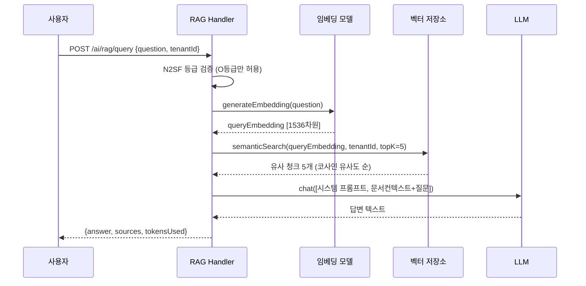
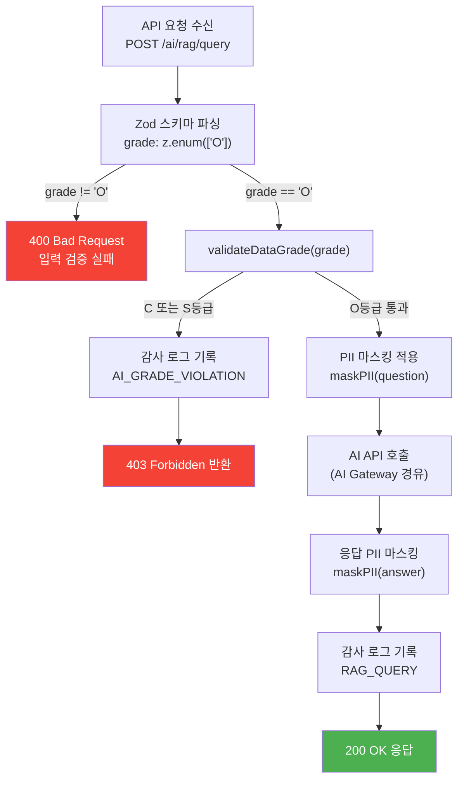
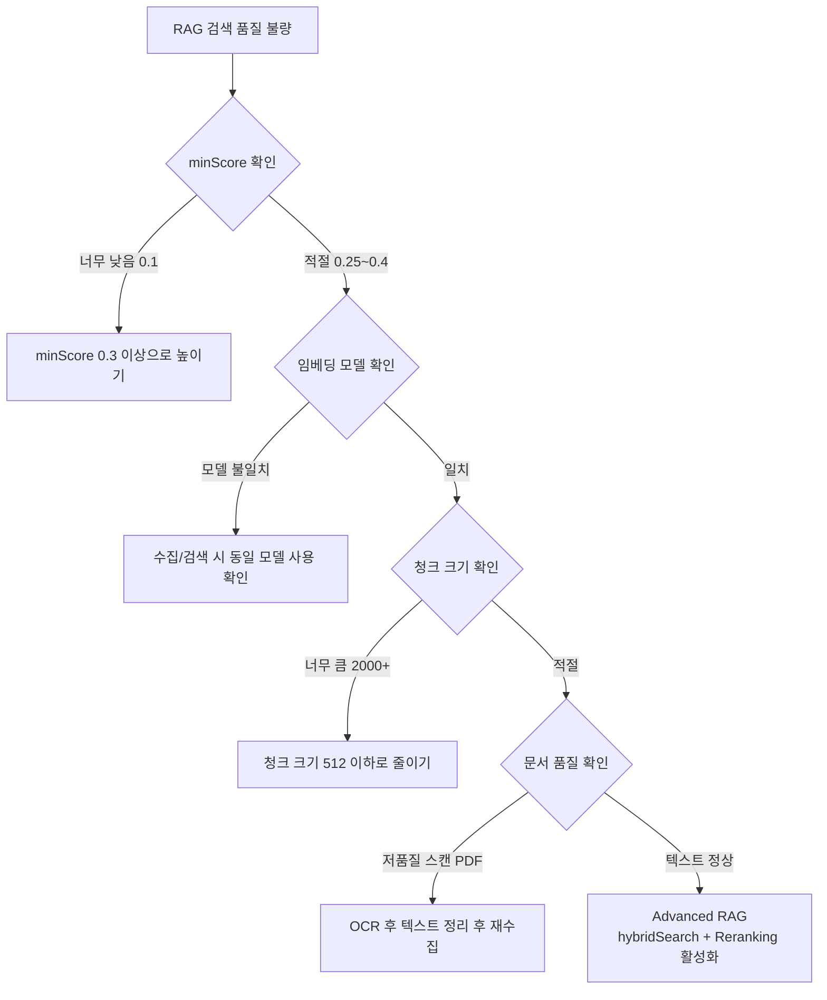

# AI/LLM 개발 FAQ

> **문서 ID**: ONBOARD-11-AI
> **버전**: 1.0.0 | **작성일**: 2026-04-12 | **작성자**: Implementer (Sonnet)
> **대상**: AI 기능 개발에 참여하는 개발자
> **질문 수**: 25개
> **선행 문서**: `03-csap-faq.md`, `platform/services/ai-service/src/` 소스 코드

---

## 목차

1. [AI 서비스 기본 (Q1~Q5)](#1-ai-서비스-기본)
2. [N2SF 데이터 규정 (Q6~Q10)](#2-n2sf-데이터-규정)
3. [성능 및 비용 최적화 (Q11~Q15)](#3-성능-및-비용-최적화)
4. [개발 실무 (Q16~Q20)](#4-개발-실무)
5. [트러블슈팅 (Q21~Q25)](#5-트러블슈팅)
6. [학습 체크리스트](#학습-체크리스트)
7. [다음 단계](#다음-단계)

---

## 1. AI 서비스 기본

---

**Q1. RAG가 뭔가요? 이 프로젝트에서 어떻게 작동하나요?**

A: **RAG(Retrieval-Augmented Generation)**는 "검색 후 생성" 방식입니다. AI 모델에게 질문하기 전에 먼저 관련 문서를 찾아서 같이 넘겨주는 방식으로, AI가 사전 학습 데이터만 보는 것이 아니라 실제 기관 문서를 근거로 답변하게 됩니다.

이 프로젝트의 RAG 파이프라인은 `platform/services/ai-service/src/lib/rag-engine.ts`에 구현되어 있으며 다음 단계로 동작합니다.

```
사용자 질문
    ↓
1. 질문 임베딩 생성 (generateEmbedding)
    ↓
2. 벡터 저장소에서 유사 청크 검색 (semanticSearch / hybridSearch)
    ↓
3. 관련 청크 컨텍스트 구성 (토큰 예산 6000 이내)
    ↓
4. LLM에 [문서 컨텍스트 + 질문] 전달
    ↓
5. [출처 인용] 포함 답변 반환
```



실제 코드에서 두 가지 RAG를 제공합니다.

| 함수 | 검색 방식 | 사용 상황 |
|------|---------|---------|
| `runRAG()` | 시맨틱 검색만 | 단순한 QA, 속도 우선 |
| `runAdvancedRAG()` | 하이브리드(BM25+시맨틱) + Reranking | 정확도 우선, 복잡한 쿼리 |

💡 **처음에는 `runRAG()`부터 시작하세요.** Advanced RAG는 LLM 호출이 추가로 발생해 비용이 높습니다.

---

**Q2. 벡터 스토어는 무엇이고 왜 쓰나요?**

A: **벡터 스토어(Vector Store)**는 텍스트를 수치 벡터로 변환해서 저장하는 데이터베이스입니다. 일반 DB가 "키워드가 정확히 일치"하는 것을 찾는다면, 벡터 스토어는 "의미가 비슷한" 것을 찾습니다.

예시로 이해해 보겠습니다.

```
검색어: "버스 환불 방법"

키워드 검색:  "버스"와 "환불"이라는 단어가 있는 문서만 반환
벡터 검색:   "대중교통 요금 취소", "교통카드 잔액 환급" 같은 의미상 연관 문서도 반환
```

이 프로젝트의 벡터 스토어는 `platform/services/ai-service/src/lib/vector-store.ts`에 구현되어 있습니다.

```typescript
// 핵심 구현: 코사인 유사도로 가장 가까운 청크 찾기
function cosineSimilarity(a: number[], b: number[]): number {
  // 두 벡터 사이의 각도를 측정: 1에 가까울수록 의미가 유사
  let dotProduct = 0;
  let normA = 0;
  let normB = 0;
  for (let i = 0; i < a.length; i++) {
    dotProduct += a[i] * b[i];
    normA += a[i] * a[i];
    normB += b[i] * b[i];
  }
  return dotProduct / (Math.sqrt(normA) * Math.sqrt(normB));
}
```

⚠️ **현재 구현의 한계**: 현재 벡터 스토어는 PostgreSQL JSON 컬럼에 임베딩을 저장하고 TypeScript에서 코사인 유사도를 계산합니다. 청크가 1만 개를 초과하면 pgvector 확장으로 마이그레이션을 권장합니다. (`vector-store.ts` 주석 참조)

```
데이터 흐름:
문서 텍스트
  → chunkText() : 512토큰 단위로 분할
  → generateEmbedding() : 각 청크를 1536차원 벡터로 변환
  → storeChunks() : PostgreSQL aiKnowledgeChunk 테이블에 JSON으로 저장
  → semanticSearch() : 질문 벡터와 저장 벡터 코사인 유사도 계산 → 상위 K개 반환
```

---

**Q3. AI 서비스에서 스트리밍 응답은 어떻게 구현하나요?**

A: 스트리밍은 LLM이 토큰을 생성하는 즉시 클라이언트로 전달하는 방식입니다. 일반 응답이 "전체 답변 완성 후 한 번에 전송"이라면, 스트리밍은 "한 글자씩 실시간 전송"입니다.

이 프로젝트에서는 **Server-Sent Events(SSE)** 방식을 사용합니다.

```typescript
// 스트리밍 엔드포인트 예시 (ai-service에 추가 시)
import type { FastifyRequest, FastifyReply } from 'fastify';

export async function ragStreamHandler(
  request: FastifyRequest<{ Body: QueryBody }>,
  reply: FastifyReply,
): Promise<void> {
  // 1. SSE 헤더 설정
  reply.raw.setHeader('Content-Type', 'text/event-stream');
  reply.raw.setHeader('Cache-Control', 'no-cache');
  reply.raw.setHeader('Connection', 'keep-alive');

  // 2. N2SF 등급 검증 (스트리밍도 동일하게 적용)
  const body = querySchema.parse(request.body);
  validateDataGrade(body.grade as DataGrade); // O등급만 허용

  // 3. 임베딩 생성 및 검색
  const queryEmbedding = await generateEmbedding(body.question);
  const searchResults = await semanticSearch(queryEmbedding, body.tenantId, 5, 0.25);

  // 4. LLM 스트리밍 호출
  const provider = await createLLMProvider(getLLMConfig());
  const stream = await provider.stream(messages, { maxTokens: 2048 });

  // 5. 청크 단위로 클라이언트에 전송
  for await (const chunk of stream) {
    reply.raw.write(`data: ${JSON.stringify({ delta: chunk.text })}\n\n`);
  }

  // 6. 완료 신호
  reply.raw.write(`data: [DONE]\n\n`);
  reply.raw.end();
}
```

클라이언트 측 구현 (React 예시):

```typescript
// 프론트엔드에서 스트리밍 수신
async function askWithStreaming(question: string): Promise<void> {
  const response = await fetch('/ai/rag/stream', {
    method: 'POST',
    headers: { 'Content-Type': 'application/json' },
    body: JSON.stringify({ question, tenantId: currentTenantId, grade: 'O' }),
  });

  const reader = response.body!.getReader();
  const decoder = new TextDecoder();
  let buffer = '';

  while (true) {
    const { done, value } = await reader.read();
    if (done) break;

    buffer += decoder.decode(value, { stream: true });
    const lines = buffer.split('\n\n');
    buffer = lines.pop() ?? '';

    for (const line of lines) {
      if (line.startsWith('data: ')) {
        const data = line.slice(6);
        if (data === '[DONE]') return;
        const parsed = JSON.parse(data) as { delta: string };
        setAnswer((prev) => prev + parsed.delta); // React 상태 업데이트
      }
    }
  }
}
```

💡 **스트리밍 주의사항**: 스트리밍 도중 에러가 발생하면 이미 전송된 부분을 되돌릴 수 없습니다. 에러 이벤트를 별도로 전송하십시오. (`data: {"error": "..."}`)

---

**Q4. Tool Use(Function Calling)는 어떻게 사용하나요?**

A: **Tool Use**는 AI 모델이 직접 코드를 실행하거나 API를 호출할 수 있게 해주는 기능입니다. "계산해줘", "지식베이스 검색해줘" 같은 요청을 받으면 AI가 적절한 도구를 선택해 실행한 후 결과를 바탕으로 답변합니다.

이 프로젝트에는 `platform/services/ai-service/src/lib/ai-tools.ts`에 7가지 내장 도구가 있습니다.

```typescript
// 현재 등록된 도구 목록 (TOOL_DEFINITIONS)
const 도구목록 = [
  'search_knowledge',  // 지식베이스 시맨틱 검색
  'summarize_text',    // 긴 텍스트 3줄 요약
  'classify_request',  // 민원 카테고리 + 우선순위 분류
  'extract_entities',  // 개체명 추출 (날짜, 금액, 기관명)
  'calculate',         // 사칙연산 (안전한 수식 파서, eval 사용 안 함)
  'current_datetime',  // 현재 날짜/시간 (KST)
  'format_document',   // 공공 공문서 형식 포맷
];
```

새 도구를 추가하는 방법:

```typescript
// Step 1: TOOL_DEFINITIONS에 도구 선언 추가
export const TOOL_DEFINITIONS: ToolDefinition[] = [
  // ... 기존 도구들 ...
  {
    name: 'lookup_regulation',  // 도구 이름 (영어, snake_case)
    description: '법령/규정 데이터베이스에서 조항을 조회합니다',
    parameters: {
      regulationName: {
        type: 'string',
        description: '법령명 (예: 개인정보보호법)',
        required: true,
      },
      articleNumber: {
        type: 'string',
        description: '조항 번호 (예: 제15조)',
        required: false,
      },
    },
  },
];

// Step 2: createToolExecutors에 실행 로직 추가
export function createToolExecutors(options = {}) {
  return {
    // ... 기존 실행기들 ...
    lookup_regulation: async (params): Promise<ToolCallResult> => {
      const name = String(params['regulationName'] ?? '');
      // 실제 법령 DB 조회 로직
      const result = await regulationDb.search(name);
      return { success: true, output: JSON.stringify(result) };
    },
  };
}
```

도구 사용 API 호출:

```bash
# 특정 도구만 허용 (보안: 필요한 도구만 노출)
curl -X POST http://localhost:3000/ai/agent \
  -H "Content-Type: application/json" \
  -d '{
    "tenantId": "uuid-여기에",
    "grade": "O",
    "query": "2026년 1월부터 3월까지 몇 일인가요?",
    "tools": ["calculate", "current_datetime"]
  }'
```

⚠️ **보안 주의**: `calculate` 도구는 `eval()` 대신 재귀 하강 파서를 사용합니다. 코드 인젝션이 불가능합니다. 새 도구를 추가할 때도 동일한 원칙을 적용하십시오.

---

**Q5. AI 응답 캐싱은 어떻게 하나요?**

A: AI API는 호출 비용이 높기 때문에 동일하거나 유사한 질문에 대한 답변을 Redis에 캐싱하는 것이 중요합니다.

이 프로젝트의 권장 캐싱 패턴은 두 가지입니다.

**방법 1: 정확한 질문 캐싱 (간단하지만 효과 낮음)**

```typescript
import { redis } from '../lib/redis.js';
import crypto from 'node:crypto';

async function ragQueryWithCache(
  tenantId: string,
  question: string,
  options: RAGOptions,
): Promise<RAGResponse> {
  // 캐시 키: tenantId + 질문의 SHA-256 해시
  const cacheKey = `rag:${tenantId}:${crypto
    .createHash('sha256')
    .update(question.trim().toLowerCase())
    .digest('hex')}`;

  // 캐시 조회
  const cached = await redis.get(cacheKey);
  if (cached) {
    return JSON.parse(cached) as RAGResponse;
  }

  // 캐시 미스: 실제 RAG 실행
  const response = await runRAG(tenantId, question, await generateEmbedding(question), options);

  // 결과 캐싱 (TTL: 1시간)
  await redis.setex(cacheKey, 3600, JSON.stringify(response));
  return response;
}
```

**방법 2: 시맨틱 캐싱 (정확도 높음)**

```typescript
// 의미가 유사한 질문도 같은 캐시를 반환
async function semanticCachedQuery(
  tenantId: string,
  question: string,
): Promise<RAGResponse | null> {
  const queryEmbedding = await generateEmbedding(question);

  // 캐시된 질문들의 임베딩과 비교
  const cachedKeys = await redis.keys(`rag-semantic:${tenantId}:*`);
  for (const key of cachedKeys) {
    const entry = JSON.parse(await redis.get(key) ?? '{}') as {
      embedding: number[];
      response: RAGResponse;
    };
    const similarity = cosineSimilarity(queryEmbedding, entry.embedding);
    if (similarity > 0.95) {
      // 95% 이상 유사하면 캐시 반환
      return entry.response;
    }
  }
  return null; // 캐시 미스
}
```

💡 **캐시 무효화**: 지식베이스 문서가 업데이트되면 (`POST /ai/rag/ingest`) 해당 테넌트의 RAG 캐시를 모두 무효화하십시오.

```typescript
// 문서 수집 완료 후 캐시 무효화
await redis.del(...await redis.keys(`rag:${tenantId}:*`));
await redis.del(...await redis.keys(`rag-semantic:${tenantId}:*`));
```

---

## 2. N2SF 데이터 규정

---

**Q6. C등급 데이터가 뭔가요? 실수로 AI에 전송하면 어떻게 되나요?**

A: N2SF(국가 정보보호 프레임워크)는 공공기관 데이터를 세 등급으로 분류합니다.

| 등급 | 의미 | 예시 | AI 전송 여부 |
|------|------|------|------------|
| **C (기밀)** | 국가 안보, 기관 비밀 | 국방 정보, 수사 자료, 계약 협상 내용 | ❌ 절대 금지 |
| **S (민감)** | 개인정보, 내부 정보 | 주민등록번호, 급여 정보, 의료 기록 | ❌ 절대 금지 |
| **O (공개)** | 일반 공개 정보 | 공지사항, 서비스 안내, FAQ | ✅ 마스킹 후 허용 |

실수로 C/S등급 데이터를 전송하려 하면 시스템에서 자동으로 차단합니다.

```typescript
// grade-check.ts 의 실제 동작
export function validateDataGrade(grade: DataGrade): void {
  if (grade === 'C' || grade === 'S') {
    throw new DataGradeViolationError(
      `BLOCKED: ${grade}등급 데이터는 AI API 전송 금지 (N2SF N-05)`,
      'N2SF_GRADE_VIOLATION'
    );
  }
}
```

`ai-rag.handler.ts`에서 모든 핸들러가 첫 번째로 이 검사를 실행합니다.

```typescript
// ragIngestHandler, ragQueryHandler 모두 동일 패턴
try {
  validateDataGrade(body.grade as DataGrade);
} catch (error) {
  if (error instanceof DataGradeViolationError) {
    // 위반 시도 감사 로그 기록 (CSAP D-06)
    await logAiEvent('AI_GRADE_VIOLATION', actor, 'rag', body.tenantId, request.ip, ...);
    await reply.status(403).send({ error: error.message });
    return;
  }
}
```

❌ **차단 시 HTTP 403 Forbidden이 반환되고 감사 로그에 위반 기록이 남습니다.** 실수라도 기록이 남으므로 주의하십시오.

현재 API는 `grade` 필드가 `'O'`만 허용하도록 Zod 스키마 자체에서 강제합니다.

```typescript
// ingestSchema, querySchema 모두 동일
grade: z.enum(['O']),  // O등급만 허용, C/S는 400 Bad Request
```

---

**Q7. PII 마스킹은 어떻게 구현하나요? 코드 예시를 보여주세요.**

A: **PII(Personal Identifiable Information)**는 개인을 식별할 수 있는 정보입니다. O등급 데이터라도 PII가 포함된 경우 마스킹 후 AI에 전송해야 합니다.

이 프로젝트는 `platform/services/ai-service/src/lib/pii-masking.ts`에서 자동 마스킹을 처리합니다. `rag-engine.ts`에서 질문과 답변 모두에 적용합니다.

```typescript
// rag-engine.ts 에서의 실제 사용
const maskedQuestion = maskPII(question);    // 질문 마스킹
// ... LLM 호출 ...
return {
  answer: maskPII(llmResponse.text),  // 답변 마스킹
  // ...
};
```

PII 마스킹 패턴 예시:

```typescript
// pii-masking.ts 구현 패턴 (실제 파일 참조)
export function maskPII(text: string): string {
  return text
    // 주민등록번호: 123456-1234567 → [주민번호 마스킹]
    .replace(/\d{6}-[1-4]\d{6}/g, '[주민번호 마스킹]')
    // 전화번호: 010-1234-5678 → [전화번호 마스킹]
    .replace(/01[0-9]-\d{3,4}-\d{4}/g, '[전화번호 마스킹]')
    // 이메일: user@domain.com → [이메일 마스킹]
    .replace(/[a-zA-Z0-9._%+-]+@[a-zA-Z0-9.-]+\.[a-zA-Z]{2,}/g, '[이메일 마스킹]')
    // 신용카드: 1234-5678-9012-3456 → [카드번호 마스킹]
    .replace(/\d{4}-\d{4}-\d{4}-\d{4}/g, '[카드번호 마스킹]')
    // 계좌번호: 123-456-789012 → [계좌번호 마스킹]
    .replace(/\d{3}-\d{3,6}-\d{4,6}/g, '[계좌번호 마스킹]');
}
```

직접 PII 마스킹이 필요한 경우:

```typescript
import { maskPII } from '../lib/pii-masking.js';

// 사용자 입력이 있는 모든 곳에 적용
const safeInput = maskPII(userInput);
const safeLog = maskPII(logMessage);

// 감사 로그에도 마스킹 적용
await logAiEvent('RAG_QUERY', actor, 'rag', tenantId, ip, userAgent, {
  question: maskPII(body.question).slice(0, 100), // 100자로 자르기
});
```

💡 **테스트에서 PII 마스킹 확인**:

```typescript
// 테스트 예시
describe('PII 마스킹', () => {
  it('주민등록번호를 마스킹해야 한다', () => {
    const input = '신청자 홍길동 (900101-1234567)의 서류';
    const masked = maskPII(input);
    expect(masked).toContain('[주민번호 마스킹]');
    expect(masked).not.toMatch(/\d{6}-[1-4]\d{6}/);
  });
});
```

---

**Q8. AI API 호출 전 등급 확인은 어떻게 하나요?**

A: 모든 AI 관련 핸들러에서 다음 순서로 등급 확인이 이루어집니다.



코드에서 직접 등급 확인이 필요한 경우:

```typescript
import { validateDataGrade, DataGradeViolationError } from '../lib/grade-check.js';
import type { DataGrade } from '@public-saas/types';

// 서비스 레이어에서 직접 확인
async function processWithAI(data: string, grade: DataGrade): Promise<string> {
  // Step 1: 등급 확인
  try {
    validateDataGrade(grade);
  } catch (error) {
    if (error instanceof DataGradeViolationError) {
      // 위반 시도 기록 후 에러 반환
      logger.error({ grade, error: error.code }, 'N2SF 등급 위반 차단');
      throw error; // 상위로 전파
    }
    throw error;
  }

  // Step 2: O등급 데이터에만 PII 마스킹 후 AI 호출
  const maskedData = maskPII(data);
  return callAIGateway(maskedData);
}
```

---

**Q9. AI 감사 로그는 어떻게 기록하나요?**

A: AI 서비스의 감사 로그는 `platform/services/ai-service/src/lib/audit.ts`에 구현되어 있으며 `@public-saas/audit-sdk`를 사용합니다.

```typescript
// audit.ts — 실제 구현 (3줄)
import { createServiceAuditLogger } from '@public-saas/audit-sdk';
export const logAiEvent = createServiceAuditLogger('ai-service', 'ai');
```

실제 핸들러에서의 사용 패턴:

```typescript
// ai-rag.handler.ts 에서 실제 사용 예시
import { logAiEvent } from '../lib/audit.js';

// 문서 수집 성공 시
await logAiEvent(
  'RAG_INGEST',        // 이벤트 유형
  actor,               // 행위자 (userId)
  'rag',               // 서비스 컴포넌트
  body.tenantId,       // 테넌트 ID
  request.ip,          // IP 주소
  request.headers['user-agent'] ?? 'unknown', // User-Agent
  {
    documentId,        // 추가 메타데이터
    chunkCount: chunks.length,
    title: body.title,
  },
);

// 등급 위반 시도 시
await logAiEvent(
  'AI_GRADE_VIOLATION',
  actor,
  'rag',
  body.tenantId,
  request.ip,
  request.headers['user-agent'] ?? 'unknown',
  { grade: body.grade, blocked: true, endpoint: 'rag/ingest' },
);
```

기록되는 AI 이벤트 유형:

| 이벤트 유형 | 발생 시점 | 심각도 |
|-----------|---------|------|
| `RAG_INGEST` | 문서 수집 성공 | INFO |
| `RAG_QUERY` | RAG 질의 성공 | INFO |
| `RAG_ADVANCED_QUERY` | Advanced RAG 질의 성공 | INFO |
| `AGENT_RUN` | ReAct 에이전트 실행 | INFO |
| `AGENT_PLAN_EXECUTE` | Plan-Execute 에이전트 실행 | INFO |
| `AGENT_ORCHESTRATE` | Orchestrator 에이전트 실행 | INFO |
| `AI_GRADE_VIOLATION` | N2SF 등급 위반 시도 | WARN |

💡 감사 로그는 append-only로 수정/삭제가 불가능합니다. CSAP D-06 요건에 따라 최소 1년 보존됩니다.

---

**Q10. 외부 AI API 직접 호출하면 안 되는 이유는?**

A: 세 가지 이유로 **반드시 AI Gateway를 경유**해야 합니다.

**이유 1: N2SF 데이터 분류 우회 방지**

직접 호출하면 등급 검사와 PII 마스킹을 건너뛸 수 있습니다. AI Gateway는 이 두 단계를 강제합니다.

```
직접 호출 (금지):
  서비스 → Anthropic API  ← C/S등급 데이터 유출 가능

게이트웨이 경유 (필수):
  서비스 → 등급 검사 → PII 마스킹 → AI Gateway → Anthropic API
```

**이유 2: 감사 추적 단절**

직접 호출하면 어떤 데이터가 외부로 나갔는지 추적할 수 없습니다. CSAP D-06 위반입니다.

**이유 3: 비용 통제 불가**

AI Gateway는 테넌트별 토큰 사용량을 추적하고 Rate Limit을 적용합니다. 직접 호출하면 한 테넌트가 전체 토큰 예산을 소진할 수 있습니다.

```typescript
// ❌ 절대 금지: 직접 외부 API 호출
import Anthropic from '@anthropic-ai/sdk';
const client = new Anthropic({ apiKey: process.env.ANTHROPIC_API_KEY });
const response = await client.messages.create({ ... }); // BLOCKED

// ✅ 올바른 방법: AI Gateway (createLLMProvider) 사용
import { createLLMProvider, getLLMConfig } from '../lib/llm-provider.js';
const provider = await createLLMProvider(getLLMConfig());
const response = await provider.chat(messages, { maxTokens: 2048 });
```

---

## 3. 성능 및 비용 최적화

---

**Q11. AI 호출 비용을 줄이는 방법은?**

A: 다섯 가지 전략을 순서대로 적용하면 비용을 70% 이상 절감할 수 있습니다.

**전략 1: 캐싱 (Q5 참조, 비용 절감 효과 최대)**

동일/유사 질문에는 캐시 답변을 반환합니다.

**전략 2: 토큰 수 제한**

```typescript
// maxContextTokens를 줄여서 컨텍스트 토큰 절약
const response = await runRAG(tenantId, question, embedding, {
  maxContextTokens: 3000,  // 기본 6000에서 절반으로 줄임
  topK: 3,                 // 기본 5에서 3으로 줄임
});

// 답변 길이 제한
const llmResponse = await provider.chat(messages, {
  maxTokens: 1024,   // 기본 2048에서 절반으로 줄임
});
```

**전략 3: 모델 선택 최적화**

| 사용 사례 | 권장 모델 | 이유 |
|---------|---------|------|
| RAG QA, 분류 | Sonnet | 비용/성능 균형 |
| 감리·법령 분석 | Opus | 높은 정확도 필요 |
| 텍스트 요약, 태깅 | Haiku | 단순 작업, 최저 비용 |

**전략 4: 배치 처리**

```typescript
// 1개씩 처리 (비효율적)
for (const chunk of chunks) {
  await generateEmbedding(chunk.content); // 청크마다 API 호출
}

// 배치 처리 (효율적)
const embeddings = await Promise.all(
  chunks.map((chunk) => generateEmbedding(chunk.content))
);
// 또는 임베딩 API의 배치 기능 활용
const result = await provider.embed(chunks.map((c) => c.content));
```

**전략 5: 청킹 최적화**

```typescript
// 너무 작은 청크: 같은 내용도 여러 번 임베딩 생성 → 비용 증가
const tooSmall = chunkText(text, 128, 10);  // 청크 수 많음

// 적절한 청크 크기: 균형
const balanced = chunkText(text, 512, 50);  // 권장 설정
```

---

**Q12. 청킹(Chunking) 전략은 어떻게 선택하나요?**

A: 이 프로젝트의 `chunker.ts`는 두 가지 전략을 제공합니다.

**전략 1: 일반 청킹 (`chunkText`)**

단락 → 문장 → 문자 순서로 분할합니다. 한국어 최적화가 적용되어 있습니다.

```typescript
import { chunkText } from '../lib/chunker.js';

// 기본 설정 (권장)
const chunks = chunkText(documentText, 512, 50);
// maxTokens=512: 청크당 최대 512 토큰 (약 1024자)
// overlapTokens=50: 앞 청크 끝 50토큰을 다음 청크 시작에 포함 (문맥 연속성)
```

**전략 2: 계층적 청킹 (`hierarchicalChunk`)**

부모 청크(1024토큰)로 컨텍스트를 유지하면서 자식 청크(256토큰)로 정밀 검색합니다.

```typescript
import { hierarchicalChunk, buildChildToParentMap } from '../lib/chunker.js';

// 부모-자식 청크 생성
const hierarchy = hierarchicalChunk(documentText, 1024, 256);

// 자식→부모 역참조 맵
const childToParent = buildChildToParentMap(hierarchy);

// 자식 청크로 검색하되, 실제 LLM에는 부모 청크 컨텍스트 제공
const searchedChildIndex = 42;
const parentChunk = childToParent.get(searchedChildIndex);
```

**어떤 전략을 언제 사용할까요?**

```
짧은 FAQ 문서 (< 10페이지): chunkText(text, 512, 50)
긴 법령/보고서 (10페이지+): hierarchicalChunk(text, 1024, 256)
코드/구조화 문서: chunkText(text, 256, 0)  // 오버랩 없이
```

---

**Q13. 임베딩 모델은 어떤 것을 써야 하나요?**

A: 이 프로젝트는 DB의 `AiModel` 테이블에서 임베딩 모델을 동적으로 선택합니다.

```typescript
// rag-engine.ts의 generateEmbedding 로직
const embedModel = await prisma.aiModel.findFirst({
  where: {
    isActive: true,
    name: { contains: 'embed' },  // name에 'embed'가 포함된 모델 자동 선택
  },
});
```

모델 등록 방법 (DB 직접 삽입):

```sql
-- 임베딩 모델 등록 예시
INSERT INTO "AiModel" (id, name, provider, endpoint, "isActive", type)
VALUES
  (gen_random_uuid(), 'text-embedding-3-small', 'openai', 'https://ai-gateway/v1', true, 'embed'),
  (gen_random_uuid(), 'text-embedding-3-large', 'openai', 'https://ai-gateway/v1', false, 'embed');
```

**모델 선택 가이드**:

| 모델 | 차원 수 | 비용 | 권장 상황 |
|------|-------|------|---------|
| text-embedding-3-small | 1536 | 낮음 | 일반 문서 검색 |
| text-embedding-3-large | 3072 | 높음 | 정확도 중요한 법령 문서 |
| 한국어 특화 모델 | 768~1024 | 중간 | 한국어 공문서 (권장) |

💡 **중요**: 임베딩 모델을 변경하면 **기존 모든 청크를 다시 임베딩해야 합니다.** 모델을 바꾸는 것은 DB 재구축과 같습니다. 신중하게 결정하십시오.

---

**Q14. AI 응답이 너무 느립니다. 어떻게 최적화하나요?**

A: AI 응답 지연은 세 구간에서 발생합니다. 각 구간별 최적화 방법이 다릅니다.

```
[구간 1] 임베딩 생성: 100~300ms
[구간 2] 벡터 검색: 50~500ms (데이터 크기에 비례)
[구간 3] LLM 답변 생성: 1~10초 (컨텍스트, 모델에 따라)
```

**구간 1 최적화: 임베딩 캐싱**

```typescript
// 동일 텍스트 임베딩은 캐싱
const embeddingKey = `embed:${crypto.createHash('sha256').update(text).digest('hex')}`;
const cached = await redis.getBuffer(embeddingKey);
if (cached) {
  return JSON.parse(cached.toString()) as number[];
}
const embedding = await provider.embed([maskPII(text)]);
await redis.setex(embeddingKey, 86400, JSON.stringify(embedding.embeddings[0])); // 24시간 캐시
return embedding.embeddings[0] ?? [];
```

**구간 2 최적화: 벡터 검색 인덱스**

```typescript
// 현재: TypeScript에서 선형 탐색 O(n)
// vector-store.ts: 모든 청크를 메모리에 올려서 비교
const chunks = await db['aiKnowledgeChunk'].findMany({ take: 10000 }); // 10,000개까지

// 개선: pgvector 인덱스 사용 (10,000개 초과 시 필수)
// CREATE INDEX ON "AiKnowledgeChunk" USING hnsw (embedding vector_cosine_ops);
```

**구간 3 최적화: 스트리밍 + 컨텍스트 축소**

```typescript
// 스트리밍으로 체감 응답 시간 단축 (Q3 참조)
// 컨텍스트 토큰 줄이기
const response = await runRAG(tenantId, question, embedding, {
  topK: 3,                 // 5 → 3
  maxContextTokens: 3000,  // 6000 → 3000
});
```

**전체 파이프라인 벤치마크**:

```bash
# 응답 시간 측정
time curl -X POST http://localhost:3008/ai/rag/query \
  -H "Content-Type: application/json" \
  -d '{"tenantId":"uuid","grade":"O","question":"공공기관 클라우드 전환 절차"}'

# 목표: P95 < 3초 (임베딩 + 검색 + LLM)
```

---

**Q15. 동시 AI 요청이 많을 때 Rate Limit은 어떻게 관리하나요?**

A: AI API는 분당 요청 수(RPM)와 분당 토큰 수(TPM) 두 가지 Rate Limit이 있습니다.

이 프로젝트의 Rate Limit 관리 패턴:

```typescript
// 서비스 레이어에서 Rate Limit 미들웨어 적용 예시
import { rateLimit } from '@fastify/rate-limit';

// AI 엔드포인트에만 별도 Rate Limit 적용
fastify.register(rateLimit, {
  routeConfig: {
    rateLimit: {
      max: 10,        // 테넌트당 분당 10회
      timeWindow: 60000, // 1분
      keyGenerator: (req) => {
        // 테넌트별 격리
        return `ai:${(req.body as { tenantId: string }).tenantId}`;
      },
    },
  },
});
```

Redis를 활용한 토큰 버킷 구현:

```typescript
// 토큰 사용량 추적 (테넌트별)
async function trackTokenUsage(tenantId: string, tokensUsed: number): Promise<boolean> {
  const key = `ai:tokens:${tenantId}:${new Date().toISOString().slice(0, 13)}`; // 시간 단위
  const current = await redis.incrby(key, tokensUsed);
  await redis.expire(key, 3600); // 1시간 후 만료

  const HOURLY_TOKEN_LIMIT = 500_000; // 테넌트당 시간당 50만 토큰
  if (current > HOURLY_TOKEN_LIMIT) {
    throw new Error(`토큰 한도 초과: ${current}/${HOURLY_TOKEN_LIMIT}`);
  }
  return true;
}

// AI 응답 후 호출
await trackTokenUsage(body.tenantId, ragResponse.tokensUsed);
```

**Rate Limit 오류 발생 시 지수 백오프**:

```typescript
async function callWithRetry<T>(
  fn: () => Promise<T>,
  maxRetries = 3,
): Promise<T> {
  for (let attempt = 0; attempt < maxRetries; attempt++) {
    try {
      return await fn();
    } catch (error) {
      if (isRateLimitError(error) && attempt < maxRetries - 1) {
        const waitMs = Math.pow(2, attempt) * 1000; // 1s, 2s, 4s
        await new Promise((resolve) => setTimeout(resolve, waitMs));
        continue;
      }
      throw error;
    }
  }
  throw new Error('최대 재시도 횟수 초과');
}
```

---

## 4. 개발 실무

---

**Q16. AI 기능 테스트는 어떻게 작성하나요?**

A: AI 테스트는 외부 API 호출을 모킹하는 것이 핵심입니다. 실제 AI API를 호출하면 테스트가 느리고 비용이 발생하며 결과가 비결정적입니다.

```typescript
// ai-service 테스트 예시 (vitest 사용)
import { describe, it, expect, vi, beforeEach } from 'vitest';
import { runRAG } from '../src/lib/rag-engine.js';

// LLM Provider 모킹
vi.mock('../src/lib/llm-provider.js', () => ({
  getLLMConfig: vi.fn(() => ({ provider: 'mock', endpoint: '', name: 'mock' })),
  buildLLMConfig: vi.fn((c) => c),
  createLLMProvider: vi.fn(async () => ({
    chat: vi.fn(async () => ({
      text: '모킹된 AI 답변입니다.',
      model: 'mock-model',
      tokensUsed: 100,
    })),
    embed: vi.fn(async (texts: string[]) => ({
      embeddings: texts.map(() => new Array(1536).fill(0.1)),
    })),
  })),
}));

// 벡터 스토어 모킹
vi.mock('../src/lib/vector-store.js', () => ({
  semanticSearch: vi.fn(async () => [
    {
      chunk: {
        id: 'chunk-1',
        tenantId: 'tenant-test',
        documentId: 'doc-1',
        chunkIndex: 0,
        content: '공공기관 클라우드 전환 절차는 다음과 같습니다...',
        embedding: new Array(1536).fill(0.1),
        tokenCount: 50,
        metadata: { documentTitle: '클라우드 전환 가이드' },
      },
      score: 0.85,
    },
  ]),
}));

describe('RAG 엔진', () => {
  it('질문에 대한 답변과 출처를 반환해야 한다', async () => {
    const result = await runRAG(
      'tenant-test',
      '클라우드 전환 절차는?',
      new Array(1536).fill(0.1),  // 모킹된 임베딩
      { topK: 5, minScore: 0.25 },
    );

    expect(result.answer).toBeTruthy();
    expect(result.sources).toHaveLength(1);
    expect(result.sources[0].documentTitle).toBe('클라우드 전환 가이드');
    expect(result.tokensUsed).toBeGreaterThan(0);
  });

  it('검색 결과가 없으면 안내 메시지를 반환해야 한다', async () => {
    vi.mocked(semanticSearch).mockResolvedValueOnce([]); // 빈 결과 모킹

    const result = await runRAG('tenant-test', '존재하지않는질문', [], {});
    expect(result.answer).toContain('찾을 수 없습니다');
    expect(result.contextChunks).toBe(0);
  });
});
```

**등급 검사 테스트**:

```typescript
import { describe, it, expect } from 'vitest';
import { validateDataGrade, DataGradeViolationError } from '../src/lib/grade-check.js';

describe('N2SF 등급 검사', () => {
  it('O등급은 통과해야 한다', () => {
    expect(() => validateDataGrade('O')).not.toThrow();
  });

  it('C등급은 DataGradeViolationError를 던져야 한다', () => {
    expect(() => validateDataGrade('C')).toThrow(DataGradeViolationError);
  });

  it('S등급도 차단해야 한다', () => {
    expect(() => validateDataGrade('S')).toThrow(DataGradeViolationError);
  });
});
```

---

**Q17. 프롬프트 버저닝은 어떻게 관리하나요?**

A: 프롬프트는 코드와 동일하게 버전 관리해야 합니다. 프롬프트 변경이 AI 답변 품질에 큰 영향을 미치기 때문입니다.

이 프로젝트의 권장 방식은 DB 기반 프롬프트 관리입니다.

```typescript
// 프롬프트 버전 관리 스키마 (Prisma)
// model AiPromptTemplate {
//   id          String   @id @default(cuid())
//   name        String   // 'rag-system-prompt', 'agent-system-prompt'
//   version     Int      // 1, 2, 3 ...
//   content     String   // 실제 프롬프트 내용
//   isActive    Boolean  @default(false)
//   createdAt   DateTime @default(now())
//   tenantId    String?  // null이면 기본값, 지정 시 테넌트 오버라이드
// }

// 활성 프롬프트 조회
async function getActivePrompt(name: string, tenantId?: string): Promise<string> {
  const prompt = await prisma.aiPromptTemplate.findFirst({
    where: {
      name,
      isActive: true,
      OR: [
        { tenantId },          // 테넌트 특화 프롬프트 우선
        { tenantId: null },    // 없으면 기본값 사용
      ],
    },
    orderBy: [
      { tenantId: 'desc' },   // 테넌트 특화 우선
      { version: 'desc' },    // 최신 버전 우선
    ],
  });
  return prompt?.content ?? DEFAULT_SYSTEM_PROMPT;
}
```

파일 기반 프롬프트 관리 (간단한 대안):

```
platform/services/ai-service/src/prompts/
├── v1/
│   ├── rag-system.txt        # v1 RAG 시스템 프롬프트
│   └── agent-system.txt      # v1 에이전트 시스템 프롬프트
├── v2/
│   ├── rag-system.txt        # v2 (현재 활성)
│   └── agent-system.txt
└── active.json               # {"rag": "v2", "agent": "v2"}
```

💡 **프롬프트 변경 시 PDCA**: 프롬프트 변경도 `FR-AI` 요구사항 ID를 붙이고 Design 문서에 기록하십시오. 감리에서 프롬프트 변경 이력을 요구할 수 있습니다.

---

**Q18. AI 에러(rate limit, timeout)를 어떻게 처리하나요?**

A: AI API 에러는 일시적인 것과 영구적인 것을 구분해서 처리해야 합니다.

```typescript
// AI 에러 분류 및 처리
export class AIError extends Error {
  constructor(
    message: string,
    public readonly code: string,
    public readonly retryable: boolean,
  ) {
    super(message);
    this.name = 'AIError';
  }
}

// LLM Provider 래퍼에서 에러 변환
async function safeProviderCall<T>(fn: () => Promise<T>): Promise<T> {
  try {
    return await fn();
  } catch (error) {
    const message = error instanceof Error ? error.message : String(error);

    // Rate Limit (429): 재시도 가능
    if (message.includes('429') || message.includes('rate limit')) {
      throw new AIError('AI API Rate Limit 초과. 잠시 후 재시도하세요.', 'RATE_LIMIT', true);
    }

    // Timeout (408): 재시도 가능
    if (message.includes('timeout') || message.includes('ETIMEDOUT')) {
      throw new AIError('AI API 응답 시간 초과.', 'TIMEOUT', true);
    }

    // 서비스 불가(503): 재시도 가능
    if (message.includes('503') || message.includes('overloaded')) {
      throw new AIError('AI 서비스가 일시적으로 과부하 상태입니다.', 'SERVICE_UNAVAILABLE', true);
    }

    // 인증 오류(401): 재시도 불가
    if (message.includes('401') || message.includes('authentication')) {
      throw new AIError('AI API 인증 실패. 설정을 확인하세요.', 'AUTH_FAILED', false);
    }

    // 기타 에러
    throw new AIError('AI API 오류가 발생했습니다.', 'AI_ERROR', false);
  }
}
```

핸들러에서의 에러 처리 (안전한 에러 메시지 반환):

```typescript
// ❌ 잘못된 방법: 민감 정보 노출
catch (err) {
  return reply.status(500).send({ error: err.message, stack: err.stack });
}

// ✅ 올바른 방법: 에러 코드만 반환 (CSAP D-12)
catch (err) {
  request.log.error(err, 'RAG query 실패'); // 내부 로그에만 상세 정보
  await reply.status(502).send({
    success: false,
    error: {
      code: 'RAG_QUERY_FAILED',
      message: 'RAG 질의 처리 중 오류가 발생했습니다.',
      // err.message, err.stack 절대 노출 금지
    },
  });
}
```

---

**Q19. 새 AI 기능 추가 시 PDCA 문서는 어떻게 작성하나요?**

A: 새 AI 기능도 다른 기능과 동일하게 Plan + Design 문서를 먼저 작성해야 합니다. AI 관련 추가 섹션이 필요합니다.

**Plan 문서 필수 항목 (AI 기능)**:

```markdown
# SVC-AI-NEWFEATURE-R1.plan.md

## 요구사항 ID
- FR-AI-NEW.1: 기능 설명

## N2SF 데이터 분류
- 처리 데이터 등급: O등급 (공개 정보)
- PII 포함 여부: 아니오 / 예 (마스킹 방법: ...)

## AI 모델 사용 계획
- 사용 모델: claude-sonnet-4-6
- 예상 토큰 사용량: 회당 약 2000 토큰
- 월 예상 비용: XX만원 (테넌트당)

## 감사 로그 이벤트
- NEW_AI_FEATURE_CALLED: 기능 호출 시
- NEW_AI_GRADE_VIOLATION: 등급 위반 시도 시
```

**Design 문서 필수 항목 (AI 기능)**:

```markdown
## AI Gateway 패턴
- 외부 API 직접 호출 금지
- createLLMProvider() 사용
- 모든 입력에 maskPII() 적용

## 데이터 흐름도 (Mermaid)
(입력 → 등급 검사 → PII 마스킹 → AI Gateway → 응답 마스킹 → 반환)

## 캐싱 전략
(TTL, 캐시 키 구조, 무효화 조건)

## 에러 처리
(Rate Limit, Timeout, Grade Violation 각각 처리 방법)
```

---

**Q20. AI 서비스 로컬 개발 시 실제 API 없이 테스트하는 방법?**

A: 로컬 개발 시 세 가지 방법으로 실제 AI API 없이 테스트할 수 있습니다.

**방법 1: Mock LLM Provider 환경 변수**

```bash
# .env.local (커밋 금지!)
AI_PROVIDER=mock
# mock 모드에서 createLLMProvider는 고정 응답을 반환하는 모의 객체를 반환
```

```typescript
// llm-provider.ts의 mock 모드 지원 예시
export async function createLLMProvider(config: LLMConfig) {
  if (config.provider === 'mock' || process.env['NODE_ENV'] === 'test') {
    return {
      chat: async () => ({ text: '[모의 답변] 로컬 테스트 응답입니다.', model: 'mock', tokensUsed: 50 }),
      embed: async (texts: string[]) => ({ embeddings: texts.map(() => new Array(1536).fill(0.1)) }),
    };
  }
  // 실제 구현...
}
```

**방법 2: Ollama 로컬 LLM 서버**

```bash
# Ollama 설치 및 경량 모델 실행
curl -fsSL https://ollama.ai/install.sh | sh
ollama pull llama3.2:3b  # 경량 모델 (약 2GB)
ollama serve              # localhost:11434에서 서버 시작

# .env.local
AI_PROVIDER=ollama
AI_ENDPOINT=http://localhost:11434
AI_MODEL_NAME=llama3.2:3b
```

**방법 3: 단위 테스트 모킹 (Q16 참조)**

```bash
# 테스트만 실행 (실제 API 호출 없음)
cd platform/services/ai-service
pnpm test          # vitest + vi.mock()으로 완전 격리
pnpm test:coverage # 커버리지 포함
```

**로컬 개발 전체 흐름**:

```bash
# 1. 의존성 설치
cd /data/ai-saas && pnpm install

# 2. DB + Redis 시작
docker-compose up -d postgres redis

# 3. 마이그레이션
cd platform/services/ai-service
pnpm exec prisma migrate dev

# 4. Mock 모드로 서비스 시작
AI_PROVIDER=mock pnpm dev

# 5. 테스트 API 호출
curl -X POST http://localhost:3008/ai/rag/query \
  -H "Content-Type: application/json" \
  -d '{"tenantId":"test-uuid","grade":"O","question":"테스트 질문"}'
```

---

## 5. 트러블슈팅

---

**Q21. RAG 검색 결과가 관련 없는 내용만 나옵니다. 원인은?**

A: 다섯 가지 원인과 해결책이 있습니다.



**원인별 진단 방법**:

```typescript
// 검색 점수 직접 확인
const results = await semanticSearch(queryEmbedding, tenantId, 10, 0.0); // minScore=0 전체 반환
console.log(results.map((r) => ({ score: r.score, title: r.chunk.metadata.documentTitle })));
// 출력: [{ score: 0.15, title: '... }, ...]
// 점수가 모두 0.2 미만이면 임베딩 모델 문제 또는 문서 관련성 자체가 낮음
```

**해결책 1: Advanced RAG로 전환**

```typescript
// 기존 단순 시맨틱 검색
const result = await runRAG(tenantId, question, embedding, { topK: 5 });

// Hybrid + Reranking으로 개선
const result = await runAdvancedRAG(tenantId, question, embedding, {
  topK: 5,
  searchMode: 'hybrid',       // BM25 + 시맨틱 병행
  enableReranking: true,      // LLM이 결과를 재평가
  bm25Weight: 0.4,            // 키워드 검색 40%, 시맨틱 60%
});
```

**해결책 2: 쿼리 확장**

```typescript
const result = await runAdvancedRAG(tenantId, question, embedding, {
  enableQueryExpansion: true,  // LLM이 다양한 관점으로 질문 재작성
  searchMode: 'hybrid',
});
// 쿼리 확장 결과 확인
console.log(result.queryExpansion?.variants);
```

---

**Q22. 벡터 스토어 인덱스가 최신화되지 않습니다. 어떻게 하나요?**

A: 문서 업데이트 후 벡터 인덱스가 갱신되지 않는 문제는 주로 세 가지 원인입니다.

**원인 1: `isActive: false` 문서가 검색에서 제외됨**

```typescript
// semanticSearch의 실제 쿼리 조건
const chunks = await db['aiKnowledgeChunk'].findMany({
  where: {
    tenantId,
    document: { isActive: true },  // isActive=false 문서는 검색 제외
  },
});
```

확인 방법:

```sql
-- 비활성 문서 확인
SELECT title, "isActive", "updatedAt"
FROM "AiKnowledgeDocument"
WHERE "tenantId" = 'your-tenant-id'
ORDER BY "updatedAt" DESC;
```

**원인 2: 문서 재수집 없이 내용만 변경**

`/ai/rag/ingest`를 다시 호출해야 새 청크가 생성됩니다.

```bash
# 문서 재수집
curl -X POST http://localhost:3008/ai/rag/ingest \
  -H "Content-Type: application/json" \
  -d '{
    "tenantId": "your-tenant-id",
    "grade": "O",
    "title": "업데이트된 문서 제목",  # 동일 제목이면 upsert
    "content": "새로운 내용..."
  }'
# title + tenantId가 같으면 자동으로 기존 청크 삭제 후 재생성
```

**원인 3: 임베딩 캐시가 오래된 벡터를 반환**

```bash
# Redis에서 임베딩 캐시 무효화
redis-cli --scan --pattern "embed:*" | xargs redis-cli del
redis-cli --scan --pattern "rag:your-tenant-id:*" | xargs redis-cli del
```

---

**Q23. AI 응답이 갑자기 503 오류를 반환합니다. 원인과 해결책은?**

A: 503 오류는 AI Gateway 또는 외부 AI API 문제입니다.

```
503 오류 원인 분류:

[경우 1] 외부 AI API 과부하
  원인: Anthropic/OpenAI 서비스 자체 장애
  확인: https://status.anthropic.com
  대응: 지수 백오프 재시도 (Q18 참조), Circuit Breaker 활성화

[경우 2] AI Gateway 오류
  원인: ai-service Pod 장애 또는 리소스 부족
  확인: kubectl logs -n saas-platform deploy/ai-service
  대응: Pod 재시작 → kubectl rollout restart deploy/ai-service

[경우 3] DB 연결 풀 고갈
  원인: Prisma 연결 풀이 모두 사용 중
  확인: pg_stat_activity 뷰에서 연결 수 확인
  대응: DATABASE_URL에 connection_limit 증가
```

**디버깅 순서**:

```bash
# 1. AI 서비스 상태 확인
kubectl get pods -n saas-platform -l app=ai-service

# 2. 최근 오류 로그 확인
kubectl logs -n saas-platform deploy/ai-service --tail=100 | grep ERROR

# 3. AI 서비스 재시작 (필요 시)
kubectl rollout restart deployment/ai-service -n saas-platform
kubectl rollout status deployment/ai-service -n saas-platform

# 4. 외부 AI API 상태 확인 (게이트웨이에서)
curl -X POST http://ai-gateway/health
```

**ai-rag.handler.ts의 502 vs 503 차이**:

```typescript
// 이 프로젝트는 AI 오류 시 502 반환 (upstream 오류)
await reply.status(502).send({
  error: { code: 'RAG_QUERY_FAILED', message: 'RAG 질의 처리 중 오류가 발생했습니다.' },
});
// 502: 게이트웨이(ai-service)가 upstream(LLM API)에서 잘못된 응답을 받음
// 503: 서비스 자체가 응답 불가 상태
```

---

**Q24. 스트리밍 도중 연결이 끊깁니다. 어떻게 처리하나요?**

A: 스트리밍 연결이 끊기는 것은 정상적으로 발생할 수 있는 상황입니다. 서버와 클라이언트 양쪽에서 처리가 필요합니다.

**서버 측 처리**:

```typescript
// 클라이언트 연결 끊김 감지 및 처리
export async function ragStreamHandler(
  request: FastifyRequest,
  reply: FastifyReply,
): Promise<void> {
  let clientDisconnected = false;

  // 연결 끊김 이벤트 리스너
  reply.raw.on('close', () => {
    clientDisconnected = true;
    request.log.info('스트리밍 클라이언트 연결 끊김');
  });

  const stream = await provider.stream(messages, { maxTokens: 2048 });

  try {
    for await (const chunk of stream) {
      if (clientDisconnected) {
        // 클라이언트가 끊기면 스트림 중단
        stream.cancel?.();
        break;
      }
      reply.raw.write(`data: ${JSON.stringify({ delta: chunk.text })}\n\n`);
    }
  } catch (error) {
    if (!clientDisconnected) {
      // 서버 오류인 경우만 에러 이벤트 전송
      reply.raw.write(`data: ${JSON.stringify({ error: 'STREAM_ERROR' })}\n\n`);
    }
  } finally {
    if (!clientDisconnected) {
      reply.raw.write(`data: [DONE]\n\n`);
      reply.raw.end();
    }
  }
}
```

**클라이언트 측 재연결 처리**:

```typescript
// EventSource를 사용한 자동 재연결 (표준 SSE)
function createResilientStream(url: string, body: object): EventSource {
  // EventSource는 연결 끊기면 자동 재연결 (브라우저 내장 기능)
  // 그러나 POST 요청을 지원하지 않으므로 fetch + ReadableStream 사용
  let retryCount = 0;
  const MAX_RETRIES = 3;

  async function connect(): Promise<void> {
    try {
      const response = await fetch(url, {
        method: 'POST',
        body: JSON.stringify(body),
        headers: { 'Content-Type': 'application/json' },
        signal: AbortSignal.timeout(30000), // 30초 타임아웃
      });

      if (!response.ok) throw new Error(`HTTP ${response.status}`);

      // 스트림 읽기 (Q3 참조)
      // ...
      retryCount = 0; // 성공 시 초기화
    } catch (error) {
      if (retryCount < MAX_RETRIES) {
        retryCount++;
        const delay = Math.pow(2, retryCount) * 500; // 1s, 2s, 4s
        await new Promise((r) => setTimeout(r, delay));
        await connect(); // 재연결
      } else {
        showError('연결이 끊어졌습니다. 페이지를 새로고침하거나 다시 시도하세요.');
      }
    }
  }

  connect();
}
```

---

**Q25. AI 모델 교체(예: Sonnet→Opus) 시 주의사항은?**

A: 모델 교체는 비용, 성능, 답변 스타일에 모두 영향을 미칩니다. 다음 절차를 따르십시오.

**1단계: DB에서 새 모델 등록**

```sql
-- 새 모델 등록 (isActive=false로 시작)
INSERT INTO "AiModel" (id, name, provider, endpoint, "isActive")
VALUES (gen_random_uuid(), 'claude-opus-4-6', 'anthropic', 'https://ai-gateway/v1', false);
```

**2단계: A/B 테스트 (요청의 일부만 새 모델로)**

```typescript
// 10%의 요청만 Opus로 라우팅
async function routeToModel(tenantId: string): Promise<string> {
  const hash = parseInt(crypto.createHash('md5').update(tenantId).digest('hex').slice(0, 4), 16);
  if (hash % 10 === 0) {
    return 'claude-opus-4-6'; // 10% 트래픽
  }
  return 'claude-sonnet-4-6'; // 90% 트래픽
}
```

**3단계: 품질 지표 비교**

```bash
# 모델별 답변 품질 비교 지표 확인 (Grafana)
# - 평균 tokensUsed (비용 지표)
# - 평균 응답 시간 (durationMs)
# - 사용자 피드백 (thumbs up/down)
# - contextChunks 대비 답변 길이
```

**4단계: 전환 확인 사항**

```
체크리스트:
[ ] 새 모델의 프롬프트 형식이 기존 모델과 동일한가?
    (Claude Opus와 Sonnet은 프롬프트 형식이 동일, GPT 계열은 다를 수 있음)
[ ] 토큰 한도가 충분한가? (Opus는 컨텍스트 비용이 5~10배 높음)
[ ] Rate Limit이 기존 모델과 동일하게 적용되는가?
[ ] 감사 로그에 모델 이름이 정확히 기록되는가?
[ ] PDCA 문서에 모델 변경 이력이 기록되었는가?
```

**5단계: 단계적 전환**

```sql
-- 새 모델 활성화
UPDATE "AiModel" SET "isActive" = true WHERE name = 'claude-opus-4-6';

-- 문제 발생 시 즉시 롤백
UPDATE "AiModel" SET "isActive" = false WHERE name = 'claude-opus-4-6';
```

⚠️ **주의**: 모델 교체 시 임베딩 모델은 변경하지 마십시오. 임베딩 모델이 바뀌면 모든 청크를 재임베딩해야 합니다 (Q13 참조).

---

## 학습 체크리스트

이 FAQ를 완료하면 다음 내용을 설명할 수 있어야 합니다.

**AI 서비스 기본**

- [ ] RAG 파이프라인의 5단계를 순서대로 설명할 수 있다
- [ ] 벡터 스토어에서 코사인 유사도가 무엇을 의미하는지 설명할 수 있다
- [ ] SSE를 활용한 스트리밍 응답 구현을 이해한다
- [ ] TOOL_DEFINITIONS에 새 도구를 추가할 수 있다
- [ ] Redis를 활용한 AI 응답 캐싱을 구현할 수 있다

**N2SF 데이터 규정**

- [ ] C/S/O 등급의 차이를 설명하고 각 데이터의 예시를 들 수 있다
- [ ] C등급 데이터 전송 시도 시 어떤 일이 발생하는지 설명할 수 있다
- [ ] PII 마스킹이 적용되는 위치를 코드에서 찾을 수 있다
- [ ] AI 감사 로그 이벤트 유형 5가지 이상을 말할 수 있다
- [ ] 외부 AI API 직접 호출이 금지된 이유 3가지를 설명할 수 있다

**성능 및 비용 최적화**

- [ ] AI 비용 절감 전략 5가지를 설명할 수 있다
- [ ] `chunkText`와 `hierarchicalChunk`의 차이를 설명할 수 있다
- [ ] 임베딩 모델 변경 시 주의사항을 알고 있다
- [ ] AI 응답 지연의 세 구간을 파악하고 각 최적화 방법을 안다
- [ ] 토큰 버킷으로 Rate Limit을 관리하는 방법을 이해한다

**개발 실무**

- [ ] AI 기능 단위 테스트에서 LLM Provider를 모킹할 수 있다
- [ ] 프롬프트 버전 관리 전략을 선택하고 구현할 수 있다
- [ ] Rate Limit 에러와 Timeout 에러를 다르게 처리할 수 있다
- [ ] 새 AI 기능 PDCA 문서에 AI 관련 필수 섹션을 작성할 수 있다
- [ ] 로컬 개발 환경에서 실제 AI API 없이 테스트할 수 있다

**트러블슈팅**

- [ ] RAG 검색 품질 진단 플로우를 따라 원인을 찾을 수 있다
- [ ] 벡터 인덱스 미갱신 시 3가지 원인을 확인하고 해결할 수 있다
- [ ] 503 오류 발생 시 kubectl로 원인을 진단할 수 있다
- [ ] 스트리밍 연결 끊김 시 서버/클라이언트 양쪽 처리를 구현할 수 있다
- [ ] AI 모델 교체 5단계 절차를 따를 수 있다

---

## 다음 단계

이 FAQ를 모두 이해했다면 다음 자료로 진행하십시오.

1. **실습**: `10-exercises/08-multi-service-coordination.md` — 멀티 서비스 협력 구현 실습
2. **소스 코드 탐색**:
   - `/data/ai-saas/platform/services/ai-service/src/` — AI 서비스 전체
   - `/data/ai-saas/platform/services/ai-service/src/lib/hybrid-retriever.ts` — 하이브리드 검색
   - `/data/ai-saas/platform/services/ai-service/src/lib/reranker.ts` — Reranking 로직
3. **설계 문서**: `docs/01-plan/mtus/SVC-AI-ADV-R1.plan.md` — Advanced RAG 설계 계획

---

*문서 ID: ONBOARD-11-AI | 버전 1.0.0 | 2026-04-12*
