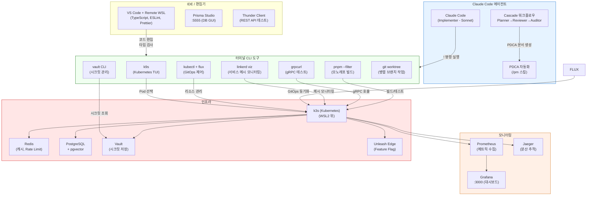
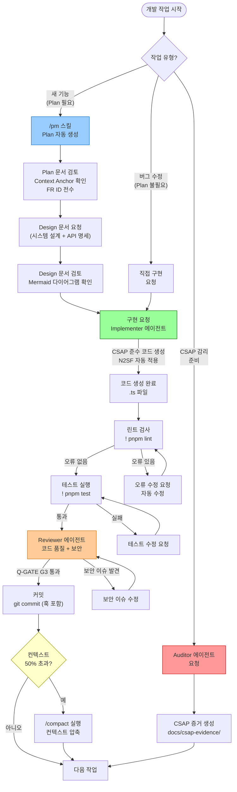

# 개발 도구 FAQ — IDE, 디버거, Claude Code, 터미널 도구 25가지

> **문서 ID**: ONBOARD-11-12
> **버전**: 1.0.0 | **작성일**: 2026-04-13 | **작성자**: Implementer (Sonnet)
> **목적**: 공공기관 SaaS 개발 환경에서 자주 발생하는 도구 사용 문제를 신속하게 해결한다.
> **선행 학습**: `01-getting-started/01-local-setup.md`, `03-development/01-local-setup.md`
> **소요 시간**: 필요한 질문만 찾아 읽기 (참조용)
> **CSAP**: D-12 (시스템 개발 보안 — 개발 환경 보안)

---

## 목차

1. [FAQ 목차 및 빠른 답변 TOP 5](#1-faq-목차-및-빠른-답변-top-5)
2. [IDE 및 편집기 FAQ (Q1-Q8)](#2-ide-및-편집기-faq)
3. [Claude Code 활용 FAQ (Q9-Q17)](#3-claude-code-활용-faq)
4. [터미널 도구 FAQ (Q18-Q25)](#4-터미널-도구-faq)
5. [개발 도구 생태계 및 워크플로우 다이어그램](#5-개발-도구-생태계-및-워크플로우-다이어그램)
6. [변경 이력](#6-변경-이력)

---

## 1. FAQ 목차 및 빠른 답변 TOP 5

### 1.1 전체 질문 목차

| 번호 | 질문 | 분류 |
|------|------|------|
| Q1 | VS Code 추천 확장 프로그램 목록은? | IDE |
| Q2 | TypeScript 타입 오류가 IDE에서 안 보입니다. | IDE |
| Q3 | Prisma Studio 실행 방법은? | IDE |
| Q4 | Turbo와 VS Code 워크스페이스 설정 방법은? | IDE |
| Q5 | Remote SSH로 WSL2에 VS Code 연결하는 방법은? | IDE |
| Q6 | ESLint/Prettier 충돌이 발생합니다. 해결법은? | IDE |
| Q7 | 코드 포매팅 규칙을 프로젝트에 맞게 설정하는 방법은? | IDE |
| Q8 | Git Lens로 코드 이력 추적하는 방법은? | IDE |
| Q9 | Claude Code에서 `!` 명령으로 터미널을 실행하는 방법은? | Claude Code |
| Q10 | Claude Code 세션이 컨텍스트를 잃으면 어떻게 하나요? | Claude Code |
| Q11 | `/pm` 스킬로 PDCA 자동화를 시작하는 방법은? | Claude Code |
| Q12 | Claude Code로 코드 리뷰를 받는 방법은? | Claude Code |
| Q13 | N2SF 규정 준수 코드를 Claude Code로 생성할 때 주의사항은? | Claude Code |
| Q14 | Claude Code 에이전트 팀(Cascade)은 언제 사용하나요? | Claude Code |
| Q15 | Claude Code로 CSAP 증거를 자동 생성하는 방법은? | Claude Code |
| Q16 | Claude Code 응답이 느릴 때 빠른 모드 전환 방법은? | Claude Code |
| Q17 | /compact로 컨텍스트를 압축하는 적절한 시점은? | Claude Code |
| Q18 | k9s에서 Pod 로그를 실시간으로 보는 방법은? | 터미널 |
| Q19 | kubectl exec로 Pod 내부에서 명령 실행하는 방법은? | 터미널 |
| Q20 | flux diff로 변경 예정 사항을 미리 보는 방법은? | 터미널 |
| Q21 | linkerd viz로 서비스 트래픽을 실시간 모니터링하는 방법은? | 터미널 |
| Q22 | Vault CLI로 시크릿을 조회하는 방법은? | 터미널 |
| Q23 | grpcurl로 gRPC 서비스를 테스트하는 방법은? | 터미널 |
| Q24 | pnpm --filter로 특정 패키지만 빌드/테스트하는 방법은? | 터미널 |
| Q25 | git worktree로 여러 브랜치를 동시에 작업하는 방법은? | 터미널 |

### 1.2 빠른 답변 TOP 5 (가장 자주 묻는 질문)

**TOP 1 — TypeScript 타입이 IDE에서 안 보일 때**: VS Code 하단 상태표시줄에서 TypeScript 버전을 확인하세요. "Use Workspace Version"을 선택하지 않으면 전역 TS가 사용되어 프로젝트 타입이 불일치합니다. `Ctrl+Shift+P` → "TypeScript: Select TypeScript Version" → "Use Workspace Version" 선택.

**TOP 2 — pnpm 빌드가 느릴 때**: `pnpm --filter <패키지명> build`로 필요한 패키지만 빌드합니다. 전체 빌드 `pnpm build`는 모든 패키지를 재빌드합니다.

**TOP 3 — Claude Code 컨텍스트 손실**: 50% 임계값에 도달하면 `/compact` 명령으로 컨텍스트를 압축합니다. 중요한 결정은 PDCA 문서에 먼저 기록합니다.

**TOP 4 — ESLint/Prettier 충돌**: `eslint-config-prettier`가 설치되어 있는지 확인합니다. 설치되어 있으면 ESLint의 포맷팅 규칙이 자동으로 비활성화되어 충돌이 없어집니다.

**TOP 5 — k9s Pod 로그**: k9s에서 Pod 선택 후 `l` 키를 누릅니다. `0` 키로 전체 로그, `/` 키로 필터링합니다.

---

## 2. IDE 및 편집기 FAQ

### Q1. VS Code 추천 확장 프로그램 목록은?

이 프로젝트에서 생산성에 직접 영향을 주는 확장 프로그램을 우선순위별로 안내합니다.

**필수 설치 (설치 안 하면 개발 불가)**

```json
{
  "recommendations": [
    "dbaeumer.vscode-eslint",              // ESLint 실시간 오류 표시
    "esbenp.prettier-vscode",              // Prettier 포매팅
    "Prisma.prisma",                       // Prisma 스키마 자동완성
    "ms-vscode-remote.remote-wsl",         // WSL2 연결 (필수)
    "ms-vscode.vscode-typescript-next"     // 최신 TypeScript 기능
  ]
}
```

**강력 권장 (없으면 불편)**

```json
{
  "recommendations": [
    "eamodio.gitlens",               // Git 이력 + blame
    "ms-kubernetes-tools.vscode-kubernetes-tools", // k8s 관리
    "rangav.vscode-thunder-client",  // REST API 테스트 (Postman 대체)
    "bierner.markdown-mermaid",      // Mermaid 다이어그램 미리보기
    "bradlc.vscode-tailwindcss",     // Tailwind CSS 자동완성 (포털)
    "ms-vscode.vscode-json"          // JSON 스키마 검증
  ]
}
```

**선택적 설치 (개인 취향)**

```json
{
  "recommendations": [
    "usernamehw.errorlens",     // 오류를 코드 줄에 인라인 표시
    "christian-kohler.path-intellisense", // 파일 경로 자동완성
    "streetsidesoftware.code-spell-checker", // 영어 철자 교정
    "wayou.vscode-todo-highlight" // TODO/FIXME 하이라이트
  ]
}
```

`.vscode/extensions.json`에 이미 추천 확장이 등록되어 있으므로, VS Code가 처음 워크스페이스를 열 때 설치를 권장합니다.

```bash
# 확장 목록 확인
cat /data/ai-saas/.vscode/extensions.json
```

---

### Q2. TypeScript 타입 오류가 IDE에서 안 보입니다.

세 가지 원인 중 하나입니다. 순서대로 확인합니다.

**원인 1 — TypeScript 버전 불일치**

```
증상: "cannot find module" 오류가 IDE에서 보이지 않거나,
      없는 프로퍼티를 참조해도 빨간 밑줄이 없음.

해결:
  1. VS Code 하단 오른쪽 상태표시줄에서 TypeScript 버전 클릭
  2. "Use Workspace Version" 선택
  3. 워크스페이스 버전: packages/*/node_modules/typescript/bin/tsserver

또는 .vscode/settings.json에 직접 설정:
```

```json
{
  "typescript.tsdk": "node_modules/typescript/lib",
  "typescript.enablePromptUseWorkspaceTsdk": true
}
```

**원인 2 — tsconfig.json 미감지**

```bash
# 프로젝트 루트에 tsconfig.json이 있는지 확인
ls /data/ai-saas/tsconfig*.json

# 서비스별 tsconfig도 확인
ls /data/ai-saas/platform/services/ai-service/tsconfig.json
```

VS Code가 올바른 `tsconfig.json`을 감지하지 못하면 타입 정보가 없습니다. 워크스페이스 루트에서 VS Code를 열었는지 확인합니다.

```bash
# 올바른 방법: 워크스페이스 루트에서 열기
code /data/ai-saas

# 잘못된 방법: 서브 디렉토리에서 열기 (타입 정보 불완전)
code /data/ai-saas/platform/services/ai-service
```

**원인 3 — TypeScript 서버 충돌**

```
Ctrl+Shift+P → "TypeScript: Restart TS Server"
```

---

### Q3. Prisma Studio 실행 방법은?

Prisma Studio는 데이터베이스 내용을 GUI로 확인하고 편집할 수 있는 브라우저 기반 도구입니다.

```bash
# 특정 서비스의 Prisma Studio 실행
cd /data/ai-saas/platform/services/ai-service
npx prisma studio

# 또는 pnpm filter 사용
pnpm --filter @platform/ai-service exec prisma studio

# 기본 포트: 5555
# 브라우저에서 http://localhost:5555 접속
```

**WSL2 환경에서 포트 접근 문제 해결**

```bash
# WSL2 IP 확인
ip addr show eth0 | grep 'inet ' | awk '{print $2}' | cut -d/ -f1

# Windows에서 WSL2 IP로 접근: http://172.x.x.x:5555
# 또는 Windows에서 포트 포워딩 설정 (PowerShell 관리자 권한)
netsh interface portproxy add v4tov4 listenport=5555 listenaddress=0.0.0.0 connectport=5555 connectaddress=<WSL2-IP>
```

**중요**: Prisma Studio에서 데이터를 직접 수정할 때는 CSAP D-06 요건에 따라 감사 로그를 수동으로 남겨야 합니다. 운영 DB에서는 Prisma Studio 사용을 자제하고 마이그레이션을 통해 변경합니다.

---

### Q4. Turbo와 VS Code 워크스페이스 설정 방법은?

Turborepo 모노레포에서 VS Code를 최적으로 사용하는 설정입니다.

```bash
# .vscode/settings.json (프로젝트 루트)
cat /data/ai-saas/.vscode/settings.json
```

핵심 설정을 설명합니다.

```json
{
  // TypeScript: 각 패키지의 tsconfig를 자동 탐지
  "typescript.tsdk": "node_modules/typescript/lib",

  // ESLint: 모든 워크스페이스 패키지에 적용
  "eslint.workingDirectories": [
    { "pattern": "packages/*" },
    { "pattern": "platform/services/*" },
    { "pattern": "platform/apps/*" }
  ],

  // 파일 감시에서 제외 (성능 향상)
  "files.watcherExclude": {
    "**/node_modules/**": true,
    "**/.turbo/**": true,
    "**/dist/**": true,
    "**/.next/**": true
  },

  // Turbo 캐시 디렉토리 숨김
  "files.exclude": {
    "**/.turbo": true
  },

  // 저장 시 자동 포맷팅
  "editor.formatOnSave": true,
  "editor.defaultFormatter": "esbenp.prettier-vscode",

  // TypeScript 파일에는 ESLint 자동 수정
  "[typescript]": {
    "editor.codeActionsOnSave": {
      "source.fixAll.eslint": "explicit"
    }
  }
}
```

**Turbo 작업을 VS Code Task로 등록**

```json
// .vscode/tasks.json
{
  "version": "2.0.0",
  "tasks": [
    {
      "label": "turbo: dev (ai-service)",
      "type": "shell",
      "command": "pnpm --filter @platform/ai-service dev",
      "group": "build",
      "presentation": { "reveal": "always", "panel": "new" }
    },
    {
      "label": "turbo: test (ai-service)",
      "type": "shell",
      "command": "pnpm --filter @platform/ai-service test",
      "group": "test"
    }
  ]
}
```

---

### Q5. Remote SSH로 WSL2에 VS Code 연결하는 방법은?

로컬 PC에서 WSL2 리눅스 환경에 바로 연결하여 네이티브 리눅스 개발 경험을 얻습니다.

**방법 1 — WSL 확장 사용 (권장)**

```bash
# 1. Windows VS Code에서 "WSL" 확장 설치
# 2. VS Code 하단 왼쪽 파란 아이콘 클릭 → "Connect to WSL"
# 3. 또는 WSL 터미널에서
cd /data/ai-saas
code .  # WSL에서 실행하면 자동으로 Remote WSL 모드로 열림
```

**방법 2 — Remote SSH (WSL2를 SSH 서버로 활용)**

```bash
# WSL2에서 SSH 서버 시작
sudo apt install openssh-server -y
sudo service ssh start

# SSH 키 설정 (패스워드 로그인 방지 - CSAP D-08)
ssh-keygen -t ed25519 -C "dev@saas"
cat ~/.ssh/id_ed25519.pub >> ~/.ssh/authorized_keys
chmod 600 ~/.ssh/authorized_keys

# Windows에서 WSL2 IP로 SSH 연결
# VS Code: Remote SSH → + → ssh dev@<WSL2-IP> -p 22
```

**Remote WSL 사용 시 성능 주의사항**

WSL2에서 Windows 파일 시스템(`/mnt/c/...`)에 있는 파일을 편집하면 속도가 매우 느립니다. 프로젝트를 반드시 WSL2 파일 시스템(`/home/...` 또는 `/data/...`)에 저장해야 합니다.

```bash
# 느린 경우 (Windows FS → WSL2)
/mnt/c/Users/devuser/projects/ai-saas  # 느림

# 빠른 경우 (WSL2 native FS)
/data/ai-saas  # 빠름 (현재 프로젝트 위치)
```

---

### Q6. ESLint/Prettier 충돌이 발생합니다. 해결법은?

두 도구가 서로 다른 포맷팅 규칙을 적용하려 할 때 충돌이 발생합니다.

**진단: 어디서 충돌이 발생하는가**

```bash
# ESLint 단독 실행 결과 확인
npx eslint src/index.ts --format=codeframe

# Prettier 단독 실행 결과 확인
npx prettier --check src/index.ts

# 두 결과가 다르면 충돌
```

**해결 방법 1 — eslint-config-prettier 확인**

```bash
# 설치 확인
cat /data/ai-saas/package.json | grep prettier

# 없으면 설치
pnpm add -D eslint-config-prettier --filter .
```

```javascript
// .eslintrc.js 또는 eslint.config.mjs에서 prettier가 마지막에 와야 함
module.exports = {
  extends: [
    'eslint:recommended',
    '@typescript-eslint/recommended',
    'prettier',  // 반드시 마지막! Prettier와 충돌하는 ESLint 규칙 비활성화
  ],
};
```

**해결 방법 2 — VS Code 기본 포매터 명시**

```json
// .vscode/settings.json
{
  "[typescript]": {
    "editor.defaultFormatter": "esbenp.prettier-vscode"  // ESLint 아님
  },
  "[typescriptreact]": {
    "editor.defaultFormatter": "esbenp.prettier-vscode"
  }
}
```

**해결 방법 3 — 저장 순서 제어**

```json
// .vscode/settings.json
{
  "editor.formatOnSave": true,           // 1. Prettier 먼저 실행
  "[typescript]": {
    "editor.codeActionsOnSave": {
      "source.fixAll.eslint": "explicit" // 2. ESLint 수정 나중에 실행
    }
  }
}
```

---

### Q7. 코드 포매팅 규칙을 프로젝트에 맞게 설정하는 방법은?

이 프로젝트의 포매팅 표준은 `CLAUDE.md`의 하네스 제약에 정의되어 있습니다.

**프로젝트 표준 포매팅 규칙**

```
들여쓰기: 2칸 (TypeScript/JavaScript)
세미콜론: 사용
작은따옴표: 사용 (큰따옴표 아님)
줄 길이: 120자 이하
후행 콤마: ES5 이상에서 사용
```

```json
// .prettierrc (프로젝트 루트)
{
  "semi": true,
  "singleQuote": true,
  "tabWidth": 2,
  "printWidth": 120,
  "trailingComma": "all",
  "bracketSpacing": true,
  "arrowParens": "always"
}
```

**개인 VS Code 설정이 프로젝트 설정을 덮어쓰는 문제 방지**

```json
// 개인 ~/.config/Code/User/settings.json 확인
// 아래 설정이 있으면 프로젝트 .prettierrc를 우선하도록 수정
{
  "prettier.useTabs": false,           // false로 설정 (탭 아닌 스페이스)
  "editor.tabSize": 2,                 // 프로젝트 기본값
  "prettier.configPath": ""            // 비워두면 프로젝트 .prettierrc 자동 탐지
}
```

---

### Q8. Git Lens로 코드 이력 추적하는 방법은?

Git Lens는 코드 라인별 마지막 변경자와 커밋 메시지를 실시간으로 보여줍니다.

**주요 기능 사용법**

```
코드 위에 커서 올리기 → 해당 라인의 마지막 커밋 메시지 팝업

Ctrl+Shift+G → Git Lens 사이드바 열기
  → File History: 현재 파일의 전체 변경 이력
  → Line History: 현재 커서 줄의 변경 이력
  → Repository: 전체 저장소 이력
```

**공공기관 SaaS에서 Git Lens 활용**

특정 코드가 어느 PDCA 문서(MTU, SVC)와 연관된 커밋에서 변경되었는지 추적할 때 유용합니다.

```bash
# 커밋 메시지 검색 (예: FR-AI26.1 관련 커밋 모두 찾기)
git log --all --grep="FR-AI26.1" --oneline

# 특정 파일의 변경 이력 (Git Lens UI와 동일)
git log --follow -p platform/services/ai-service/src/handlers/ai-rag.handler.ts
```

Git Lens의 "Blame" 기능으로 현재 코드가 어느 커밋에서 추가되었는지 확인하면, 해당 커밋의 PR 링크와 설계 결정 근거를 찾을 수 있습니다.

---

## 3. Claude Code 활용 FAQ

### Q9. Claude Code에서 `!` 명령으로 터미널을 실행하는 방법은?

Claude Code 대화창에서 `!` 접두사를 사용하면 셸 명령을 직접 실행합니다.

```bash
# Claude Code 대화창에서 입력
! pnpm --filter @platform/ai-service test
! git status
! kubectl get pods -n ai-service
! k9s
```

**주의사항 — CSAP D-09 시크릿 보호**

`!` 명령으로 실행된 결과는 Claude 컨텍스트에 포함됩니다. 시크릿이 포함된 명령은 `!` 대신 별도 터미널에서 실행합니다.

```bash
# 안전 (환경 변수 값이 노출되지 않음)
! echo $DATABASE_URL     # 결과: postgresql://...password... → 노출 위험!

# 올바른 방법: 별도 터미널에서 실행
# 또는 환경 변수 이름만 확인
! printenv | grep -E "^(DATABASE|REDIS|INTERNAL)" | cut -d= -f1
# 결과: DATABASE_URL, REDIS_HOST, INTERNAL_SERVICE_KEY (값 없이 키만 표시)
```

**유용한 `!` 명령 조합**

```bash
# 현재 브랜치와 상태 한번에 확인
! git status && git branch --show-current

# pnpm 캐시 정리 + 재설치
! pnpm store prune && pnpm install

# 특정 서비스 로그 실시간 추적
! kubectl logs -f deployment/ai-service -n platform --tail=50
```

---

### Q10. Claude Code 세션이 컨텍스트를 잃으면 어떻게 하나요?

Claude Code는 대화 컨텍스트에 한계(200K 토큰)가 있습니다. 긴 작업 중에 컨텍스트가 손실되면 이전 결정을 반복해야 합니다.

**컨텍스트 유지 전략**

1. **PDCA 문서 선기록**: 중요한 결정은 항상 Plan/Design 문서에 먼저 기록합니다. 새 세션에서 "이 문서를 읽고 계속하라"고 하면 컨텍스트를 복원할 수 있습니다.

2. **`/compact` 명령 사용**: 컨텍스트 사용량이 50%에 도달하면 `/compact`로 요약 압축합니다. 이후 새 세션에서 압축 요약을 시작점으로 사용합니다.

3. **`CLAUDE.md` 활용**: 프로젝트 전반적인 제약과 구조는 `CLAUDE.md`에 이미 정의되어 있으므로 매 세션 초기화 시 자동으로 로드됩니다.

**컨텍스트 손실 시 복원 절차**

```bash
# 1. 현재 작업 상태 저장
! git status    # 변경된 파일 목록 확인
! git diff --stat  # 변경 내용 요약

# 2. 작업 중인 문서 확인
ls /data/ai-saas/docs/01-plan/mtus/   # 현재 Plan 문서
ls /data/ai-saas/docs/02-design/      # 현재 Design 문서
```

새 세션 시작 시 다음과 같이 컨텍스트를 복원합니다.

```
"이전 세션에서 다음 작업을 진행 중이었습니다:
- 파일: platform/services/ai-service/src/handlers/ai-rag.handler.ts
- Plan 문서: docs/01-plan/mtus/SVC-AI-ADV-R1.plan.md
- 작업 내용: Advanced RAG 핸들러 구현 (FR-ADV1.7)

이 파일들을 읽고 어디까지 완료되었는지 확인해서 계속 진행해 주세요."
```

---

### Q11. `/pm` 스킬로 PDCA 자동화를 시작하는 방법은?

Claude Code의 `/pm` 스킬은 새로운 기능 구현을 위한 PDCA 문서(Plan + Design)를 자동으로 생성합니다.

**사용 방법**

```bash
# Claude Code 대화창에서
/pm "AI 에이전트 마켓플레이스 검색 기능 추가"

# 또는 더 구체적인 요구사항 제공
/pm "RAG 문서 삭제 기능 추가 — FR-AI26.1 확장, 테넌트 격리 필수"
```

**생성되는 파일 구조**

```
docs/01-plan/mtus/
└── MTU-N{번호}-{기능명}.plan.md    # 요구사항, 성공 기준, 스코프

docs/02-design/
└── MTU-N{번호}-{기능명}.design.md  # 시스템 설계, API 명세, 시퀀스 다이어그램
```

**PDCA 자동화 워크플로우**

```
1. /pm 명령으로 Plan 생성
2. Plan 문서 검토 및 수정 (감리 준수 확인)
3. "이 Plan을 기반으로 Design 문서를 작성해 주세요"
4. Design 문서 검토 및 수정
5. "이 Design을 기반으로 구현해 주세요"
6. 구현 완료 후 Reviewer 에이전트 호출
```

**주의**: Plan/Design 문서 없이 구현 요청을 하면 CSAP 감리 결함이 발생합니다. 반드시 문서 선행 원칙을 준수합니다.

---

### Q12. Claude Code로 코드 리뷰를 받는 방법은?

두 가지 방법이 있습니다.

**방법 1 — Reviewer 에이전트 직접 요청**

```
"다음 파일들에 대해 Reviewer 에이전트로서 코드 품질 검사를 수행해 주세요:
- platform/services/ai-service/src/handlers/ai-rag.handler.ts
- platform/services/ai-service/src/lib/rag-engine.ts

CSAP D-08, D-09, D-12 준수 여부와 N2SF N-05 준수 여부를 중점 검사해 주세요."
```

**방법 2 — PR 전 체크리스트 자동 생성**

```
"git diff HEAD~1..HEAD 결과를 바탕으로 PR 체크리스트를 생성해 주세요.
보안(CSAP), N2SF, 성능, 테스트 커버리지 관점에서 검사해 주세요."
```

**Claude Code 리뷰 항목**

Claude Code는 다음 항목을 자동으로 검사합니다.

```
보안 (CSAP D-12):
  - 하드코딩된 시크릿 없음
  - 입력 검증 (Zod) 적용
  - SQL 주입 방지 (매개변수화 쿼리)

N2SF:
  - C/S 등급 데이터 AI API 전송 금지
  - PII 마스킹 적용

코드 품질:
  - Dead code 없음
  - 함수 크기 80줄 이하
  - 주석: WHY 설명 (WHAT 아님)

CSAP D-06:
  - 민감 작업 감사 로그 기록
```

---

### Q13. N2SF 규정 준수 코드를 Claude Code로 생성할 때 주의사항은?

Claude Code에 구현을 요청할 때 N2SF 컨텍스트를 명시하면 자동으로 규정 준수 코드가 생성됩니다.

**올바른 요청 방법**

```
"다음 핸들러를 구현해 주세요:
- 기능: 민원 텍스트를 AI로 분류
- N2SF: 처리 데이터는 O등급, PII 마스킹 필수
- CSAP D-08: 인증된 사용자만 접근 가능
- CSAP D-06: 처리 결과 감사 로그 기록
- 참조: platform/services/ai-service/src/handlers/ai-public.handler.ts"
```

**N2SF 제약 자동 적용 예시**

이 요청을 받으면 Claude Code는 다음 패턴을 자동으로 포함합니다.

```typescript
// 자동으로 포함되는 N2SF 준수 코드
export async function citizenClassifyHandler(
  request: FastifyRequest<{ Body: ClassifyBody }>,
  reply: FastifyReply,
): Promise<void> {
  const body = classifySchema.parse(request.body); // Zod 검증 (D-12)

  // N2SF N-05: C/S 등급 차단 (자동 포함)
  try {
    validateDataGrade(body.grade as DataGrade);
  } catch (error) {
    if (error instanceof DataGradeViolationError) {
      await logAiEvent('AI_GRADE_VIOLATION', ...); // D-06 감사 로그 (자동 포함)
      return reply.status(403).send({ ... });
    }
  }

  // PII 마스킹 (자동 포함)
  const maskedText = maskPII(body.text);

  // 감사 로그 (D-06, 자동 포함)
  await logAiEvent('CITIZEN_CLASSIFY', ...);
}
```

**Claude Code가 절대 생성하지 않는 코드**

```typescript
// C/S 등급 데이터를 외부 API로 전송 (생성 금지)
const response = await fetch('https://external-ai.api.com/classify', {
  body: JSON.stringify({ text: body.confidentialText }), // BLOCKED
});

// 하드코딩된 시크릿 (생성 금지)
const apiKey = 'sk-abc123';  // BLOCKED
```

---

### Q14. Claude Code 에이전트 팀(Cascade)은 언제 사용하나요?

Cascade는 5개 전문 에이전트가 순서대로 작업하는 워크플로우입니다.

```
연구 → 계획(Planner) → 구현(Implementer) → 리뷰(Reviewer) → 감리(Auditor) → 테스트(Tester) → 리팩토링(Refactorer)
```

**Cascade를 사용해야 하는 경우**

| 상황 | 이유 |
|------|------|
| 새 기능 전체 구현 (Plan부터 테스트까지) | 품질 게이트 7단계 전체 통과 필수 |
| CSAP 감리 준비 | Auditor 에이전트 필수 |
| 대규모 리팩토링 | Refactorer 에이전트로 Dead code 정리 |
| 보안 검토 필요한 기능 | Reviewer 에이전트 강제 검사 |

**단일 Claude 세션으로 충분한 경우**

| 상황 | 이유 |
|------|------|
| 버그 수정 (2~3줄) | 오버헤드 없이 빠르게 |
| 문서 업데이트 | 코드 변경 없음 |
| 설정 파일 수정 | 보안 영향 최소 |
| 질문/탐색 | 실행 없이 분석만 |

**Cascade 실행 방법**

```
"Cascade 메서드로 다음 기능을 구현해 주세요:
MTU-N251 DORA Four Keys 메트릭 수집기

Plan 문서: docs/01-plan/mtus/MTU-N251-dora-four-keys.plan.md
Design 문서를 먼저 작성하고, 구현 → 리뷰 → 감리 → 테스트 → 리팩토링 순서로 진행해 주세요."
```

---

### Q15. Claude Code로 CSAP 증거를 자동 생성하는 방법은?

CSAP 인증 심사에 필요한 증거 파일을 Claude Code로 자동 생성합니다.

**증거 자동 생성 요청**

```
"CSAP D-06 침해사고 관리 항목의 감사 로그 증거를 생성해 주세요.
다음 내용을 포함해야 합니다:
1. .claude/audit.jsonl에서 최근 100건의 감사 로그 발췌
2. 감사 로그 구조 설명 (어떤 필드가 있는가)
3. append-only 구조임을 증명하는 파일 속성

증거 파일을 docs/csap-evidence/D-06-audit-log-$(date +%Y%m%d).md로 저장해 주세요."
```

**자동화 스크립트 예시**

```bash
# CSAP 증거 자동 수집 스크립트
# .gitea/workflows/csap-evidence.yml에서 주간 실행

#!/bin/bash
EVIDENCE_DATE=$(date +%Y%m%d)
EVIDENCE_DIR="/data/ai-saas/docs/csap-evidence"

# D-06: 감사 로그 증거
echo "## CSAP D-06 감사 로그 증거" > "$EVIDENCE_DIR/D-06-$EVIDENCE_DATE.md"
echo "수집 일시: $(date)" >> "$EVIDENCE_DIR/D-06-$EVIDENCE_DATE.md"
echo "### 최근 감사 로그 (100건)" >> "$EVIDENCE_DIR/D-06-$EVIDENCE_DATE.md"
tail -100 /data/ai-saas/.claude/audit.jsonl | jq -r '.' >> "$EVIDENCE_DIR/D-06-$EVIDENCE_DATE.md"

# D-08-06: Rate Limiting 증거
echo "## CSAP D-08-06 Rate Limiting 증거" > "$EVIDENCE_DIR/D-08-06-$EVIDENCE_DATE.md"
kubectl get configmap -n platform -l csap=D-08-06 -o yaml >> "$EVIDENCE_DIR/D-08-06-$EVIDENCE_DATE.md"
```

---

### Q16. Claude Code 응답이 느릴 때 빠른 모드 전환 방법은?

Claude Code는 현재 `claude-sonnet-4-6` 모델을 기본으로 사용합니다. 응답이 느린 경우 작업 유형에 따라 더 가벼운 모델로 전환을 고려합니다.

**모델 라우팅 기준 (CLAUDE.md §7)**

| 작업 유형 | 적합한 모델 | 이유 |
|----------|-----------|------|
| 구현, 리뷰, 테스트 | Sonnet (기본) | 표준 복잡도 |
| CSAP 감리, 규제 분석 | Opus | 복잡한 규정 해석 |
| 리팩토링, Dead code 탐색 | Haiku | 단순 정리 |

**Haiku로 빠른 리팩토링 요청**

```
"Haiku 모델로 다음 파일의 Dead code를 탐지하고 제거해 주세요:
platform/services/ai-service/src/lib/chunker.ts

단순 Dead code 제거만 수행하고, 로직 변경 없이 진행해 주세요."
```

**응답 속도 개선 팁**

```
1. 범위를 좁게 지정: "전체 서비스" 대신 "이 함수 하나"
2. 파일 수 제한: 한 번에 3개 이하 파일 참조
3. /compact 선행: 컨텍스트가 많을수록 응답이 느려짐
4. 질문 구체화: 애매한 요청은 재확인 과정이 추가됨
```

---

### Q17. /compact로 컨텍스트를 압축하는 적절한 시점은?

`/compact`는 대화 히스토리를 요약하여 컨텍스트를 줄이는 명령입니다. 잘못된 시점에 사용하면 중요한 정보가 손실됩니다.

**적절한 시점**

```
1. 컨텍스트 사용량 50% 초과 시
   → VS Code 상태표시줄 또는 Claude Code UI에서 확인

2. 한 기능 구현이 완전히 완료되었을 때
   → 구현 → 테스트 → 커밋 완료 후

3. 다른 기능으로 전환할 때
   → 이전 기능의 컨텍스트가 더 이상 필요 없을 때

4. 탐색 단계가 끝나고 구현 단계로 전환할 때
   → 코드를 많이 읽었지만 아직 수정하지 않은 경우
```

**부적절한 시점 (사용 금지)**

```
1. 구현이 절반 진행 중일 때
   → 이전 결정 컨텍스트 손실로 일관성 저하

2. 긴 오류 메시지를 분석 중일 때
   → 오류 스택 트레이스가 요약에서 누락될 수 있음

3. 복잡한 CSAP 감리 검토 중일 때
   → 79개 항목 중 어디까지 완료했는지 손실
```

**압축 전 체크포인트 저장**

```bash
# /compact 실행 전 현재 상태를 파일로 저장
! git status > /tmp/work-status.txt
! git diff --stat >> /tmp/work-status.txt
! echo "현재 작업 중인 MTU: MTU-N251" >> /tmp/work-status.txt
```

---

## 4. 터미널 도구 FAQ

### Q18. k9s에서 Pod 로그를 실시간으로 보는 방법은?

k9s는 Kubernetes 클러스터를 터미널에서 관리하는 인터랙티브 도구입니다.

```bash
# k9s 실행
k9s -n platform   # platform 네임스페이스 기본으로 열기
k9s --context staging  # staging 클러스터 연결
```

**Pod 로그 보기 단계별 안내**

```
1. k9s 실행 후 Pod 목록 화면 (기본)
2. 방향키로 원하는 Pod 선택
3. 'l' 키 → 로그 뷰어 열기
4. 로그 뷰어에서:
   - '0' → 처음부터 전체 로그
   - '5' → 최근 5분 로그
   - '/' → 필터 (예: /ERROR)
   - 'f' → 실시간 팔로우 모드 (tail -f 효과)
   - 'Ctrl+S' → 로그 파일로 저장
   - 'Esc' → 이전 화면으로
```

**멀티 Pod 로그 동시 확인**

```bash
# k9s 없이 여러 Pod 로그 동시에 보기 (stern 사용)
stern -n platform ai-service    # ai-service 관련 모든 Pod 로그
stern -n platform . --since 5m  # 모든 Pod, 최근 5분

# 특정 패턴 필터링
stern -n platform ai-service --include "ERROR|WARN"
```

---

### Q19. kubectl exec로 Pod 내부에서 명령 실행하는 방법은?

Pod 내부 파일 시스템이나 네트워크를 직접 디버깅할 때 사용합니다.

```bash
# 기본 형식
kubectl exec -it <pod-name> -n <namespace> -- <command>

# 예시: ai-service Pod에서 bash 실행
kubectl exec -it $(kubectl get pod -n platform -l app=ai-service -o jsonpath='{.items[0].metadata.name}') \
  -n platform -- /bin/sh

# 한 번만 실행하는 명령 (인터랙티브 불필요)
kubectl exec <pod-name> -n platform -- printenv | grep -E "^REDIS"
kubectl exec <pod-name> -n platform -- curl -s localhost:3000/health | jq
kubectl exec <pod-name> -n platform -- ls /app/dist/
```

**유용한 디버깅 명령**

```bash
# Pod 내부에서 다른 서비스 연결 테스트
kubectl exec -it <pod-name> -n platform -- \
  curl -s http://redis-master:6379  # Redis 연결 확인

# 환경 변수 확인 (시크릿 값 주의)
kubectl exec -it <pod-name> -n platform -- printenv | sort | grep -v PASSWORD

# 파일 복사 (Pod ↔ 로컬)
kubectl cp platform/<pod-name>:/app/logs/app.log ./local-app.log
```

**CSAP D-09 보안 주의**: `kubectl exec`로 얻은 시크릿 값은 터미널 히스토리에 남지 않도록 합니다.

```bash
# 나쁜 예 (시크릿이 bash 히스토리에 남음)
kubectl exec pod -- printenv DATABASE_URL

# 좋은 예 (시크릿 존재 여부만 확인)
kubectl exec pod -- sh -c 'test -n "$DATABASE_URL" && echo "SET" || echo "UNSET"'
```

---

### Q20. flux diff로 변경 예정 사항을 미리 보는 방법은?

`flux diff`는 Git 저장소의 Flux 매니페스트와 클러스터의 현재 상태 차이를 보여줍니다. 실제 배포 전 무엇이 변경될지 미리 확인합니다.

```bash
# 현재 브랜치의 변경이 클러스터에 어떤 영향을 주는가
flux diff kustomization platform \
  --path ./platform/k8s/overlays/staging

# 특정 HelmRelease의 변경사항 확인
flux diff helmrelease ai-service \
  -n platform

# 실제 배포 없이 Dry-run
flux reconcile kustomization platform --dry-run
```

**실제 활용 시나리오**

```bash
# 새 버전 이미지를 배포하기 전 변경 확인
# 1. HelmRelease 이미지 태그 수정 (Git)
vim platform/k8s/platform/helmrelease-ai-service.yaml
# image.tag: v1.2.3 → v1.2.4

# 2. flux diff로 변경 예정 확인
flux diff helmrelease ai-service -n platform
# 출력: 변경될 Deployment, ConfigMap, Service 목록

# 3. 이상 없으면 커밋 + 푸시
git commit -m "feat(ai-service): 이미지 v1.2.4 배포"
git push

# 4. Flux 자동 reconcile 또는 수동 트리거
flux reconcile helmrelease ai-service -n platform
```

---

### Q21. linkerd viz로 서비스 트래픽을 실시간 모니터링하는 방법은?

Linkerd는 서비스 메시로, `linkerd viz`는 서비스 간 트래픽 흐름을 시각화합니다.

```bash
# Linkerd viz 설치 확인
linkerd viz check

# 서비스 메시 실시간 모니터링 (터미널 UI)
linkerd viz stat deployment -n platform

# 특정 서비스의 실시간 요청 흐름
linkerd viz top deployment/ai-service -n platform

# 서비스 간 연결 추적 (한 서비스에서 나가는 요청)
linkerd viz tap deployment/api-gateway -n platform --to deployment/ai-service
```

**출력 해석**

```
NAME          MESHED  SUCCESS  RPS     LATENCY_P50  LATENCY_P95  LATENCY_P99
ai-service    3/3     98.5%    12.4    234ms        1.2s         3.8s
rag-service   2/2     99.1%    8.2     156ms        890ms        2.1s

MESHED:    3/3 → Pod 3개 모두 Linkerd 사이드카 주입됨
SUCCESS:   성공률 (98.5% = 정상)
RPS:       초당 요청 수
LATENCY:   응답 시간 분포
```

**SLO 위반 탐지**

```bash
# P99 응답시간이 5초 초과하는 서비스 탐지 (SLO 위반)
linkerd viz stat deployment -n platform -o json | \
  jq '.deployments[] | select(.latencyMsP99 > 5000) | .name'
```

---

### Q22. Vault CLI로 시크릿을 조회하는 방법은?

HashiCorp Vault는 프로젝트의 시크릿 관리 시스템입니다.

```bash
# Vault 로그인 (OIDC 방식 권장 - CSAP D-08)
vault login -method=oidc

# 또는 토큰으로 로그인 (개발 환경)
export VAULT_ADDR="https://vault.internal:8200"
export VAULT_TOKEN="$(cat ~/.vault-token)"

# 시크릿 경로 탐색
vault kv list secret/saas-platform/

# 특정 시크릿 조회
vault kv get secret/saas-platform/ai-service

# 특정 필드만 조회 (시크릿 노출 최소화)
vault kv get -field=INTERNAL_SERVICE_KEY secret/saas-platform/ai-service
```

**CSAP D-09 준수 주의사항**

```bash
# 나쁜 예 (시크릿이 터미널 히스토리에 저장됨)
export DATABASE_URL=$(vault kv get -field=url secret/saas-platform/database)
echo $DATABASE_URL  # 노출 위험!

# 좋은 예 (환경 변수에 직접 주입, echo 안 함)
vault kv get -format=json secret/saas-platform/ai-service | \
  jq -r '.data.data | to_entries[] | "export \(.key)=\(.value)"' | \
  source /dev/stdin

# 시크릿 로테이션 (만료 전 교체)
vault kv put secret/saas-platform/ai-service \
  INTERNAL_SERVICE_KEY="$(openssl rand -hex 32)"
```

**Kubernetes 연동 (Vault Agent Injector)**

운영 환경에서는 CLI 대신 Vault Agent가 자동으로 시크릿을 Pod에 주입합니다.

```yaml
# Pod 어노테이션으로 Vault 시크릿 자동 주입
annotations:
  vault.hashicorp.com/agent-inject: "true"
  vault.hashicorp.com/role: "ai-service"
  vault.hashicorp.com/agent-inject-secret-config: "secret/saas-platform/ai-service"
```

---

### Q23. grpcurl로 gRPC 서비스를 테스트하는 방법은?

`grpcurl`은 HTTP 서비스의 `curl`처럼 gRPC 서비스를 터미널에서 테스트하는 도구입니다.

```bash
# gRPC 서버의 서비스 목록 조회 (서버 리플렉션 활성화된 경우)
grpcurl -plaintext localhost:50051 list

# 특정 서비스의 메서드 목록
grpcurl -plaintext localhost:50051 list platform.ai.AiService

# 메서드 호출 예시
grpcurl -plaintext -d '{"tenantId": "test", "message": "안녕하세요"}' \
  localhost:50051 platform.ai.AiService/Chat

# 헤더 포함 (내부 서비스 인증)
grpcurl -plaintext \
  -H "x-internal-service-key: $(vault kv get -field=key secret/internal)" \
  -H "x-tenant-id: test-tenant-uuid" \
  -d '{"query": "테스트"}' \
  localhost:50051 platform.rag.RagService/Query
```

**TLS 연결 (운영 환경)**

```bash
# TLS 인증서 사용
grpcurl -cert /path/to/client.crt \
        -key /path/to/client.key \
        -cacert /path/to/ca.crt \
        -d '{"tenantId": "uuid"}' \
        ai-service.platform.svc.cluster.local:50051 \
        platform.ai.AiService/Health

# 서버 인증서 검증 건너뛰기 (개발 환경에서만, 운영 금지)
grpcurl -insecure localhost:50051 list
```

**스트리밍 gRPC 테스트**

```bash
# 서버 스트리밍 응답 수신 (ai/chat/stream 처럼)
grpcurl -plaintext \
  -d '{"tenantId": "test", "message": "긴 응답 생성해줘"}' \
  localhost:50051 platform.ai.AiService/ChatStream
# 응답이 스트림으로 여러 번 출력됨
```

---

### Q24. pnpm --filter로 특정 패키지만 빌드/테스트하는 방법은?

Turborepo 모노레포에서 전체 빌드는 시간이 오래 걸립니다. `--filter`로 필요한 패키지만 선택합니다.

```bash
# 기본 형식
pnpm --filter <패키지명> <명령>

# 패키지 이름은 package.json의 "name" 필드 사용
cat /data/ai-saas/platform/services/ai-service/package.json | jq '.name'
# "@platform/ai-service"

# ai-service만 빌드
pnpm --filter @platform/ai-service build

# ai-service와 그 의존성 모두 빌드
pnpm --filter @platform/ai-service... build

# ai-service에 의존하는 패키지 모두 빌드
pnpm --filter ...@platform/ai-service build

# 여러 패키지 동시 지정
pnpm --filter @platform/ai-service --filter @platform/security-service build

# 테스트만 실행
pnpm --filter @platform/ai-service test

# 테스트 감시 모드 (코드 변경 시 자동 재실행)
pnpm --filter @platform/ai-service test:watch

# 린트 검사
pnpm --filter @platform/ai-service lint
```

**Turbo 캐시 활용**

```bash
# Turbo는 변경되지 않은 패키지를 캐시에서 복원
pnpm turbo build --filter @platform/ai-service

# 캐시 무시하고 강제 재빌드 (문제 발생 시)
pnpm turbo build --filter @platform/ai-service --force

# 캐시 상태 확인
pnpm turbo build --dry-run
```

**자주 사용하는 필터 패턴**

```bash
# 현재 변경된 파일이 있는 패키지만 빌드 (CI 최적화)
pnpm turbo build --filter=[HEAD^1]

# 특정 디렉토리 하위 패키지 모두
pnpm --filter "./platform/services/*" test

# 패키지 이름 패턴 매칭
pnpm --filter "@platform/*" lint
```

---

### Q25. git worktree로 여러 브랜치를 동시에 작업하는 방법은?

`git worktree`는 하나의 Git 저장소에서 여러 브랜치를 동시에 다른 디렉토리에 체크아웃합니다. 하나의 작업을 진행하면서 다른 긴급 수정을 병렬로 할 수 있습니다.

```bash
# 현재 상황: main 브랜치에서 기능 개발 중
git branch
# * feat/ai-advanced-rag    ← 현재 브랜치 (작업 중)
#   main

# 상황: 긴급 버그가 발생하여 main에서 hotfix 필요
# 기존 방법: stash → checkout main → 수정 → checkout back
# 문제: pnpm install 재실행, 빌드 재실행 등 시간 낭비

# git worktree로 해결
git worktree add /tmp/hotfix-worktree main

# 새 디렉토리에서 hotfix 작업
cd /tmp/hotfix-worktree
git checkout -b hotfix/critical-bug
# 수정 작업...
pnpm install  # 독립적인 node_modules
pnpm test
git commit -m "fix: 긴급 버그 수정"
git push origin hotfix/critical-bug

# 원래 작업으로 복귀 (기존 브랜치 상태 그대로 유지됨)
cd /data/ai-saas
# 기존 작업이 그대로! stash 불필요

# worktree 정리 (hotfix 완료 후)
git worktree remove /tmp/hotfix-worktree
```

**유용한 worktree 관리 명령**

```bash
# 현재 활성 worktree 목록
git worktree list
# /data/ai-saas         a1b2c3d [feat/ai-advanced-rag]
# /tmp/hotfix-worktree  d4e5f6g [hotfix/critical-bug]

# 오래된 worktree 정리 (디렉토리 삭제 후 Git 메타데이터 정리)
git worktree prune

# 잠긴 worktree 강제 제거
git worktree remove --force /tmp/old-worktree
```

**CSAP D-09 주의**: worktree로 생성된 디렉토리에는 `.env` 파일이 복사되지 않습니다. 새 worktree에서 민감한 환경 변수가 필요하면 Vault에서 별도로 가져와야 합니다.

---

## 5. 개발 도구 생태계 및 워크플로우 다이어그램

### 5.1 개발 도구 생태계 다이어그램



### 5.2 Claude Code 워크플로우 다이어그램



---

## 6. 변경 이력

| 버전 | 일자 | 내용 | 작성자 |
|------|------|------|--------|
| 1.0.0 | 2026-04-13 | 최초 작성 — 개발 도구 FAQ 25개 (IDE 8개, Claude Code 9개, 터미널 8개) + 생태계 다이어그램 2개 | Implementer (Sonnet) |
