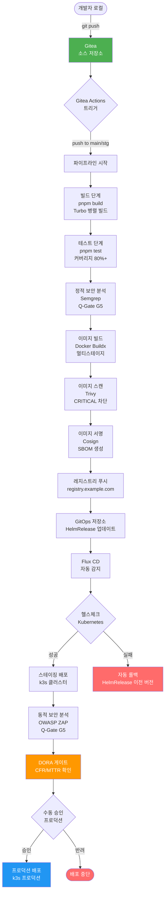
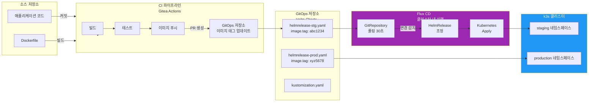

# CI/CD 고급 FAQ — Gitea Actions 심화, GitOps 운영, DevSecOps 튜닝

> 대상 독자: CI/CD 파이프라인 운영 경험이 있는 개발자 및 DevOps 엔지니어
> 선행 학습: `06-cicd/` 디렉토리 전체, `07-security/05-security-hardening.md`
> 관련 표준: CSAP D-12 (개발 보안), DORA Four Keys

---

## 목차

**Gitea Actions 심화** (Q1~Q8)
**GitOps Flux 운영** (Q9~Q17)
**DevSecOps 운영** (Q18~Q25)

---

## 전체 파이프라인 흐름 이해

FAQ를 읽기 전에 전체 CI/CD 흐름을 파악합니다.



### GitOps 배포 흐름 상세



---

## Gitea Actions 심화

### Q1. Gitea Actions workflow_dispatch를 사용해 수동으로 파이프라인을 실행하는 방법은?

**상황**: 자동 트리거가 없는 상황에서 특정 브랜치의 파이프라인을 즉시 실행해야 할 때.

**답변**

`workflow_dispatch` 이벤트를 워크플로우 파일에 추가하면 Gitea UI에서 수동으로 실행할 수 있습니다.

```yaml
# .gitea/workflows/manual-deploy.yml
name: 수동 배포 (workflow_dispatch)

on:
  # 자동 트리거
  push:
    branches: [main, stg]

  # 수동 트리거 — Gitea UI에서 "Run workflow" 버튼 활성화
  workflow_dispatch:
    inputs:
      target_env:
        description: '배포 대상 환경'
        required: true
        type: choice
        options:
          - staging
          - production
        default: staging
      service_name:
        description: '배포할 서비스 이름 (비워두면 전체)'
        required: false
        type: string
        default: ''
      skip_tests:
        description: '테스트 건너뛰기 (긴급 핫픽스 시만 사용)'
        required: false
        type: boolean
        default: false
      reason:
        description: '수동 실행 사유 (감사 로그용)'
        required: true
        type: string

jobs:
  validate-inputs:
    runs-on: self-hosted
    steps:
      # 수동 실행 사유 감사 로그 기록 (CSAP D-06)
      - name: 감사 로그 기록
        run: |
          echo "수동 배포 실행" >> /var/log/csap-audit.log
          echo "실행자: ${{ github.actor }}" >> /var/log/csap-audit.log
          echo "대상: ${{ inputs.target_env }}" >> /var/log/csap-audit.log
          echo "사유: ${{ inputs.reason }}" >> /var/log/csap-audit.log
          echo "시각: $(date -u)" >> /var/log/csap-audit.log

      # 프로덕션 배포 시 이중 확인
      - name: 프로덕션 배포 확인
        if: inputs.target_env == 'production'
        run: |
          if [ "${{ github.ref }}" != "refs/heads/main" ]; then
            echo "ERROR: 프로덕션 배포는 main 브랜치에서만 가능합니다."
            exit 1
          fi
          echo "프로덕션 배포 승인됨: main 브랜치 확인"

  deploy:
    needs: validate-inputs
    runs-on: self-hosted
    environment: ${{ inputs.target_env || 'staging' }}
    steps:
      - uses: actions/checkout@v4

      - name: 배포 실행
        run: |
          ENV=${{ inputs.target_env || 'staging' }}
          SERVICE=${{ inputs.service_name || 'all' }}
          echo "환경: ${ENV}, 서비스: ${SERVICE} 배포 시작"
          # 실제 배포 로직
          flux reconcile helmrelease ${SERVICE} -n ${ENV} --with-source
```

**Gitea UI에서 수동 실행 방법**

```
1. Gitea 저장소 접속
2. Actions 탭 클릭
3. 좌측 워크플로우 목록에서 "수동 배포" 선택
4. 우측 "Run workflow" 버튼 클릭
5. 입력값 채워서 실행
```

---

### Q2. 파이프라인에서 특정 서비스만 빌드/테스트하는 방법은? (Turbo --filter)

**상황**: 전체 모노레포에서 ai-service만 변경했는데 모든 서비스가 빌드되어 시간이 오래 걸립니다.

**답변**

Turborepo의 `--filter` 플래그와 Gitea Actions의 경로 변경 감지를 조합합니다.

```yaml
# .gitea/workflows/ci-selective.yml
name: 선택적 빌드 (변경된 서비스만)

on:
  push:
    branches: [main, stg]
  pull_request:
    branches: [main]

jobs:
  detect-changes:
    runs-on: self-hosted
    outputs:
      ai_service: ${{ steps.filter.outputs.ai_service }}
      security_service: ${{ steps.filter.outputs.security_service }}
      compliance_service: ${{ steps.filter.outputs.compliance_service }}
    steps:
      - uses: actions/checkout@v4
        with:
          fetch-depth: 2  # 이전 커밋과 비교하기 위해 필요

      - name: 변경된 서비스 감지
        id: filter
        uses: dorny/paths-filter@v3
        with:
          filters: |
            ai_service:
              - 'platform/services/ai-service/**'
              - 'packages/types/**'
            security_service:
              - 'platform/services/security-service/**'
              - 'platform/services/security-monitor-service/**'
            compliance_service:
              - 'platform/services/compliance-service/**'
            shared_packages:
              - 'packages/**'

  build-ai-service:
    needs: detect-changes
    if: needs.detect-changes.outputs.ai_service == 'true'
    runs-on: self-hosted
    steps:
      - uses: actions/checkout@v4

      - name: pnpm 설치
        uses: pnpm/action-setup@v4
        with:
          version: 9

      - name: Node.js 설정
        uses: actions/setup-node@v4
        with:
          node-version: 22
          cache: pnpm

      - name: 의존성 설치
        run: pnpm install --frozen-lockfile

      # Turbo --filter로 ai-service와 의존 패키지만 빌드
      - name: ai-service 빌드
        run: |
          pnpm turbo build \
            --filter=ai-service... \
            --cache-dir=.turbo \
            --output-logs=errors-only

      # ai-service와 의존 패키지만 테스트
      - name: ai-service 테스트
        run: |
          pnpm turbo test \
            --filter=ai-service... \
            --cache-dir=.turbo

  # 공통 패키지 변경 시 전체 빌드
  build-all:
    needs: detect-changes
    if: needs.detect-changes.outputs.shared_packages == 'true'
    runs-on: self-hosted
    steps:
      - uses: actions/checkout@v4
      - uses: pnpm/action-setup@v4
        with:
          version: 9
      - uses: actions/setup-node@v4
        with:
          node-version: 22
          cache: pnpm
      - run: pnpm install --frozen-lockfile
      - run: pnpm turbo build --cache-dir=.turbo
      - run: pnpm turbo test --cache-dir=.turbo
```

**Turbo filter 패턴 참고**

```bash
# ai-service만 (의존성 제외)
pnpm turbo build --filter=ai-service

# ai-service + 이 서비스가 의존하는 패키지까지
pnpm turbo build --filter=ai-service...

# ai-service + 이 서비스에 의존하는 서비스까지 (역방향)
pnpm turbo build --filter=...ai-service

# 변경된 파일 기준 (Git 비교)
pnpm turbo build --filter=[HEAD^1]
```

---

### Q3. pnpm 캐시가 무효화되는 원인과 최적화 방법은?

**상황**: 파이프라인마다 `pnpm install`이 수백 MB를 다시 다운로드하여 5분 이상 걸립니다.

**답변**

pnpm 캐시 무효화의 주요 원인과 해결 방법입니다.

**원인 1: pnpm-lock.yaml 변경**

```yaml
# 올바른 캐시 키 설정
- name: pnpm 캐시 설정
  uses: actions/cache@v3
  with:
    path: |
      ~/.pnpm-store
      node_modules/.cache/turbo
    # pnpm-lock.yaml 해시 기반 캐시 키
    key: ${{ runner.os }}-pnpm-${{ hashFiles('**/pnpm-lock.yaml') }}
    restore-keys: |
      ${{ runner.os }}-pnpm-
```

**원인 2: 패키지 버전 비고정 (^ 또는 ~ 사용)**

```json
// package.json — ❌ 범위 지정 (매번 다른 버전 설치 가능)
{
  "dependencies": {
    "fastify": "^5.1.0"
  }
}

// package.json — ✅ 정확한 버전 고정
{
  "dependencies": {
    "fastify": "5.1.0"
  }
}
```

**원인 3: 매번 `pnpm install` 대신 `--frozen-lockfile` 미사용**

```yaml
# ❌ lock 파일 무시 (캐시 불일치 발생)
- run: pnpm install

# ✅ lock 파일 엄격 준수 (캐시 일치 보장)
- run: pnpm install --frozen-lockfile
```

**최적화된 캐시 전략**

```yaml
jobs:
  build:
    runs-on: self-hosted
    steps:
      - uses: actions/checkout@v4

      - name: pnpm 설치 (버전 고정)
        uses: pnpm/action-setup@v4
        with:
          version: 9.15.0  # 정확한 버전 고정

      - name: Node.js + pnpm 캐시 설정
        uses: actions/setup-node@v4
        with:
          node-version: 22.x
          cache: pnpm  # setup-node 내장 pnpm 캐시

      - name: Turborepo 캐시 (별도)
        uses: actions/cache@v3
        with:
          path: .turbo
          key: ${{ runner.os }}-turbo-${{ github.sha }}
          restore-keys: |
            ${{ runner.os }}-turbo-

      - name: 의존성 설치
        run: pnpm install --frozen-lockfile

      # frozen-lockfile: lock 파일과 package.json 불일치 시 즉시 실패
      # 캐시 적중 시 설치 시간: 5분 → 30초
```

---

### Q4. 파이프라인 실행 시간이 15분을 초과합니다. 어떻게 단축하나요?

**상황**: 전체 파이프라인이 18분 걸려 빠른 피드백이 어렵습니다.

**답변**

병렬화, 캐싱, 불필요한 단계 제거로 대부분 8분 이내로 단축할 수 있습니다.

**현재 문제 분석**

```bash
# 파이프라인 실행 시간 분석 방법
# Gitea UI → Actions → 워크플로우 실행 → 각 단계별 시간 확인

# 일반적인 병목 원인:
# 1. 순차적 빌드 (병렬화 안 됨): +5분
# 2. pnpm 캐시 미사용: +4분
# 3. Docker 빌드 캐시 미사용: +3분
# 4. 테스트 순차 실행: +2분
```

**해결책 1: 작업 병렬화**

```yaml
jobs:
  # 이 두 작업은 병렬 실행 (needs 없음)
  lint-and-typecheck:
    runs-on: self-hosted
    steps:
      - uses: actions/checkout@v4
      - run: pnpm install --frozen-lockfile
      - run: pnpm turbo lint typecheck --parallel

  unit-tests:
    runs-on: self-hosted
    steps:
      - uses: actions/checkout@v4
      - run: pnpm install --frozen-lockfile
      - run: pnpm turbo test --parallel

  # lint와 tests 모두 완료 후 빌드
  build:
    needs: [lint-and-typecheck, unit-tests]
    runs-on: self-hosted
    steps:
      - uses: actions/checkout@v4
      - run: pnpm install --frozen-lockfile
      - run: pnpm turbo build
```

**해결책 2: Docker 레이어 캐시**

```yaml
- name: Docker Buildx 설정 (캐시 최적화)
  uses: docker/setup-buildx-action@v3
  with:
    driver-opts: |
      image=moby/buildkit:latest
      network=host

- name: ai-service 이미지 빌드 (캐시 사용)
  uses: docker/build-push-action@v5
  with:
    context: platform/services/ai-service
    cache-from: type=registry,ref=registry.example.com/ai-service:cache
    cache-to: type=registry,ref=registry.example.com/ai-service:cache,mode=max
    push: true
    tags: registry.example.com/ai-service:${{ github.sha }}
```

**해결책 3: Turborepo 원격 캐시**

```bash
# .turbo/config.json
{
  "teamId": "public-saas",
  "apiUrl": "https://turbo-cache.example.com"
}

# Turborepo 원격 캐시로 변경 없는 패키지 빌드 완전 생략
# 캐시 적중 시: 빌드 0초 (결과만 다운로드)
```

---

### Q5. Self-hosted runner 추가/교체 방법은?

**상황**: 현재 runner 1대가 과부하 상태입니다. runner를 추가하거나 교체해야 합니다.

**답변**

**새 Runner 등록**

```bash
# 1. Gitea에서 Runner 토큰 획득
# Gitea → 설정 → Actions → Runners → "새 Runner 만들기"
RUNNER_TOKEN="<Gitea에서 복사한 토큰>"

# 2. Runner 설치 및 등록
# k3s 환경에서 Kubernetes Job으로 실행
cat > gitea-runner-deployment.yaml << 'EOF'
apiVersion: apps/v1
kind: Deployment
metadata:
  name: gitea-runner
  namespace: gitea
spec:
  replicas: 3  # runner 3대 병렬 실행
  selector:
    matchLabels:
      app: gitea-runner
  template:
    metadata:
      labels:
        app: gitea-runner
    spec:
      containers:
        - name: runner
          image: gitea/act_runner:latest
          env:
            - name: GITEA_INSTANCE_URL
              value: "https://gitea.example.com"
            - name: GITEA_RUNNER_REGISTRATION_TOKEN
              valueFrom:
                secretKeyRef:
                  name: gitea-runner-secret
                  key: token
            - name: GITEA_RUNNER_NAME
              valueFrom:
                fieldRef:
                  fieldPath: metadata.name
          resources:
            requests:
              cpu: "2"
              memory: "4Gi"
            limits:
              cpu: "4"
              memory: "8Gi"
          volumeMounts:
            - name: docker-sock
              mountPath: /var/run/docker.sock
      volumes:
        - name: docker-sock
          hostPath:
            path: /var/run/docker.sock
EOF

kubectl apply -f gitea-runner-deployment.yaml
```

**Runner 레이블로 특정 작업 라우팅**

```yaml
# 무거운 빌드 작업은 고성능 runner에 할당
jobs:
  heavy-build:
    runs-on: [self-hosted, high-cpu]  # 레이블로 runner 선택
    steps:
      - run: pnpm turbo build

  # 가벼운 lint는 일반 runner
  lint:
    runs-on: [self-hosted, standard]
    steps:
      - run: pnpm turbo lint
```

---

### Q6. Gitea Actions에서 시크릿을 안전하게 사용하는 방법은?

**상황**: 파이프라인에서 데이터베이스 비밀번호, API 키 등을 사용해야 하는데 안전한 방법을 모릅니다.

**답변**

CSAP D-09 요건에 따라 하드코딩 절대 금지. Gitea 시크릿을 사용합니다.

**Gitea UI에서 시크릿 등록**

```
저장소 → Settings → Secrets and Variables → Actions → New Secret
이름: DB_PASSWORD
값: (실제 비밀번호 입력 — 이후 UI에서 조회 불가)
```

**워크플로우에서 시크릿 사용**

```yaml
jobs:
  deploy:
    runs-on: self-hosted
    steps:
      - name: 데이터베이스 마이그레이션
        env:
          # 시크릿을 환경 변수로 주입 (로그에 출력 안 됨)
          DATABASE_URL: ${{ secrets.DATABASE_URL }}
          ENCRYPTION_KEY: ${{ secrets.ENCRYPTION_KEY }}
          JWT_PRIVATE_KEY: ${{ secrets.JWT_PRIVATE_KEY }}
        run: |
          # 환경 변수로만 접근 (절대 echo 금지)
          pnpm prisma migrate deploy

      # ❌ 절대 금지 — 시크릿 값 직접 출력
      # - run: echo "DB: ${{ secrets.DATABASE_URL }}"

      # ✅ 시크릿 존재 여부만 확인 (값 미출력)
      - name: 시크릿 존재 확인
        run: |
          if [ -z "${{ secrets.DATABASE_URL }}" ]; then
            echo "ERROR: DATABASE_URL 시크릿이 설정되지 않았습니다."
            exit 1
          fi
          echo "DATABASE_URL 시크릿 확인됨 (값 미출력)"
```

**환경별 시크릿 분리**

```yaml
# Gitea Environments 사용 (환경별 시크릿 분리)
# Gitea → Settings → Environments → staging / production

jobs:
  deploy-staging:
    environment: staging  # staging 환경의 시크릿 사용
    runs-on: self-hosted
    steps:
      - env:
          DB_URL: ${{ secrets.DATABASE_URL }}  # staging DB
        run: pnpm prisma migrate deploy

  deploy-production:
    environment: production  # production 환경의 시크릿 사용
    runs-on: self-hosted
    steps:
      - env:
          DB_URL: ${{ secrets.DATABASE_URL }}  # production DB (다른 값)
        run: pnpm prisma migrate deploy
```

---

### Q7. 파이프라인 실패 시 팀에 알림을 보내는 방법은?

**상황**: 새벽에 파이프라인이 실패했는데 아무도 모르고 있다가 아침에 발견했습니다.

**답변**

Gitea Actions에서 Slack/Teams/이메일 알림을 자동화합니다.

```yaml
jobs:
  build-and-test:
    runs-on: self-hosted
    steps:
      - uses: actions/checkout@v4
      - run: pnpm install --frozen-lockfile
      - run: pnpm turbo build test

  notify-on-failure:
    needs: [build-and-test]
    if: failure()  # 이전 작업 실패 시에만 실행
    runs-on: self-hosted
    steps:
      - name: Slack 실패 알림
        uses: slackapi/slack-github-action@v1.26.0
        with:
          payload: |
            {
              "channel": "#ci-alerts",
              "attachments": [
                {
                  "color": "danger",
                  "title": "CI/CD 파이프라인 실패",
                  "fields": [
                    {
                      "title": "저장소",
                      "value": "${{ github.repository }}",
                      "short": true
                    },
                    {
                      "title": "브랜치",
                      "value": "${{ github.ref_name }}",
                      "short": true
                    },
                    {
                      "title": "커밋",
                      "value": "${{ github.sha }}",
                      "short": true
                    },
                    {
                      "title": "실행자",
                      "value": "${{ github.actor }}",
                      "short": true
                    },
                    {
                      "title": "파이프라인 링크",
                      "value": "${{ github.server_url }}/${{ github.repository }}/actions/runs/${{ github.run_id }}"
                    }
                  ]
                }
              ]
            }
        env:
          SLACK_WEBHOOK_URL: ${{ secrets.SLACK_WEBHOOK_URL }}
          SLACK_WEBHOOK_TYPE: INCOMING_WEBHOOK

  notify-on-success:
    needs: [build-and-test]
    if: success() && github.ref == 'refs/heads/main'  # main 브랜치 성공 시만
    runs-on: self-hosted
    steps:
      - name: Slack 성공 알림
        uses: slackapi/slack-github-action@v1.26.0
        with:
          payload: |
            {
              "channel": "#deployments",
              "text": "배포 성공: ${{ github.repository }} @ ${{ github.sha }}"
            }
        env:
          SLACK_WEBHOOK_URL: ${{ secrets.SLACK_WEBHOOK_URL }}
          SLACK_WEBHOOK_TYPE: INCOMING_WEBHOOK
```

---

### Q8. 조건부 배포 (특정 브랜치에서만 배포)를 설정하는 방법은?

**상황**: feature 브랜치에서는 빌드/테스트만 하고, stg 브랜치에서는 스테이징 배포, main 브랜치에서만 프로덕션 배포하고 싶습니다.

**답변**

```yaml
# .gitea/workflows/full-pipeline.yml
name: 전체 파이프라인

on:
  push:
    branches: ['**']  # 모든 브랜치
  pull_request:
    branches: [main, stg]

jobs:
  # 모든 브랜치: 빌드 + 테스트 (항상 실행)
  build-test:
    runs-on: self-hosted
    steps:
      - uses: actions/checkout@v4
      - run: pnpm install --frozen-lockfile
      - run: pnpm turbo build test

  # stg 브랜치 push 또는 PR: 스테이징 배포
  deploy-staging:
    needs: build-test
    if: |
      github.event_name == 'push' &&
      github.ref == 'refs/heads/stg'
    runs-on: self-hosted
    environment: staging
    steps:
      - name: 스테이징 배포
        run: |
          kubectl set image deployment/ai-service \
            ai-service=registry.example.com/ai-service:${{ github.sha }} \
            -n staging

  # main 브랜치 push: 프로덕션 배포 (수동 승인 필수)
  deploy-production:
    needs: build-test
    if: |
      github.event_name == 'push' &&
      github.ref == 'refs/heads/main'
    runs-on: self-hosted
    environment:
      name: production
      url: https://api.example.com
    # Gitea Environments에서 "Required reviewers" 설정 시 수동 승인 필요
    steps:
      - name: 프로덕션 배포 (Flux GitOps)
        run: |
          # GitOps 저장소의 이미지 태그 업데이트
          cd /tmp/gitops-repo
          yq e '.spec.values.image.tag = "${{ github.sha }}"' \
            -i helmrelease-prod.yaml
          git commit -am "chore: ai-service 프로덕션 배포 ${{ github.sha }}"
          git push
```

---

## GitOps Flux 운영

### Q9. HelmRelease가 배포에 실패했을 때 롤백하는 방법은?

**상황**: Flux가 새 버전을 배포했는데 포드가 CrashLoopBackOff 상태가 되었습니다.

**답변**

Flux는 헬스체크 실패 시 자동 롤백을 지원하지만, 수동으로도 롤백할 수 있습니다.

**자동 롤백 설정 (HelmRelease 정의)**

```yaml
# gitops/helmrelease-ai-service.yaml
apiVersion: helm.toolkit.fluxcd.io/v2beta1
kind: HelmRelease
metadata:
  name: ai-service
  namespace: public-saas
spec:
  interval: 5m
  chart:
    spec:
      chart: ./charts/ai-service
      sourceRef:
        kind: GitRepository
        name: gitops-repo
  # 자동 롤백 설정
  rollback:
    enable: true
    retries: 3        # 3회 재시도 후 롤백
    timeout: 5m       # 5분 내 성공 안 하면 롤백
  # 업그레이드 실패 시 행동
  upgrade:
    remediation:
      remediateLastFailure: true  # 마지막 실패 자동 복구
      retries: 3
  # 헬스체크 조건
  test:
    enable: true
    ignoreFailures: false
```

**수동 롤백 명령어**

```bash
# 1. 현재 HelmRelease 상태 확인
flux get helmrelease ai-service -n public-saas

# 2. 롤백 이력 확인
helm history ai-service -n public-saas

# 3. 이전 버전으로 즉시 롤백
flux suspend helmrelease ai-service -n public-saas
helm rollback ai-service 3 -n public-saas  # 3은 이전 revision 번호
flux resume helmrelease ai-service -n public-saas

# 4. GitOps 저장소에서 이전 버전 이미지 태그로 revert (권장)
cd /path/to/gitops-repo
git revert HEAD  # 마지막 커밋 되돌리기
git push  # Flux가 자동으로 재배포
```

---

### Q10. Flux가 Git 저장소 변경사항을 감지하지 못할 때 해결 방법은?

**상황**: GitOps 저장소에 커밋을 올렸는데 Flux가 30분이 지나도 배포를 안 합니다.

**답변**

```bash
# 1단계: Flux 상태 전체 확인
flux get all -n flux-system

# 2단계: GitRepository 상태 확인
flux get source git gitops-repo -n flux-system
# Ready: False 라면 Git 연결 문제

# 3단계: 강제 재동기화 (즉시 감지)
flux reconcile source git gitops-repo -n flux-system

# 4단계: 에러 로그 확인
kubectl logs -n flux-system deployment/source-controller --tail=50

# 5단계: SSH 키 만료 여부 확인 (일반적인 원인)
kubectl get secret -n flux-system gitops-repo-ssh
# 만료된 경우 키 재생성
ssh-keygen -t ed25519 -C "flux@example.com" -f /tmp/flux-ssh
kubectl create secret generic gitops-repo-ssh \
  --from-file=identity=/tmp/flux-ssh \
  --from-file=identity.pub=/tmp/flux-ssh.pub \
  --from-file=known_hosts=<(ssh-keyscan gitea.example.com) \
  -n flux-system \
  --dry-run=client -o yaml | kubectl apply -f -
```

---

### Q11. 스테이징과 프로덕션 환경의 values.yaml을 어떻게 분리 관리하나요?

**상황**: 스테이징은 레플리카 1개, 프로덕션은 3개로 다르게 설정해야 합니다.

**답변**

Kustomize를 활용한 환경별 overlay 전략입니다.

```
gitops/
├── base/
│   ├── kustomization.yaml
│   └── helmrelease-ai-service.yaml    # 공통 설정
├── overlays/
│   ├── staging/
│   │   ├── kustomization.yaml
│   │   └── values-patch.yaml          # 스테이징 오버라이드
│   └── production/
│       ├── kustomization.yaml
│       └── values-patch.yaml          # 프로덕션 오버라이드
```

```yaml
# gitops/base/helmrelease-ai-service.yaml
apiVersion: helm.toolkit.fluxcd.io/v2beta1
kind: HelmRelease
metadata:
  name: ai-service
spec:
  values:
    replicaCount: 1       # 기본값 (base)
    resources:
      requests:
        cpu: 100m
        memory: 256Mi
    env:
      LOG_LEVEL: info
```

```yaml
# gitops/overlays/production/values-patch.yaml
apiVersion: helm.toolkit.fluxcd.io/v2beta1
kind: HelmRelease
metadata:
  name: ai-service
spec:
  values:
    replicaCount: 3       # 프로덕션: 3개
    resources:
      requests:
        cpu: 500m
        memory: 1Gi
      limits:
        cpu: 2000m
        memory: 4Gi
    env:
      LOG_LEVEL: warn     # 프로덕션: warn 레벨
```

```yaml
# gitops/overlays/production/kustomization.yaml
apiVersion: kustomize.config.k8s.io/v1beta1
kind: Kustomization
namespace: public-saas-prod
resources:
  - ../../base
patches:
  - path: values-patch.yaml
    target:
      kind: HelmRelease
      name: ai-service
```

---

### Q12. 새 서비스를 추가할 때 GitOps 흐름으로 배포하는 방법은?

**상황**: 새로운 마이크로서비스를 개발했습니다. GitOps 흐름으로 배포하려면 무엇을 해야 하나요?

**답변**

새 서비스를 GitOps 흐름으로 등록하는 절차입니다.

```bash
# 1단계: Helm Chart 작성
mkdir -p charts/new-service/templates

cat > charts/new-service/Chart.yaml << 'EOF'
apiVersion: v2
name: new-service
description: 새로운 마이크로서비스
version: 0.1.0
appVersion: "1.0.0"
EOF

# 2단계: HelmRelease 리소스 작성
cat > gitops/base/helmrelease-new-service.yaml << 'EOF'
apiVersion: helm.toolkit.fluxcd.io/v2beta1
kind: HelmRelease
metadata:
  name: new-service
  namespace: public-saas
spec:
  interval: 5m
  chart:
    spec:
      chart: ./charts/new-service
      sourceRef:
        kind: GitRepository
        name: gitops-repo
  values:
    image:
      repository: registry.example.com/new-service
      tag: latest
    replicaCount: 1
    service:
      port: 8080
EOF

# 3단계: Kustomization에 새 서비스 추가
# gitops/base/kustomization.yaml에 추가:
# resources:
#   - helmrelease-new-service.yaml  ← 추가

# 4단계: GitOps 저장소에 커밋
git add gitops/ charts/
git commit -m "feat(gitops): new-service GitOps 등록"
git push

# 5단계: Flux 자동 감지 및 배포 (30초 이내)
watch flux get helmrelease -n public-saas
```

---

### Q13. Image Automation으로 이미지 태그를 자동 업데이트하는 방법은?

**상황**: 새 이미지를 레지스트리에 푸시할 때마다 GitOps 저장소의 이미지 태그를 수동으로 변경하기가 번거롭습니다.

**답변**

Flux Image Automation이 이미지 태그를 자동으로 업데이트합니다.

```yaml
# Flux Image Automation 구성 (3개 리소스 필요)

# 1. ImageRepository: 이미지 레지스트리 감시
apiVersion: image.toolkit.fluxcd.io/v1beta2
kind: ImageRepository
metadata:
  name: ai-service
  namespace: flux-system
spec:
  image: registry.example.com/ai-service
  interval: 1m  # 1분마다 새 태그 확인
  secretRef:
    name: registry-credentials

---
# 2. ImagePolicy: 최신 태그 선택 정책
apiVersion: image.toolkit.fluxcd.io/v1beta2
kind: ImagePolicy
metadata:
  name: ai-service
  namespace: flux-system
spec:
  imageRepositoryRef:
    name: ai-service
  # SemVer 패턴으로 최신 안정 버전 선택
  policy:
    semver:
      range: '>=1.0.0'

---
# 3. ImageUpdateAutomation: GitOps 저장소 자동 업데이트
apiVersion: image.toolkit.fluxcd.io/v1beta1
kind: ImageUpdateAutomation
metadata:
  name: auto-image-update
  namespace: flux-system
spec:
  interval: 5m
  sourceRef:
    kind: GitRepository
    name: gitops-repo
  git:
    checkout:
      ref:
        branch: main
    commit:
      author:
        email: flux@example.com
        name: Flux Bot
      messageTemplate: |
        chore: AI Service 이미지 자동 업데이트

        {{range .Updated.Images -}}
        - {{.}} 
        {{end -}}
    push:
      branch: main
  update:
    path: ./gitops
    strategy: Setters
```

```yaml
# HelmRelease에 마커 추가 (Flux가 이 줄을 자동 업데이트)
spec:
  values:
    image:
      repository: registry.example.com/ai-service
      tag: 1.2.3  # {"$imagepolicy": "flux-system:ai-service:tag"}
```

---

### Q14. Flux reconciliation 상태 확인 및 강제 재동기화 방법은?

**상황**: 배포가 예상대로 진행되지 않아 Flux 상태를 확인하고 강제로 재동기화해야 합니다.

**답변**

```bash
# 전체 Flux 리소스 상태 한 번에 확인
flux get all -A

# 특정 네임스페이스 상태
flux get all -n public-saas

# HelmRelease 상태만 확인
flux get helmrelease -n public-saas
# 출력 예시:
# NAME          REVISION   SUSPENDED   READY   MESSAGE
# ai-service    1.2.3      False       True    Release reconciliation succeeded
# security-svc  1.0.0      False       False   Helm upgrade failed

# 실패한 HelmRelease 상세 확인
kubectl describe helmrelease ai-service -n public-saas

# 강제 재동기화 (즉시 적용)
flux reconcile helmrelease ai-service -n public-saas --with-source

# 모든 Kustomization 강제 재동기화
flux reconcile kustomization --all -n flux-system

# Flux 컨트롤러 재시작 (최후 수단)
kubectl rollout restart deployment/helm-controller -n flux-system
kubectl rollout restart deployment/source-controller -n flux-system
```

---

### Q15. HelmRelease의 dependsOn이 데드락 상태가 되었을 때 해결 방법은?

**상황**: A 서비스가 B 서비스에 의존하고, B 서비스가 다시 A 서비스에 의존하는 설정이 잘못되었거나, 의존 서비스가 영구적으로 실패 상태입니다.

**답변**

```bash
# 1. 데드락 상태 확인
flux get helmrelease -n public-saas | grep -v True

# 예시 출력:
# service-a  False  waiting for HelmRelease/service-b to be ready
# service-b  False  waiting for HelmRelease/service-a to be ready

# 2. dependsOn 임시 제거로 데드락 해소
kubectl patch helmrelease service-a \
  -n public-saas \
  --type=json \
  -p='[{"op": "remove", "path": "/spec/dependsOn"}]'

# 3. service-a 재동기화
flux reconcile helmrelease service-a -n public-saas

# 4. service-a Ready 확인 후 service-b 재동기화
flux reconcile helmrelease service-b -n public-saas

# 5. 올바른 단방향 의존성으로 복원
kubectl patch helmrelease service-a \
  -n public-saas \
  --type=json \
  -p='[{"op": "add", "path": "/spec/dependsOn", "value": [{"name": "database"}]}]'

# 예방: dependsOn은 단방향으로만 설정
# service-a → database (가능)
# database → service-a (금지 — 순환 의존)
```

---

### Q16. Kustomize overlay로 환경별 설정을 오버라이드하는 방법은?

**상황**: 스테이징에서는 디버그 로그, 프로덕션에서는 warn 로그를 설정해야 합니다.

**답변**

```yaml
# gitops/overlays/staging/patch-env.yaml
# 스테이징 전용 환경 변수 오버라이드
apiVersion: apps/v1
kind: Deployment
metadata:
  name: ai-service
spec:
  template:
    spec:
      containers:
        - name: ai-service
          env:
            - name: LOG_LEVEL
              value: debug  # 스테이징: 디버그 로그
            - name: NODE_ENV
              value: staging
            - name: AI_GATEWAY_URL
              value: https://ai-gateway-stg.example.com
```

```yaml
# gitops/overlays/staging/kustomization.yaml
apiVersion: kustomize.config.k8s.io/v1beta1
kind: Kustomization
namespace: staging

resources:
  - ../../base

patches:
  # 환경 변수 오버라이드
  - path: patch-env.yaml
    target:
      kind: Deployment
      name: ai-service

  # 레플리카 수 조정
  - patch: |
      - op: replace
        path: /spec/replicas
        value: 1
    target:
      kind: Deployment
      name: ai-service

# 이미지 태그 오버라이드
images:
  - name: registry.example.com/ai-service
    newTag: latest  # 스테이징: latest 태그
```

---

### Q17. Flux Health Check 실패 원인과 해결 방법은?

**상황**: HelmRelease가 배포되었지만 Health Check 실패로 Ready가 되지 않습니다.

**답변**

```bash
# 1. Health Check 실패 상세 확인
kubectl describe helmrelease ai-service -n public-saas | grep -A 20 "Status:"

# 일반적인 실패 원인:
# - 포드가 CrashLoopBackOff 상태
# - 포드가 ImagePullBackOff (이미지 없음)
# - Readiness Probe 실패

# 2. 포드 상태 확인
kubectl get pods -n public-saas -l app=ai-service
kubectl describe pod -n public-saas -l app=ai-service | grep -A 20 "Events:"
kubectl logs -n public-saas -l app=ai-service --previous  # 이전 실행 로그

# 3. Readiness Probe 설정 확인
kubectl get deployment ai-service -n public-saas -o yaml | grep -A 20 "readinessProbe:"

# 4. Health Check 조건 완화 (임시 — 프로덕션에서 권장 안 함)
kubectl patch helmrelease ai-service -n public-saas --type=merge -p='{
  "spec": {
    "healthChecks": null
  }
}'

# 5. 올바른 Health Check 설정 (HelmRelease)
# spec:
#   healthChecks:
#     - apiVersion: apps/v1
#       kind: Deployment
#       name: ai-service
#       namespace: public-saas
```

---

## DevSecOps 운영

### Q18. Semgrep에서 오탐(False Positive)이 발생했을 때 처리 방법은?

**상황**: Semgrep이 실제로는 안전한 코드를 취약점으로 잘못 탐지합니다.

**답변**

오탐 처리는 세 가지 방법을 상황에 따라 선택합니다.

**방법 1: 인라인 무시 주석 (단일 라인)**

```typescript
// ❌ Semgrep이 오탐 탐지 (실제로는 Prisma ORM이라 SQL 주입 불가)
const users = await prisma.$queryRaw`SELECT * FROM users WHERE id = ${userId}`; // nosemgrep: sql-injection

// 또는 더 명시적으로
// nosemgrep: typescript.lang.security.audit.dangerous-use-of-html-string
const safeHtml = sanitizer.sanitize(userInput);
```

**방법 2: .semgrepignore 파일 (파일/디렉토리 단위)**

```
# .semgrepignore
# 테스트 파일 — SQL 주입 테스트를 위해 의도적으로 사용
tests/pentest/
tests/fixtures/

# 마이그레이션 스크립트 — 관리자만 실행
migrations/

# 빌드 산출물
dist/
.next/
```

**방법 3: Semgrep 설정 파일에서 규칙 제외**

```yaml
# .semgrep.yml
rules:
  - id: project-override-nosql-injection
    pattern: |
      prisma.$queryRaw`...`
    message: "Prisma queryRaw — 타입 안전 확인 필요"
    severity: WARNING  # ERROR에서 WARNING으로 하향
    languages: [typescript]
    # 실제 오탐인 경우 아예 제외
    options:
      generic_ellipsis_max_span: 10
```

**오탐 처리 시 필수 사유 기록**

```typescript
// CSAP D-12 요건: 오탐 처리 시 사유 주석 필수
// nosemgrep: typescript.lang.security.audit.sql-injection
// 사유: Prisma ORM의 태그드 템플릿 리터럴은 내부적으로 매개변수화 쿼리 사용
//        실제 SQL 주입 불가 (https://www.prisma.io/docs/concepts/components/prisma-client/raw-database-access)
// 확인자: 보안팀 이순신 (2026-04-13)
const result = await prisma.$queryRaw`SELECT id FROM users WHERE email = ${email}`;
```

---

### Q19. Trivy 이미지 스캔에서 CRITICAL 취약점이 나왔을 때 대응 방법은?

**상황**: 파이프라인에서 Trivy가 CRITICAL 취약점을 발견하여 배포가 차단되었습니다.

**답변**

**즉각 대응 절차**

```bash
# 1. 취약점 상세 확인
trivy image --severity CRITICAL \
  --format json \
  registry.example.com/ai-service:latest \
  | jq '.Results[].Vulnerabilities[] | {CVE: .VulnerabilityID, Package: .PkgName, InstalledVersion: .InstalledVersion, FixedVersion: .FixedVersion, CVSS: .CVSS}'

# 출력 예시:
# {
#   "CVE": "CVE-2024-12345",
#   "Package": "node",
#   "InstalledVersion": "22.1.0",
#   "FixedVersion": "22.2.0",
#   "CVSS": 9.8
# }
```

**대응 의사결정 트리**

```
CRITICAL 취약점 발견
    │
    ├─ 수정 버전 있음?
    │     │
    │     ├─ 예 → 패키지 업데이트 → 재빌드 → 재스캔 → 배포
    │     │
    │     └─ 아니오 → 우회 방법 있음?
    │                       │
    │                       ├─ 예 → 우회 적용 + 사유 문서화 → .trivyignore 등록 → 배포
    │                       │
    │                       └─ 아니오 → CSAP 예외 신청 + 감리팀 보고 → 긴급 패치 대기
```

**패키지 업데이트 방법**

```bash
# Node.js 패키지 취약점 수정
# pnpm으로 특정 패키지 강제 업데이트
pnpm up node@22.2.0 --recursive

# 모든 패키지 최신 안정 버전으로 업데이트
pnpm up --latest

# Dockerfile 기본 이미지 업데이트
# FROM node:22.1-alpine → FROM node:22.2-alpine (Dockerfile 수정 후 재빌드)
```

**불가피한 경우 .trivyignore 등록 (CSAP 준수)**

```
# .trivyignore
# CVE-2024-12345: Node.js 취약점
# 수정 버전: 22.2.0 (2026-04-20 릴리즈 예정)
# 영향 범위: 특정 URL 파싱 시나리오 (이 서비스에서 미사용)
# 위험 수용: 보안팀 이순신 승인 (2026-04-13)
# 재검토일: 2026-04-20
# 참고: https://nodejs.org/en/security/advisories/
CVE-2024-12345
```

---

### Q20. Cosign으로 이미지 서명을 검증하는 방법은?

**상황**: 빌드된 이미지가 변조되지 않았음을 증명해야 합니다.

**답변**

```bash
# 1. Cosign 키 쌍 생성 (최초 1회)
cosign generate-key-pair
# 생성 파일: cosign.key (비공개 — 절대 커밋 금지), cosign.pub (공개)

# 비공개 키를 Gitea Secrets에 등록
# COSIGN_PRIVATE_KEY = $(cat cosign.key | base64)
# COSIGN_PRIVATE_KEY_PASSWORD = (키 암호)

# 2. CI에서 이미지 서명 (빌드 후)
# .gitea/workflows/sign-image.yml
- name: 이미지 서명 (Cosign)
  env:
    COSIGN_PRIVATE_KEY: ${{ secrets.COSIGN_PRIVATE_KEY }}
    COSIGN_PASSWORD: ${{ secrets.COSIGN_PRIVATE_KEY_PASSWORD }}
  run: |
    echo "$COSIGN_PRIVATE_KEY" | base64 -d > /tmp/cosign.key
    cosign sign \
      --key /tmp/cosign.key \
      --tlog-upload=false \
      registry.example.com/ai-service:${{ github.sha }}
    rm -f /tmp/cosign.key

# 3. 배포 전 서명 검증 (Kyverno Policy)
```

```yaml
# kyverno/verify-image-policy.yaml
apiVersion: kyverno.io/v1
kind: ClusterPolicy
metadata:
  name: verify-image-signatures
spec:
  rules:
    - name: verify-ai-service-signature
      match:
        resources:
          kinds: [Pod]
          namespaces: [public-saas, public-saas-prod]
      verifyImages:
        - image: "registry.example.com/ai-service:*"
          key: |-
            -----BEGIN PUBLIC KEY-----
            (cosign.pub 내용)
            -----END PUBLIC KEY-----
          mutateDigest: true
          required: true
```

---

### Q21. SBOM(소프트웨어 자재 명세서)을 생성하고 감리에 제출하는 방법은?

**상황**: 감리 심사에서 사용된 오픈소스 목록과 라이선스 정보를 제출해야 합니다.

**답변**

SBOM(Software Bill of Materials)은 소프트웨어에 포함된 모든 구성 요소 목록입니다.

```bash
# 방법 1: Trivy로 SBOM 생성 (CycloneDX 형식 — 감리 권장)
trivy image \
  --format cyclonedx \
  --output sbom-ai-service-$(date +%Y%m%d).json \
  registry.example.com/ai-service:latest

# 방법 2: Syft로 더 상세한 SBOM 생성
syft registry.example.com/ai-service:latest \
  -o cyclonedx-json=sbom-ai-service.json \
  -o spdx-json=sbom-ai-service-spdx.json

# 방법 3: pnpm으로 npm 패키지 의존성 목록
pnpm list --json --recursive > npm-dependencies.json
```

**CI/CD에 SBOM 생성 통합**

```yaml
- name: SBOM 생성 (CSAP 증거)
  run: |
    trivy image \
      --format cyclonedx \
      --output sbom-${{ github.sha }}.json \
      registry.example.com/ai-service:${{ github.sha }}

- name: SBOM을 Cosign으로 서명 (무결성 증명)
  env:
    COSIGN_PRIVATE_KEY: ${{ secrets.COSIGN_PRIVATE_KEY }}
  run: |
    cosign attest \
      --key /tmp/cosign.key \
      --type cyclonedx \
      --predicate sbom-${{ github.sha }}.json \
      registry.example.com/ai-service:${{ github.sha }}

- name: SBOM 감리 증거 저장
  uses: actions/upload-artifact@v3
  with:
    name: sbom-${{ github.sha }}
    path: sbom-${{ github.sha }}.json
    retention-days: 365  # CSAP D-12: 1년 보존
```

---

### Q22. DORA 게이트가 CFR 임계값을 초과해서 배포가 막혔을 때 해결 방법은?

**상황**: 최근 변경 실패율(CFR)이 15%를 초과하여 DORA 게이트가 배포를 차단합니다.

**답변**

CFR(Change Failure Rate)은 배포 후 장애가 발생한 비율입니다. DORA 엘리트 팀 기준은 5% 이하입니다.

```bash
# 1. 현재 CFR 확인
# .gitea/workflows/dora-gate.yml에서 CFR 계산 방법 확인
flux get helmrelease -n public-saas --output json | \
  jq '[.[] | {name: .metadata.name, failures: .status.failures}]'

# 2. CFR 상승 원인 분석
# 최근 30일 배포 이력에서 실패 원인 파악
kubectl get events -n public-saas \
  --field-selector reason=Failed \
  --sort-by='.lastTimestamp' \
  | tail -20

# 3. 단기 조치: 임계값 일시 완화 (감리팀 승인 필요)
# .gitea/workflows/dora-gate.yml 수정
# CFR_THRESHOLD: 0.15 → 0.25 (임시)

# 4. 근본 원인 해결
# 자주 실패하는 배포 패턴 파악:
# a) 테스트 커버리지 부족 → Q-Gate G4 강화
# b) 스테이징 환경 불일치 → 환경 동기화
# c) 불충분한 헬스체크 → readinessProbe 강화
```

**CFR 임계값 설정**

```yaml
# .gitea/workflows/dora-gate.yml
env:
  CFR_THRESHOLD: "0.15"    # 15% 이하 권장 (DORA High 기준)
  MTTR_THRESHOLD_HOURS: "1" # MTTR 1시간 이하
  DEPLOYMENT_FREQ_TARGET: "1" # 일 1회 이상

jobs:
  dora-gate:
    runs-on: self-hosted
    steps:
      - name: CFR 계산
        run: |
          # 최근 30일 배포 및 실패 횟수 조회
          TOTAL=$(kubectl get events -n public-saas --field-selector reason=Deployed | wc -l)
          FAILED=$(kubectl get events -n public-saas --field-selector reason=Failed | wc -l)
          CFR=$(echo "scale=4; $FAILED / $TOTAL" | bc)

          echo "CFR: ${CFR} (임계값: ${CFR_THRESHOLD})"

          if (( $(echo "$CFR > $CFR_THRESHOLD" | bc -l) )); then
            echo "FAIL: CFR ${CFR} > 임계값 ${CFR_THRESHOLD}"
            echo "배포 차단: 변경 실패율이 너무 높습니다."
            exit 1
          fi
          echo "PASS: CFR ${CFR} <= 임계값 ${CFR_THRESHOLD}"
```

---

### Q23. Kyverno PolicyException을 언제 사용하고 어떻게 설정하나요?

**상황**: Kyverno 정책이 특정 배포를 차단하는데, 이 배포는 정당한 이유로 예외 처리해야 합니다.

**답변**

PolicyException은 특정 리소스에 대해 Kyverno 정책을 일시적으로 예외 처리합니다. 남용하면 보안이 약화되므로 반드시 사유를 문서화해야 합니다.

```yaml
# kyverno/exceptions/pentest-tools-exception.yaml
# CSAP 예외 처리 — 감리팀 승인 필수

apiVersion: kyverno.io/v2beta1
kind: PolicyException
metadata:
  name: pentest-tools-privileged
  namespace: security-testing
  annotations:
    # 예외 사유 (감리 증거)
    exception.csap.go.kr/reason: "침투 테스트 도구는 privileged 컨테이너가 필요합니다."
    exception.csap.go.kr/approved-by: "CISO 이순신 (2026-04-13)"
    exception.csap.go.kr/review-date: "2026-07-13"  # 3개월 후 재검토
    exception.csap.go.kr/ticket: "SEC-2026-042"
spec:
  exceptions:
    - policyName: disallow-privileged-containers
      ruleNames:
        - autogen-check-privileged-containers
  match:
    any:
      - resources:
          kinds: [Pod]
          namespaces: [security-testing]
          names: ["pentest-*", "zap-*", "trivy-*"]
```

**PolicyException 사용 원칙**

```
예외 허용 상황:
- 보안 테스트 도구 (pentest, ZAP, Trivy)
- 시스템 디버깅 도구 (임시, 시간 제한)
- 레거시 시스템 마이그레이션 (기한 명시)

예외 금지 상황:
- 편의를 위한 예외 ("귀찮아서")
- 무기한 예외 (review-date 없음)
- 프로덕션 서비스에 대한 예외 (보안 약화)
```

---

### Q24. Falco 알림이 오탐으로 과다 발생할 때 규칙 튜닝 방법은?

**상황**: Falco가 하루에 수백 건의 알림을 보내는데, 대부분 정상적인 운영 활동입니다.

**답변**

Falco 규칙을 프로젝트 특성에 맞게 조정합니다.

```yaml
# /etc/falco/falco_rules.local.yaml
# 커스텀 규칙 — 기본 규칙을 오버라이드

# 예외 1: ai-service의 정상적인 임베딩 API 호출 허용
- rule: Unexpected outbound connection
  condition: >
    (fd.type = ipv4 and evt.type = connect) and
    not (container.name startswith "ai-service" and
         fd.sip.name in (ai_gateway_ips))
  # 기존 규칙에 예외 조건 추가

# Falco 매크로 — 허용된 AI Gateway IP 목록
- macro: ai_gateway_ips
  condition: fd.rip in (10.0.0.100, 10.0.0.101, 10.0.0.102)

# 예외 2: flux 컨트롤러의 Git 접근 허용
- list: trusted_git_processes
  items: [flux, source-controller, helm-controller]

- macro: flux_git_access
  condition: >
    proc.name in (trusted_git_processes) and
    fd.sip.name = "gitea.example.com"

# 알림 임계값 조정 (동일 알림 30분 내 중복 억제)
- rule: Suspicious network activity
  output: >
    Suspicious network: user=%user.name container=%container.name
  priority: WARNING
  # rate: 1/30m (30분에 1회로 제한)
```

**알림 심각도별 채널 분리**

```yaml
# /etc/falco/falco.yaml
# 알림 레벨별 채널 분리 (노이즈 감소)
outputs:
  - http_output:
      enabled: true
      url: https://alerts.example.com/falco
      # CRITICAL만 즉시 알림
      condition: priority >= CRITICAL

  - stdout_output:
      enabled: true
      # 모든 레벨 로그 (분석용)
```

---

### Q25. Q-Gate G6(CSAP 100%)가 실패할 때 주요 원인과 해결 방법은?

**상황**: Q-Gate G6 CSAP 체크가 실패하여 배포가 차단됩니다. 구체적으로 어느 항목이 문제인지 파악하기 어렵습니다.

**답변**

G6 실패의 주요 원인과 해결 방법을 단계별로 설명합니다.

**원인 1: 감사 로그 누락 (D-06)**

```bash
# 감사 로그 완전성 확인
cat .claude/audit.jsonl | jq 'select(.action != null)' | wc -l

# 누락된 감사 로그 API 확인
# 모든 민감 작업에 auditLog() 호출 여부 검사
grep -r "DELETE\|UPDATE\|CREATE" platform/services/ \
  --include="*.ts" \
  | grep -v "auditLog\|logAiEvent\|logSecurityEvent"
# 결과가 있으면 감사 로그 누락 → 추가 필요
```

**원인 2: 하드코딩된 시크릿 (D-09)**

```bash
# Semgrep으로 하드코딩 탐지
semgrep --config=p/secrets \
  platform/services/ \
  --output=reports/hardcoded-secrets.json \
  --json

cat reports/hardcoded-secrets.json | jq '.results | length'
# 0이어야 G6 통과
```

**원인 3: RBAC 누락 엔드포인트 (D-08)**

```bash
# 모든 API 엔드포인트에 인증 미들웨어 적용 여부 확인
grep -r "fastify.get\|fastify.post\|fastify.put\|fastify.delete\|fastify.patch" \
  platform/services/ --include="*.ts" \
  | grep -v "preHandler\|authenticate\|verifyJWT"
# 결과가 있으면 인증 누락 → RBAC 미들웨어 추가 필요
```

**원인 4: 암호화 미적용 (D-09)**

```typescript
// 취약한 코드 — D-09 위반
await prisma.user.update({
  where: { id: userId },
  data: { ssn: userSSN }  // 주민등록번호 평문 저장 — 절대 금지
});

// 올바른 코드 — D-09 준수
import { encrypt } from '@/lib/crypto';
const encryptedSSN = await encrypt(userSSN, process.env.ENCRYPTION_KEY!);
await prisma.user.update({
  where: { id: userId },
  data: { ssnEncrypted: encryptedSSN }
});
```

**G6 체크리스트 자동화**

```bash
#!/bin/bash
# scripts/check-csap-g6.sh
# Q-Gate G6 사전 점검 스크립트 (로컬에서 실행)

PASS=0; FAIL=0

check() {
  if eval "$2" > /dev/null 2>&1; then
    echo "PASS: $1"
    ((PASS++))
  else
    echo "FAIL: $1"
    ((FAIL++))
  fi
}

# D-06: 감사 로그
check "D-06 감사 로그 존재" "[ -f .claude/audit.jsonl ] && [ $(wc -l < .claude/audit.jsonl) -gt 0 ]"

# D-08: RBAC 누락 없음
check "D-08 RBAC 전체 적용" "[ $(grep -r 'fastify\.(get|post|put|delete)' platform/services/ --include='*.ts' | grep -v 'preHandler\|authenticate' | wc -l) -eq 0 ]"

# D-09: 하드코딩 시크릿 없음
check "D-09 하드코딩 시크릿 없음" "semgrep --config=p/secrets platform/services/ --quiet 2>&1 | grep -q '0 findings'"

# D-12: 정적 분석 통과
check "D-12 Semgrep ERROR 없음" "semgrep --config=auto platform/services/ --quiet 2>&1 | grep -q 'No findings'"

echo ""
echo "G6 결과: PASS=${PASS}, FAIL=${FAIL}"
[ $FAIL -eq 0 ] && echo "Q-Gate G6 통과" || echo "Q-Gate G6 실패 — 위 항목 수정 필요"
```

---

## 관련 문서

- `06-cicd/` — CI/CD 기본 설정
- `07-security/12-penetration-testing-guide.md` — 보안 테스트 상세
- `.gitea/workflows/` — 실제 워크플로우 파일
- `.claude/rules/csap-compliance.md` — CSAP 준수 규칙

---

*최종 수정: 2026-04-13 | 버전: 1.0.0*
*새로운 Q&A 추가는 PR로 제출 — 검토 후 반영*
