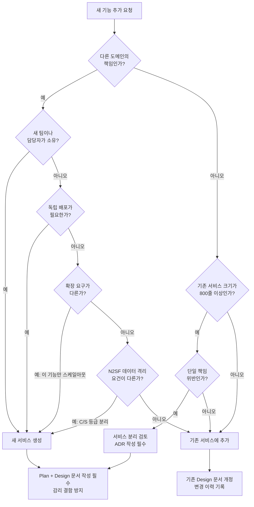
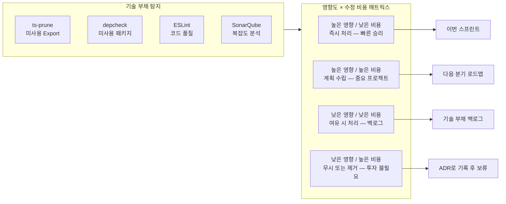

# 아키텍처 고급 FAQ — 마이크로서비스 설계 결정, 서비스 분리, 기술 부채

> **대상 독자**: 중급~고급 개발자, 아키텍트
> **최종 수정**: 2026-04-13
> **관련 문서**: `02-architecture/`, `docs/01-plan/`, `docs/02-design/`

---

## 개요

이 문서는 공공기관 SaaS 프레임워크를 운영하면서 자주 부딪히는 아키텍처 수준의 질문 25개를 다룹니다.
단순한 이론이 아니라, 실제 `/data/ai-saas` 코드베이스와 CSAP 규제 환경을 바탕으로 실용적인 답변을 제공합니다.

---

## 마이크로서비스 설계 (Q1–Q9)

---

### Q1: 새 기능을 기존 서비스에 추가해야 하나요, 새 서비스로 분리해야 하나요?

**짧은 답변**: 도메인 경계, 팀 소유권, 확장 요구, 데이터 격리 필요성 4가지를 기준으로 판단합니다.

**상세 설명**

이 질문은 마이크로서비스 아키텍처에서 가장 많이 받는 질문 중 하나입니다.
틀린 결정이 쌓이면 서비스가 너무 잘게 쪼개지는 "나노서비스 지옥" 또는 서비스가 무분별하게 비대해지는 "분산 모놀리스"가 됩니다.

아래 결정 트리를 따라 판단하십시오:



**실무 판단 기준표**

| 판단 기준 | 새 서비스 | 기존 서비스 추가 |
|---------|---------|--------------|
| 도메인 경계 | 다른 Bounded Context | 같은 Bounded Context |
| 팀 소유권 | 다른 팀/담당자가 소유 | 같은 팀이 소유 |
| 배포 주기 | 독립적으로 배포 필요 | 같이 배포해도 무방 |
| 확장 패턴 | 이 기능만 스케일아웃 필요 | 함께 확장해도 됨 |
| 데이터 격리 | 별도 DB 스키마 필요 (CSAP) | 공유 스키마 가능 |
| 기술 스택 | 다른 언어/런타임 필요 | 기존 스택으로 충분 |

**공공기관 SaaS 특수 고려 사항**

CSAP 심사에서 "서비스 경계가 명확하지 않다"는 지적을 받으면 D-08 (접근 통제) 항목에서 감점됩니다.
민감도 등급이 다른 데이터를 처리하는 기능 (예: 일반 사용자 데이터 O등급 vs 행정 데이터 S등급)은 반드시 서비스를 분리해야 합니다.

```typescript
// ❌ 잘못된 예: 한 서비스에서 O등급/S등급 혼합 처리
export class UserService {
  async getPublicProfile(userId: string) { /* O등급 */ }
  async getAdminSensitiveData(userId: string) { /* S등급 — 분리 필요! */ }
}

// ✅ 올바른 예: 등급별 서비스 분리
// platform/services/user-service: O등급 일반 프로필
// platform/services/security-service: S등급 보안 민감 데이터
```

---

### Q2: 서비스 간 공유 데이터베이스를 사용하면 안 되는 이유는?

**짧은 답변**: 공유 DB는 서비스 결합도를 높이고, 독립 배포와 확장을 불가능하게 만들며, CSAP 데이터 격리 요건에도 위배됩니다.

**상세 설명**

공유 데이터베이스 패턴이 왜 문제인지를 구체적인 시나리오로 설명합니다.

**시나리오**: `user-service`와 `billing-service`가 같은 PostgreSQL DB를 사용한다고 가정합니다.

```
문제 1: 스키마 변경 충돌
billing-service 팀이 users 테이블에 컬럼을 추가하면
→ user-service가 예상치 못한 컬럼을 받아 오류 발생
→ 두 서비스가 동시에 배포되어야 하는 강결합 발생

문제 2: 성능 경합
billing-service의 대용량 정산 쿼리가 DB 커넥션 풀을 점유
→ user-service의 로그인 요청이 커넥션 대기로 타임아웃
→ 한 서비스의 부하가 다른 서비스에 직접 영향

문제 3: CSAP D-08 위반
N2SF S등급 청구 데이터와 O등급 사용자 데이터가
같은 DB에 공존 → 테넌트 격리 요건 위반
```

**올바른 패턴**: 서비스별 독립 DB + API를 통한 데이터 접근

```typescript
// ✅ billing-service가 user 정보가 필요할 때
// 직접 DB 접근이 아닌, user-service API 호출
export class BillingService {
  constructor(private readonly userClient: UserServiceClient) {}

  async generateInvoice(tenantId: string, userId: string) {
    // API를 통해 사용자 정보 조회 (서비스 경계 존중)
    const user = await this.userClient.getUser(userId);
    // 청구 로직 처리 (billing DB만 접근)
    return this.billingRepo.create({ tenantId, userId, userName: user.name });
  }
}
```

**예외 허용 케이스**

개발 초기 단계 또는 모놀리스에서 마이크로서비스로 전환 중인 경우,
임시로 공유 DB를 허용할 수 있습니다. 단, ADR에 다음을 명시해야 합니다:
- 허용 기간 (예: Phase 2 완료까지, 2026-09-30)
- 분리 계획 (어떤 테이블을 언제 어떤 서비스로 이관)
- 리스크 (CSAP 심사 전 반드시 해소)

---

### Q3: 마이크로서비스 간 데이터 일관성을 어떻게 보장하나요?

**짧은 답변**: 분산 트랜잭션 대신 Saga 패턴과 이벤트 소싱(Outbox 패턴)을 사용합니다.

**상세 설명**

서비스 간 데이터 일관성은 마이크로서비스의 가장 어려운 문제입니다.
`/data/ai-saas`의 구독(subscription) 생성 프로세스를 예시로 설명합니다.

**잘못된 접근 (분산 2PC)**

```typescript
// ❌ 절대 이렇게 하지 마십시오 — 분산 트랜잭션은 교착 상태를 유발합니다
async function createSubscription(tenantId: string, plan: string) {
  await billingService.charge(tenantId, plan);   // 1. 결제
  await tenantService.activate(tenantId, plan);  // 2. 활성화 — 여기서 실패하면?
  await notificationService.sendWelcome(tenantId); // 3. 알림
  // 2번 실패 시 1번 롤백이 불가능 → 데이터 불일치
}
```

**올바른 접근 (Saga 패턴 + Outbox)**

```typescript
// ✅ Saga 패턴: 각 단계를 독립 이벤트로 처리
// platform/packages/outbox/ 패키지 활용

// Step 1: subscription-service에서 이벤트 발행 (DB 트랜잭션 내)
async function createSubscription(tenantId: string, plan: string) {
  await prisma.$transaction(async (tx) => {
    const subscription = await tx.subscription.create({
      data: { tenantId, plan, status: 'PENDING' }
    });
    // Outbox에 이벤트 저장 (DB 트랜잭션이므로 원자적)
    await tx.outboxEvent.create({
      data: {
        topic: 'subscription.created',
        payload: JSON.stringify({ subscriptionId: subscription.id, tenantId, plan }),
      }
    });
  });
}

// Step 2: billing-service가 'subscription.created' 이벤트 소비
// Step 3: 결제 성공 시 'payment.succeeded' 이벤트 발행
// Step 4: tenant-service가 'payment.succeeded' 소비 → 테넌트 활성화
// Step 5: notification-service가 'tenant.activated' 소비 → 웰컴 이메일 발송
```

**보상 트랜잭션**: 중간 단계 실패 시 이미 완료된 단계를 되돌리는 보상 이벤트 발행
- `payment.succeeded` 이후 `tenant.activation.failed` → `payment.refund.requested` 발행

---

### Q4: 서비스가 너무 많아서 관리가 어렵습니다. Bounded Context를 어떻게 설정하나요?

**짧은 답변**: Eric Evans의 DDD Bounded Context 원칙에 따라 비즈니스 도메인별로 서비스를 그룹화하고, 팀 토폴로지와 일치시킵니다.

**상세 설명**

현재 `/data/ai-saas`의 서비스 구조를 살펴보면 25개 이상의 서비스가 있습니다.
이를 Bounded Context로 그룹화하면 다음과 같습니다:

**공공기관 SaaS 도메인 분류**

```
Identity & Access Context (신원 및 접근)
├── auth-service       # 인증/인가
├── user-service       # 사용자 관리
└── tenant-service     # 테넌트 관리

Subscription Context (구독 관리)
├── subscription-service  # 구독 플랜
├── billing-service       # 청구/결제
└── catalog-service       # 서비스 카탈로그

AI & Knowledge Context (AI 지식 관리)
├── ai-service            # RAG, LLM 연동
└── (vector-store)        # 내장 모듈

Compliance Context (규정 준수)
├── audit-service         # 감사 로그
├── compliance-service    # CSAP/N2SF
└── security-service      # 보안 이벤트
│   └── security-monitor-service

Operations Context (운영)
├── notification-service  # 알림
└── file-service          # 파일 관리
```

**팀 토폴로지와 일치시키기**

서비스 경계는 Conway's Law에 따라 조직 구조를 반영해야 합니다.
Bounded Context와 팀 구성이 맞지 않으면 팀 간 협의 비용이 폭증합니다.

```
Identity 팀     → Identity & Access Context 소유
Platform 팀     → Subscription + Operations Context 소유
AI/데이터 팀   → AI & Knowledge Context 소유
보안/감리 팀   → Compliance Context 소유
```

---

### Q5: 개발 환경에서 모든 서비스를 로컬로 실행하기 어렵습니다. 어떻게 해결하나요?

**짧은 답변**: "개발자 컨텍스트" 기법을 사용합니다. 자신이 담당하는 서비스만 로컬에서 실행하고, 나머지는 개발 클러스터(k3s)를 사용합니다.

**상세 설명**

25개 서비스를 모두 로컬에서 실행하려면 최소 16GB RAM이 필요합니다.
실용적인 해결책은 세 가지입니다:

**방법 1: 서비스 스텁(Stub) 활용**

```typescript
// 다른 서비스 의존성을 스텁으로 대체
// jest.mock 또는 msw(Mock Service Worker) 사용

// packages/user-service-stub/src/index.ts
export const userServiceStub = {
  getUser: async (id: string) => ({
    id,
    name: '테스트 사용자',
    email: 'test@example.com',
    tenantId: 'dev-tenant-001'
  })
};
```

**방법 2: Docker Compose 프로파일**

```yaml
# docker-compose.dev.yml
services:
  # 내가 담당하는 서비스만 로컬에서 빌드
  billing-service:
    build: ./platform/services/billing-service
    profiles: ["billing-dev"]

  # 나머지 서비스는 레지스트리 이미지 사용
  user-service:
    image: registry.internal/user-service:latest
    profiles: ["billing-dev"]
```

```bash
# billing 개발 시: billing-service만 로컬 빌드
docker compose --profile billing-dev up
```

**방법 3: Telepresence (권장)**

```bash
# 개발 k3s 클러스터에 연결된 상태에서 로컬 서비스를 클러스터에 인젝션
telepresence connect
telepresence intercept billing-service --port 3006:3006

# 이후 billing-service 트래픽이 로컬로 라우팅됨
# 나머지 서비스는 k3s 클러스터에서 실행
```

**WSL2 환경 특수 사항**

이 프로젝트는 WSL2 위에서 개발됩니다. k3s 클러스터가 WSL2 내에서 실행되므로
Telepresence 연결 시 WSL2 네트워크 인터페이스를 사용합니다:

```bash
# WSL2 IP 확인
ip addr show eth0 | grep 'inet ' | awk '{print $2}' | cut -d/ -f1

# k3s kubeconfig WSL2 설정
export KUBECONFIG=/etc/rancher/k3s/k3s.yaml
kubectl get pods -n ai-saas
```

---

### Q6: 서비스 API 계약이 변경될 때 소비자를 어떻게 안전하게 마이그레이션하나요?

**짧은 답변**: API 버전 관리와 Tolerant Reader 패턴을 함께 사용하고, Consumer-Driven Contract Testing으로 하위 호환성을 검증합니다.

**상세 설명**

공공기관 SaaS에서 API 계약 변경은 특히 위험합니다.
다른 기관의 시스템이 우리 API를 사용하는 경우 변경 통보 기간이 법적으로 요구될 수 있습니다.

**API 버전 관리 전략**

```typescript
// Fastify 라우터 — URL 버전 관리
fastify.register(v1Routes, { prefix: '/api/v1' });
fastify.register(v2Routes, { prefix: '/api/v2' });

// v1 응답 (기존)
// GET /api/v1/users/:id
// { "id": "123", "name": "홍길동", "email": "hong@example.com" }

// v2 응답 (신규 — address 필드 추가)
// GET /api/v2/users/:id
// { "id": "123", "name": "홍길동", "email": "hong@example.com",
//   "address": { "city": "서울", "district": "종로구" } }
```

**하위 호환 변경 (안전)**
- 새 선택적 필드 추가
- 새 엔드포인트 추가
- 더 넓은 범위의 값 허용

**파괴적 변경 (위험 — 주요 버전 번호 올려야 함)**
- 기존 필드 제거 또는 이름 변경
- 필드 타입 변경 (string → number)
- 필수 필드 추가
- 상태 코드 변경

**마이그레이션 절차**

```
1단계: v2 API 배포 (v1 유지)
2단계: 소비자 팀에 변경 공지 (최소 30일 — 공공기관 기준)
3단계: 소비자 팀이 v2로 마이그레이션
4단계: v1 트래픽이 0이 되면 deprecation 헤더 추가
5단계: 6개월 후 v1 종료 (Sunset 헤더로 공지)
```

```typescript
// Deprecation 헤더 추가
reply.header('Deprecation', 'Tue, 01 Apr 2027 00:00:00 GMT');
reply.header('Sunset', 'Tue, 01 Oct 2027 00:00:00 GMT');
reply.header('Link', '</api/v2/users>; rel="successor-version"');
```

---

### Q7: 공유 라이브러리(패키지)가 너무 많아졌습니다. 어떻게 정리하나요?

**짧은 답변**: 의존성 그래프를 분석하여 실제로 사용되는 패키지만 유지하고, 과도하게 작은 패키지는 통합합니다.

**상세 설명**

현재 `/data/ai-saas/platform/packages/`에는 20개 이상의 공유 패키지가 있습니다.
이를 정리하는 단계적 방법을 설명합니다.

**1단계: 사용 현황 분석**

```bash
# 미사용 패키지 탐지
cd /data/ai-saas
npx depcheck --json | jq '.unused[]'

# 각 패키지 의존성 그래프 시각화
npx madge --image graph.svg platform/services/
```

**2단계: 패키지 분류**

```
핵심 패키지 (유지 필수)
├── @ai-saas/auth-sdk      — 인증 공통 (모든 서비스 사용)
├── @ai-saas/audit-sdk     — 감사 로깅 (CSAP D-06 필수)
├── @ai-saas/types         — 공통 타입 정의
└── @ai-saas/mesh-ready    — Kubernetes/Linkerd 헬스체크

통합 검토 패키지 (2~3개 서비스만 사용)
├── @ai-saas/crypto-util   → audit-sdk에 통합 검토
└── @ai-saas/id-generator  → types에 통합 검토

제거 후보 (사용처 없음)
└── @ai-saas/legacy-client — 마이그레이션 완료, 불필요
```

**3단계: 통합 기준**

```
통합 기준:
- 사용 서비스 2개 이하 → 사용하는 서비스 내부로 이동
- 패키지 코드 100줄 이하 → 연관 패키지에 합병
- 독립 버전 관리가 불필요 → 모노레포 내 로컬 모듈로 전환
```

---

### Q8: 서비스가 재시작될 때 인플라이트(in-flight) 요청을 어떻게 안전하게 처리하나요?

**짧은 답변**: Graceful Shutdown 패턴을 구현합니다. 새 연결 수락을 중단하고 기존 요청이 완료될 때까지 대기합니다.

**상세 설명**

`/data/ai-saas/platform/packages/mesh-ready/src/graceful-shutdown.ts`에 이미 구현되어 있습니다.
이 패키지를 모든 서비스에 적용해야 합니다.

**구현 원칙**

```
SIGTERM 수신
    → 헬스 체크를 unhealthy로 전환 (Kubernetes가 트래픽 라우팅 중단)
    → 새 연결 수락 중단
    → 기존 인플라이트 요청 완료 대기 (최대 30초)
    → DB 커넥션 풀 정리
    → 프로세스 종료 (exit code 0)
```

```typescript
// platform/packages/mesh-ready/src/graceful-shutdown.ts 활용
import { setupGracefulShutdown } from '@ai-saas/mesh-ready';

const server = Fastify();

setupGracefulShutdown(server, {
  signals: ['SIGTERM', 'SIGINT'],
  timeout: 30_000,        // 30초 대기
  onShutdown: async () => {
    await prisma.$disconnect();
    await redisClient.quit();
  }
});
```

**Kubernetes 설정**

```yaml
# Helm 차트 — terminationGracePeriodSeconds는 graceful shutdown 타임아웃보다 커야 함
spec:
  terminationGracePeriodSeconds: 45  # 30초 + 15초 여유
  containers:
    - name: billing-service
      lifecycle:
        preStop:
          exec:
            command: ["/bin/sh", "-c", "sleep 5"]  # Kubernetes endpoint 제거 대기
```

---

### Q9: 멀티테넌트 환경에서 특정 테넌트의 트래픽이 다른 테넌트에 영향을 주지 않게 하려면?

**짧은 답변**: Noisy Neighbor 문제는 테넌트별 레이트 리밋, DB 커넥션 풀 분리, 그리고 Kubernetes QoS 클래스를 통해 해결합니다.

**상세 설명**

공공기관 SaaS에서 멀티테넌시는 CSAP D-08 (접근 통제)의 핵심 요건입니다.
Noisy Neighbor 문제는 한 테넌트의 과도한 사용이 다른 테넌트에 영향을 주는 현상입니다.

**레이어별 격리 전략**

```
L4: 네트워크 레이어
└── Linkerd + Cilium: 테넌트별 네트워크 정책 적용

L3: 애플리케이션 레이어
└── rate-limiter 패키지: 테넌트별 요청 제한
    예) BASIC 플랜: 100 req/min, ENTERPRISE: 10,000 req/min

L2: 데이터베이스 레이어
└── Prisma RLS (Row Level Security): tenantId 기반 자동 필터링
    PostgreSQL 커넥션 풀: 테넌트별 max_connections 제한

L1: 인프라 레이어
└── Kubernetes ResourceQuota: 테넌트 네임스페이스별 CPU/메모리 제한
```

**레이트 리밋 구현 예시**

```typescript
// platform/packages/rate-limiter 활용
import { createTenantRateLimiter } from '@ai-saas/rate-limiter';

const rateLimiter = createTenantRateLimiter({
  redis: redisClient,
  plans: {
    BASIC:      { windowMs: 60_000, max: 100 },
    STANDARD:   { windowMs: 60_000, max: 1_000 },
    ENTERPRISE: { windowMs: 60_000, max: 10_000 },
  }
});

// Fastify 플러그인으로 등록
fastify.addHook('preHandler', async (request, reply) => {
  const { tenantId, plan } = request.tenantContext;  // 미들웨어에서 설정
  const allowed = await rateLimiter.check(tenantId, plan);
  if (!allowed) {
    return reply.status(429).send({ error: 'Rate limit exceeded', retryAfter: 60 });
  }
});
```

---

## 기술 부채 관리 (Q10–Q17)

---

### Q10: 기술 부채를 어떻게 식별하고 우선순위를 정하나요?

**짧은 답변**: 자동화 도구로 탐지하고, 영향도(Impact)와 수정 비용(Effort)을 기준으로 우선순위 매트릭스를 만들어 PM과 공유합니다.

**상세 설명**



**영향도 측정 기준**

| 영향도 | 기준 |
|--------|------|
| 상 (High) | CSAP 통제항목 위반, 보안 취약점, 장애 발생 이력 |
| 중 (Medium) | 개발 속도 저하, 테스트 어려움, 신규 기능 추가 방해 |
| 하 (Low) | 코드 가독성 저하, 사소한 중복, 주석 누락 |

**수정 비용 측정 기준**

| 비용 | 기준 |
|------|------|
| 낮음 | 1~2일 이내 해결 가능, 위험도 낮음 |
| 중간 | 1~2주 소요, 일부 테스트 수정 필요 |
| 높음 | 1개월 이상, 다른 서비스 변경 필요, 롤백 위험 |

---

### Q11: 레거시 서비스를 리팩토링할 때 가장 안전한 접근 방법은?

**짧은 답변**: Strangler Fig 패턴을 사용합니다. 레거시 코드를 한 번에 교체하지 말고 점진적으로 새 구현으로 이관합니다.

**상세 설명**

마틴 파울러의 Strangler Fig Pattern은 무화과 나무(Strangler Fig)가 숙주 나무를 점진적으로 대체하는 자연 현상에서 이름을 따왔습니다.

**단계별 적용 방법**

```
1단계: 파사드(Facade) 추가
   기존 서비스 앞에 라우터를 추가, 모든 트래픽을 기존 서비스로 전달

2단계: 기능 단위 이관
   하나의 기능(예: 로그인)을 새 구현으로 이관
   라우터가 해당 기능 트래픽을 새 구현으로 전달
   나머지는 기존 서비스로 유지

3단계: 점진적 확장
   기능을 하나씩 이관하면서 테스트 커버리지 유지
   각 이관 후 관찰 기간(1~2주)

4단계: 레거시 제거
   모든 트래픽이 새 구현으로 이관되면 레거시 서비스 종료
```

**공공기관 SaaS 적용 시 주의사항**

- 이관 중에도 감사 로그(CSAP D-06)가 끊기지 않아야 합니다
- 새 구현과 레거시가 병행 운영되는 기간에 두 곳 모두에 로그가 기록되어야 합니다
- 이관 완료 후 레거시 제거 전 CSAP 감리팀 확인 필요

---

### Q12: Dead code를 프로덕션 환경에서 안전하게 제거하는 절차는?

**짧은 답변**: 탐지 → 검증 → 제거 → 배포 → 관찰의 5단계를 거칩니다. 절대 급하게 제거하지 마십시오.

**상세 설명**

Dead code 제거는 "안전해 보이지만 위험할 수 있는" 작업입니다.
반사적으로 호출되거나, 이벤트로 트리거되는 코드는 정적 분석에서 "미사용"으로 표시될 수 있습니다.

**5단계 안전 제거 절차**

```bash
# 1단계: 자동 탐지
npx ts-prune --error 2>&1 | tee dead-code-report.txt
npx depcheck | tee unused-deps.txt

# 2단계: 수동 검증 (중요!)
# 아래 케이스는 ts-prune이 "미사용"으로 오탐할 수 있음:
# - EventEmitter 리스너로 호출되는 함수
# - Fastify 플러그인으로 동적 등록된 라우터
# - CSAP 감사 목적으로만 존재하는 함수 (실제 삭제 불가)
```

```typescript
// 제거 전 반드시 이 3가지 확인:
// 1. grep으로 런타임 동적 호출 여부 확인
// 2. 이벤트 리스너로 등록 여부 확인
// 3. 외부 시스템(공공 API)에서 호출 가능성 확인
```

```bash
# 3단계: 제거 (별도 브랜치에서)
git checkout -b refactor/remove-dead-code-batch-1

# 4단계: PR + 코드 리뷰 (Reviewer 에이전트)
# 5단계: 스테이징 환경에서 최소 1주일 관찰 후 프로덕션 배포
```

**`/data/ai-saas/.claude/rules/deadcode-policy.md` 정책 준수 필수**

---

### Q13: 의존성 패키지의 주요 버전 업그레이드를 어떻게 접근하나요?

**짧은 답변**: 격리된 브랜치에서 업그레이드 후 모든 테스트 통과 및 CSAP 보안 스캔을 완료한 뒤 스테이징에서 충분히 검증합니다.

**상세 설명**

공공기관 SaaS에서 의존성 업그레이드는 특별히 신중해야 합니다.
보안 취약점이 있는 버전을 방치하면 CSAP D-12 위반이지만,
검증 없는 업그레이드는 장애를 초래할 수 있습니다.

**의존성 업그레이드 우선순위**

```
1순위: 보안 패치 (CVE 등록된 취약점)
   → 48시간 이내 패치 필수 (CSAP D-12 요건)
   → 긴급 패치 파이프라인 사용

2순위: 주요 성능/안정성 버전
   → 2주 이내 스테이징 검증 후 배포

3순위: 기능 추가 버전
   → 다음 정기 유지보수 창에 배포
```

**주요 버전 업그레이드 절차**

```bash
# 1. 격리 브랜치 생성
git checkout -b upgrade/prisma-v7

# 2. 변경 로그 검토 (Breaking Changes 확인)
# prisma.io/changelog 참조

# 3. pnpm을 사용하여 업그레이드
pnpm update prisma @prisma/client --latest

# 4. 타입 오류 수정
npx tsc --noEmit 2>&1 | head -50

# 5. 테스트 실행
pnpm test

# 6. 보안 감사
pnpm audit --audit-level high

# 7. PR 생성 + Reviewer 에이전트 검토 요청
```

---

### Q14: 기술 부채 로드맵을 PM과 공유하는 방법은?

**짧은 답변**: 비즈니스 영향도(배포 속도, 장애 빈도)로 기술 부채를 번역하고, 분기별 기술 부채 예산(전체 스프린트 역량의 20%)을 확보합니다.

**상세 설명**

PM에게 "코드가 나빠서 고쳐야 한다"고 설명하면 우선순위 경쟁에서 항상 집니다.
비즈니스 언어로 번역하는 것이 핵심입니다.

**기술 부채 → 비즈니스 언어 번역 예시**

```
[기술적 표현] "모듈 A의 Cyclomatic Complexity가 25입니다."
[비즈니스 표현] "모듈 A 수정 시 버그 발생률이 다른 모듈보다 3배 높고,
                새 기능 추가에 평균 2일이 더 소요됩니다."

[기술적 표현] "레거시 API에 타입 안전성이 없습니다."
[비즈니스 표현] "지난 분기 장애 5건 중 3건이 이 API에서 발생했습니다.
                수정 시 장애율 60% 감소 예상입니다."

[기술적 표현] "의존성 패키지 버전이 2년 전입니다."
[비즈니스 표현] "CVE-2024-XXXX 취약점이 있습니다.
                CSAP 심사에서 D-12 결함으로 감점될 위험이 있습니다."
```

**분기별 기술 부채 예산 협상**

```markdown
# 기술 부채 예산 제안 (PM 보고용)

## 현황
- 기술 부채 총점: 450 (SonarQube 기준)
- 부채 이자: 신기능 개발 속도 30% 저하 추정

## 제안
- 기술 부채 스프린트: 매 분기 1 스프린트 (20% 역량)
- Q2 집중 목표: 보안 취약점 패치 + 핵심 모듈 리팩토링
- 예상 효과: Q3 개발 속도 15% 향상, 장애 발생 30% 감소

## 위험 비용 (처리하지 않을 경우)
- CSAP 심사 D-12 결함 위험: 재심사 비용 500만원 예상
- 레거시 API 장애 시: SLA 위반 패널티 발생 가능
```

---

### Q15: Node.js/TypeScript 주요 버전 업그레이드 전략은?

**짧은 답변**: LTS 버전을 기준으로 1세대 뒤에서 업그레이드합니다. 현재 Node.js 22 LTS 사용 중이므로 Node.js 24 LTS 출시 후 6개월 뒤 마이그레이션 계획을 수립합니다.

**상세 설명**

현재 스택: TypeScript 5.7, Node.js 22 LTS

**업그레이드 타임라인**

```
Node.js 22 LTS (현재)
    → 2024-10 출시, 2027-04까지 지원
    → 현재 프로젝트 기준 버전

Node.js 24 LTS (예정)
    → 2025-04 출시 예정
    → LTS 지정: 2025-10
    → 마이그레이션 시작: 2026-04 (LTS 지정 6개월 후)

TypeScript 5.x → 6.x
    → Breaking Change 최소화 경향 (마이너 업그레이드 우선)
    → TypeScript는 분기별 업그레이드 가능
```

**Node.js 업그레이드 체크리스트**

```bash
# 1. 모든 npm 패키지의 Node.js 버전 호환성 확인
npx node-check-tools check

# 2. 실험적 API 사용 여부 확인
grep -r "process.experimental\|--experimental" platform/

# 3. Native 모듈 재빌드 필요 여부
find . -name "*.node" -not -path "*/node_modules/*"

# 4. 업그레이드 후 전체 테스트
NODE_VERSION=24 pnpm test
```

---

### Q16: 스키마 마이그레이션 빚이 쌓였습니다. 어떻게 정리하나요?

**짧은 답변**: 스쿼시(Squash) 마이그레이션을 사용하여 히스토리를 정리하되, 프로덕션 DB에는 점진적 마이그레이션을 유지합니다.

**상세 설명**

Prisma 마이그레이션이 수백 개 쌓이면 초기화 시간이 길어지고 관리가 어려워집니다.

**현황 확인**

```bash
# 마이그레이션 수 확인
ls /data/ai-saas/platform/prisma/migrations/ | wc -l

# 미적용 마이그레이션 확인
npx prisma migrate status
```

**스쿼시 절차 (개발 환경)**

```bash
# 1. 현재 DB 상태를 baseline으로 캡처
npx prisma db pull

# 2. 기존 마이그레이션 폴더 아카이브
mv prisma/migrations prisma/migrations-archive-$(date +%Y%m%d)

# 3. 새 baseline 마이그레이션 생성
npx prisma migrate diff \
  --from-empty \
  --to-schema-datamodel prisma/schema.prisma \
  --script > prisma/migrations/0001_squash_baseline/migration.sql

# 4. Prisma에 baseline 표시 (실행하지 않음)
npx prisma migrate resolve --applied 0001_squash_baseline
```

**프로덕션 주의사항**

프로덕션에서는 스쿼시를 직접 적용할 수 없습니다.
신규 인스턴스 배포 시에는 스쿼시 버전을 사용하고,
기존 프로덕션 DB는 점진적 마이그레이션을 계속 적용합니다.

---

### Q17: 코드 복잡도(Cyclomatic Complexity)가 높은 함수를 찾고 줄이는 방법은?

**짧은 답변**: ESLint의 `complexity` 규칙과 SonarQube를 사용하여 탐지하고, 함수 추출(Extract Function)과 조기 반환(Early Return) 패턴으로 줄입니다.

**상세 설명**

Cyclomatic Complexity(CC)는 코드 경로의 수를 나타냅니다.
CC 10 이상은 테스트 작성이 어렵고 버그 발생률이 높습니다.

**탐지 방법**

```bash
# ESLint 복잡도 검사
npx eslint --rule '{"complexity": ["error", 10]}' platform/services/

# 결과 예시:
# platform/services/ai-service/src/lib/rag-engine.ts
#   Line 171: Function 'runAdvancedRAG' has a complexity of 15. (complexity)
```

**리팩토링 기법**

```typescript
// ❌ CC 높은 함수 (CC = 12)
async function processRequest(request: Request, type: string, options: Options) {
  if (type === 'A') {
    if (options.flag1) {
      if (request.user) {
        // ... 중첩 지옥
      } else {
        // ...
      }
    } else {
      // ...
    }
  } else if (type === 'B') {
    // ...
  }
  // 계속 이어짐...
}

// ✅ Early Return + 함수 추출 (각 함수 CC = 3 이하)
async function processRequest(request: Request, type: string, options: Options) {
  if (!request.user) return unauthorizedError();
  if (type === 'A') return processTypeA(request, options);
  if (type === 'B') return processTypeB(request, options);
  return unknownTypeError(type);
}

async function processTypeA(request: Request, options: Options) {
  if (!options.flag1) return defaultTypeAResponse();
  return flaggedTypeAResponse(request);
}
```

---

## 아키텍처 결정 (Q18–Q25)

---

### Q18: ADR(Architecture Decision Record)은 언제, 어떻게 작성해야 하나요?

**짧은 답변**: 돌이키기 어려운 결정(Irreversible Decision)을 내릴 때마다 작성합니다. 형식은 간단하게, 핵심은 "왜"를 기록하는 것입니다.

**상세 설명**

ADR의 목적은 "당시에 왜 그런 결정을 내렸는가"를 미래의 팀원(과 감리관)에게 설명하는 것입니다.

**ADR 작성 트리거**

```
ADR을 작성해야 하는 상황:
✓ 데이터베이스 또는 스토리지 기술 선택
✓ 서비스 분리 또는 통합 결정
✓ 외부 API/라이브러리 채택
✓ 보안 아키텍처 변경 (CSAP 관련)
✓ 성능 vs 보안 트레이드오프 결정
✓ 레거시 기능 폐기 결정

ADR이 불필요한 상황:
✗ 일상적인 코드 스타일 결정
✗ 단기간에 쉽게 되돌릴 수 있는 결정
✗ 팀 전체 합의가 이미 있는 결정
```

**ADR 템플릿 (공공기관 SaaS 최적화)**

```markdown
# ADR-{번호}: {제목}

## 상태
- [ ] 제안 중 | [ ] 승인됨 | [ ] 폐기됨 | [ ] 대체됨

## 컨텍스트
어떤 문제/상황에서 이 결정이 필요했는가?
CSAP/N2SF 관련 제약 조건은 무엇인가?

## 결정
무엇을 결정했는가?

## 대안 검토
| 대안 | 장점 | 단점 | 제외 이유 |
|-----|------|------|---------|
| 대안 A | ... | ... | ... |

## 결과
이 결정의 결과로 무엇이 달라지는가?
트레이드오프는 무엇인가?

## CSAP 영향
해당 없음 / D-{번호} 항목에 영향: {내용}

## 작성일 및 검토자
작성일: YYYY-MM-DD | 검토자: {이름}
```

---

### Q19: 동기 API 호출을 비동기 큐로 교체해야 할 시점은 어떻게 판단하나요?

**짧은 답변**: 다음 세 조건 중 하나라도 해당되면 비동기 큐로 교체를 검토합니다: (1) P99 응답시간 > 3초, (2) 재시도 필요한 작업, (3) 실패 시 데이터 손실이 허용되지 않는 작업.

**상세 설명**

**동기가 적합한 경우**

```
- 즉각적인 결과가 사용자에게 필요한 경우 (예: 로그인, 데이터 조회)
- 처리 시간이 100ms 이하인 경우
- 실패 시 즉시 재시도할 수 있는 경우
- 단순한 CRUD 작업
```

**비동기 큐가 필요한 경우**

```
- 처리 시간이 1초 이상인 경우 (예: AI RAG 처리, 대용량 파일 처리)
- 외부 API 호출 포함 (네트워크 불안정)
- 배치 처리 (이메일 발송, 보고서 생성)
- 결제 처리 (정확히 한 번 처리 보장 필요)
- 감사 로그 기록 (손실 불가, CSAP D-06)
```

**비동기 큐 구현 예시**

```typescript
// Outbox 패턴으로 안전한 비동기 처리
// platform/packages/outbox/ 활용

// 동기: HTTP 요청 수신 → DB 저장 + Outbox 이벤트 저장 (원자적)
export async function requestAIAnalysis(tenantId: string, documentId: string) {
  await prisma.$transaction(async (tx) => {
    await tx.aiAnalysisJob.create({
      data: { tenantId, documentId, status: 'PENDING' }
    });
    await tx.outboxEvent.create({
      data: {
        topic: 'ai.analysis.requested',
        payload: JSON.stringify({ tenantId, documentId }),
      }
    });
  });
  // HTTP 응답: 즉시 반환 (202 Accepted)
  return { status: 'queued', message: '분석 요청이 접수되었습니다.' };
}

// 비동기: 큐 워커가 이벤트 소비 → AI 분석 실행 → 결과 저장
```

---

### Q20: 캐시 레이어를 추가해야 할지, DB 인덱스를 추가해야 할지 어떻게 결정하나요?

**짧은 답변**: 먼저 인덱스를 확인하고, 인덱스가 충분한데도 느리면 캐시를 추가합니다. 캐시는 최후의 수단이 아니라 적절한 도구입니다.

**상세 설명**

```
결정 절차:

1단계: 쿼리 실행 계획 분석
   EXPLAIN ANALYZE SELECT ...
   → Seq Scan(전체 스캔)이면 인덱스 추가

2단계: 인덱스 추가 후 측정
   → P99 < 100ms 달성 시 → 완료
   → 여전히 느리면 3단계

3단계: 캐시 필요성 평가
   캐시가 효과적인 조건:
   - 데이터 변경 빈도 낮음 (코드 목록, 공통 코드 등)
   - 동일 쿼리가 자주 반복됨 (hot data)
   - 캐시 무효화가 단순함

   캐시가 부적절한 조건:
   - 실시간 정확성이 중요한 데이터 (재고, 잔액)
   - 테넌트별로 모두 다른 데이터
   - 캐시 무효화 로직이 복잡함
```

**Redis 캐시 구현 예시**

```typescript
// platform/packages/cache-manager 활용
import { withCache } from '@ai-saas/cache-manager';

// 공통 코드 목록: 변경 빈도 낮음 → 캐시 적합
export async function getCommonCodes(category: string): Promise<CommonCode[]> {
  return withCache(
    `common-codes:${category}`,
    async () => prisma.commonCode.findMany({ where: { category } }),
    { ttl: 3600 }  // 1시간 캐시
  );
}

// 사용자 권한: 보안 민감 → 짧은 TTL
export async function getUserPermissions(userId: string): Promise<Permission[]> {
  return withCache(
    `permissions:${userId}`,
    async () => permissionRepo.findByUserId(userId),
    { ttl: 300 }  // 5분 캐시 (CSAP D-08 고려)
  );
}
```

---

### Q21: 서비스 메시(Linkerd)가 필요 없는 상황은 언제인가요?

**짧은 답변**: 서비스 수가 3개 이하이거나, 단일 팀이 모든 서비스를 소유하고, mTLS 요건이 없는 경우에는 Linkerd가 오버엔지니어링일 수 있습니다.

**상세 설명**

Linkerd는 강력하지만 운영 복잡도를 증가시킵니다.
공공기관 SaaS에서 Linkerd가 꼭 필요한 이유와 대안을 비교합니다.

**Linkerd가 필요한 경우**

```
- CSAP mTLS 요건: 서비스 간 통신 암호화 필수 (D-09)
  → Linkerd가 자동으로 mTLS 제공
- 서비스 수 5개 이상: 트래픽 가시성 없이 디버깅 어려움
- 멀티테넌트 트래픽 분리: Linkerd + Cilium 조합으로 네트워크 정책 적용
- 카나리 배포: Linkerd traffic split으로 점진적 배포 제어
```

**Linkerd 없이도 되는 경우**

```
- 단일 서비스 또는 2~3개 소규모 시스템
- 개발/테스트 환경 (CSAP 적용 안 함)
- Kubernetes 대신 단순 Docker Compose 사용 환경
```

**Linkerd 대신 사용할 수 있는 대안**

```
1. Nginx/Envoy 사이드카: 수동 설정, 더 많은 제어
2. Kubernetes NetworkPolicy: L4 격리만 필요한 경우
3. 애플리케이션 레벨 mTLS: 각 서비스에서 직접 인증서 관리
   (운영 부담 큼, 비권장)
```

---

### Q22: CQRS를 도입할 때 오버엔지니어링을 피하는 방법은?

**짧은 답변**: 읽기와 쓰기의 확장 패턴이 실제로 다를 때만 CQRS를 도입합니다. 단순 CRUD 서비스에 CQRS는 불필요한 복잡도를 추가합니다.

**상세 설명**

CQRS(Command Query Responsibility Segregation)는 읽기(Query)와 쓰기(Command)를 분리하는 패턴입니다.

**CQRS가 적합한 경우**

```
✓ 읽기 트래픽이 쓰기보다 100배 이상 많은 경우
  (예: 공지사항 조회 vs 공지사항 등록)

✓ 읽기 최적화 뷰(View)가 도메인 모델과 매우 다른 경우
  (예: 대시보드 집계 데이터 vs 개별 엔티티)

✓ 쓰기 복잡도(유효성 검사, 비즈니스 규칙)와
  읽기 복잡도(조인, 집계)가 서로 다른 경우
```

**CQRS가 불필요한 경우**

```
✗ 단순 CRUD (관리자 코드 테이블)
✗ 읽기와 쓰기 트래픽이 비슷한 경우
✗ 팀이 이벤트 소싱에 익숙하지 않은 경우
✗ 마이크로서비스 전환 초기 단계
```

**점진적 도입 방법**

```typescript
// 1단계: 읽기/쓰기 핸들러만 분리 (같은 DB 사용)
// 복잡도 최소화

// Command 핸들러
export class CreateSubscriptionCommand {
  async execute(data: CreateSubscriptionDTO) {
    // 비즈니스 규칙 검증 + DB 쓰기
  }
}

// Query 핸들러
export class GetSubscriptionSummaryQuery {
  async execute(tenantId: string) {
    // 최적화된 읽기 쿼리 (JOIN, 집계)
  }
}

// 2단계: 필요시 읽기 전용 DB 레플리카 추가
// 3단계: 필요시 별도 읽기 모델(Redis, Elasticsearch) 추가
```

---

### Q23: 모노레포 vs 멀티레포 선택 기준은? 지금 모노레포로 전환해야 하나요?

**짧은 답변**: 현재 `/data/ai-saas`는 pnpm Workspaces 기반 모노레포를 사용하고 있습니다. 이미 모노레포이므로 전환은 불필요하며, 모노레포의 장점을 최대화하는 데 집중하십시오.

**상세 설명**

현재 구조:
```
/data/ai-saas/              ← 모노레포 루트
├── packages/               ← 공유 npm 패키지 (개별 라이브러리)
├── platform/
│   ├── packages/           ← 플랫폼 공유 패키지
│   ├── services/           ← 마이크로서비스들
│   └── apps/               ← 웹 앱 (Next.js)
└── pnpm-lock.yaml          ← 단일 락파일
```

**모노레포의 주요 장점 (현재 활용 중)**

```
1. 원자적 커밋: 여러 패키지에 걸친 변경을 하나의 커밋으로
2. 공유 타입: @ai-saas/types가 모든 서비스에서 동일하게 사용
3. 통합 CI/CD: 영향받은 패키지만 빌드 (Turbo/Nx 빌드 캐시)
4. 의존성 중복 제거: pnpm Workspaces가 자동으로 공유 의존성 호이스팅
```

**모노레포 관리 팁**

```bash
# 특정 서비스만 빌드
pnpm --filter @ai-saas/ai-service build

# 변경 영향받은 패키지만 테스트
pnpm turbo test --filter=[HEAD^1]

# 의존성 그래프 시각화
pnpm list --depth 2 --filter @ai-saas/billing-service
```

---

### Q24: AI 서비스가 장애일 때 시스템 전체가 멈추지 않으려면 어떻게 설계하나요?

**짧은 답변**: Circuit Breaker 패턴과 Fallback 전략을 함께 사용합니다. AI 기능은 선택적(Optional) 기능으로 설계하여 AI 없이도 기본 서비스가 동작해야 합니다.

**상세 설명**

공공기관 SaaS에서 AI 기능은 편의 기능이지, 핵심 행정 처리의 필수 요소가 아닙니다.
AI 서비스 장애 시 행정 처리가 중단되어서는 안 됩니다.

**설계 원칙**

```
AI 기능 의존성: Optional (보조 기능)
핵심 기능 의존성: 없음 (AI 없이도 동작)

AI 서비스 장애 시 동작:
- AI 요약 기능 → "현재 AI 서비스 점검 중입니다. 직접 문서를 확인해 주십시오." 표시
- AI 검색 기능 → 일반 키워드 검색으로 자동 폴백
- AI 추천 기능 → 기본 최신순 정렬로 폴백
```

**Circuit Breaker 구현**

```typescript
// platform/packages/circuit-breaker 활용
import { CircuitBreaker } from '@ai-saas/circuit-breaker';

const aiCircuitBreaker = new CircuitBreaker({
  failureThreshold: 5,     // 5회 실패 시 OPEN
  successThreshold: 2,     // 2회 성공 시 CLOSED
  timeout: 10_000,         // 10초 타임아웃
  halfOpenRetryDelay: 30_000, // 30초 후 HALF-OPEN 시도
});

export async function getAISummary(documentId: string): Promise<string | null> {
  try {
    return await aiCircuitBreaker.execute(() =>
      aiServiceClient.summarize(documentId)
    );
  } catch (error) {
    // Fallback: AI 없이 문서 첫 200자 반환
    logger.warn('AI 서비스 폴백 활성화', { documentId, error });
    const doc = await documentRepo.findById(documentId);
    return doc?.content.slice(0, 200) + '... (AI 요약 일시 중단)' ?? null;
  }
}
```

**Kubernetes 설정 (AI 서비스 헬스체크)**

```yaml
# ai-service Deployment — 헬스체크 적극 활용
livenessProbe:
  httpGet:
    path: /health/live
    port: 3010
  initialDelaySeconds: 30
  periodSeconds: 10
  failureThreshold: 3

readinessProbe:
  httpGet:
    path: /health/ready
    port: 3010
  initialDelaySeconds: 10
  periodSeconds: 5
  failureThreshold: 3
# readinessProbe 실패 시 트래픽 라우팅 중단 (다른 서비스에 영향 없음)
```

---

### Q25: 공공기관 SaaS에서 GDPR/개인정보보호법 준수를 위한 데이터 아키텍처는?

**짧은 답변**: 데이터 최소화 원칙, 목적 제한, 보존 기간 자동화, 그리고 잊혀질 권리(삭제 요청) 처리 메커니즘을 아키텍처 수준에서 내장해야 합니다.

**상세 설명**

공공기관은 GDPR보다 「개인정보 보호법」과 「공공기관 개인정보 보호 가이드」를 준수해야 합니다.
N2SF의 C등급(기밀), S등급(민감) 데이터 처리 규칙과도 연계됩니다.

**데이터 분류 및 처리 규칙**

```typescript
// N2SF 데이터 등급별 처리 정책
enum DataGrade { C = 'C', S = 'S', O = 'O' }

const dataRetentionPolicy: Record<DataGrade, { days: number; autoDelete: boolean }> = {
  C: { days: 365 * 5, autoDelete: false },  // C등급: 5년, 수동 삭제 (감리 승인 필요)
  S: { days: 365 * 3, autoDelete: false },  // S등급: 3년, 수동 삭제
  O: { days: 365,     autoDelete: true  },  // O등급: 1년, 자동 삭제
};
```

**개인정보 아키텍처 패턴**

```
1. 가명처리 (Pseudonymization)
   실제 개인정보 → 가명 ID로 참조
   실제 데이터는 별도 암호화 저장소(Key-Value)

2. 목적 분리 저장
   서비스 운영 DB: 가명 ID + 업무 데이터
   개인정보 저장소: 실명 + 연락처 (AES-256 암호화)

3. 자동 삭제 스케줄러
   보존 기간 만료 데이터 자동 식별 + 감리관 승인 후 삭제

4. 삭제 요청 처리 (잊혀질 권리)
   삭제 요청 → 가명 ID 연결 해제 → 개인정보 삭제
   업무 데이터는 통계 목적으로 보존 (익명화)
```

```typescript
// 개인정보 삭제 요청 처리 (CSAP D-06 감사 로그 필수)
export async function processDeleteRequest(
  requestUserId: string,
  adminUserId: string
): Promise<void> {
  await auditLog({
    actor: adminUserId,
    action: 'PII_DELETE_REQUEST',
    target: requestUserId,
    timestamp: new Date().toISOString(),
  });

  // 1. 개인정보 저장소에서 실제 데이터 삭제
  await piiStore.delete(requestUserId);

  // 2. 가명 ID 매핑 제거 (복원 불가)
  await pseudonymMap.revoke(requestUserId);

  // 3. 업무 데이터는 유지 (익명 상태)
  await auditLog({
    actor: adminUserId,
    action: 'PII_DELETE_COMPLETED',
    target: requestUserId,
    timestamp: new Date().toISOString(),
  });
}
```

---

## 참고 자료

- `docs/02-design/features/public-saas-framework.design.md` — 전체 아키텍처 설계
- `platform/packages/mesh-ready/` — Graceful Shutdown, 헬스체크
- `platform/packages/circuit-breaker/` — Circuit Breaker 구현
- `platform/packages/rate-limiter/` — 테넌트별 레이트 리밋
- `.claude/rules/csap-compliance.md` — CSAP 준수 규칙
- `docs/guides/onboarding/07-security/` — 보안 심화 가이드

---

*이 문서는 실제 코드베이스와 CSAP 규제 환경을 바탕으로 작성되었습니다.*
*질문이나 보완이 필요한 경우 Pull Request로 기여해 주십시오.*
