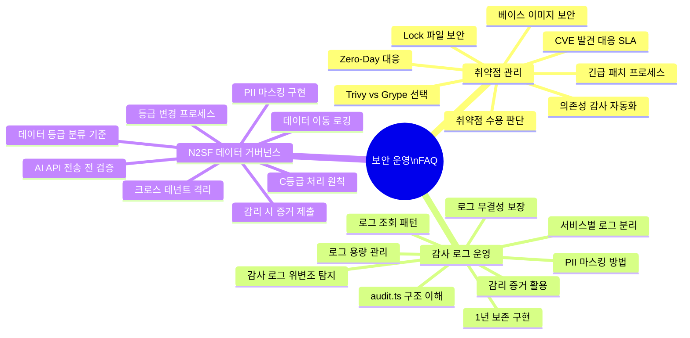
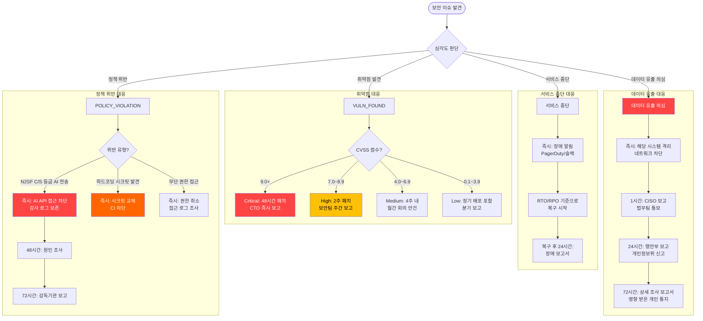

# 보안 운영 고급 FAQ

> 취약점 대응 | 감사 로그 관리 | CSAP 운영 | N2SF 데이터 거버넌스
> 대상 독자: 보안 담당자, 운영 엔지니어, CSAP 감리 담당자
> 최종 수정: 2026-04-13

---

## Executive Summary

| 관점 | 내용 |
|------|------|
| WHY | 공공기관 SaaS 운영에서 보안 이슈가 발생했을 때 신속하고 정확하게 대응하기 위한 지식 기반 |
| WHO | 보안 운영 담당자, CSAP 감리 대응자, N2SF 데이터 거버넌스 담당자 |
| RISK | 늦은 CVE 대응, 감사 로그 누락, N2SF 위반, CSAP 재인증 실패 |
| SUCCESS | CVE Critical 48시간 내 패치, 감사 로그 1년 무결성 유지, N2SF O등급 검증 100% |
| SCOPE | platform/services/ 전체, packages/, .gitea/workflows/, CSAP D-06/D-08/D-09/D-12 |

---

## FAQ 카테고리 구성



---

## 카테고리 1: 취약점 관리 FAQ (8개)

---

### Q1. CVE가 발견되었을 때 SLA(대응 기한)는 어떻게 되나요?

**짧은 답변**: Critical은 48시간 이내 패치 완료, High는 2주, Medium은 4주, Low는 다음 정기 배포입니다.

**상세 설명**

CVE 발견 경로는 크게 3가지입니다.
1. **Grype 자동 스캔** — `sbom-scan.yml` 파이프라인이 매주 월요일 + 코드 푸시 시마다 실행
2. **NVD/KISA 취약점 공지** — 국내 KISA 보안공지 또는 NVD 피드 구독
3. **pnpm audit** — `security.yml` 파이프라인이 주간 자동 실행

**SLA 기준표**

| CVSS 점수 | 심각도 | 대응 SLA | 담당자 | 에스컬레이션 |
|---------|------|---------|--------|-----------|
| 9.0 - 10.0 | Critical | 48시간 내 패치 완료 | 보안팀 + 개발팀 | CTO 즉시 보고 |
| 7.0 - 8.9 | High | 2주 내 패치 완료 | 개발팀 | 보안팀 주간 보고 |
| 4.0 - 6.9 | Medium | 4주 내 패치 또는 수용 결정 | 개발팀 | 월간 취약점 회의 |
| 0.1 - 3.9 | Low | 다음 정기 배포 포함 | 개발팀 | 분기 보고 |

**실제 대응 절차**

```bash
# 1단계: 취약점 영향 범위 확인
grype sbom:sbom-api-gateway.cdx.json \
  --fail-on critical \
  --output json | jq '.matches[] | select(.vulnerability.severity == "Critical")'

# 2단계: Renovate PR 확인 또는 수동 업데이트
pnpm update express@latest --recursive

# 3단계: 취약점 패치 확인
grype sbom:sbom-api-gateway.cdx.json | grep "CVE-2024-XXXX"
# 출력 없으면 패치 완료

# 4단계: 감사 로그 기록 (CSAP D-06)
echo '{"timestamp":"2026-04-13T10:00:00Z","action":"CVE_PATCH",
  "cve":"CVE-2024-XXXX","package":"express","version":"4.21.0",
  "severity":"Critical","patched_by":"devops@gov.kr"}' >> .claude/audit.jsonl
```

---

### Q2. Trivy와 Grype 중 무엇을 언제 사용해야 하나요?

**짧은 답변**: 취약점 스캔은 Grype, IaC(Helm/k8s) 스캔은 Trivy를 사용합니다. 이 분리는 2026-03-19 Trivy 공급망 공격 사건 이후 결정됐습니다.

**상세 설명**

본 프로젝트 `.gitea/workflows/sbom-scan.yml`의 주석에서 명확히 설명합니다.

```yaml
# 보안 참고:
#   - Trivy 공급망 공격(2026-03-19) 대응으로 Grype 채택
#   - 모든 바이너리 다운로드 시 SHA256 체크섬 검증 필수
#   - GitHub Actions 태그가 아닌 커밋 SHA 핀 고정
```

**도구별 역할 분리**

| 도구 | 담당 영역 | 파이프라인 | 주요 이유 |
|------|---------|---------|---------|
| Grype | SBOM 기반 CVE 스캔, npm/node 의존성 | `sbom-scan.yml` | 공급망 침해 위험 감소 |
| Trivy | IaC (Helm, k8s YAML, Infra 설정) | `devsecops.yml` | IaC 설정 오류 탐지에 특화 |
| Semgrep | 소스 코드 정적 분석 (SAST) | `devsecops.yml` | OWASP Top10 패턴 탐지 |
| pnpm audit | npm 패키지 취약점 (NPM Advisory) | `security.yml`, `devsecops.yml` | npm 생태계 권고사항 |

**Grype 설치 시 체크섬 검증 (공급망 보안 실천)**

```yaml
# sbom-scan.yml에서 발췌 — 도구 설치 시 무결성 검증
- name: Install Grype (checksum verified)
  run: |
    GRYPE_VERSION="0.87.0"
    curl -sSfL "https://raw.githubusercontent.com/anchore/grype/main/install.sh" | \
      sh -s -- -b /usr/local/bin "v${GRYPE_VERSION}"
    grype version
```

---

### Q3. 긴급 보안 패치를 적용하는 절차는 어떻게 되나요?

**짧은 답변**: `fix/security-CVE-XXXX` 브랜치 → 패치 → Hotfix 파이프라인 → stg 검증 → main 즉시 배포

**상세 설명**

긴급 패치는 일반 배포와 달리 Sprint 계획 없이 즉시 처리합니다.

```bash
# 1단계: 긴급 패치 브랜치 생성
git checkout main
git pull origin main
git checkout -b fix/security-CVE-2024-XXXX

# 2단계: 패키지 업데이트
pnpm update vulnerable-package@patch-version --recursive

# 3단계: lock 파일 업데이트 확인
git diff pnpm-lock.yaml  # vulnerable-package 버전이 변경됐는지 확인

# 4단계: 빌드 및 테스트
pnpm build
pnpm test

# 5단계: 커밋 (Conventional Commits 형식)
git add pnpm-lock.yaml package.json
git commit -m "fix(security): CVE-2024-XXXX vulnerable-package 긴급 패치

CVSS: 9.8 (Critical)
영향 패키지: vulnerable-package < 2.1.5
패치 버전: 2.1.5
참조: https://nvd.nist.gov/vuln/detail/CVE-2024-XXXX"

# 6단계: PR 생성 + 긴급 리뷰 요청
# PR 제목에 [SECURITY] 접두사 필수
```

**Hotfix 파이프라인 (`hotfix-pipeline.yaml`)**

긴급 패치는 일반 CI 게이트를 단축하여 빠르게 배포합니다. 단, CSAP D-06 감사 로그는 반드시 기록됩니다.

---

### Q4. Zero-Day 취약점이 공개됐을 때 어떻게 대응하나요?

**짧은 답변**: 즉각 격리 → 영향 범위 평가 → 임시 완화 조치 → 패치 → 재검증의 순서로 대응합니다.

**상세 설명**

Zero-Day는 패치가 존재하지 않는 상태에서 공개된 취약점입니다.

**단계별 대응 절차**

```
0시간: 취약점 공개 인지
  ↓
1시간: 영향 범위 확인 (SBOM으로 사용 여부 즉시 조회)
  ↓
4시간: 임시 완화 조치 (WAF 규칙 추가, 기능 임시 비활성화)
  ↓
24시간: 공식 패치 릴리스 모니터링
  ↓
48시간 (패치 공개 후): 패치 적용 및 재배포
  ↓
완료 후: 사후 검토 보고서 작성 (CSAP D-06)
```

**SBOM으로 영향 받는 서비스 즉시 확인**

```bash
# Zero-Day 발견 후 — 어떤 서비스가 영향 받나?
# SBOM 아티팩트에서 취약 패키지 검색
for service in api-gateway auth-service ai-service; do
  echo "=== ${service} ==="
  cat sbom-output/sbom-${service}.cdx.json | \
    jq ".components[] | select(.name == \"vulnerable-package\")" 2>/dev/null && \
    echo "[영향 있음]" || echo "[영향 없음]"
done
```

**임시 완화 조치 예시 (Feature Flag 활용)**

```typescript
// feature-flag-sdk를 활용한 취약 기능 즉시 비활성화
import { createFeatureFlagClient } from '@saas/feature-flag-sdk';

const ff = createFeatureFlagClient();
await ff.initialize();

// Unleash에서 'vulnerable-feature' 플래그를 false로 설정하면
// 즉시 모든 서버에서 기능이 비활성화됨 (재배포 불필요)
if (ff.isEnabled('vulnerable-feature')) {
  // 취약한 코드 경로
  await vulnerableOperation();
} else {
  // 안전한 대체 경로
  return { status: 'maintenance', message: '서비스 점검 중' };
}
```

---

### Q5. 취약점을 즉시 패치하지 않고 "수용"할 수 있나요?

**짧은 답변**: CVSS 7.0 미만(Medium/Low)은 수용 가능하지만, 반드시 보안팀 서면 승인 + `.trivyignore` + 감사 로그 기록이 필요합니다.

**상세 설명**

모든 취약점을 즉시 패치하는 것은 현실적으로 불가능합니다. CSAP는 위험 수용(Risk Acceptance)을 허용하지만, 적절한 거버넌스가 필요합니다.

**수용 가능 조건**

```
CVSS < 4.0 (Low): 보안팀 구두 승인 + 분기 재검토
4.0 ≤ CVSS < 7.0 (Medium): 보안팀 서면 승인 + 월별 재검토 + 완화 조치
7.0 ≤ CVSS < 9.0 (High): CTO 승인 + 주별 재검토 + 구체적 완화 조치 + 패치 일정
9.0 ≤ CVSS (Critical): 수용 불가 — 반드시 패치 또는 서비스 중단
```

**취약점 수용 등록 절차**

```bash
# 1단계: .trivyignore에 등록 (버전 관리됨)
cat >> .trivyignore << 'EOF'
# CVE-2023-44487: HTTP/2 Rapid Reset
# 승인: 보안팀 (2026-04-13, 승인자: security@gov.kr)
# 완화: WAF에서 HTTP/2 Rapid Reset 패턴 차단 중
# 재검토: 2026-07-13 (3개월 후)
# CVSS: 7.5 (High)
CVE-2023-44487
EOF

# 2단계: Grype 설정에도 등록
cat >> infra/security/.grype.yaml << 'EOF'
ignore:
  - vulnerability: CVE-2023-44487
    reason: "WAF에서 차단 중, 2026-07-13 재검토"
    fix-state: not-fixed
EOF

# 3단계: 감사 로그 기록 (CSAP D-06 필수)
echo "{
  \"timestamp\": \"$(date -u +%Y-%m-%dT%H:%M:%SZ)\",
  \"action\": \"CVE_RISK_ACCEPTANCE\",
  \"cve\": \"CVE-2023-44487\",
  \"cvss\": 7.5,
  \"approver\": \"security@gov.kr\",
  \"mitigation\": \"WAF HTTP/2 Rapid Reset 차단\",
  \"review_date\": \"2026-07-13\",
  \"csap_ref\": \"D-06\"
}" >> .claude/audit.jsonl
```

---

### Q6. pnpm-lock.yaml이 왜 보안에 중요한가요?

**짧은 답변**: lock 파일이 없으면 npm 패키지 타이포스쿼팅 및 버전 범위 공격에 취약합니다. `--frozen-lockfile`으로 lock 파일 변경을 CI에서 차단해야 합니다.

**상세 설명**

`package.json`에 `"express": "^4.21.0"`라고 써있으면, pnpm은 최소 4.21.0 이상 5.0.0 미만의 최신 버전을 설치합니다. 공격자가 4.21.1-malicious를 배포했다면 자동으로 설치될 수 있습니다.

**`pnpm-lock.yaml`이 이를 막는 방법**

```yaml
# pnpm-lock.yaml (자동 생성)
express@4.21.0:
  resolution:
    integrity: sha512-abc123...  # SHA512 체크섬 고정
  # 4.21.1이 나와도 CI에서 --frozen-lockfile이면 이 버전만 설치
```

**CI에서 lock 파일 준수 강제**

```yaml
# .gitea/workflows/devsecops.yml에서 발췌
- name: Install dependencies
  run: pnpm install --frozen-lockfile
  # --frozen-lockfile: lock 파일과 package.json이 불일치하면 즉시 실패
  # 로컬에서 패키지를 추가하고 lock 파일 없이 커밋하면 CI 차단됨
```

**lock 파일 변경 시 주의사항**

```bash
# PR에서 pnpm-lock.yaml이 변경됐다면 반드시 확인
git diff pnpm-lock.yaml

# 확인 포인트:
# 1. 의도한 패키지만 변경됐나?
# 2. integrity 해시가 정상인가?
# 3. 예상치 못한 전이적 의존성이 추가됐나?

# 변경된 패키지 목록만 확인 (diff 노이즈 제거)
git diff pnpm-lock.yaml | grep "^+ " | grep "resolution:" | head -20
```

---

### Q7. Docker 베이스 이미지는 어떻게 보안 관리해야 하나요?

**짧은 답변**: 베이스 이미지는 특정 다이제스트(SHA256)로 고정하고, Trivy로 정기 스캔 후 Renovate Bot으로 자동 업데이트합니다.

**상세 설명**

```dockerfile
# 잘못된 방법: 태그만 사용 (mutable)
FROM node:22-alpine
# node:22-alpine은 언제든 다른 이미지를 가리킬 수 있음

# 올바른 방법: 다이제스트로 고정 (immutable)
FROM node:22-alpine@sha256:b94d27b9934d3e08a52e52d7da7dabfac484efe04cbb4adfa5b4da6438db3f0d
# 이 이미지는 절대로 변경되지 않음
```

**베이스 이미지 다이제스트 확인**

```bash
# 현재 이미지 다이제스트 확인
docker pull node:22-alpine
docker inspect node:22-alpine | jq '.[0].RepoDigests'
# 출력: ["node@sha256:b94d27b9..."]

# Harbor에서 가져올 때
docker pull localhost:8080/public-saas/node:22-alpine
docker inspect --format='{{index .RepoDigests 0}}' \
  localhost:8080/public-saas/node:22-alpine
```

**베이스 이미지 취약점 정기 스캔**

```bash
# Trivy로 베이스 이미지 직접 스캔
trivy image \
  --severity HIGH,CRITICAL \
  node:22-alpine

# 베이스 이미지만 스캔 (애플리케이션 계층 제외)
trivy image \
  --severity HIGH,CRITICAL \
  --ignore-unfixed \
  node:22-alpine
```

**Renovate로 Dockerfile 자동 업데이트**

```json
// renovate.json에 추가
{
  "dockerfile": {
    "enabled": true,
    "pinDigests": true,    // 다이제스트 자동 고정
    "automerge": false,    // 베이스 이미지 변경은 수동 검토
    "reviewers": ["security-team"]
  }
}
```

---

### Q8. 의존성 감사를 어떻게 자동화하나요?

**짧은 답변**: `security.yml`이 매주 월요일 자동 실행, `devsecops.yml`이 매일 실행합니다. 결과는 Gitea Artifacts에 365일 보존됩니다.

**상세 설명**

`.gitea/workflows/security.yml` (매주 월요일 09:00 KST)

```yaml
# security.yml 핵심 구성
on:
  push:
    branches: [main]
  schedule:
    - cron: "0 0 * * 1"  # 매주 월요일 00:00 UTC (09:00 KST)

jobs:
  dependency-audit:
    steps:
      - name: npm audit (high severity)
        run: pnpm audit --audit-level=high
        continue-on-error: true  # 감사 결과 수집 목적, 배포 차단은 별도

      - name: Generate audit report
        run: pnpm audit --json > audit-report.json

      - name: Upload audit report
        uses: actions/upload-artifact@v4
        with:
          name: security-audit-report
          path: audit-report.json
          retention-days: 90   # 90일 보존
```

**수동으로 감사 실행**

```bash
# 즉시 감사 실행
pnpm audit --audit-level=high

# JSON 형식으로 결과 저장
pnpm audit --json > audit-$(date +%Y%m%d).json

# 심각도별 요약
pnpm audit --json | jq '{
  total: .metadata.vulnerabilities.total,
  critical: .metadata.vulnerabilities.critical,
  high: .metadata.vulnerabilities.high,
  moderate: .metadata.vulnerabilities.moderate,
  low: .metadata.vulnerabilities.low
}'
```

---

## 카테고리 2: 감사 로그 운영 FAQ (9개)

---

### Q9. 이 프로젝트의 감사 로그 아키텍처는 어떻게 구성되어 있나요?

**짧은 답변**: `@public-saas/audit-sdk`가 모든 서비스에서 공통 사용되며, 서비스별 `audit.ts` 래퍼가 서비스 컨텍스트를 주입합니다.

**상세 설명**

3개의 서비스 감사 로거를 비교해보겠습니다.

**security-service/src/lib/audit.ts**
```typescript
// Design Ref: DESIGN-MTU-P15
// CSAP: D-06
import { createAuditLogger, createStandardTransport } from '@public-saas/audit-sdk';

const auditLogger = createAuditLogger({
  serviceName: 'security-service',
  transport: createStandardTransport('security-service'),
});

export async function logSecurityEvent(
  action: string,
  metadata?: Record<string, unknown>
): Promise<void> {
  await auditLogger.log({
    actor: 'system:security-service',    // 자동화된 서비스 행위자
    action,                               // 이벤트 유형 (예: FIREWALL_RULE_ADDED)
    target: 'security',
    targetType: 'security',
    tenantId: 'system',                   // 시스템 레벨 이벤트
    ip: process.env.SERVICE_IP || '127.0.0.1',
    userAgent: 'security-service/1.0',
    metadata,
  });
}
```

**security-monitor-service/src/lib/audit.ts**
```typescript
// 보안 모니터링 서비스 — 구조는 동일, actor만 다름
const auditLogger = createAuditLogger({
  serviceName: 'security-monitor-service',
  transport: createStandardTransport('security-monitor-service'),
});

export async function logSecurityEvent(
  action: string,
  metadata?: Record<string, unknown>
): Promise<void> {
  await auditLogger.log({
    actor: 'system:security-monitor',  // security-service와 구분
    // ...동일한 구조
  });
}
```

**compliance-service/src/lib/audit.ts**
```typescript
// 준수 현황 서비스 — 컴플라이언스 이벤트 전용
const auditLogger = createAuditLogger({
  serviceName: 'compliance-service',
  transport: createStandardTransport('compliance-service'),
});

export async function logComplianceEvent(  // 함수명이 logSecurityEvent가 아님
  action: string,
  metadata?: Record<string, unknown>
): Promise<void> {
  await auditLogger.log({
    actor: 'system:compliance-service',
    target: 'compliance',      // target이 'security'가 아닌 'compliance'
    targetType: 'compliance',
    // ...
  });
}
```

**패턴 분석**: 세 서비스 모두 동일한 `audit-sdk`를 사용하지만, `actor`, `target`, `targetType`, `serviceName`을 각 서비스에 맞게 설정합니다. 이를 통해 감사 로그를 서비스별로 필터링할 수 있습니다.

---

### Q10. audit.jsonl 파일 형식은 무엇이고 어떻게 사용하나요?

**짧은 답변**: JSON Lines(JSONL) 형식으로, 한 줄이 하나의 이벤트입니다. Append-only로 운영하여 무결성을 보장합니다.

**상세 설명**

```jsonl
{"timestamp":"2026-04-13T09:00:00Z","action":"IMAGE_SIGN","image":"localhost:8080/public-saas/api-gateway:main-abc1234","status":"success","actor":"gitea-actions"}
{"timestamp":"2026-04-13T09:01:00Z","action":"SBOM_SCAN","service":"api-gateway","scan_tool":"grype","vulnerabilities":{"critical":0,"high":1},"result":"PASS","csap_ref":"D-12-03"}
{"timestamp":"2026-04-13T09:05:00Z","action":"DEVSECOPS_SCAN","ref":"main","sha":"abc1234","trivy":"success","semgrep":"success","secrets":"success"}
```

**JSONL 형식의 장점**
- 파일을 열지 않고도 `tail -n 100`으로 최신 로그 확인 가능
- `jq`로 쉽게 필터링 가능
- 로그 서버 스트리밍에 적합 (한 줄씩 전송)

**감사 로그 조회 예시**

```bash
# 특정 이미지의 서명 이벤트 조회
jq 'select(.action == "IMAGE_SIGN" and .image | contains("api-gateway"))' \
  .claude/audit.jsonl

# 오늘의 Critical 취약점 발견 이벤트
jq 'select(.action == "SBOM_SCAN" and .vulnerabilities.critical > 0)' \
  .claude/audit.jsonl | \
  jq 'select(.timestamp | startswith("2026-04-13"))'

# CSAP D-12-03 관련 모든 이벤트
jq 'select(.csap_ref | contains("D-12"))' .claude/audit.jsonl

# 감사 기간 내 이벤트 수 집계
jq -s 'group_by(.action) | map({action: .[0].action, count: length})' \
  .claude/audit.jsonl
```

---

### Q11. 감사 로그 무결성을 어떻게 보장하나요?

**짧은 답변**: append-only 쓰기 권한 설정, SHA256 해시 체인, 정기적 외부 저장소 백업으로 무결성을 보장합니다.

**상세 설명**

CSAP D-06은 감사 로그의 수정/삭제 방지를 요구합니다.

**파일시스템 레벨 보호**

```bash
# audit.jsonl을 append-only로 설정 (루트 권한 필요)
chattr +a /data/ai-saas/.claude/audit.jsonl
# +a: append-only — root도 수정/삭제 불가, 추가만 가능

# 설정 확인
lsattr /data/ai-saas/.claude/audit.jsonl
# 출력: -----a------------ /data/ai-saas/.claude/audit.jsonl
```

**SHA256 해시 체인 구현**

```bash
# 매 시간 로그 파일의 SHA256 해시 기록
HASH=$(sha256sum .claude/audit.jsonl | awk '{print $1}')
echo "{
  \"timestamp\": \"$(date -u +%Y-%m-%dT%H:%M:%SZ)\",
  \"action\": \"AUDIT_LOG_INTEGRITY_CHECK\",
  \"file\": \".claude/audit.jsonl\",
  \"sha256\": \"${HASH}\",
  \"line_count\": $(wc -l < .claude/audit.jsonl)
}" >> .claude/audit-integrity.jsonl

# 무결성 검증 (과거 해시와 비교)
STORED_HASH=$(jq -r 'select(.action == "AUDIT_LOG_INTEGRITY_CHECK") | .sha256' \
  .claude/audit-integrity.jsonl | tail -2 | head -1)
CURRENT_HASH=$(sha256sum .claude/audit.jsonl | awk '{print $1}')

if [ "$STORED_HASH" != "$CURRENT_HASH" ]; then
  echo "[CRITICAL] 감사 로그 무결성 위반! 변조 가능성 있음"
  # 보안팀 즉시 알림
fi
```

**WORM(Write Once Read Many) 저장소 연동**

```bash
# MinIO의 Object Lock (WORM) 기능으로 외부 백업
mc ilm add \
  --replication-days 365 \
  --retention-mode COMPLIANCE \
  minio/audit-logs

mc mirror \
  --watch \
  .claude/audit.jsonl \
  minio/audit-logs/$(date +%Y/%m/%d)/
```

---

### Q12. 감사 로그에 개인정보(PII)가 포함될 수 있나요?

**짧은 답변**: 감사 로그에는 최소한의 식별자(사용자 ID, IP)만 기록해야 합니다. 이름, 이메일, 전화번호 등 직접 PII는 절대 기록하지 않습니다.

**상세 설명**

CSAP D-06과 개인정보보호법 제3조(개인정보보호 원칙)에 따라 감사 로그는 최소한의 개인정보만 수집해야 합니다.

**허용되는 감사 로그 내용**

```typescript
// 올바른 감사 로그 — 최소 식별자만 사용
await auditLogger.log({
  actor: userId,          // 내부 UUID (예: "usr_abc123")
  action: 'USER_LOGIN',
  target: userId,
  targetType: 'user',
  tenantId: tenantId,     // 내부 UUID
  ip: clientIp,           // IP 주소 (감사 목적으로 허용)
  metadata: {
    loginMethod: 'password',
    mfaUsed: true,
    // 이름, 이메일, 주민번호 등 직접 PII 절대 금지
  },
});

// 잘못된 감사 로그 — PII 직접 기록
await auditLogger.log({
  actor: '홍길동',                    // 이름 직접 기록 금지
  metadata: {
    email: 'hong@example.com',       // 이메일 직접 기록 금지
    phone: '010-1234-5678',          // 전화번호 직접 기록 금지
    birthDate: '1990-01-01',         // 생년월일 직접 기록 금지
  },
});
```

**IP 주소 마스킹 (GDPR/개인정보보호법 일부 해석)**

```typescript
// IP 주소의 마지막 옥텟 마스킹 (선택사항)
function maskIPAddress(ip: string): string {
  const ipv4Match = ip.match(/^(\d+\.\d+\.\d+)\.\d+$/);
  if (ipv4Match) {
    return `${ipv4Match[1]}.0`;  // 192.168.1.123 → 192.168.1.0
  }
  return ip;
}

// security-service/audit.ts 적용 예
ip: maskIPAddress(process.env.SERVICE_IP || '127.0.0.1'),
```

---

### Q13. 감사 로그를 1년 보존하는 구체적인 방법은?

**짧은 답변**: CI 파이프라인 아티팩트 365일 설정 + MinIO/S3 버킷 버전 관리 + 월별 로그 로테이션 아카이브입니다.

**상세 설명**

**방법 1: CI 아티팩트 365일 보존**

```yaml
# .gitea/workflows/sbom-scan.yml에서 발췌 — 이미 구현됨
- name: Upload SBOM artifact
  uses: actions/upload-artifact@v4
  with:
    name: sbom-${{ matrix.service }}-${{ steps.image.outputs.tag }}
    path: sbom-output/
    retention-days: 365  # CSAP D-06: 1년 보존
```

**방법 2: 월별 로그 아카이브**

```bash
#!/bin/bash
# scripts/archive-audit-logs.sh — 월별 실행

YEAR_MONTH=$(date -d "last month" +%Y-%m)
ARCHIVE_FILE="audit-logs-${YEAR_MONTH}.jsonl.gz"

# 이전 달 로그 추출
jq -r "select(.timestamp | startswith(\"${YEAR_MONTH}\"))" \
  .claude/audit.jsonl | gzip > "${ARCHIVE_FILE}"

# SHA256 체크섬 생성
sha256sum "${ARCHIVE_FILE}" > "${ARCHIVE_FILE}.sha256"

# MinIO에 업로드 (WORM 버킷)
mc cp "${ARCHIVE_FILE}" minio/audit-archive/${YEAR_MONTH}/
mc cp "${ARCHIVE_FILE}.sha256" minio/audit-archive/${YEAR_MONTH}/

echo "감사 로그 아카이브 완료: ${ARCHIVE_FILE}"
```

**방법 3: 로그 보존 현황 대시보드 확인**

```bash
# 보존 기간 확인 (가장 오래된 로그)
jq -r '.timestamp' .claude/audit.jsonl | sort | head -1

# 보존된 로그 용량 확인
du -sh .claude/audit.jsonl
ls -la .claude/audit.jsonl

# 365일 이전 로그 경고
OLDEST=$(jq -r '.timestamp' .claude/audit.jsonl | sort | head -1)
DAYS_OLD=$(( ($(date +%s) - $(date -d "$OLDEST" +%s)) / 86400 ))
if [ $DAYS_OLD -gt 365 ]; then
  echo "[WARN] 365일 이상 된 로그 발견: ${OLDEST}"
fi
```

---

### Q14. 서비스별 감사 로그를 어떻게 구분하고 조회하나요?

**짧은 답변**: `serviceName` 필드와 `actor` 필드로 구분합니다. security-service는 `actor: 'system:security-service'`, compliance-service는 `actor: 'system:compliance-service'`입니다.

**상세 설명**

각 서비스의 audit.ts를 보면 `actor` 값이 다릅니다.

| 서비스 | actor 값 | 이벤트 함수명 |
|--------|---------|------------|
| security-service | `system:security-service` | `logSecurityEvent()` |
| security-monitor-service | `system:security-monitor` | `logSecurityEvent()` |
| compliance-service | `system:compliance-service` | `logComplianceEvent()` |
| gitea-actions (CI) | `gitea-actions` | 직접 기록 |

**서비스별 로그 조회**

```bash
# security-service 이벤트만 조회
jq 'select(.actor == "system:security-service")' .claude/audit.jsonl

# compliance-service 이벤트만 조회
jq 'select(.actor == "system:compliance-service")' .claude/audit.jsonl

# 보안 관련 모든 서비스 이벤트
jq 'select(.actor | startswith("system:security"))' .claude/audit.jsonl

# 특정 시간 범위 + 특정 서비스
jq 'select(
  .actor == "system:security-service" and
  .timestamp >= "2026-04-13T00:00:00Z" and
  .timestamp < "2026-04-14T00:00:00Z"
)' .claude/audit.jsonl
```

---

### Q15. 감사 로그 용량 관리는 어떻게 하나요?

**짧은 답변**: 프로덕션 환경에서는 일일 최대 500MB 기준 로그 로테이션을 적용합니다. 보존 기간(1년) 데이터는 압축 아카이브로 이동합니다.

**상세 설명**

```bash
# 현재 로그 크기 확인
wc -l .claude/audit.jsonl
du -sh .claude/audit.jsonl

# 일일 이벤트 수 추정
jq -r '.timestamp[:10]' .claude/audit.jsonl | sort | uniq -c | tail -7

# 평균 로그 엔트리 크기 계산 (바이트)
wc -c .claude/audit.jsonl
# 크기(바이트) / 줄 수 = 평균 엔트리 크기

# 로테이션 설정 (logrotate 사용)
cat > /etc/logrotate.d/audit-saas << 'EOF'
/data/ai-saas/.claude/audit.jsonl {
  daily
  rotate 365          # 365일치 보존
  compress            # gzip 압축
  delaycompress       # 1일 후 압축 (현재 파일은 그대로)
  missingok
  notifempty
  postrotate
    # 로테이션 후 SHA256 기록
    sha256sum /data/ai-saas/.claude/audit.jsonl >> \
      /data/ai-saas/.claude/audit-integrity.jsonl
  endscript
}
EOF
```

---

### Q16. 감사 로그에서 이상 패턴을 어떻게 탐지하나요?

**짧은 답변**: 단기간 과다 이벤트, 비정상 시간대 접근, 실패 패턴 급증을 모니터링합니다.

**상세 설명**

```bash
# 최근 1시간 내 동일 사용자 로그인 실패 10회 이상
jq -r 'select(.action == "USER_LOGIN_FAILED") |
  [.timestamp[:13], .actor] | join(" ")' .claude/audit.jsonl | \
  awk '{print $2}' | sort | uniq -c | sort -rn | \
  awk '$1 >= 10 {print "[경고] 브루트포스 시도 의심:", $2, $1, "회"}'

# 새벽 시간대 (02:00~05:00 KST) 관리자 접근
jq 'select(
  .action == "ADMIN_ACTION" and
  ((.timestamp | split("T")[1] | split(":")[0] | tonumber) >= 17 or
   (.timestamp | split("T")[1] | split(":")[0] | tonumber) <= 20)
)' .claude/audit.jsonl

# 비정상적으로 많은 데이터 내보내기
jq 'select(.action | startswith("DATA_EXPORT")) |
  {actor, action, timestamp, size: .metadata.recordCount}' \
  .claude/audit.jsonl | \
  jq 'select(.size > 10000)'
```

---

### Q17. CSAP 감리 시 감사 로그를 어떻게 증거로 제출하나요?

**짧은 답변**: 특정 기간의 로그를 추출하고, SHA256 해시 체인으로 무결성을 증명한 후 감리단에 제출합니다.

**상세 설명**

```bash
#!/bin/bash
# scripts/export-csap-evidence.sh — 감리 증거 패키지 생성

EVIDENCE_DIR="csap-evidence-$(date +%Y%m%d)"
START_DATE="${1:-$(date -d '1 month ago' +%Y-%m-%d)}"
END_DATE="${2:-$(date +%Y-%m-%d)}"

mkdir -p "${EVIDENCE_DIR}"

# 1. 기간 내 감사 로그 추출
echo "감사 로그 추출: ${START_DATE} ~ ${END_DATE}"
jq "select(
  .timestamp >= \"${START_DATE}T00:00:00Z\" and
  .timestamp < \"${END_DATE}T23:59:59Z\"
)" .claude/audit.jsonl > "${EVIDENCE_DIR}/audit-log.jsonl"

# 2. 이벤트 유형별 통계
jq -s 'group_by(.action) |
  map({action: .[0].action, count: length}) |
  sort_by(.count) | reverse' \
  "${EVIDENCE_DIR}/audit-log.jsonl" > "${EVIDENCE_DIR}/event-summary.json"

# 3. SHA256 무결성 증명
sha256sum "${EVIDENCE_DIR}/audit-log.jsonl" > "${EVIDENCE_DIR}/audit-log.sha256"

# 4. CSAP D-06 준수 체크리스트
cat > "${EVIDENCE_DIR}/csap-d06-checklist.md" << 'EOF'
# CSAP D-06 준수 증거 체크리스트

- [x] 감사 로그 생성 (audit.jsonl)
- [x] 1년 보존 (retention-days: 365)
- [x] SHA256 무결성 해시
- [x] append-only 파일 속성 (chattr +a)
- [x] 서비스별 actor 구분
- [x] timestamp, action, actor, target 필수 필드 포함
EOF

# 5. 증거 패키지 압축
tar -czf "${EVIDENCE_DIR}.tar.gz" "${EVIDENCE_DIR}/"
sha256sum "${EVIDENCE_DIR}.tar.gz" > "${EVIDENCE_DIR}.tar.gz.sha256"

echo "증거 패키지 생성 완료: ${EVIDENCE_DIR}.tar.gz"
echo "SHA256: $(cat ${EVIDENCE_DIR}.tar.gz.sha256)"
```

---

## 카테고리 3: N2SF 데이터 거버넌스 FAQ (8개)

---

### Q18. N2SF 데이터 등급 분류 기준이 무엇인가요?

**짧은 답변**: C(기밀), S(민감), O(공개) 3등급입니다. 국가 안보·개인정보는 C등급, 내부 업무 데이터는 S등급, 공개 가능 데이터는 O등급입니다.

**상세 설명**

N2SF(국가 사이버안보 종합 프레임워크)는 공공기관이 취급하는 데이터를 3단계로 분류합니다.

| 등급 | 명칭 | 예시 | AI API 전송 |
|------|------|------|-----------|
| C | 기밀(Classified) | 국가 안보 정보, 수사 자료, 개인의 민감정보(주민번호, 의료정보) | 절대 금지 |
| S | 민감(Sensitive) | 내부 업무 문서, 비공개 정책, 공무원 인사 정보 | 절대 금지 |
| O | 공개(Open) | 행정 공개 데이터, 통계 자료, 공개 API 응답 | PII 마스킹 후 허용 |

**데이터 등급 판단 기준**

```typescript
// CSAP compliance.md에서 정의된 패턴
enum DataGrade { C = 'C', S = 'S', O = 'O' }

async function classifyData(data: unknown): Promise<DataGrade> {
  // C등급 판단: 개인 고유 식별자 포함 여부
  if (containsPII(data)) return DataGrade.C;

  // S등급 판단: 내부 업무 정보 포함 여부
  if (containsInternalInfo(data)) return DataGrade.S;

  // O등급: 위 조건에 해당하지 않는 공개 가능 데이터
  return DataGrade.O;
}

function containsPII(data: unknown): boolean {
  const str = JSON.stringify(data);
  const piiPatterns = [
    /\d{6}-\d{7}/,                        // 주민등록번호
    /\d{3}-\d{4}-\d{4}/,                  // 전화번호
    /[a-zA-Z0-9._%+-]+@[a-zA-Z0-9.-]+/,  // 이메일
    /\d{4}-\d{4}-\d{4}-\d{4}/,           // 카드번호
  ];
  return piiPatterns.some(p => p.test(str));
}
```

---

### Q19. AI API 전송 전 데이터 등급 검증을 어떻게 구현하나요?

**짧은 답변**: AI Gateway 경유가 필수이며, C/S 등급 데이터는 에러를 반환합니다. O등급이라도 PII를 마스킹 후 전송합니다.

**상세 설명**

CLAUDE.md의 절대 제약 사항입니다.

```
[데이터 분류 확인] → C/S 등급이면 → API 전송 금지 (에러 반환)
                  → O 등급이면  → PII 마스킹 후 → AI Gateway 경유 → 외부 API
```

**AI API 호출 시 등급 검증 패턴**

```typescript
// platform/services/ai-service/src/lib/data-grade-validator.ts

import { DataGrade } from './n2sf-classifier';

export class AIGateway {
  async sendToAI(
    data: unknown,
    grade: DataGrade,
    endpoint: string,
  ): Promise<AIResponse> {
    // C, S 등급: 절대 전송 금지 (N2SF N-05)
    if (grade === DataGrade.C || grade === DataGrade.S) {
      // 감사 로그 기록 (차단 이벤트도 기록 필요)
      await logSecurityEvent('AI_DATA_BLOCKED', {
        grade,
        reason: `${grade}등급 데이터는 AI API 전송 금지 (N2SF N-05)`,
        dataPreview: '[REDACTED]',
      });
      throw new Error(`BLOCKED: ${grade}등급 데이터는 AI API 전송 금지 (N2SF N-05)`);
    }

    // O 등급: PII 마스킹 후 전송
    const masked = await maskPII(data);

    // AI Gateway 경유 (직접 외부 API 호출 금지)
    return this.gatewayClient.forward(masked, endpoint);
  }
}
```

**AI Gateway 미경유 시 차단**

```typescript
// 잘못된 패턴 — 직접 외부 API 호출 절대 금지
import OpenAI from 'openai';
const client = new OpenAI({ apiKey: process.env.OPENAI_API_KEY }); // BLOCKED

// 올바른 패턴 — AI Gateway 경유
import { aiGateway } from '@/lib/ai-gateway';
const response = await aiGateway.send({
  prompt: maskedQuery,
  model: 'gpt-4',
}, {
  grade: DataGrade.O,
  masked: true,
});
```

---

### Q20. PII 마스킹 구현은 어떻게 하나요?

**짧은 답변**: 정규식 기반 자동 마스킹과 명시적 필드 마스킹 두 가지를 조합합니다.

**상세 설명**

```typescript
// platform/services/ai-service/src/lib/pii-masker.ts

export interface MaskingResult {
  masked: unknown;
  maskedFields: string[];
  maskedCount: number;
}

export async function maskPII(data: unknown): Promise<MaskingResult> {
  const maskedFields: string[] = [];
  let maskedCount = 0;

  function maskValue(value: string, fieldName?: string): string {
    // 주민등록번호: 000000-0000000 → ######-#######
    if (/^\d{6}-\d{7}$/.test(value)) {
      maskedCount++;
      maskedFields.push(fieldName ?? 'unknown');
      return '######-#######';
    }

    // 전화번호: 010-1234-5678 → 010-****-5678 (마지막 4자리는 유지)
    if (/^010-\d{4}-(\d{4})$/.test(value)) {
      maskedCount++;
      maskedFields.push(fieldName ?? 'unknown');
      return value.replace(/010-\d{4}-/, '010-****-');
    }

    // 이메일: user@example.com → u***@example.com
    if (/^[a-zA-Z0-9._%+-]+@[a-zA-Z0-9.-]+\.[a-zA-Z]{2,}$/.test(value)) {
      maskedCount++;
      maskedFields.push(fieldName ?? 'unknown');
      const [local, domain] = value.split('@');
      return `${local[0]}***@${domain}`;
    }

    return value;
  }

  function processObject(obj: unknown, path = ''): unknown {
    if (typeof obj === 'string') {
      return maskValue(obj, path);
    }
    if (Array.isArray(obj)) {
      return obj.map((item, i) => processObject(item, `${path}[${i}]`));
    }
    if (obj !== null && typeof obj === 'object') {
      const result: Record<string, unknown> = {};
      for (const [key, val] of Object.entries(obj)) {
        // 특정 필드명은 항상 마스킹
        if (['password', 'token', 'secret', 'ssn', 'rnn'].includes(key.toLowerCase())) {
          result[key] = '[MASKED]';
          maskedCount++;
          maskedFields.push(`${path}.${key}`);
        } else {
          result[key] = processObject(val, `${path}.${key}`);
        }
      }
      return result;
    }
    return obj;
  }

  const masked = processObject(data);
  return { masked, maskedFields, maskedCount };
}
```

---

### Q21. 데이터 등급이 잘못 분류된 경우 어떻게 수정하나요?

**짧은 답변**: 등급 변경은 데이터 거버넌스 위원회 승인이 필요합니다. 무단 등급 다운그레이드(C→O)는 CSAP 위반입니다.

**상세 설명**

**등급 변경 프로세스**

```
1. 담당자가 데이터 거버넌스 위원회에 변경 요청서 제출
   - 현재 등급, 변경 희망 등급
   - 변경 근거 (법적 근거 또는 업무 필요성)
   - 영향 범위 (어떤 시스템에서 사용 중인지)

2. 위원회 검토 (CISO 포함)
   - 최대 5 영업일 이내 결정

3. 승인 시:
   - 등급 변경 기록 (audit.jsonl)
   - 영향 받는 시스템 설정 업데이트
   - 관련 담당자 교육

4. 거부 시:
   - 거부 사유 서면 통보
   - 6개월 후 재신청 가능
```

**등급 변경 감사 로그**

```typescript
// compliance-service에서 등급 변경 이벤트 기록
await logComplianceEvent('DATA_GRADE_CHANGE', {
  dataId: datasetId,
  previousGrade: DataGrade.S,
  newGrade: DataGrade.O,
  approvedBy: 'ciso@gov.kr',
  approvalDate: '2026-04-13',
  reason: '공공데이터법 제17조에 따른 공개 의무 이행',
  affectedSystems: ['compliance-service', 'ai-service'],
  csapRef: 'D-08',
});
```

---

### Q22. 크로스 테넌트 데이터 격리를 어떻게 검증하나요?

**짧은 답변**: 모든 데이터베이스 쿼리에 `tenantId` 조건을 강제하고, 감사 로그에서 크로스 테넌트 접근 패턴을 정기 검증합니다.

**상세 설명**

N2SF는 SaaS 환경에서 테넌트 간 데이터 격리를 필수 요건으로 정합니다.

**Prisma 미들웨어로 tenantId 자동 강제**

```typescript
// platform/services/{service}/src/lib/prisma.ts
import { PrismaClient } from '@prisma/client';

const prisma = new PrismaClient();

// 모든 쿼리에 tenantId 자동 주입
prisma.$use(async (params, next) => {
  // 테넌트가 있는 모델에만 적용
  const tenantModels = ['User', 'Document', 'Subscription'];

  if (tenantModels.includes(params.model ?? '')) {
    if (params.action === 'findMany' || params.action === 'findFirst') {
      // WHERE 절에 tenantId 자동 추가
      params.args.where = {
        ...params.args.where,
        tenantId: getCurrentTenantId(),  // 현재 요청의 테넌트 ID
      };
    }
  }

  return next(params);
});
```

**크로스 테넌트 접근 패턴 감사 로그 분석**

```bash
# 동일 사용자가 여러 tenantId로 접근하는 패턴 탐지
jq -r '[.actor, .metadata.tenantId] | @csv' .claude/audit.jsonl | \
  awk -F',' '{users[$1] = users[$1] "," $2} END {
    for (u in users) {
      n = split(users[u], tenants, ",")
      if (n > 3) print "[경고] " u " 가 " n " 개 테넌트 접근:", users[u]
    }
  }'
```

---

### Q23. AI 서비스에서 N2SF 등급을 실시간으로 확인하는 방법은?

**짧은 답변**: AI 요청 처리 전에 N2SF 분류기를 통과시키는 미들웨어를 사용합니다. 등급 확인 실패 시 요청 자체를 거부합니다.

**상세 설명**

```typescript
// platform/services/ai-service/src/middleware/n2sf-gate.ts

import { Request, Response, NextFunction } from 'express';
import { classifyData, DataGrade } from '@/lib/n2sf-classifier';
import { logSecurityEvent } from '@/lib/audit';

export async function n2sfGate(req: Request, res: Response, next: NextFunction) {
  try {
    const requestBody = req.body;

    // 데이터 등급 자동 분류
    const grade = await classifyData(requestBody);

    // C/S 등급 즉시 차단
    if (grade === DataGrade.C || grade === DataGrade.S) {
      await logSecurityEvent('N2SF_AI_REQUEST_BLOCKED', {
        grade,
        endpoint: req.path,
        reason: 'C/S 등급 데이터 AI 전송 금지',
        requestId: req.headers['x-request-id'],
      });

      return res.status(403).json({
        error: 'FORBIDDEN',
        message: `${grade}등급 데이터는 AI API 전송이 금지되어 있습니다 (N2SF N-05)`,
        code: 'N2SF_GRADE_VIOLATION',
      });
    }

    // O 등급: PII 마스킹 처리 표시
    req.body = await maskPII(requestBody);
    req.headers['x-data-grade'] = grade;
    req.headers['x-pii-masked'] = 'true';

    await logSecurityEvent('N2SF_AI_REQUEST_ALLOWED', {
      grade,
      endpoint: req.path,
      piiMasked: true,
    });

    next();
  } catch (error) {
    await logSecurityEvent('N2SF_CLASSIFICATION_ERROR', {
      error: (error as Error).message,
      endpoint: req.path,
    });

    // 분류 실패 시 안전하게 거부 (Fail-Safe)
    return res.status(500).json({
      error: 'CLASSIFICATION_FAILED',
      message: '데이터 등급 분류 실패로 요청이 거부됐습니다',
    });
  }
}
```

---

### Q24. N2SF 위반이 발생했을 때 보고 절차는?

**짧은 답변**: 발견 즉시 CISO와 감독기관(행안부)에 24시간 이내 보고, 72시간 이내 상세 조사 보고서 제출입니다.

**상세 설명**

**보안 이슈 에스컬레이션 의사결정 트리**



**N2SF 위반 감사 로그 기록**

```typescript
// security-service에서 N2SF 위반 기록
await logSecurityEvent('N2SF_VIOLATION_DETECTED', {
  violationType: 'GRADE_C_AI_TRANSMISSION_ATTEMPT',
  dataId: affectedDataId,
  attemptedBy: userId,
  targetApi: 'external-llm-api',
  blockedAt: new Date().toISOString(),
  reportRequired: true,
  reportDeadline: new Date(Date.now() + 24 * 60 * 60 * 1000).toISOString(),
  csapRef: 'D-06, D-08',
  n2sfRef: 'N-05',
});
```

---

### Q25. CSAP 재인증 시 N2SF 관련 증거 자료는 무엇을 준비해야 하나요?

**짧은 답변**: AI API 전송 전 등급 검증 로그, PII 마스킹 처리 기록, 데이터 등급 분류 정책 문서, 위반 차단 이벤트 로그 4가지입니다.

**상세 설명**

CSAP 재인증 시 N2SF 관련 증거 패키지 구성:

**증거 1: 데이터 등급 분류 정책 문서**
- 등급 기준(C/S/O) 정의 문서
- 등급 분류 절차서
- 등급 변경 이력

**증거 2: 기술적 통제 구현 증거**

```bash
# AI API 전송 전 등급 검증 호출 로그 추출
jq 'select(.action | startswith("N2SF_AI_"))' .claude/audit.jsonl | \
  jq -s '{
    total_requests: length,
    blocked: map(select(.action == "N2SF_AI_REQUEST_BLOCKED")) | length,
    allowed: map(select(.action == "N2SF_AI_REQUEST_ALLOWED")) | length,
    block_rate: (map(select(.action == "N2SF_AI_REQUEST_BLOCKED")) | length) /
                length * 100
  }'
```

**증거 3: 코드 레벨 통제 증거**

```bash
# AI API 직접 호출 패턴 없음 증명
grep -r "new OpenAI\|anthropic\|openai.chat" \
  platform/services/ --include="*.ts" | \
  grep -v "test\|spec\|mock" | \
  grep -v "ai-gateway"
# 출력 없음 = 직접 호출 없음 = 통제 준수
```

**증거 4: PII 마스킹 처리 기록**

```bash
# PII 마스킹 이벤트 통계
jq 'select(.action == "N2SF_AI_REQUEST_ALLOWED" and .metadata.piiMasked == true) |
  .metadata.maskedCount' .claude/audit.jsonl | \
  jq -s 'add'
# 총 마스킹 처리 횟수
```

**증거 패키지 자동 생성 스크립트**

```bash
#!/bin/bash
# scripts/n2sf-evidence.sh

EVIDENCE_DIR="n2sf-evidence-$(date +%Y%m%d)"
mkdir -p "${EVIDENCE_DIR}"

# AI API 차단 이벤트 (C/S 등급 전송 시도)
jq 'select(.action == "N2SF_AI_REQUEST_BLOCKED")' \
  .claude/audit.jsonl > "${EVIDENCE_DIR}/ai-blocked-events.jsonl"

# PII 마스킹 처리된 허용 이벤트
jq 'select(.action == "N2SF_AI_REQUEST_ALLOWED")' \
  .claude/audit.jsonl > "${EVIDENCE_DIR}/ai-allowed-events.jsonl"

# N2SF 위반 탐지 이벤트
jq 'select(.action | contains("N2SF_VIOLATION"))' \
  .claude/audit.jsonl > "${EVIDENCE_DIR}/n2sf-violations.jsonl"

# 통계 요약
jq -s '{
  ai_blocked: length
}' "${EVIDENCE_DIR}/ai-blocked-events.jsonl" > "${EVIDENCE_DIR}/summary.json"

jq -s '{
  ai_allowed: length,
  pii_masked: map(select(.metadata.piiMasked == true)) | length
}' "${EVIDENCE_DIR}/ai-allowed-events.jsonl" >> "${EVIDENCE_DIR}/summary.json"

# SHA256 무결성
for f in "${EVIDENCE_DIR}"/*.jsonl; do
  sha256sum "$f" >> "${EVIDENCE_DIR}/checksums.sha256"
done

tar -czf "${EVIDENCE_DIR}.tar.gz" "${EVIDENCE_DIR}/"
echo "N2SF 증거 패키지 생성: ${EVIDENCE_DIR}.tar.gz"
```

---

## 변경 이력

| 버전 | 일자 | 내용 | 작성자 |
|------|------|------|--------|
| 1.0.0 | 2026-04-13 | 최초 작성 — 취약점 관리 8개, 감사 로그 9개, N2SF 8개 Q&A | Implementer Agent |

---

## 참조 문서

- `/data/ai-saas/platform/services/security-service/src/lib/audit.ts`
- `/data/ai-saas/platform/services/security-monitor-service/src/lib/audit.ts`
- `/data/ai-saas/platform/services/compliance-service/src/lib/audit.ts`
- `/data/ai-saas/.gitea/workflows/sbom-scan.yml` — Grype 스캔, 365일 보존
- `/data/ai-saas/.gitea/workflows/devsecops.yml` — Trivy IaC, Semgrep SAST
- `/data/ai-saas/.gitea/workflows/security.yml` — 주간 의존성 감사
- CSAP 보안인증 기준 D-06 (침해사고 관리)
- N2SF (국가 사이버안보 종합 프레임워크) N-05 (데이터 등급 분류)
- 개인정보보호법 제3조 (개인정보보호 원칙)
