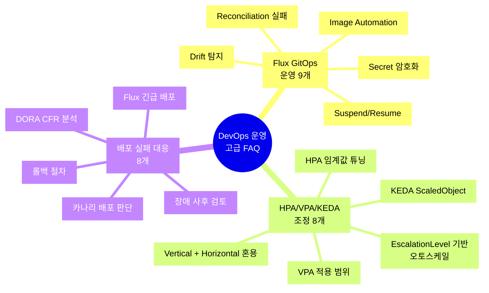
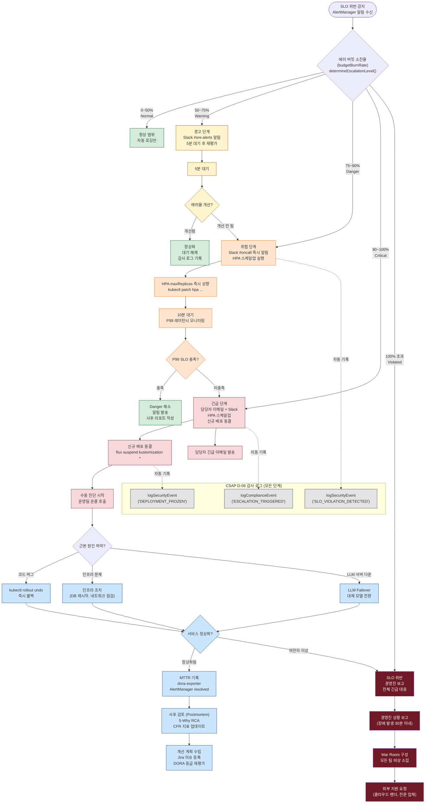

# DevOps 운영 고급 FAQ

> 대상: 공공기관 SaaS 플랫폼 DevOps 엔지니어 및 SRE 담당자
> 연관 코드: packages/slo-escalation, packages/dora-exporter
> 최종 수정: 2026-04-13

---

## 목차

- [FAQ 카테고리 개요](#faq-카테고리-개요)
- [카테고리 A: Flux GitOps 운영 FAQ](#카테고리-a-flux-gitops-운영-faq-9개)
- [카테고리 B: HPA/VPA/KEDA 조정 FAQ](#카테고리-b-hpavpakeda-조정-faq-8개)
- [카테고리 C: 배포 실패 대응 FAQ](#카테고리-c-배포-실패-대응-faq-8개)
- [장애 에스컬레이션 결정 트리](#장애-에스컬레이션-결정-트리)

---

## FAQ 카테고리 개요



---

## 카테고리 A: Flux GitOps 운영 FAQ 9개

### A-1. Flux Reconciliation이 실패했습니다. 어떻게 진단하나요?

**짧은 답변**: `flux get all` → 에러 메시지 확인 → 원인별 처리

**상세 설명**

Flux Reconciliation 실패는 크게 4가지 원인으로 나뉩니다.

첫 번째, GitRepository 연결 오류 (Gitea 인증 실패 또는 네트워크 문제)
두 번째, Kustomization 적용 오류 (잘못된 YAML, CRD 미설치 등)
세 번째, HelmRelease 실패 (차트 버전 없음, 값 오류 등)
네 번째, 의존성 미충족 (A가 B에 의존하는데 B가 준비 안 됨)

**진단 명령어**

```bash
# 전체 Flux 리소스 상태 확인
flux get all -n flux-system

# GitRepository 상태 상세 확인
flux get sources git -n flux-system

# Kustomization 실패 로그 확인
flux get kustomizations -n flux-system
kubectl describe kustomization public-saas -n flux-system

# HelmRelease 실패 원인 확인
flux get helmreleases -n default
kubectl describe helmrelease ai-service -n default

# Flux 컨트롤러 로그 직접 확인
kubectl logs -n flux-system deploy/source-controller -f
kubectl logs -n flux-system deploy/kustomize-controller -f
kubectl logs -n flux-system deploy/helm-controller -f
```

**일반적인 에러 메시지와 해결책**

```bash
# 에러: "authentication required"
# 원인: Gitea SSH 키 또는 토큰 만료
kubectl get secret flux-gitea-auth -n flux-system -o yaml
# → secret.data.password 값 디코딩 후 유효성 확인
kubectl create secret generic flux-gitea-auth \
  --from-literal=username=flux-bot \
  --from-literal=password=NEW_TOKEN \
  -n flux-system --dry-run=client -o yaml | kubectl apply -f -

# 에러: "Health check failed after 3m0s"
# 원인: 배포된 Pod가 Ready 상태가 되지 않음
kubectl get pods -n default | grep -v Running
kubectl describe pod FAILED_POD_NAME -n default

# 에러: "CRD not found"
# 원인: Kustomization이 CRD보다 먼저 적용됨
# 해결: Kustomization에 dependsOn 추가
kubectl patch kustomization app-kustomization \
  -n flux-system \
  --type=merge \
  -p '{"spec":{"dependsOn":[{"name":"crds-kustomization"}]}}'
```

---

### A-2. Flux Reconciliation을 일시 중지하고 싶습니다. 어떻게 하나요?

**짧은 답변**: `flux suspend` 명령어로 일시 중지, `flux resume`으로 재개

**상세 설명**

운영 중 긴급 패치, 수동 조작 테스트, 점검 작업 시 Flux가 Git 상태로 되돌리는 것을 막아야 합니다. `flux suspend`는 Flux 컨트롤러가 해당 리소스를 무시하도록 합니다.

**명령어 예시**

```bash
# GitRepository suspend (모든 하위 Kustomization에 영향)
flux suspend source git public-saas -n flux-system

# 특정 Kustomization만 suspend
flux suspend kustomization ai-service -n flux-system

# HelmRelease suspend
flux suspend helmrelease ai-service -n default

# suspend 상태 확인
flux get kustomizations -n flux-system
# → READY=False, MESSAGE="Suspended" 표시

# 재개 (작업 완료 후)
flux resume kustomization ai-service -n flux-system
flux resume source git public-saas -n flux-system
```

**suspend 사용 시 주의사항**

suspend 상태에서는 Git에 변경사항을 push해도 자동 적용이 되지 않습니다. resume 후에는 즉시 reconciliation이 실행되므로, resume 전에 현재 클러스터 상태와 Git 상태가 일치하는지 확인해야 합니다. 일치하지 않으면 resume 직후 Flux가 Git 상태로 강제 복구합니다.

```bash
# resume 전 drift 확인
kubectl diff -f path/to/manifests/

# 강제 즉시 reconcile
flux reconcile kustomization ai-service -n flux-system --with-source
```

---

### A-3. Flux가 감지하지 못하는 Drift가 발생했습니다. 어떻게 탐지하나요?

**짧은 답변**: Flux는 기본적으로 drift를 탐지하고 복구합니다. 탐지 안 되는 경우는 force-apply 또는 ownerReference 문제일 가능성이 높습니다.

**상세 설명**

Flux의 drift 탐지는 Git에 정의된 상태와 클러스터 실제 상태를 비교합니다. 하지만 일부 상황에서 Flux가 drift를 인식하지 못합니다.

경우 1: `kubectl edit`으로 직접 수정한 경우 — Flux가 다음 reconcile 주기(기본 1분)에 되돌립니다.

경우 2: 외부 Admission Controller(Kyverno 등)가 리소스를 수정한 경우 — Flux는 자신이 적용한 것과 실제 클러스터 상태가 다르면 drift로 간주합니다.

경우 3: HPA가 레플리카 수를 변경한 경우 — Deployment의 replicas를 HPA가 관리하면, Flux와 충돌합니다.

```bash
# Kustomization의 drift 상태 확인
kubectl describe kustomization public-saas -n flux-system | grep -A 20 "Status:"

# Force reconcile로 강제 동기화
flux reconcile kustomization public-saas --force -n flux-system

# HPA-Flux 충돌 방지: Flux Kustomization에서 replicas 제외
# kustomization.yaml 수정
patches:
  - patch: |
      - op: remove
        path: /spec/replicas
    target:
      kind: Deployment
      name: ai-service
```

**drift 탐지 알림 설정**

```yaml
# Flux Alert — drift 탐지 시 Slack 알림
apiVersion: notification.toolkit.fluxcd.io/v1beta3
kind: Alert
metadata:
  name: drift-alert
  namespace: flux-system
spec:
  providerRef:
    name: slack-provider
  eventSeverity: info
  eventSources:
    - kind: Kustomization
      name: "*"
  inclusionList:
    - ".*drift.*"
    - ".*diverged.*"
```

---

### A-4. Image Automation이 동작하지 않습니다. 원인과 해결책은?

**짧은 답변**: ImagePolicy → ImageUpdateAutomation 순서로 확인. 레지스트리 인증 또는 Git 쓰기 권한 문제일 가능성이 높습니다.

**상세 설명**

Flux Image Automation은 새 컨테이너 이미지가 레지스트리에 Push되면 자동으로 Git 저장소의 이미지 태그를 업데이트합니다. 동작하지 않을 때의 진단 순서입니다.

```bash
# 1단계: ImageRepository 상태 확인 (레지스트리 접근 가능 여부)
kubectl get imagerepository -n flux-system
kubectl describe imagerepository ai-service -n flux-system
# → LastScanTime이 갱신되는지 확인

# 2단계: ImagePolicy 상태 확인 (최신 이미지 태그 선택 규칙)
kubectl get imagepolicy -n flux-system
kubectl describe imagepolicy ai-service-latest -n flux-system
# → LatestImage 필드가 정확한지 확인

# 3단계: ImageUpdateAutomation 상태 확인
kubectl get imageupdateautomation -n flux-system
kubectl describe imageupdateautomation flux-automation -n flux-system
# → LastAutomationRunTime 확인

# 4단계: Git 커밋 권한 확인
kubectl get secret flux-git-auth -n flux-system -o yaml | base64 -d
# → Gitea 봇 계정의 Push 권한 확인
```

**이미지 태그 마커 확인**

```yaml
# deployment.yaml에 마커 주석이 있어야 자동 업데이트됨
spec:
  template:
    spec:
      containers:
        - name: ai-service
          image: registry.internal.go.kr/public-saas/ai-service:v1.5.0 # {"$imagepolicy": "flux-system:ai-service-latest"}
```

마커 주석(`{"$imagepolicy": "flux-system:ai-service-latest"}`)이 없으면 Image Automation이 동작하지 않습니다.

---

### A-5. Flux로 관리하는 Secret을 암호화하려면 어떻게 하나요?

**짧은 답변**: SOPS + Age 암호화로 Git에 암호화된 Secret을 저장하고, Flux Decryption 설정으로 자동 복호화합니다.

**상세 설명**

Git에 평문 Secret을 저장하면 감리 결함입니다. SOPS(Secret OPerationS)는 Secret을 암호화한 채로 Git에 저장하고, Flux가 적용 시 자동 복호화합니다.

```bash
# Age 키 생성 (1회)
age-keygen -o age.key
# Public key: age1xxxxxx...

# Secret 암호화
kubectl create secret generic app-secret \
  --from-literal=DB_PASSWORD=secure-password \
  --dry-run=client -o yaml | \
  sops --age=age1xxxxxx... --encrypt /dev/stdin > secret-encrypted.yaml

# Git에 암호화된 Secret 저장
git add secret-encrypted.yaml
git commit -m "feat: 앱 시크릿 암호화 추가"
git push

# Flux Decryption 설정
kubectl create secret generic sops-age \
  --from-file=age.key \
  -n flux-system

kubectl patch kustomization public-saas \
  -n flux-system \
  --type=merge \
  -p '{
    "spec": {
      "decryption": {
        "provider": "sops",
        "secretRef": {
          "name": "sops-age"
        }
      }
    }
  }'
```

---

### A-6. Flux HelmRelease 업그레이드가 실패하고 롤백이 안 됩니다. 어떻게 복구하나요?

**짧은 답변**: `flux suspend` → `helm rollback` 수동 실행 → `flux resume`

```bash
# 1. HelmRelease suspend (Flux가 개입하지 않도록)
flux suspend helmrelease ai-service -n default

# 2. Helm 히스토리 확인
helm history ai-service -n default

# 3. 특정 버전으로 수동 롤백
helm rollback ai-service 5 -n default  # 5번 리비전으로 복구

# 4. 롤백 성공 확인
kubectl rollout status deployment/ai-service -n default

# 5. Git의 HelmRelease 값도 이전 버전으로 되돌리기
git revert HEAD  # 또는 git reset

# 6. Flux resume
flux resume helmrelease ai-service -n default
```

---

### A-7. Flux Notification이 작동하지 않습니다. Slack 알림이 오지 않아요.

**짧은 답변**: Provider 설정 → Alert 설정 → Slack URL 유효성 순서로 확인합니다.

```bash
# Provider 상태 확인
kubectl get providers -n flux-system
kubectl describe provider slack-provider -n flux-system

# Provider 시크릿 확인 (Slack Webhook URL)
kubectl get secret slack-webhook-url -n flux-system -o yaml | \
  awk '/url:/{print $2}' | base64 -d
# → https://hooks.slack.com/services/... 형식이어야 함

# Alert 상태 확인
kubectl get alerts -n flux-system

# 테스트 이벤트 발생시키기
flux reconcile kustomization public-saas --force -n flux-system
# → 강제 reconcile 후 Slack 알림 확인
```

---

### A-8. Flux가 GitOps 동기화를 너무 자주 수행합니다. 주기를 늘리려면?

**짧은 답변**: GitRepository와 Kustomization의 `spec.interval`을 조정합니다.

```yaml
# GitRepository: Git 폴링 주기 변경 (기본 1분 → 5분)
apiVersion: source.toolkit.fluxcd.io/v1
kind: GitRepository
metadata:
  name: public-saas
  namespace: flux-system
spec:
  interval: 5m  # 5분마다 Git 변경 확인
  url: ssh://gitea.internal/devops/k8s-manifests
  ref:
    branch: main

---
# Kustomization: 적용 주기 변경 (기본 10분 → 30분)
apiVersion: kustomize.toolkit.fluxcd.io/v1
kind: Kustomization
metadata:
  name: public-saas
  namespace: flux-system
spec:
  interval: 30m  # 30분마다 drift 확인 및 적용
  sourceRef:
    kind: GitRepository
    name: public-saas
```

운영 환경에서는 5~30분 간격을 권장합니다. 너무 짧으면 API 서버 부하, 너무 길면 drift 방치 시간이 길어집니다.

---

### A-9. Flux가 특정 네임스페이스만 관리하게 제한할 수 있나요?

**짧은 답변**: Kustomization의 `spec.targetNamespace`와 ServiceAccount 권한으로 범위를 제한합니다.

```yaml
# 특정 네임스페이스에만 적용되는 Kustomization
apiVersion: kustomize.toolkit.fluxcd.io/v1
kind: Kustomization
metadata:
  name: tenant-a-workloads
  namespace: flux-system
spec:
  interval: 5m
  targetNamespace: tenant-a  # 이 네임스페이스에만 적용
  sourceRef:
    kind: GitRepository
    name: tenant-a-repo
  serviceAccountName: tenant-a-flux-sa  # 제한된 권한의 SA 사용

---
# tenant-a 전용 ServiceAccount (다른 네임스페이스 접근 불가)
apiVersion: rbac.authorization.k8s.io/v1
kind: RoleBinding
metadata:
  name: tenant-a-flux-binding
  namespace: tenant-a
subjects:
  - kind: ServiceAccount
    name: tenant-a-flux-sa
    namespace: flux-system
roleRef:
  kind: ClusterRole
  name: cluster-admin  # tenant-a 네임스페이스 내에서만 admin
  apiGroup: rbac.authorization.k8s.io
```

---

## 카테고리 B: HPA/VPA/KEDA 조정 FAQ 8개

### B-1. SLO 위반 시 오토스케일은 어떻게 트리거되나요? EscalationLevel과의 관계는?

**짧은 답변**: SLOEscalationController의 EscalationLevel이 Danger/Critical이 되면 HPA minReplicas를 자동으로 상향합니다.

**상세 설명**

`packages/slo-escalation/src/escalation-controller.ts`의 `determineEscalationLevel` 함수는 에러 버짓 소진율(budgetBurnRate)에 따라 5단계 레벨을 반환합니다.

```typescript
// escalation-controller.ts에서 실제 사용 중인 임계값
export function determineEscalationLevel(budgetBurnRate: number): EscalationLevel {
  if (budgetBurnRate <= 50)  return EscalationLevel.Normal;   // 정상
  if (budgetBurnRate <= 75)  return EscalationLevel.Warning;  // 경고
  if (budgetBurnRate <= 90)  return EscalationLevel.Danger;   // 위험
  if (budgetBurnRate <= 100) return EscalationLevel.Critical; // 긴급
  return EscalationLevel.Violated;                             // SLO 위반
}
```

각 레벨에서의 오토스케일 행동을 정의합니다.

```typescript
// escalation-controller.ts의 EscalationPolicy 예시
const aiServicePolicy: EscalationPolicy = {
  name: 'ai-service-slo',
  service: 'ai-service',
  levels: [
    {
      level: EscalationLevel.Warning,      // budgetBurnRate 50~75%
      budgetBurnRateMin: 50,
      budgetBurnRateMax: 75,
      contacts: [{ name: 'sre-team', channel: NotificationChannel.Slack, target: '#sre-alerts' }],
      waitMinutes: 5,
      actions: [],  // 알림만
    },
    {
      level: EscalationLevel.Danger,       // budgetBurnRate 75~90%
      budgetBurnRateMin: 75,
      budgetBurnRateMax: 90,
      contacts: [{ name: 'on-call', channel: NotificationChannel.Slack, target: '#oncall' }],
      waitMinutes: 0,
      actions: ['scale-up-hpa'],  // HPA 스케일업
    },
    {
      level: EscalationLevel.Critical,     // budgetBurnRate 90~100%
      budgetBurnRateMin: 90,
      budgetBurnRateMax: 100,
      contacts: [{ name: 'manager', channel: NotificationChannel.Email, target: 'manager@saas.go.kr' }],
      waitMinutes: 0,
      actions: ['scale-up-hpa', 'freeze-deployments'],  // HPA + 배포 동결
    },
  ],
};
```

`actions: ['scale-up-hpa']`는 런북 서비스가 해당 서비스의 HPA minReplicas를 임시 상향하는 것을 의미합니다.

```bash
# scale-up-hpa 런북 스크립트 예시
CURRENT_MIN=$(kubectl get hpa ai-service -n default -o jsonpath='{.spec.minReplicas}')
NEW_MIN=$((CURRENT_MIN + 2))
kubectl patch hpa ai-service -n default \
  --type=merge \
  -p "{\"spec\":{\"minReplicas\":${NEW_MIN}}}"
echo "HPA minReplicas: ${CURRENT_MIN} → ${NEW_MIN}"
```

---

### B-2. HPA의 CPU 임계값을 어떻게 설정해야 SLO를 지킬 수 있나요?

**짧은 답변**: 부하 테스트로 CPU 사용률과 P99 레이턴시의 관계를 측정한 뒤, P99 SLO 위반 직전의 CPU 사용률을 목표값으로 설정합니다.

**상세 설명**

HPA CPU 임계값을 너무 낮게 설정하면 과도한 스케일아웃으로 비용이 증가합니다. 너무 높게 설정하면 CPU 포화 상태에서 SLO를 위반합니다.

```bash
# 현재 CPU 사용률과 응답시간 상관관계 확인
# Grafana 쿼리: CPU 사용률 vs P99 레이턴시
kubectl top pods -n default -l app=ai-service

# 부하 테스트 중 CPU 임계점 찾기
# k6로 점진적 부하 증가
k6 run \
  --vus 10 \
  --duration 5m \
  --env BASE_URL=https://api.saas.go.kr \
  load-test.js
```

```yaml
# HPA 설정 예시 — ai-service
apiVersion: autoscaling/v2
kind: HorizontalPodAutoscaler
metadata:
  name: ai-service-hpa
  namespace: default
  annotations:
    description: |
      CPU 70% 임계값: 부하테스트에서 70% CPU = P99 약 1.2초 확인.
      SLO(3초) 여유 있음. 실제 P99 SLO 위반은 CPU 85% 이상에서 발생.
      안전 마진 15%를 두고 70%로 설정.
spec:
  scaleTargetRef:
    apiVersion: apps/v1
    kind: Deployment
    name: ai-service
  minReplicas: 2   # SLO 보장을 위한 최소 2대 (N+1 이중화)
  maxReplicas: 10  # 비용 상한선
  metrics:
    - type: Resource
      resource:
        name: cpu
        target:
          type: Utilization
          averageUtilization: 70  # 70% 초과 시 스케일아웃
    - type: Resource
      resource:
        name: memory
        target:
          type: Utilization
          averageUtilization: 80  # 메모리도 함께 모니터링
  behavior:
    scaleUp:
      stabilizationWindowSeconds: 60  # 1분 안정화 (노이즈 방지)
      policies:
        - type: Pods
          value: 2        # 한 번에 최대 2대씩 추가
          periodSeconds: 60
    scaleDown:
      stabilizationWindowSeconds: 300  # 5분 안정화 (조기 스케일다운 방지)
      policies:
        - type: Pods
          value: 1        # 한 번에 1대씩만 감소
          periodSeconds: 120
```

---

### B-3. KEDA로 큐 길이 기반 스케일링을 설정하려면 어떻게 하나요?

**짧은 답변**: KEDA ScaledObject에 Redis 또는 메시지 큐 트리거를 설정합니다. `ai-service`의 경우 에이전트 작업 큐 길이를 지표로 사용합니다.

**상세 설명**

에이전트 실행처럼 처리 시간이 긴 작업은 HPA의 CPU 기반 스케일링보다 KEDA의 큐 길이 기반 스케일링이 더 효과적입니다. CPU가 100%가 되기 전에 큐가 쌓이기 시작하면 미리 스케일아웃합니다.

```yaml
# KEDA ScaledObject — Redis 큐 기반 스케일링
apiVersion: keda.sh/v1alpha1
kind: ScaledObject
metadata:
  name: ai-agent-worker-scaler
  namespace: default
  annotations:
    description: |
      에이전트 작업 큐(Redis List: agent:queue)가 10개 이상이면 스케일아웃.
      큐 1개당 워커 1대 유지 (최소 2대 ~ 최대 20대).
      KEDA가 HPA보다 우선: ScaledObject 존재 시 HPA 자동 생성됨.
spec:
  scaleTargetRef:
    name: ai-agent-worker
  minReplicaCount: 2   # 큐가 비어도 최소 2대 유지
  maxReplicaCount: 20  # 최대 20대
  pollingInterval: 15  # 15초마다 큐 길이 확인
  cooldownPeriod: 300  # 5분 쿨다운 (급격한 스케일다운 방지)
  triggers:
    - type: redis
      metadata:
        address: redis-sentinel.default.svc.cluster.local:26379
        listName: "agent:queue"
        listLength: "10"   # 큐 10개당 Pod 1대
        activationListLength: "1"  # 큐 1개 이상이면 스케일 시작
      authenticationRef:
        name: redis-auth
---
# Redis 인증 정보
apiVersion: keda.sh/v1alpha1
kind: TriggerAuthentication
metadata:
  name: redis-auth
  namespace: default
spec:
  secretTargetRef:
    - parameter: password
      name: redis-credentials
      key: password
```

```bash
# KEDA ScaledObject 상태 확인
kubectl get scaledobjects -n default
kubectl describe scaledobject ai-agent-worker-scaler -n default

# 현재 메트릭 확인
kubectl get hpa -n default  # KEDA가 자동 생성한 HPA 확인

# 큐 길이 수동 확인
kubectl exec -it redis-0 -n default -- redis-cli LLEN agent:queue
```

---

### B-4. VPA(Vertical Pod Autoscaler)는 언제 사용해야 하나요? HPA와 동시에 사용할 수 있나요?

**짧은 답변**: VPA는 리소스 요청값(request) 최적화에 사용합니다. HPA와 VPA를 동시에 CPU/메모리에 적용하면 충돌이 발생합니다. VPA는 Off 모드 + HPA는 CPU/메모리 타깃으로 사용하거나, 커스텀 메트릭(KEDA)과 VPA를 조합합니다.

**상세 설명**

```yaml
# VPA를 추천 모드로만 사용 (실제 변경은 수동)
apiVersion: autoscaling.k8s.io/v1
kind: VerticalPodAutoscaler
metadata:
  name: ai-service-vpa
  namespace: default
  annotations:
    description: |
      updateMode: Off — VPA는 추천값만 표시, 실제 적용은 수동.
      HPA와 충돌 방지. 추천값 기반으로 Deployment resources를 주기적으로 검토.
spec:
  targetRef:
    apiVersion: apps/v1
    kind: Deployment
    name: ai-service
  updatePolicy:
    updateMode: "Off"  # 추천만 표시, 자동 적용 안 함
  resourcePolicy:
    containerPolicies:
      - containerName: ai-service
        minAllowed:
          cpu: 100m
          memory: 128Mi
        maxAllowed:
          cpu: 4
          memory: 8Gi
```

```bash
# VPA 추천값 확인
kubectl describe vpa ai-service-vpa -n default

# 출력 예시:
# Recommendation:
#   Container Recommendations:
#     Container Name: ai-service
#     Lower Bound:
#       Cpu: 250m
#       Memory: 512Mi
#     Target:                    ← 이 값을 Deployment에 반영 권장
#       Cpu: 500m
#       Memory: 1Gi
#     Upper Bound:
#       Cpu: 2
#       Memory: 4Gi
```

---

### B-5. HPA가 scale-down을 하지 않습니다. Pod가 계속 늘어난 채로 유지됩니다.

**짧은 답변**: `stabilizationWindowSeconds`가 기본 300초(5분)입니다. 5분 동안 메트릭이 임계값 이하로 유지되어야 scale-down됩니다.

```bash
# HPA 현재 상태 확인 (scale-down 억제 이유 확인)
kubectl describe hpa ai-service-hpa -n default

# 출력에서 확인할 항목:
# Events에 "ScaleDown stabilized" 메시지가 있으면 정상
# ScaleDown 조건: 5분간 CPU < 70% 유지

# 강제로 scale-down (주의: SLO 영향 있을 수 있음)
kubectl patch hpa ai-service-hpa \
  -n default \
  --type=merge \
  -p '{
    "spec": {
      "behavior": {
        "scaleDown": {
          "stabilizationWindowSeconds": 60
        }
      }
    }
  }'
```

일반적으로 scale-down을 서두르지 않는 것이 좋습니다. 갑작스러운 트래픽 증가 시 다시 scale-up되는 과정에서 레이턴시가 증가할 수 있습니다.

---

### B-6. EscalationLevel에 따라 HPA maxReplicas를 동적으로 변경할 수 있나요?

**짧은 답변**: SLOEscalationController의 triggerAction에서 kubectl patch 명령을 실행하는 런북을 등록합니다.

**상세 설명**

`escalation-controller.ts`의 `triggerAction` 메서드는 현재 `process.stdout.write`로 로그만 기록합니다. 실제 운영에서는 이 메서드를 확장하여 HPA를 직접 조작합니다.

```typescript
// escalation-controller.ts 확장 — 실제 HPA 조작
private async triggerAction(
  action: string,
  service: string,
  level: EscalationLevel
): Promise<void> {
  if (action === 'scale-up-hpa') {
    const maxReplicasMap: Record<EscalationLevel, number> = {
      [EscalationLevel.Normal]: 5,
      [EscalationLevel.Warning]: 8,
      [EscalationLevel.Danger]: 12,
      [EscalationLevel.Critical]: 20,
      [EscalationLevel.Violated]: 20,
    };

    const newMax = maxReplicasMap[level];
    // kubectl 실행 (또는 Kubernetes API 직접 호출)
    const { execSync } = require('child_process');
    execSync(
      `kubectl patch hpa ${service}-hpa -n default --type=merge ` +
      `--patch '{"spec":{"maxReplicas":${newMax}}}'`
    );
  }
}
```

---

### B-7. KEDA와 HPA를 동시에 사용하면 어떤 일이 발생하나요?

**짧은 답변**: KEDA ScaledObject를 생성하면 KEDA가 내부적으로 HPA를 자동 생성합니다. 기존 HPA가 있으면 충돌이 발생하므로 기존 HPA를 삭제해야 합니다.

```bash
# KEDA ScaledObject 생성 전 기존 HPA 확인
kubectl get hpa -n default

# 기존 HPA 삭제 (KEDA가 대체)
kubectl delete hpa ai-service-hpa -n default

# KEDA ScaledObject 생성
kubectl apply -f keda-scaledobject.yaml

# KEDA가 자동 생성한 HPA 확인 (keda- 접두사)
kubectl get hpa -n default
# → keda-hpa-ai-agent-worker-scaler 와 같은 이름으로 생성됨
```

---

### B-8. 새벽 점검 시간(00:00~06:00)에 스케일을 줄이고 싶습니다. KEDA Cron 트리거는 어떻게 설정하나요?

**짧은 답변**: KEDA CronJob 트리거를 사용하여 시간대별 minReplicas를 다르게 설정합니다.

```yaml
# KEDA Cron 기반 스케줄링
apiVersion: keda.sh/v1alpha1
kind: ScaledObject
metadata:
  name: ai-service-schedule-scaler
  namespace: default
spec:
  scaleTargetRef:
    name: ai-service
  minReplicaCount: 1
  maxReplicaCount: 10
  triggers:
    # 업무 시간 (평일 09:00~18:00): 최소 4대
    - type: cron
      metadata:
        timezone: "Asia/Seoul"
        start: "0 9 * * 1-5"   # 평일 오전 9시 시작
        end: "0 18 * * 1-5"    # 평일 오후 6시 종료
        desiredReplicas: "4"
    # 야간/주말: 최소 1대 (운영 중단은 안 됨)
    - type: cron
      metadata:
        timezone: "Asia/Seoul"
        start: "0 18 * * 1-5"  # 평일 오후 6시 ~ 다음 날 오전 9시
        end: "0 9 * * 1-5"
        desiredReplicas: "1"
```

---

## 카테고리 C: 배포 실패 대응 FAQ 8개

### C-1. DORA 변경 실패율(CFR)이 높아졌습니다. 어떻게 분석하나요?

**짧은 답변**: `dora-exporter`의 `changeFailureRate` 메트릭을 분석하고, `ChangeFailureDetector`가 어떤 커밋을 실패로 분류했는지 확인합니다.

**상세 설명**

`packages/dora-exporter/src/index.ts`에서 정의된 DORA 메트릭을 살펴봅니다.

```typescript
// dora-exporter/src/index.ts — 실제 구현 코드
const changeFailureRate = new Gauge({
  name: 'dora_change_failure_rate',
  help: '변경 실패율 (0.0 ~ 1.0)',
  labelNames: ['team', 'service'] as const,
  registers: [register],
});

// Gitea webhook에서 변경 실패 감지
const isFailure = changeFailureDetector.detect(payload.commits);
if (isFailure) {
  changeFailureDetector.recordFailure(team, service);
} else {
  changeFailureDetector.recordSuccess(team, service);
}
const rate = changeFailureDetector.getRate(team, service);
changeFailureRate.set({ team, service }, rate);
```

`ChangeFailureDetector.detect(commits)`는 커밋 메시지에 `hotfix`, `revert`, `rollback`, `fix: critical` 등의 키워드가 있으면 실패로 판단합니다.

```bash
# CFR 현황 확인 (Prometheus 쿼리)
curl -s "http://dora-exporter:9170/metrics" | grep dora_change_failure_rate

# DORA 분류 강제 실행 (최신 등급 계산)
curl -X POST http://dora-exporter:9170/classify

# 주간 보고서 생성
curl http://dora-exporter:9170/report/weekly

# 감사 증거 형식으로 보고서 생성 (CSAP 제출용)
curl "http://dora-exporter:9170/report/weekly?format=evidence" | jq .
```

**CFR 개선 전략**

DORA Elite 팀의 CFR 기준은 5% 미만입니다. CFR이 높으면 다음 조치를 취합니다.

단계 1: 최근 30일 hotfix/revert 커밋 분석 → 공통 원인 파악
단계 2: 해당 컴포넌트의 테스트 커버리지 확인 → 80% 미달이면 테스트 추가
단계 3: 카나리 배포 도입 → 10% 트래픽 → 1시간 모니터링 → 100% 전환
단계 4: Feature Flag 활성화 → 코드 배포와 기능 활성화 분리

---

### C-2. 배포 후 서비스가 다운됩니다. 즉시 롤백 절차는?

**짧은 답변**: Kubernetes 롤아웃 롤백 → Flux suspend → 원인 분석 → 코드 revert → Flux resume 순서로 진행합니다.

**롤백 절차 (분 단위)**

```bash
# [T+0분] 장애 감지 — Alertmanager에서 알림 수신

# [T+1분] 즉시 롤백 (Kubernetes 수준)
kubectl rollout undo deployment/ai-service -n default
kubectl rollout status deployment/ai-service -n default --timeout=3m

# [T+2분] 롤백 성공 확인
kubectl get pods -n default -l app=ai-service
# → 모든 Pod가 Running 상태여야 함

# [T+2분] Flux suspend (Git push로 재배포 방지)
flux suspend kustomization ai-service -n flux-system
flux suspend helmrelease ai-service -n default

# [T+3분] 서비스 정상화 확인
curl -f https://api.saas.go.kr/health
# → 200 OK 확인

# [T+5분] DORA 장애 기록 (AlertManager webhook으로 자동 기록됨)
# dora-exporter가 AlertManager 알림을 수신하여 MTTR 추적 시작

# [T+30분] 원인 분석 시작
kubectl logs deployment/ai-service -n default --previous | tail -100

# [T+2시간] 코드 수정 + revert 커밋
git revert HEAD~1  # 문제 커밋 revert
git push origin main

# [T+2.5시간] Flux resume (수정된 코드 배포)
flux resume kustomization ai-service -n flux-system

# MTTR 기록 (AlertManager resolved 이벤트로 자동 기록)
# dora-exporter: dora_mttr_seconds 업데이트됨
```

**자동 롤백 설정 (Flux HelmRelease)**

```yaml
# HelmRelease에 자동 롤백 설정
apiVersion: helm.toolkit.fluxcd.io/v2
kind: HelmRelease
metadata:
  name: ai-service
spec:
  upgrade:
    remediation:
      retries: 3
      strategy: rollback  # 업그레이드 3회 실패 시 자동 롤백
  rollback:
    cleanupOnFail: true
    timeout: 5m
```

---

### C-3. 카나리 배포 중 에러율이 상승했습니다. 카나리를 즉시 중단해야 하나요?

**짧은 답변**: DORA CFR과 에러율을 동시에 확인합니다. 에러율 > 5% 이상이거나 P99 레이턴시가 SLO 위반이면 즉시 롤백합니다.

**카나리 배포 판단 기준**

```
카나리 판단 매트릭스:

에러율     | 레이턴시P99  | CFR    | 판단
---------- | ------------ | ------ | ------
< 1%       | SLO 이내     | 개선   | 계속 진행
1% ~ 5%    | SLO 이내     | 유지   | 30분 더 관찰
> 5%       | SLO 이내     | 증가   | 즉시 롤백
< 1%       | SLO 위반     | 유지   | 즉시 롤백
> 5%       | SLO 위반     | 증가   | 즉시 롤백
```

```bash
# 카나리 에러율 확인 (Traefik 메트릭)
# Prometheus 쿼리
curl -G "http://prometheus:9090/api/v1/query" \
  --data-urlencode 'query=
    sum(rate(traefik_service_requests_total{
      service="ai-service-canary@kubernetes",
      code=~"5.."
    }[5m]))
    /
    sum(rate(traefik_service_requests_total{
      service="ai-service-canary@kubernetes"
    }[5m]))
  '

# 카나리 즉시 롤백 (Traefik WeightedRRBalancer 조정)
kubectl patch ingressrouteudp canary-ingress \
  --type=merge \
  -p '{"spec":{"routes":[{"services":[{"name":"ai-service","weight":100},{"name":"ai-service-canary","weight":0}]}]}}'
```

---

### C-4. Flux를 우회하여 긴급 배포가 필요합니다. 어떻게 하나요?

**짧은 답변**: Flux suspend → 직접 kubectl apply → 즉각 CHANGELOG 기록 → Git push 후 Flux resume 순서입니다. 긴급 배포도 반드시 감사 로그에 남겨야 합니다.

```bash
# [T+0] Flux suspend (Git push로 되돌림 방지)
flux suspend kustomization ai-service -n flux-system

# [T+1] 긴급 패치 배포 (kubectl 직접 적용)
kubectl set image deployment/ai-service \
  ai-service=registry.internal.go.kr/public-saas/ai-service:hotfix-v1.5.1 \
  -n default
kubectl rollout status deployment/ai-service -n default

# [T+3] 감사 기록 (CSAP D-06 — 변경 사유 기록 필수)
cat >> .claude/audit.jsonl << 'EOF'
{"timestamp":"2026-04-13T03:30:00Z","actor":"system:ops-engineer","action":"EMERGENCY_DEPLOY","target":"ai-service","metadata":{"reason":"CVE-2026-XXXX critical vulnerability","image":"hotfix-v1.5.1","authorizedBy":"security-team"}}
EOF

# [T+5] DORA 핫픽스 이벤트 기록 (자동: Git push 시 dora-exporter 수신)
# 수동 기록 방법:
curl -X POST http://dora-exporter:9170/webhook/gitea \
  -H 'Content-Type: application/json' \
  -d '{
    "ref": "refs/tags/hotfix-v1.5.1",
    "after": "abc123def456",
    "repository": {"full_name": "devops/ai-service"},
    "commits": [{"id":"abc123","timestamp":"2026-04-13T03:30:00Z","message":"hotfix: CVE-2026-XXXX critical patch"}],
    "pusher": {"login": "ops-engineer"}
  }'

# [T+30] Git에 패치 머지 + Flux resume
git cherry-pick HOTFIX_COMMIT
git push origin main
flux resume kustomization ai-service -n flux-system
```

---

### C-5. 배포 후 Pod가 CrashLoopBackOff 상태입니다. 원인을 빠르게 파악하는 방법은?

**짧은 답변**: 로그 → 종료 코드 → 환경 변수 → 리소스 순서로 확인합니다.

```bash
# 1. 종료 코드 확인
kubectl describe pod FAILED_POD -n default | grep -A 5 "Last State"
# Exit Code:
#   0: 정상 종료 (설정 오류 가능성)
#   1: 일반 오류
#   137: OOMKilled (메모리 부족)
#   143: SIGTERM (강제 종료)

# 2. 최근 로그 확인
kubectl logs FAILED_POD -n default --previous --tail=50

# 3. 환경 변수 누락 확인 (가장 흔한 원인)
kubectl exec -it FAILED_POD -n default -- env | sort | grep -E "(DB|REDIS|KEY|SECRET)"
# INTERNAL_SERVICE_KEY 누락 시 서비스 시작 거부 (routes.ts 로직)

# 4. 리소스 제한 확인 (OOMKilled 시)
kubectl top pod FAILED_POD -n default
kubectl get pod FAILED_POD -n default -o jsonpath='{.spec.containers[0].resources}'

# 5. 시크릿 마운트 확인
kubectl get pod FAILED_POD -n default -o yaml | grep -A 20 "volumes:"
kubectl get secret REQUIRED_SECRET -n default  # 시크릿 존재 여부
```

**CrashLoopBackOff 자주 원인별 해결책**

| 원인 | 진단 | 해결책 |
|---|---|---|
| 환경 변수 누락 | `kubectl describe pod` Events | Kubernetes Secret/ConfigMap 추가 |
| 시크릿 마운트 실패 | `MountVolume.SetUp failed` | Secret 이름/키 확인 |
| OOMKilled | `Exit Code: 137` | `resources.limits.memory` 상향 |
| 포트 충돌 | `address already in use` | 포트 설정 확인 |
| 마이그레이션 실패 | DB 연결 오류 로그 | DB 연결 정보 확인 |

---

### C-6. 배포 파이프라인이 느립니다. DORA 리드타임을 개선하는 방법은?

**짧은 답변**: dora-exporter의 `dora_lead_time_seconds` 메트릭으로 병목 단계를 파악하고, 빌드 캐싱과 병렬 테스트를 적용합니다.

**상세 설명**

`packages/dora-exporter/src/index.ts`의 `leadTimeSeconds` 히스토그램이 측정하는 구간입니다.

```typescript
// dora-exporter/src/index.ts — 실제 구현 코드
const leadTimeSeconds = new Histogram({
  name: 'dora_lead_time_seconds',
  help: '변경 리드타임 - 첫 커밋에서 프로덕션 배포까지 (초)',
  labelNames: ['team', 'service'] as const,
  buckets: [60, 300, 900, 1800, 3600, 7200, 14400, 28800, 86400, 604800],
  registers: [register],
});

// 리드타임 = 배포 시각 - 첫 커밋 시각
const firstCommitTime = getFirstCommitTimestamp(payload.commits);
if (firstCommitTime) {
  const deployTime = Date.now();
  const leadTime = leadTimeCalculator.calculate(firstCommitTime, deployTime);
  leadTimeSeconds.observe({ team, service }, leadTime);
}
```

리드타임 구간별 최적화 방법입니다.

```
전체 리드타임 분석:
개발 시간     [커밋 ~ PR 생성]    → 측정 불가 (개발 속도)
코드 리뷰     [PR 생성 ~ 승인]    → 2인 이상 리뷰어 지정, SLA 4시간
CI 파이프라인 [push ~ 빌드 완료]  → Docker 레이어 캐싱, pnpm 캐싱 (1분 목표)
배포 대기     [CI 완료 ~ Flux]    → Flux 폴링 주기 줄이기 (5분 → 1분)
배포 실행     [Flux ~ Pod Ready]  → HPA minReplicas 여유 유지
```

```yaml
# Gitea CI — pnpm 캐싱으로 빌드 시간 단축
steps:
  - name: pnpm 캐시 복원
    uses: actions/cache@v3
    with:
      path: ~/.pnpm-store
      key: pnpm-${{ hashFiles('pnpm-lock.yaml') }}

  - name: Docker 레이어 캐싱
    uses: docker/build-push-action@v5
    with:
      cache-from: type=gha
      cache-to: type=gha,mode=max
```

---

### C-7. 배포 실패율이 반복됩니다. 근본 원인 분석(RCA) 방법은?

**짧은 답변**: DORA 메트릭과 감사 로그를 교차 분석하여 패턴을 찾습니다. 5-Why 기법으로 근본 원인을 파악합니다.

```bash
# DORA 메트릭 트렌드 확인 (최근 30일)
curl "http://dora-exporter:9170/api/trends?period=weekly&count=4" | jq .

# 특정 서비스의 실패 패턴 확인
curl "http://dora-exporter:9170/report/weekly?format=json" | \
  jq '.services["ai-service"] | {cfr: .changeFailureRate, deployCount: .deploymentCount}'

# 감사 로그에서 배포 실패 이벤트 추출
grep '"action":"DEPLOY_FAILED"' .claude/audit.jsonl | \
  jq -r '[.timestamp, .metadata.service, .metadata.reason] | @csv' | \
  sort > /tmp/deploy-failures.csv

# 실패 커밋 공통 패턴 분석
# → "hotfix" 커밋이 많으면 테스트 부족
# → "revert" 커밋이 많으면 리뷰 프로세스 문제
# → 같은 서비스에서 반복되면 해당 서비스 아키텍처 문제
```

**5-Why RCA 템플릿**

```
문제: ai-service 배포 실패율 15% (DORA Low 등급)

Why 1: 왜 배포가 실패하는가?
  → 테스트 환경에서 통과한 코드가 운영에서 실패

Why 2: 왜 테스트 환경과 운영이 다른 결과를 내는가?
  → 환경 변수 차이 (테스트는 mock, 운영은 실제 LLM 서버)

Why 3: 왜 환경 변수 차이가 있는가?
  → staging 환경이 없어 dev → prod 직접 배포

Why 4: 왜 staging 환경이 없는가?
  → 초기 구축 시 비용 절감으로 생략

Why 5: 왜 비용 절감이 QA 환경 생략을 초래했는가?
  → staging 환경 필요성에 대한 의사결정 기준 부재

근본 원인: staging 환경 부재 + 의사결정 기준 없음
해결책: k3s staging 클러스터 구축 + 배포 파이프라인 dev→stg→prod 3단계화
```

---

### C-8. DORA 메트릭 등급이 Low입니다. Elite 등급으로 올리는 로드맵은?

**짧은 답변**: DORA 4대 지표별로 현황 측정 → 목표 설정 → 단계별 개선 계획을 수립합니다. 일반적으로 6~12개월이 소요됩니다.

**DORA 등급 기준 (dora-exporter DORAClassifier 기준)**

| 등급 | 배포 빈도 | 리드타임 | CFR | MTTR |
|---|---|---|---|---|
| Elite | 일 1회 이상 | 1시간 이내 | < 5% | < 1시간 |
| High | 주 1회~일 1회 | 1일 이내 | 5~10% | 1시간 이내 |
| Medium | 월 1회~주 1회 | 1주 이내 | 10~15% | 4시간 이내 |
| Low | 월 1회 미만 | 1달 이상 | > 15% | 1일 초과 |

```bash
# 현재 DORA 등급 확인
curl -X POST http://dora-exporter:9170/classify && \
curl http://dora-exporter:9170/metrics | grep dora_team_level
# 0=Low, 1=Medium, 2=High, 3=Elite
```

**단계별 개선 로드맵**

1단계 (1~2개월): 측정 기반 구축
- dora-exporter를 모든 서비스에 연결
- Gitea webhook + AlertManager webhook 설정
- Grafana DORA 대시보드 완성

2단계 (3~4개월): CFR 감소
- 테스트 커버리지 80% 달성 (Tester 에이전트 활용)
- staging 환경 구축 (dev → stg → prod)
- 카나리 배포 도입 (CFR 5% 미만 목표)

3단계 (5~6개월): 리드타임 단축
- CI 빌드 시간 5분 이내 최적화
- 병렬 테스트 실행
- Feature Flag으로 코드-기능 배포 분리

4단계 (7~12개월): Elite 달성
- 일 10회 이상 배포 자동화
- MTTR 30분 이내 (자동 롤백 + 런북 자동 실행)
- 배포 프리즘 0 (모든 변경이 자동 CI/CD 통과)

---

## 장애 에스컬레이션 결정 트리

### escalation-controller.ts 기반 결정 트리



### EscalationLevel별 대응 요약표

이 표는 `escalation-controller.ts`의 `EscalationLevel`과 실제 운영 대응을 매핑합니다.

| EscalationLevel | budgetBurnRate | 자동 조치 | 알림 채널 | 대기 시간 | 에스컬레이션 대상 |
|---|---|---|---|---|---|
| Normal | 0~50% | 로깅만 | 없음 | - | - |
| Warning | 50~75% | 로깅 + 알림 | Slack #sre-alerts | 5분 | SRE 팀 |
| Danger | 75~90% | HPA 스케일업 | Slack #oncall | 즉시 | 온콜 엔지니어 |
| Critical | 90~100% | HPA 스케일업 + 배포 동결 | Slack + Email | 즉시 | 팀장 |
| Violated | 100% 초과 | 전체 비상 | 모든 채널 | 즉시 | 임원진 |

### 에스컬레이션 이력 조회

```typescript
// escalation-controller.ts — getHistory 메서드 활용
const controller = new SLOEscalationController();

// 전체 에스컬레이션 이력 (최근 100건)
const history = controller.getHistory(undefined, 100);

// ai-service만 필터링
const aiHistory = controller.getHistory('ai-service', 50);

// 이력 분석
const criticalEvents = aiHistory.filter(
  e => e.level === EscalationLevel.Critical ||
       e.level === EscalationLevel.Violated
);

console.log(`지난 24시간 Critical 이상 이벤트: ${criticalEvents.length}건`);
```

### 포스트모템(사후 검토) 템플릿

DORA 메트릭 개선의 핵심은 장애 후 학습입니다. 모든 Critical 이상 장애는 포스트모템을 작성합니다.

```markdown
# 포스트모템: [서비스명] SLO 위반 — [날짜]

## 요약
- 장애 시작: 2026-04-13 03:15 KST
- 복구 완료: 2026-04-13 03:47 KST
- MTTR: 32분 (SLO: 60분 이내 — 충족)
- 영향 범위: ai-service P99 레이턴시 12초 (SLO: 3초)
- 에러 버짓 소진: 87% → Critical 레벨 트리거

## DORA 지표 영향
- CFR: 8% → 11% (이번 장애 포함)
- MTTR: 이번 장애 32분 반영 시 주간 중앙값 28분

## 근본 원인
- LLM 서버 메모리 부족 (OOMKilled)
- VPA 추천값 미반영으로 메모리 limit 과소 설정

## 시간대별 조치
03:15 — Alertmanager 장애 감지, EscalationLevel.Critical 트리거
03:17 — 온콜 엔지니어 Slack 알림 수신
03:20 — kubectl 롤백 시작
03:25 — 롤백 완료, P99 정상화 (2.1초)
03:47 — 모니터링 안정화 확인, 복구 완료

## 재발 방지 조치
1. VPA 추천값 적용 — 메모리 limit 512Mi → 1Gi (1주 내)
2. OOMKilled 경보 추가 (현재 없음) — prometheus rule 추가 (2일 내)
3. LLM 서버 메모리 모니터링 강화 (1주 내)
```

---

*이 문서는 packages/slo-escalation 및 packages/dora-exporter 실제 코드를 기반으로 작성된 운영 실무 가이드입니다.*
*최신 버전: docs/guides/onboarding/11-faq/18-devops-operations-faq.md*
