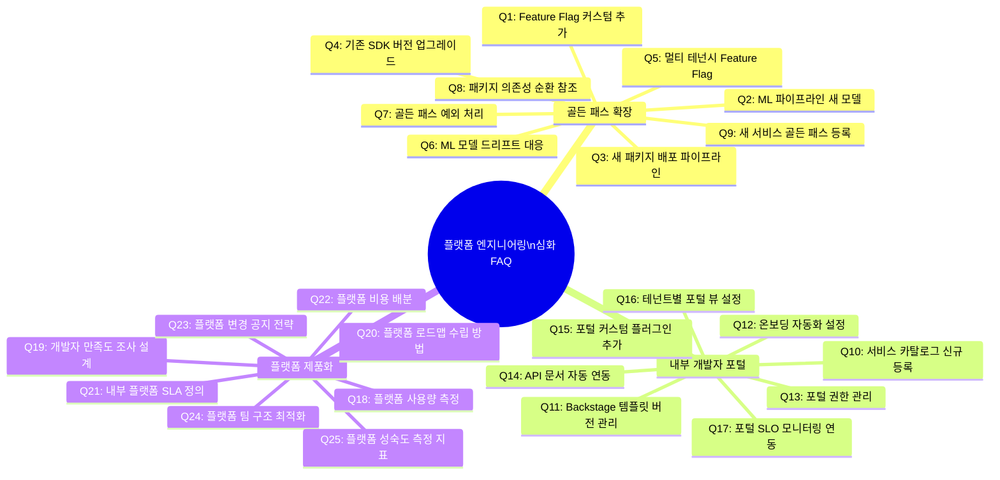
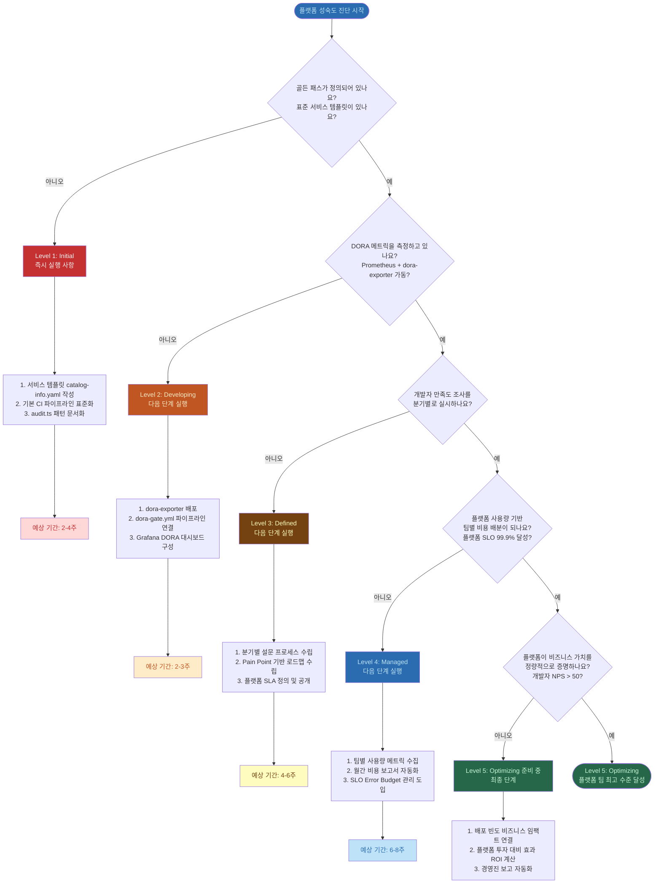

# 플랫폼 엔지니어링 심화 FAQ — 골든 패스 확장, 내부 개발자 포털, 플랫폼 제품화

> Design Ref: MTU-N234 (Feature Flag SDK), MTU-N173 (ML 파이프라인)
> Plan SC: FR-FF.3, FR-ML.4, FR-ML.6
> 대상 독자: 플랫폼 엔지니어, 서비스 개발팀, DevOps 리더
> 난이도: 심화 (플랫폼 엔지니어링 기초 개념 전제)

---

## 목차

1. [플랫폼 엔지니어링 FAQ 맵](#1-플랫폼-엔지니어링-faq-맵)
2. [골든 패스 확장 FAQ (9개)](#2-골든-패스-확장-faq-9개)
3. [내부 개발자 포털 운영 FAQ (8개)](#3-내부-개발자-포털-운영-faq-8개)
4. [플랫폼 제품화 FAQ (8개)](#4-플랫폼-제품화-faq-8개)
5. [플랫폼 팀 운영 성숙도 평가 결정 트리](#5-플랫폼-팀-운영-성숙도-평가-결정-트리)

---

## 1. 플랫폼 엔지니어링 FAQ 맵

이 다이어그램은 25개 FAQ가 어떻게 플랫폼 엔지니어링의 세 가지 핵심 영역으로 분류되는지 보여줍니다.



### 1.1 이 FAQ를 효과적으로 활용하는 방법

각 FAQ는 다음 구조로 작성되었습니다.

- **질문**: 실제 업무에서 자주 나오는 구체적인 질문
- **짧은 답변**: 30초 안에 파악할 수 있는 핵심 답변
- **상세 설명**: 배경과 원리 설명
- **실제 코드 예제**: 프로젝트 파일을 직접 참조한 실행 가능한 코드

---

## 2. 골든 패스 확장 FAQ (9개)

### Q1: Feature Flag SDK에 커스텀 Flag 타입을 추가하려면 어떻게 해야 하나요?

**짧은 답변**: `IFeatureFlagClient` 인터페이스를 확장하고 `UnleashFeatureFlagClient` 구현체에 새 메서드를 추가합니다.

**상세 설명**

`/data/ai-saas/packages/feature-flag-sdk/src/index.ts`를 보면 현재 SDK는 `boolean` 타입 플래그와 문자열 `variant`를 지원합니다.

```typescript
export interface IFeatureFlagClient {
  initialize(): Promise<void>;
  isEnabled(flagName: string, context?: FeatureFlagContext): boolean;
  getVariant(flagName: string, context?: FeatureFlagContext): string | undefined;
  getActiveFlags(): string[];
  destroy(): void;
}
```

공공기관 SaaS에서 자주 필요한 커스텀 타입은 다음과 같습니다.

1. **숫자형 플래그**: 요율 제한, 임계값 조정 (예: "AI 요청 최대 횟수: 100")
2. **JSON 설정형 플래그**: 복잡한 설정을 플래그로 제어
3. **테넌트 등급별 플래그**: 플랫폼 등급(기본/표준/프리미엄)에 따른 기능 활성화

**실제 코드 예제**

```typescript
// packages/feature-flag-sdk/src/index.ts 확장
// Design Ref: MTU-N234 §3.2 — 커스텀 플래그 타입 확장
// Plan SC: FR-FF.3

// 1. 인터페이스 확장
export interface IFeatureFlagClient {
  initialize(): Promise<void>;
  isEnabled(flagName: string, context?: FeatureFlagContext): boolean;
  getVariant(flagName: string, context?: FeatureFlagContext): string | undefined;
  getActiveFlags(): string[];
  destroy(): void;

  // [신규] 숫자형 플래그 — 임계값, 요율 제한
  getNumber(flagName: string, defaultValue: number, context?: FeatureFlagContext): number;

  // [신규] JSON 설정형 플래그 — 복잡한 설정 객체
  getConfig<T extends object>(flagName: string, defaultValue: T, context?: FeatureFlagContext): T;

  // [신규] 테넌트 등급 확인
  getTenantTier(tenantId: string): 'basic' | 'standard' | 'premium';
}

// 2. UnleashFeatureFlagClient 구현체 확장
export class UnleashFeatureFlagClient implements IFeatureFlagClient {
  // 기존 필드 유지
  private config: Required<FeatureFlagConfig>;
  private initialized = false;
  private flagCache: Map<string, boolean> = new Map();
  private variantCache: Map<string, string> = new Map();

  // [신규] 숫자형 플래그 캐시
  private numberCache: Map<string, number> = new Map();

  // [신규] JSON 설정형 플래그 캐시
  private configCache: Map<string, object> = new Map();

  // 기존 메서드 유지...

  getNumber(
    flagName: string,
    defaultValue: number,
    _context?: FeatureFlagContext
  ): number {
    if (!this.initialized) {
      process.stderr.write(JSON.stringify({
        level: 'warn',
        component: 'feature-flag',
        msg: `미초기화 상태. getNumber fallback: ${defaultValue}`,
        ts: new Date().toISOString(),
      }) + '\n');
      return defaultValue;
    }

    const cached = this.numberCache.get(flagName);
    // 캐시에 없으면 기본값 반환 (NFR-1: < 10ms)
    return cached !== undefined ? cached : defaultValue;
  }

  getConfig<T extends object>(
    flagName: string,
    defaultValue: T,
    _context?: FeatureFlagContext
  ): T {
    if (!this.initialized) return defaultValue;

    const cached = this.configCache.get(flagName);
    if (!cached) return defaultValue;

    // 타입 안전성: defaultValue 키가 모두 있는지 검증
    const isValid = Object.keys(defaultValue).every(key => key in cached);
    return isValid ? (cached as T) : defaultValue;
  }

  getTenantTier(tenantId: string): 'basic' | 'standard' | 'premium' {
    // 테넌트 등급 플래그: 'tenant-tier-{tenantId}' 패턴
    const tierFlag = `tenant-tier-${tenantId}`;
    const variant = this.getVariant(tierFlag);

    if (variant === 'premium') return 'premium';
    if (variant === 'standard') return 'standard';
    return 'basic';
  }
}
```

**주의사항**: 인터페이스를 확장할 때는 기존 구현체(`UnleashFeatureFlagClient`)에도 반드시 해당 메서드를 추가해야 합니다. TypeScript 컴파일러가 이를 강제합니다.

---

### Q2: ML 파이프라인에 새로운 모델 타입을 추가하는 방법은 무엇인가요?

**짧은 답변**: `ModelCIPipeline` 클래스에 새로운 `ModelValidationCriteria`를 정의하고, `ModelStage` 전환 흐름에 새 단계를 추가합니다.

**상세 설명**

`/data/ai-saas/packages/ml-pipeline/src/model-ci.ts`를 보면 `ModelCIPipeline`은 4단계 CI 흐름을 구현합니다.

```typescript
// 현재 4단계 흐름:
// 1. logTrainingRun()  — 학습 결과 기록
// 2. validateModel()   — 모델 검증 (정확도, 속도, 크기)
// 3. registerModel()   — 레지스트리 등록
// 4. promoteModel()    — 스테이지 전환 (Staging → Production)
```

공공기관 환경에서 새 모델 타입(예: 문서 분류 모델, 개인정보 탐지 모델)을 추가할 때는 각 모델의 특성에 맞는 검증 기준이 다릅니다.

**실제 코드 예제 — 공공문서 분류 모델 추가**

```typescript
// packages/ml-pipeline/src/model-ci.ts 확장
// Design Ref: MTU-N173 §3.4

// [신규] 공공문서 분류 모델 검증 기준
// 일반 모델과 다른 기준 적용:
// - 분류 정확도 기준 상향 (0.85 → 0.92): 행정 문서 오분류 위험
// - 추론 시간 엄격화 (100ms → 50ms): 실시간 처리 요건
const DOCUMENT_CLASSIFICATION_CRITERIA: ModelValidationCriteria = {
  minAccuracy: 0.92,              // 92% 이상 (공문서 오분류 위험)
  maxInferenceTimeMs: 50,         // 50ms 이하 (실시간 분류)
  maxModelSizeMb: 200,            // 200MB 이하 (Edge 배포 고려)
  requiredMetrics: [
    'accuracy',
    'f1_score',
    'precision',
    'recall',
    'macro_f1',                   // 클래스 불균형 고려
    'top_k_accuracy',             // 상위 3개 후보 정확도
  ],
};

// [신규] 개인정보 탐지 모델 검증 기준 (N2SF N-05 준수)
// 개인정보 탐지는 Recall이 Precision보다 중요
// (미탐지가 오탐지보다 더 위험)
const PII_DETECTION_CRITERIA: ModelValidationCriteria = {
  minAccuracy: 0.95,
  maxInferenceTimeMs: 100,
  maxModelSizeMb: 500,
  requiredMetrics: ['accuracy', 'precision', 'recall', 'f1_score'],
};

// 모델 타입별 기준 레지스트리
export const MODEL_CRITERIA_REGISTRY: Record<string, ModelValidationCriteria> = {
  'document-classification': DOCUMENT_CLASSIFICATION_CRITERIA,
  'pii-detection': PII_DETECTION_CRITERIA,
  'default': DEFAULT_VALIDATION_CRITERIA,  // 기존 기본값
};

// ModelCIPipeline 팩토리 함수 — 모델 타입으로 기준 자동 설정
export function createPipelineForModel(
  config: MLflowConfig,
  modelType: string
): ModelCIPipeline {
  const criteria = MODEL_CRITERIA_REGISTRY[modelType]
    ?? MODEL_CRITERIA_REGISTRY['default'];

  process.stdout.write(JSON.stringify({
    level: 'info',
    component: 'model-ci',
    action: 'create_pipeline',
    modelType,
    criteria,
    ts: new Date().toISOString(),
  }) + '\n');

  return new ModelCIPipeline(config, criteria);
}
```

**새 모델 타입 등록 체크리스트**

```
[ ] ModelValidationCriteria 상수 정의
[ ] MODEL_CRITERIA_REGISTRY에 등록
[ ] 해당 모델의 requiredMetrics 확인 (학습 코드와 일치)
[ ] 추론 시간 기준 실제 측정값 기반 설정
[ ] 단위 테스트 작성 (validateModel 통과/실패 케이스)
[ ] CSAP D-12: 입력 스키마 검증 로직 포함 여부 확인
```

---

### Q3: 새로운 패키지를 위한 배포 파이프라인을 구축하는 방법은?

**짧은 답변**: `packages/` 디렉토리에 새 패키지를 생성하고, Turbo 파이프라인에 등록 후 Gitea Actions 워크플로우를 추가합니다.

**상세 설명**

공공기관 SaaS 모노레포에서 새 패키지를 배포하는 과정을 단계별로 설명합니다.

**실제 코드 예제**

```bash
# 1단계: 패키지 디렉토리 생성
mkdir -p packages/audit-report-generator/src

# 2단계: package.json 생성
cat > packages/audit-report-generator/package.json << 'EOF'
{
  "name": "@public-saas/audit-report-generator",
  "version": "1.0.0",
  "description": "CSAP 감사 보고서 자동 생성 패키지",
  "main": "dist/index.js",
  "types": "dist/index.d.ts",
  "scripts": {
    "build": "tsc",
    "test": "vitest run",
    "lint": "eslint src/"
  },
  "dependencies": {
    "zod": "^3.22.0"
  },
  "devDependencies": {
    "typescript": "^5.3.0",
    "vitest": "^1.0.0"
  }
}
EOF
```

```json
// turbo.json — 새 패키지를 Turbo 파이프라인에 자동 포함
// packages/ 하위의 모든 패키지는 자동으로 Turbo 파이프라인에 포함됨
// turbo.json 수정 불필요 — workspace 자동 탐지
{
  "$schema": "https://turbo.build/schema.json",
  "pipeline": {
    "build": {
      "dependsOn": ["^build"],
      "outputs": ["dist/**"]
    }
  }
}
```

```yaml
# .gitea/workflows/publish-package.yml
# 새 패키지 배포 파이프라인
name: 패키지 배포

on:
  push:
    tags:
      - 'packages/audit-report-generator@*'

jobs:
  publish:
    runs-on: ubuntu-latest
    steps:
      - uses: actions/checkout@v4

      - name: pnpm 설치
        uses: pnpm/action-setup@v3
        with:
          version: 9

      - name: 빌드
        run: pnpm --filter @public-saas/audit-report-generator build

      - name: 테스트
        run: pnpm --filter @public-saas/audit-report-generator test

      - name: 내부 레지스트리에 배포
        run: |
          pnpm --filter @public-saas/audit-report-generator publish \
            --registry http://gitea.internal:3000/api/packages/public-saas/npm/ \
            --no-git-checks
        env:
          NPM_AUTH_TOKEN: ${{ secrets.GITEA_PACKAGE_TOKEN }}
```

---

### Q4: 기존 SDK(feature-flag-sdk, ml-pipeline)를 새 버전으로 업그레이드하는 안전한 방법은?

**짧은 답변**: 의존 서비스에 영향을 주지 않도록 3단계(내부 테스트 → 스테이징 검증 → 점진적 롤아웃)로 진행합니다.

**상세 설명**

SDK를 직접 사용하는 서비스가 여러 개 있을 때 하위 호환성 없는 변경은 연쇄 장애를 유발할 수 있습니다.

**실제 코드 예제 — 안전한 SDK 업그레이드 패턴**

```typescript
// 1단계: 새 버전에서 deprecated 마커 추가
// packages/feature-flag-sdk/src/index.ts

/**
 * @deprecated v2.0에서 제거 예정.
 * v1.x 호환성 유지. 새 코드에서는 getConfig() 사용.
 * @see IFeatureFlagClient.getConfig
 */
export function getLegacyConfig(flagName: string): unknown {
  process.stderr.write(JSON.stringify({
    level: 'warn',
    component: 'feature-flag',
    msg: `deprecated: getLegacyConfig('${flagName}'). getConfig() 사용 권장`,
    ts: new Date().toISOString(),
  }) + '\n');
  // 기존 구현 유지
  return undefined;
}
```

```bash
# 2단계: 영향받는 서비스 목록 자동 탐지
grep -r "getLegacyConfig" platform/services/ packages/ \
  --include="*.ts" \
  -l
# 출력:
# platform/services/ai-service/src/handlers/ai-agent.handler.ts
# platform/services/compliance-service/src/lib/check.ts
```

```typescript
// 3단계: Feature Flag로 마이그레이션 점진적 진행
// 서비스별로 새 API를 플래그로 제어
const useNewConfig = flags.isEnabled('sdk-v2-config-api', { tenantId });
const config = useNewConfig
  ? flags.getConfig('myFlag', defaultValue)  // 새 API
  : getLegacyConfig('myFlag');               // 기존 API
```

---

### Q5: 멀티 테넌트 환경에서 Feature Flag를 테넌트별로 다르게 적용하는 방법은?

**짧은 답변**: `FeatureFlagContext`의 `tenantId` 필드를 활용하고, Unleash에서 테넌트별 전략(Strategy)을 설정합니다.

**상세 설명**

공공기관 SaaS에서 테넌트마다 다른 기능을 활성화해야 하는 경우(예: 특정 기관에만 AI 요약 기능 제공)에 활용합니다.

**실제 코드 예제**

```typescript
// 테넌트별 Feature Flag 평가
// Design Ref: MTU-N234 §2.3

import { createFeatureFlagClient, FeatureFlagContext } from '@public-saas/feature-flag-sdk';

const flags = createFeatureFlagClient({
  apiUrl: process.env.UNLEASH_API_URL!,
  apiKey: process.env.UNLEASH_API_KEY!,
  appName: 'ai-service',
});

async function processDocument(
  document: Document,
  tenantId: string
): Promise<ProcessedDocument> {
  // 테넌트 컨텍스트 구성
  const flagContext: FeatureFlagContext = {
    userId: document.uploadedBy,
    tenantId,
    environment: process.env.NODE_ENV,
    properties: {
      // 테넌트 등급 정보 (Unleash 전략에서 활용)
      tenantTier: await getTenantTier(tenantId),
      // 기관 유형 (중앙부처, 지자체, 공공기관)
      agencyType: await getAgencyType(tenantId),
    },
  };

  // 테넌트별 AI 요약 기능 활성화 여부 확인
  if (flags.isEnabled('ai-document-summary', flagContext)) {
    return await summarizeWithAI(document, tenantId);
  }

  return await basicProcessing(document);
}
```

```yaml
# Unleash에서 테넌트별 전략 설정 (Unleash Admin API 또는 UI)
# 전략 유형: "Custom Constraint" (tenantId 기반)
# 
# 플래그: ai-document-summary
# 전략 1: tenantId in [ministry-01, ministry-02] → 활성
# 전략 2: tenantTier = premium → 활성
# 기본값: 비활성
```

---

### Q6: ML 모델 드리프트가 탐지되었을 때 자동 대응 방법은?

**짧은 답변**: `ModelDriftDetector.detect()`의 결과를 AlertManager로 전송하고, PSI > 0.25이면 자동 재학습 파이프라인을 트리거합니다.

**상세 설명**

`/data/ai-saas/packages/ml-pipeline/src/model-ci.ts`의 `ModelDriftDetector` 클래스는 PSI(Population Stability Index)를 사용하여 드리프트를 탐지합니다.

```typescript
// ModelDriftDetector의 임계값 이해
const DEFAULT_PSI_THRESHOLD = 0.2;  // 경미한 드리프트 기준

// PSI 해석:
// PSI < 0.1  : 드리프트 없음 (정상)
// 0.1 ~ 0.2 : 주의 필요 (모니터링 강화)
// 0.2 ~ 0.25: 경미한 드리프트 (재학습 검토)
// PSI > 0.25 : 심각한 드리프트 (즉시 재학습)
```

**실제 코드 예제 — 드리프트 자동 대응**

```typescript
// packages/ml-pipeline/src/drift-monitor.ts
// Design Ref: MTU-N173 §3.6
// Plan SC: FR-ML.6

import { ModelDriftDetector } from './model-ci';

interface DriftAlert {
  modelName: string;
  modelVersion: number;
  psi: number;
  recommendation: string;
  detectedAt: string;
}

export async function monitorModelDrift(
  modelName: string,
  modelVersion: number,
  expectedDistribution: number[],
  actualDistribution: number[]
): Promise<void> {
  const detector = new ModelDriftDetector(0.2, 0.05);
  const result = detector.detect(expectedDistribution, actualDistribution);

  if (!result.drifted) {
    return;  // 정상 상태 — 조치 불필요
  }

  const alert: DriftAlert = {
    modelName,
    modelVersion,
    psi: result.psi,
    recommendation: result.recommendation,
    detectedAt: new Date().toISOString(),
  };

  // 구조화된 로그 기록 (CSAP D-06)
  process.stdout.write(JSON.stringify({
    level: 'warn',
    component: 'model-ci',
    action: 'model_drift_detected',
    ...alert,
  }) + '\n');

  // PSI 심각도에 따른 자동 대응
  if (result.psi > 0.25) {
    // 심각한 드리프트: 자동 재학습 파이프라인 트리거
    await triggerRetrainingPipeline(modelName, alert);
  } else if (result.psi > 0.1) {
    // 경미한 드리프트: 모니터링 강화 (알림만)
    await notifyDataScientist(modelName, alert);
  }
}

async function triggerRetrainingPipeline(
  modelName: string,
  alert: DriftAlert
): Promise<void> {
  // Gitea Actions API를 통해 재학습 워크플로우 트리거
  const response = await fetch(
    `${process.env.GITEA_API_URL}/repos/platform/ml-models/actions/workflows/retrain.yml/dispatches`,
    {
      method: 'POST',
      headers: {
        'Authorization': `Bearer ${process.env.GITEA_TOKEN}`,
        'Content-Type': 'application/json',
      },
      body: JSON.stringify({
        ref: 'main',
        inputs: {
          model_name: modelName,
          trigger_reason: `drift_psi_${alert.psi.toFixed(3)}`,
        },
      }),
    }
  );

  if (!response.ok) {
    throw new Error(`재학습 파이프라인 트리거 실패: ${response.status}`);
  }
}
```

---

### Q7: 골든 패스를 따르지 않아야 하는 정당한 예외 상황은 무엇인가요?

**짧은 답변**: 세 가지 경우에만 예외를 허용합니다. 레거시 마이그레이션 기간, 플랫폼 자체의 bootstrapping, 감사 대응을 위한 임시 도구입니다.

**상세 설명**

골든 패스는 "최선의 방법"이지만 모든 상황에 맞지 않을 수 있습니다. 예외를 허용할 때는 반드시 다음 기준을 충족해야 합니다.

| 예외 유형 | 허용 조건 | 기간 제한 |
|-----------|-----------|-----------|
| 레거시 마이그레이션 | AS-IS 시스템 연결 어댑터 필요 | Phase 완료 시 제거 |
| 플랫폼 bootstrapping | Unleash 자체 설치 전 Feature Flag 불가 | 첫 배포 후 즉시 제거 |
| 감사 증거 도구 | 단발성 증거 수집 스크립트 | 감사 완료 후 아카이브 |

```typescript
// 예외 코드 패턴 — 반드시 주석 포함
// NOTE: 미사용. 이유: legacy-auth-service 마이그레이션 기간 중 하위 호환성 유지.
// Phase 2(2026-07-01) 완료 후 제거. 담당자: 플랫폼팀
// @deprecated 골든 패스 예외: FR-LEGACY.1
function legacySessionAdapter(sessionToken: string): void {
  // 구현...
}
```

---

### Q8: 패키지 간 의존성 순환 참조 오류가 발생했을 때 어떻게 해결하나요?

**짧은 답변**: `depcheck`와 `madge`로 순환 참조를 시각화한 뒤, 공통 의존성을 새 유틸리티 패키지로 추출합니다.

**상세 설명**

```bash
# 순환 참조 탐지 도구 실행
npx madge --circular --extensions ts packages/

# 출력 예:
# Circular dependency found!
# packages/feature-flag-sdk/src/index.ts →
# packages/audit-sdk/src/index.ts →
# packages/feature-flag-sdk/src/index.ts
```

**해결 패턴**

```
문제:
feature-flag-sdk → audit-sdk (플래그 변경 감사 로그)
audit-sdk → feature-flag-sdk (감사 기능 플래그 제어)
→ 순환 참조!

해결:
공통 타입 패키지 추출 (packages/shared-types)
feature-flag-sdk → shared-types
audit-sdk → shared-types
→ 순환 참조 제거
```

---

### Q9: 새로운 마이크로서비스를 골든 패스에 등록하는 전체 절차는?

**짧은 답변**: Backstage 서비스 카탈로그 등록 → `catalog-info.yaml` 추가 → 골든 패스 체크리스트 6단계 완료 순서로 진행합니다.

**상세 설명**

새 서비스를 골든 패스에 등록할 때 필요한 `catalog-info.yaml` 파일 구조입니다.

```yaml
# platform/services/new-service/catalog-info.yaml
apiVersion: backstage.io/v1alpha1
kind: Component
metadata:
  name: new-service
  title: 신규 서비스 (한국어 이름)
  description: >
    서비스 설명. 어떤 비즈니스 문제를 해결하는지 명시.
  annotations:
    # CSAP 통제항목 매핑
    csap.security/controls: "D-06,D-08,D-09,D-12"
    # 설계 문서 참조
    design.saas/doc-ref: "docs/02-design/features/new-service.design.md"
    # Grafana 대시보드 링크
    grafana/dashboard-url: "https://grafana.internal/d/new-service"
    # Gitea 저장소
    gitea/project-slug: "platform/new-service"
  tags:
    - microservice
    - csap-compliant
    - n2sf-o-grade  # 또는 n2sf-c-grade, n2sf-s-grade

spec:
  type: service
  lifecycle: production  # experimental / production / deprecated
  owner: platform-team
  system: public-saas-platform
  dependsOn:
    - component:ai-service
    - component:compliance-service
  providesApis:
    - new-service-api-v1
```

골든 패스 등록 체크리스트 6단계:

```
[ ] 1. catalog-info.yaml 작성 및 커밋
[ ] 2. Backstage에서 자동 탐지 확인
[ ] 3. feature-flag-sdk 초기화 코드 포함
[ ] 4. audit.ts 표준 패턴으로 감사 로그 설정
[ ] 5. /healthz, /metrics 엔드포인트 구현
[ ] 6. dora-gate.yml 배포 파이프라인에 연결
```

---

## 3. 내부 개발자 포털 운영 FAQ (8개)

### Q10: 서비스 카탈로그에 새 서비스를 신규 등록하는 절차는?

**짧은 답변**: `catalog-info.yaml`을 서비스 저장소 루트에 추가하면 Backstage가 자동으로 탐지합니다. 수동 등록은 불필요합니다.

**상세 설명**

Backstage의 자동 탐지 설정이 모든 Gitea 저장소를 주기적으로 스캔합니다.

```yaml
# backstage/app-config.yaml — 자동 탐지 설정
catalog:
  providers:
    gitea:
      default:
        host: gitea.internal
        organization: platform
        # 모든 저장소의 catalog-info.yaml 자동 탐지
        catalogPath: /catalog-info.yaml
        # 15분마다 갱신
        schedule:
          frequency: { minutes: 15 }
          timeout: { minutes: 3 }
```

등록 완료 확인 방법:

```bash
# Backstage API로 등록 상태 확인
curl -s https://backstage.internal/api/catalog/entities \
  | jq '.[] | select(.metadata.name == "new-service") | .metadata'
```

---

### Q11: Backstage 스캐폴딩 템플릿의 버전을 관리하는 방법은?

**짧은 답변**: 템플릿 파일에 `${{ values.version }}` 변수를 사용하고, 주요 버전 변경 시 별도 템플릿 파일을 만들어 기존 서비스 영향을 방지합니다.

**상세 설명**

```yaml
# backstage/templates/microservice-template-v2/template.yaml
apiVersion: scaffolder.backstage.io/v1beta3
kind: Template
metadata:
  name: microservice-template-v2
  title: 마이크로서비스 스캐폴딩 (v2, 2026-Q2)
  description: >
    공공기관 SaaS 표준 마이크로서비스 템플릿.
    feature-flag-sdk v2, audit-sdk v3 포함.
  annotations:
    # 이전 버전 참조
    backstage.io/deprecates: microservice-template-v1
    # 마이그레이션 가이드
    migration-guide: docs/guides/template-v1-to-v2.md
spec:
  type: service
  parameters:
    - title: 서비스 기본 정보
      required: [name, description, owner]
      properties:
        name:
          title: 서비스 이름
          type: string
          pattern: '^[a-z][a-z0-9-]*$'
        sdkVersion:
          title: SDK 버전 선택
          type: string
          enum: ['v2-stable', 'v2-latest']
          default: 'v2-stable'
```

---

### Q12: 신규 개발자 온보딩 자동화를 어떻게 설정하나요?

**짧은 답변**: Backstage Self-Service Action을 통해 Gitea 계정 생성, 팀 추가, 로컬 개발 환경 설정 스크립트를 자동으로 실행합니다.

**상세 설명**

```yaml
# backstage/templates/onboarding-template/template.yaml
apiVersion: scaffolder.backstage.io/v1beta3
kind: Template
metadata:
  name: developer-onboarding
  title: 신규 개발자 온보딩 자동화

spec:
  steps:
    - id: gitea-account
      name: Gitea 계정 생성
      action: gitea:user:create
      input:
        username: ${{ parameters.username }}
        email: ${{ parameters.email }}
        teams: ['platform-team', 'default-developers']

    - id: k8s-namespace
      name: 개발 네임스페이스 생성
      action: kubernetes:namespace:create
      input:
        name: dev-${{ parameters.username }}
        labels:
          owner: ${{ parameters.username }}
          environment: development

    - id: send-welcome-email
      name: 환영 이메일 발송
      action: http:backstage:request
      input:
        method: POST
        path: /api/notifications/send
        body:
          to: ${{ parameters.email }}
          template: onboarding-welcome
          variables:
            name: ${{ parameters.name }}
            docsUrl: https://backstage.internal
```

---

### Q13: 포털에서 테넌트별 권한을 어떻게 관리하나요?

**짧은 답변**: Backstage Permission Framework에 RBAC 정책을 추가하고, 테넌트 ID를 기반으로 서비스 카탈로그 가시성을 제어합니다.

**상세 설명**

```typescript
// backstage/packages/backend/src/plugins/permissions.ts
import { createPermissionIntegrationRouter } from '@backstage/plugin-permission-node';

// 테넌트별 서비스 카탈로그 접근 제어
// 공공기관 SaaS: 테넌트는 자신의 서비스만 볼 수 있음
export const catalogPermissions = {
  rules: [
    {
      name: 'IS_ENTITY_OWNER',
      description: '엔티티 소유자만 접근 가능',
      apply: (user: UserEntity, entity: Entity) => {
        // 사용자의 테넌트 ID가 엔티티의 테넌트 레이블과 일치해야 함
        const userTenantId = user.metadata.annotations?.['saas/tenant-id'];
        const entityTenantId = entity.metadata.labels?.['saas/tenant-id'];

        // 플랫폼 관리자는 모든 접근 허용
        if (user.spec.memberOf?.includes('platform-admin')) return true;

        return userTenantId === entityTenantId;
      },
    },
  ],
};
```

---

### Q14: API 문서를 포털에 자동으로 연동하는 방법은?

**짧은 답변**: 서비스의 `catalog-info.yaml`에 `providesApis`를 선언하고, OpenAPI 스펙 파일 경로를 등록하면 Backstage가 자동으로 문서를 렌더링합니다.

**실제 코드 예제**

```yaml
# catalog-info.yaml에 API 선언
spec:
  providesApis:
    - ai-service-api-v1

---
# api-spec.yaml — API 엔티티 정의
apiVersion: backstage.io/v1alpha1
kind: API
metadata:
  name: ai-service-api-v1
  title: AI 서비스 API v1
  description: RAG 기반 문서 분석 및 요약 API
  annotations:
    # OpenAPI 스펙 파일 위치
    backstage.io/techdocs-ref: dir:.
spec:
  type: openapi
  lifecycle: production
  owner: platform-team
  # OpenAPI 스펙 URL (서비스가 /openapi.json 엔드포인트 제공)
  definition:
    $text: http://ai-service.ai-service.svc/openapi.json
```

---

### Q15: 커스텀 Backstage 플러그인을 추가하는 방법은?

**짧은 답변**: `backstage/plugins/` 디렉토리에 새 패키지를 생성하고, 프론트엔드 앱과 백엔드에 각각 등록합니다.

**실제 코드 예제 — CSAP 준수율 대시보드 플러그인**

```typescript
// backstage/plugins/csap-compliance/src/plugin.ts
import { createPlugin, createRoutableExtension } from '@backstage/core-plugin-api';

export const csapCompliancePlugin = createPlugin({
  id: 'csap-compliance',
  routes: {
    root: rootRouteRef,
  },
});

export const CSAPCompliancePage = csapCompliancePlugin.provide(
  createRoutableExtension({
    name: 'CSAPCompliancePage',
    component: () =>
      import('./components/CSAPDashboard').then(m => m.CSAPDashboard),
    mountPoint: rootRouteRef,
  })
);
```

```typescript
// backstage/plugins/csap-compliance/src/components/CSAPDashboard.tsx
// CSAP 79개 통제항목 준수율을 시각화하는 대시보드
import React from 'react';
import { useApi } from '@backstage/core-plugin-api';

export function CSAPDashboard(): JSX.Element {
  // CSAP 증거 데이터를 Backstage API에서 조회
  const csapApi = useApi(csapApiRef);
  const { value: evidence } = useAsync(
    () => csapApi.getLatestEvidence()
  );

  if (!evidence) return <Progress />;

  const totalControls = 79;
  const compliantControls = evidence.passedControls.length;
  const complianceRate = (compliantControls / totalControls * 100).toFixed(1);

  return (
    <Grid container spacing={3}>
      <Grid item xs={12} md={4}>
        <InfoCard title="CSAP 준수율">
          <Typography variant="h2">{complianceRate}%</Typography>
          <Typography variant="body2">
            {compliantControls}/{totalControls} 통제항목 통과
          </Typography>
        </InfoCard>
      </Grid>
    </Grid>
  );
}
```

---

### Q16: 테넌트마다 다른 포털 뷰를 제공하는 방법은?

**짧은 답변**: Backstage App Config에 테넌트별 테마와 메뉴 설정을 추가하고, 사용자 로그인 시 테넌트 ID를 기반으로 동적으로 렌더링합니다.

**실제 코드 예제**

```typescript
// backstage/packages/app/src/App.tsx
// 테넌트별 커스텀 뷰

import { useEntity } from '@backstage/plugin-catalog-react';

function TenantAwareSidebar(): JSX.Element {
  const { profile } = useUserProfile();
  const tenantId = profile?.metadata?.annotations?.['saas/tenant-id'];

  // 중앙부처 테넌트: 전체 기능 메뉴
  if (tenantId?.startsWith('ministry-')) {
    return <MinistryFullMenu />;
  }

  // 지자체 테넌트: 일부 기능만
  if (tenantId?.startsWith('local-gov-')) {
    return <LocalGovMenu />;
  }

  // 기본: 표준 메뉴
  return <StandardMenu />;
}
```

---

### Q17: Backstage 포털에서 SLO 모니터링 현황을 어떻게 연동하나요?

**짧은 답변**: `@backstage/plugin-grafana` 플러그인을 설치하고, 서비스 카탈로그 엔티티에 Grafana 대시보드 URL을 annotation으로 등록합니다.

**실제 코드 예제**

```yaml
# catalog-info.yaml — Grafana SLO 대시보드 연동
metadata:
  annotations:
    # Grafana 대시보드 URL (SLO 모니터링)
    grafana/dashboard-url: >
      https://grafana.internal/d/slo-ai-service?orgId=1

    # 알람 연동 (Grafana Alert Manager)
    grafana/alert-label-selector: "service=ai-service"

    # Prometheus 메트릭 직접 연동
    prometheus.io/alert: "AiServiceHighLatency"
```

---

## 4. 플랫폼 제품화 FAQ (8개)

### Q18: 플랫폼 사용량을 어떻게 측정하고 보고하나요?

**짧은 답변**: 각 플랫폼 컴포넌트의 사용 메트릭을 Prometheus에서 수집하고, 주간 사용량 보고서를 자동 생성합니다.

**상세 설명**

플랫폼 제품화의 첫 단계는 "어떤 팀이 어떤 기능을 얼마나 사용하는가"를 정량화하는 것입니다. 이것 없이는 플랫폼의 가치를 증명하거나 우선순위를 결정할 수 없습니다.

**실제 코드 예제**

```typescript
// packages/platform-metrics/src/usage-tracker.ts
// 플랫폼 컴포넌트별 사용량 추적
// Design Ref: MTU-N173 §5.1

import { Counter, Gauge } from 'prom-client';

// feature-flag-sdk 사용량
export const featureFlagEvaluations = new Counter({
  name: 'platform_feature_flag_evaluations_total',
  help: 'Feature Flag 평가 총 횟수',
  labelNames: ['team', 'flag_name', 'result'] as const,
});

// ml-pipeline 사용량
export const mlPipelineRuns = new Counter({
  name: 'platform_ml_pipeline_runs_total',
  help: 'ML 파이프라인 실행 총 횟수',
  labelNames: ['team', 'model_type', 'stage'] as const,
});

// 팀별 활성 Feature Flag 수
export const activeFeatureFlags = new Gauge({
  name: 'platform_active_feature_flags_by_team',
  help: '팀별 활성 Feature Flag 수',
  labelNames: ['team'] as const,
});
```

```bash
# 주간 플랫폼 사용량 보고서 생성
# .gitea/workflows/platform-usage-report.yml

- name: 사용량 보고서 생성
  run: |
    # 지난 7일 팀별 Feature Flag 사용량
    USAGE=$(curl -s "${PROMETHEUS_URL}/api/v1/query" \
      --data-urlencode 'query=sum by (team) (increase(platform_feature_flag_evaluations_total[7d]))' \
      | jq -r '.data.result[] | "\(.metric.team): \(.value[1])"')
    
    echo "=== 플랫폼 주간 사용량 보고서 ==="
    echo "기간: $(date -d '7 days ago' +%Y-%m-%d) ~ $(date +%Y-%m-%d)"
    echo ""
    echo "팀별 Feature Flag 평가 횟수:"
    echo "$USAGE"
```

---

### Q19: 개발자 만족도 조사를 어떻게 설계하고 운영하나요?

**짧은 답변**: SPACE 프레임워크 기반 5개 핵심 질문으로 분기별 설문을 진행하고, 결과를 Grafana 대시보드에 시각화합니다.

**상세 설명**

개발자 경험(Developer Experience, DX)은 플랫폼의 성공을 측정하는 가장 중요한 지표입니다. Google의 SPACE 프레임워크(Satisfaction, Performance, Activity, Communication, Efficiency)를 공공기관 SaaS 맥락에 맞게 변형합니다.

**설문 설계 예시**

```yaml
# platform-satisfaction-survey.yaml
survey:
  name: "플랫폼 팀 분기별 개발자 만족도 조사"
  frequency: quarterly
  targetAudience: all-developers
  estimatedTime: 5분

questions:
  - id: Q1
    category: Satisfaction
    type: scale-1-5
    text: "골든 패스(표준 개발 환경)가 일상 업무에 얼마나 도움이 되나요?"
    followUp: "불만족 시: 가장 불편한 점은 무엇인가요?"

  - id: Q2
    category: Efficiency
    type: scale-1-5
    text: "새 기능 개발을 시작할 때 환경 설정에 소요되는 시간이 적절한가요?"
    benchmark: "목표: 15분 이내 개발 환경 구축"

  - id: Q3
    category: Performance
    type: multiple-choice
    text: "CI/CD 파이프라인 속도에 대한 평가는?"
    options:
      - "매우 빠름 (10분 이내)"
      - "적당함 (10-20분)"
      - "느림 (20-30분)"
      - "매우 느림 (30분 초과)"

  - id: Q4
    category: Activity
    type: scale-1-5
    text: "플랫폼 팀의 지원 및 문서화 품질은 어떤가요?"

  - id: Q5
    category: Communication
    type: open-text
    text: "플랫폼 팀이 가장 시급하게 개선해야 할 사항 한 가지를 적어주세요."
```

**결과 분석 및 액션 플랜 연결**

```python
# scripts/analyze-survey.py
# 설문 결과를 분석하여 우선순위 액션 플랜 생성

import json
from collections import Counter

def analyze_results(survey_data: dict) -> dict:
    """설문 결과 분석 및 플랫폼 개선 우선순위 도출"""

    satisfaction_scores = [r['Q1'] for r in survey_data['responses']]
    avg_satisfaction = sum(satisfaction_scores) / len(satisfaction_scores)

    # NPS(Net Promoter Score) 계산
    promoters = sum(1 for s in satisfaction_scores if s >= 4)
    detractors = sum(1 for s in satisfaction_scores if s <= 2)
    nps = (promoters - detractors) / len(satisfaction_scores) * 100

    # 자유 응답에서 키워드 추출
    open_responses = [r['Q5'] for r in survey_data['responses'] if r.get('Q5')]
    keyword_freq = Counter()
    for response in open_responses:
        for keyword in ['느림', '문서', '복잡', '오류', '설정', '배포']:
            if keyword in response:
                keyword_freq[keyword] += 1

    return {
        'avg_satisfaction': round(avg_satisfaction, 2),
        'nps': round(nps, 1),
        'top_pain_points': keyword_freq.most_common(3),
        'response_count': len(survey_data['responses']),
    }
```

---

### Q20: 플랫폼 로드맵을 어떻게 수립하고 공유하나요?

**짧은 답변**: 서비스 팀의 Pain Point, DORA 메트릭 개선 목표, CSAP 준수 요건을 종합하여 분기별 OKR 형식으로 수립합니다.

**상세 설명**

플랫폼 로드맵 수립의 3가지 입력 소스:

```
입력 1: 개발자 Pain Point (분기별 설문)
  → "배포 파이프라인이 느림" (응답자 60%)
  → 액션: 빌드 캐시 최적화

입력 2: DORA 메트릭 목표 차이
  → 현재 CFR 22%, 목표 15%
  → 액션: Feature Flag 점진적 배포 도입

입력 3: CSAP/N2SF 준수 일정
  → 2026-Q3 CSAP 중등급 갱신 심사
  → 액션: D-06 감사 로그 자동화 완성
```

```yaml
# platform-roadmap-2026-Q3.yaml
quarter: 2026-Q3
theme: "배포 안정성 + 개발자 경험 개선"

objectives:
  - id: OKR-1
    objective: "배포 파이프라인 속도 50% 개선"
    keyResults:
      - "빌드 시간 평균 15분 → 7분 이하"
      - "pnpm 캐시 히트율 90% 이상"
      - "Turbo 원격 캐시 도입 완료"
    source: developer-survey-2026-Q2
    dueDate: 2026-09-30

  - id: OKR-2
    objective: "DORA CFR 15% 이하 달성"
    keyResults:
      - "Feature Flag SDK 전체 서비스 적용"
      - "카나리 배포 파이프라인 구축"
      - "자동 롤백 평균 시간 < 5분"
    source: dora-metrics-gap
    dueDate: 2026-09-30

  - id: OKR-3
    objective: "CSAP 중등급 갱신 심사 준비"
    keyResults:
      - "D-06 감사 로그 100% 자동화"
      - "79개 통제항목 증거 패키지 완성"
      - "사전 모의 감리 1회 실시"
    source: csap-renewal-schedule
    dueDate: 2026-08-31
```

---

### Q21: 내부 플랫폼의 SLA를 어떻게 정의하나요?

**짧은 답변**: 플랫폼 컴포넌트별로 가용성, 응답 시간, 지원 응답 시간을 정의하고 SLO 대시보드에서 실시간 모니터링합니다.

**실제 코드 예제**

```yaml
# platform-sla-definition.yaml
# 내부 플랫폼 서비스 수준 약정

platform_components:
  - name: feature-flag-sdk (Unleash 서버)
    tier: 1-critical  # 장애 시 모든 서비스 영향
    slo:
      availability: 99.9%  # 월 최대 44분 장애 허용
      latency_p99: 50ms    # 99%ile 응답 시간
    support:
      business_hours: 30분 내 응답
      after_hours: 4시간 내 응답 (CRITICAL 한정)

  - name: ml-pipeline (MLflow)
    tier: 2-standard  # 비실시간 작업
    slo:
      availability: 99.5%
      batch_job_completion: 2시간 이내
    support:
      business_hours: 1시간 내 응답

  - name: backstage (개발자 포털)
    tier: 3-best-effort  # 장애 시 개발 생산성만 영향
    slo:
      availability: 99%
      page_load_p95: 3초
    support:
      business_hours: 4시간 내 응답
```

```typescript
// 플랫폼 SLO 준수율 모니터링
// platform/services/slo-service/src/platform-slo.ts

export const platformSLOTargets = {
  'feature-flag-uptime': {
    target: 0.999,           // 99.9%
    window: 30 * 24 * 3600, // 30일 슬라이딩 윈도우
    prometheusQuery: 'avg_rate(unleash_up[30d])',
  },
  'backstage-uptime': {
    target: 0.990,
    window: 30 * 24 * 3600,
    prometheusQuery: 'avg_rate(backstage_up[30d])',
  },
};
```

---

### Q22: 플랫폼 비용을 팀별로 어떻게 배분하나요?

**짧은 답변**: Kubernetes 리소스 사용량(CPU, 메모리)과 플랫폼 서비스 사용량을 기반으로 팀별 비용 보고서를 월간 자동 생성합니다.

**실제 코드 예제**

```bash
# 팀별 쿠버네티스 리소스 사용량 수집
# scripts/cost-allocation.sh

# 네임스페이스(팀)별 CPU 요청 합계
CPU_USAGE=$(kubectl get pods --all-namespaces -o json | \
  jq -r '.items[] | 
    select(.metadata.namespace | startswith("team-")) |
    {namespace: .metadata.namespace, 
     cpu: (.spec.containers[].resources.requests.cpu // "0")} |
    "\(.namespace)\t\(.cpu)"' | \
  sort | uniq -c)

echo "=== 팀별 CPU 사용량 ==="
echo "$CPU_USAGE"

# feature-flag-sdk 사용량 (Prometheus 쿼리)
FF_USAGE=$(curl -s "${PROMETHEUS_URL}/api/v1/query" \
  --data-urlencode 'query=sum by (team) (increase(platform_feature_flag_evaluations_total[30d]))' \
  | jq -r '.data.result[] | "\(.metric.team)\t\(.value[1])"')

echo ""
echo "=== 팀별 Feature Flag 사용량 (30일) ==="
echo "$FF_USAGE"
```

---

### Q23: 플랫폼 변경 사항을 서비스 팀에 효과적으로 공지하는 방법은?

**짧은 답변**: 변경 영향도에 따라 3가지 채널(긴급 Slack, 주간 뉴스레터, Backstage 공지)을 구분하여 사용합니다.

**상세 설명**

```yaml
# platform-change-notification-policy.yaml
change_tiers:
  - tier: BREAKING_CHANGE
    description: "하위 호환성 없는 변경. 서비스 수정 필요."
    notice_period: 최소 4주 전
    channels:
      - slack: "#platform-announcements (전체 공지)"
      - email: "서비스 팀 리더 직접 메일"
      - backstage: "포털 배너 공지"
    required_actions:
      - 영향받는 서비스 목록 자동 생성
      - 마이그레이션 가이드 문서 작성
      - 마이그레이션 지원 세션 2회

  - tier: FEATURE_DEPRECATION
    description: "기존 기능 deprecated, 후계 기능 제공."
    notice_period: 최소 8주 전
    channels:
      - slack: "#platform-announcements"
      - backstage: "엔티티 페이지 deprecated 배너"
    required_actions:
      - "@deprecated 마커 코드 추가"
      - 마이그레이션 경로 문서화

  - tier: NEW_FEATURE
    description: "새 기능 추가. 기존 동작 변경 없음."
    notice_period: 없음 (릴리즈 시 공지)
    channels:
      - slack: "#platform-what-is-new"
      - backstage: "What's New 섹션"
```

---

### Q24: 플랫폼 팀의 최적 구조는 어떻게 되나요?

**짧은 답변**: 플랫폼 규모에 따라 3가지 모델(풀타임 플랫폼 팀, 가상 팀, 챔피언 네트워크) 중 선택합니다. 5개 이상 서비스가 있다면 풀타임 팀이 필요합니다.

**상세 설명**

```
모델 1: 풀타임 플랫폼 팀 (권장: 서비스 5개 이상)
┌─────────────────────────────────────┐
│ 플랫폼 팀 (3-5명)                   │
│ - 플랫폼 엔지니어 2-3명            │
│ - SRE 1명                          │
│ - 개발자 경험(DX) 담당 1명         │
└─────────────────────────────────────┘
         ↕ 제품으로서의 플랫폼
┌──────┐ ┌──────┐ ┌──────┐ ┌──────┐
│팀 A  │ │팀 B  │ │팀 C  │ │팀 D  │
└──────┘ └──────┘ └──────┘ └──────┘

모델 2: 가상 플랫폼 팀 (서비스 2-4개)
각 서비스 팀에서 1명씩 순환 근무
월 40% 시간 플랫폼 작업, 60% 서비스 작업

모델 3: 챔피언 네트워크 (서비스 1-2개)
서비스 팀 내 플랫폼 챔피언 지정
플랫폼 관련 이슈를 내부에서 1차 해결
```

---

### Q25: 플랫폼 성숙도를 측정하는 핵심 지표는 무엇인가요?

**짧은 답변**: 5가지 차원(커버리지, 채택율, 신뢰성, 개발자 만족도, 비용 효율성)으로 측정하고 분기별 성숙도 점수를 계산합니다.

**상세 설명**

```python
# scripts/platform-maturity-score.py
# 플랫폼 성숙도 점수 계산
# 총 100점 만점

def calculate_maturity_score(metrics: dict) -> dict:
    """
    플랫폼 성숙도 5개 차원 점수 계산
    """
    scores = {}

    # 1. 커버리지 (20점): 골든 패스 적용 서비스 비율
    services_on_golden_path = metrics['services_using_golden_path']
    total_services = metrics['total_services']
    scores['coverage'] = min(20, int(services_on_golden_path / total_services * 20))

    # 2. 채택율 (20점): 플랫폼 SDK 사용 팀 비율
    teams_using_sdk = metrics['teams_using_platform_sdk']
    total_teams = metrics['total_teams']
    scores['adoption'] = min(20, int(teams_using_sdk / total_teams * 20))

    # 3. 신뢰성 (25점): 플랫폼 컴포넌트 SLO 준수율
    slo_compliance = metrics['slo_compliance_rate']  # 0.0 ~ 1.0
    scores['reliability'] = min(25, int(slo_compliance * 25))

    # 4. 개발자 만족도 (20점): NPS 기반
    nps = metrics['developer_nps']  # -100 ~ +100
    scores['dx_satisfaction'] = max(0, min(20, int((nps + 100) / 10)))

    # 5. 비용 효율성 (15점): 플랫폼 비용 vs 절감 비용 비율
    cost_savings_ratio = metrics['cost_savings_ratio']  # > 1이면 이득
    scores['cost_efficiency'] = min(15, int(cost_savings_ratio * 5))

    total_score = sum(scores.values())
    maturity_level = (
        'Optimizing' if total_score >= 85 else
        'Managed' if total_score >= 70 else
        'Defined' if total_score >= 55 else
        'Developing' if total_score >= 40 else
        'Initial'
    )

    return {
        'total_score': total_score,
        'maturity_level': maturity_level,
        'dimension_scores': scores,
        'measured_at': datetime.utcnow().isoformat() + 'Z',
    }
```

---

## 5. 플랫폼 팀 운영 성숙도 평가 결정 트리

이 결정 트리는 현재 플랫폼 팀 운영 수준을 진단하고 다음 단계 액션을 안내합니다.



### 5.1 성숙도 레벨별 특징 요약

| 레벨 | 이름 | DORA 등급 | 플랫폼 특성 |
|------|------|-----------|-------------|
| 1 | Initial | Low | 골든 패스 없음, 수동 프로세스 |
| 2 | Developing | Medium | CI 자동화, DORA 측정 시작 |
| 3 | Defined | Medium-High | 표준 프로세스, 개발자 피드백 루프 |
| 4 | Managed | High | 데이터 기반 의사결정, SLO 관리 |
| 5 | Optimizing | Elite | 지속적 개선, 비즈니스 가치 증명 |

### 5.2 공공기관 환경에서의 성숙도 경로

공공기관 SaaS 플랫폼은 일반 민간 환경과 다른 제약이 있습니다.

**빠르게 달성할 수 있는 것**: CSAP 감사 로그 자동화, CI/CD 파이프라인 표준화, DORA 측정. 이미 코드베이스에 `audit.ts`, `dora-exporter`, `dora-gate.yml`이 구현되어 있기 때문에 설정과 연결만으로 Level 3~4를 빠르게 달성할 수 있습니다.

**시간이 필요한 것**: 개발자 문화 변화, CSAP 심사 결과 반영 주기, 조달 제약으로 인한 도구 선택 제한.

**공공기관 고유 가치**: CSAP 준수율 자체가 플랫폼 가치의 핵심 지표입니다. 민간 기업과 달리, "79개 통제항목 자동 증거 수집"은 감사 준비 시간을 수주에서 수일로 단축시키는 명확한 비즈니스 가치입니다.

---

*이 문서는 플랫폼 엔지니어링 팀과 서비스 개발 팀이 공통으로 참조하는 심화 FAQ입니다.*
*최종 업데이트: 2026-04-13*
*관련 패키지: packages/feature-flag-sdk, packages/ml-pipeline, packages/dora-exporter*
*참조 설계 문서: MTU-N234 (Feature Flag), MTU-N173 (ML 파이프라인), MTU-N251 (DORA 4 Keys)*
