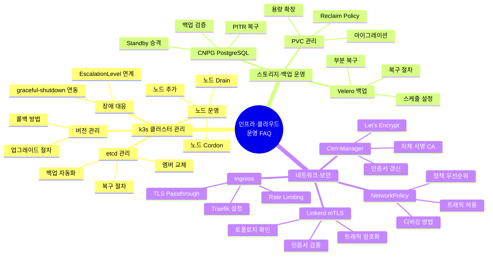

# 인프라·클라우드 운영 심화 FAQ

> 공공기관 SaaS 프레임워크 — k3s 클러스터 관리, 스토리지 운영, 네트워크 트러블슈팅
> Design Ref: graceful-shutdown.ts(SVC-MESH-R13), escalation-controller.ts(MTU-N178) 실제 코드 분석
> 작성일: 2026-04-13 | 총 25개 Q&A

---

## 목차

1. [FAQ 카테고리 맵](#1-faq-카테고리-맵)
2. [k3s 클러스터 관리 FAQ (Q1~Q9)](#2-k3s-클러스터-관리-faq)
3. [스토리지·백업 운영 FAQ (Q10~Q17)](#3-스토리지백업-운영-faq)
4. [네트워크·보안 FAQ (Q18~Q25)](#4-네트워크보안-faq)
5. [k3s 운영 에스컬레이션 의사결정 트리](#5-k3s-운영-에스컬레이션-의사결정-트리)

---

## 1. FAQ 카테고리 맵



---

## 2. k3s 클러스터 관리 FAQ

### Q1. 새로운 워커 노드를 k3s 클러스터에 추가하려면 어떻게 하나요?

**짧은 답변**: 서버 노드에서 토큰을 가져온 뒤 워커 노드에서 join 명령을 실행합니다.

**상세 설명**: k3s는 단일 바이너리로 배포되므로 기존 Kubernetes보다 훨씬 간단하게 노드를 추가할 수 있습니다. 공공기관 SaaS 환경에서는 내부망(에어갭) 환경에서 노드를 추가하는 경우가 많으므로, 이미지를 미리 배포하는 방법도 함께 알아둡니다.

```bash
# 1단계: 서버(마스터) 노드에서 K3S 토큰 조회
# 이 토큰은 클러스터 인증 키이므로 보안 채널로 전달할 것
sudo cat /var/lib/rancher/k3s/server/node-token

# 2단계: 서버 노드 IP 확인
kubectl get nodes -o wide
# NAME          STATUS   ROLES                  AGE   VERSION   INTERNAL-IP
# k3s-server1   Ready    control-plane,master   10d   v1.29.2   192.168.1.10

# 3단계: 워커 노드에서 k3s agent 설치 및 클러스터 참가
# 주의: 내부망 환경이므로 온라인 설치 스크립트 대신 바이너리 직접 배포
export K3S_TOKEN="<1단계에서 복사한 토큰>"
export K3S_URL="https://192.168.1.10:6443"

# 워커 노드에서 실행
curl -sfL https://get.k3s.io | K3S_URL=$K3S_URL K3S_TOKEN=$K3S_TOKEN sh -
# 또는 에어갭 환경에서:
# k3s agent --server $K3S_URL --token $K3S_TOKEN &

# 4단계: 서버 노드에서 새 노드 확인
kubectl get nodes
# 새 노드가 Ready 상태가 될 때까지 1~2분 소요

# 5단계: 노드 레이블 추가 (워크로드 배치 제어)
kubectl label node <새노드명> node-role.kubernetes.io/worker=true
kubectl label node <새노드명> csap-env=production
```

**공공기관 특이사항**: 노드 추가 시 반드시 보안 그룹 또는 iptables 규칙에서 6443(API), 8472(VXLAN), 51820(WireGuard) 포트를 허용해야 합니다.

---

### Q2. 노드 유지보수를 위해 안전하게 워크로드를 이동시키는 방법은?

**짧은 답변**: `kubectl cordon`으로 신규 스케줄링을 막고, `kubectl drain`으로 기존 파드를 이동시킵니다.

**상세 설명**: 노드 점검, 커널 업그레이드, 하드웨어 교체 시 서비스 중단 없이 워크로드를 이전하는 절차입니다. graceful-shutdown.ts의 `terminationGracePeriodSeconds`와 직접 연관됩니다.

```bash
# 1단계: 노드 Cordon — 신규 파드 스케줄링 차단 (기존 파드는 유지)
kubectl cordon k3s-worker1
# 확인: STATUS가 Ready,SchedulingDisabled로 변경됨
kubectl get nodes k3s-worker1

# 2단계: 노드 Drain — 실행 중인 파드를 다른 노드로 이동
# --ignore-daemonsets: DaemonSet 파드는 이동하지 않음 (이동 불가)
# --delete-emptydir-data: emptyDir 볼륨 데이터 삭제 허용
# --grace-period=60: 각 파드에 60초 종료 대기 시간 부여
kubectl drain k3s-worker1 \
  --ignore-daemonsets \
  --delete-emptydir-data \
  --grace-period=60 \
  --timeout=300s

# 3단계: Drain 중 진행 상황 모니터링
# 다른 터미널에서:
watch kubectl get pods -A -o wide | grep k3s-worker1

# 4단계: 유지보수 작업 수행
# 커널 업그레이드, 패치 적용 등

# 5단계: 유지보수 완료 후 Uncordon — 정상 스케줄링 재개
kubectl uncordon k3s-worker1
```

**graceful-shutdown.ts 연동 설명**: 실제 코드에서 `terminationGracePeriodSeconds`는 k8s가 SIGTERM을 보낸 후 강제 종료(SIGKILL)까지 대기하는 시간입니다.

```typescript
// 실제 코드: graceful-shutdown.ts
// DEFAULT_TIMEOUT = 30_000ms (30초)
// k8s terminationGracePeriodSeconds 기본값 30초와 일치하도록 설계

const DEFAULT_TIMEOUT = 30_000;

// k8s Deployment의 terminationGracePeriodSeconds를
// GracefulShutdown의 timeout과 반드시 맞춰야 합니다:

// kubectl drain의 --grace-period 값도 일치시키는 것 권장
// --grace-period=30 (또는 Deployment의 terminationGracePeriodSeconds 값)
```

```yaml
# k8s Deployment에서 terminationGracePeriodSeconds 설정
spec:
  template:
    spec:
      terminationGracePeriodSeconds: 30  # graceful-shutdown.ts DEFAULT_TIMEOUT과 일치
      containers:
        - name: ai-service
          lifecycle:
            preStop:
              exec:
                command: ["/bin/sh", "-c", "sleep 5"]  # readiness 해제 대기
```

---

### Q3. k3s etcd 백업을 자동화하려면 어떻게 하나요?

**짧은 답변**: k3s 내장 etcd snapshot 기능을 사용하거나, 외부 S3/NFS에 자동 저장 설정을 합니다.

**상세 설명**: k3s는 내장 etcd를 사용하며, 클러스터 상태의 전체 백업인 etcd 스냅샷을 관리합니다. 공공기관 환경에서는 외부 클라우드 S3 대신 온프레미스 NFS나 MinIO를 사용합니다.

```bash
# k3s 내장 etcd 스냅샷 — 즉시 수동 실행
sudo k3s etcd-snapshot save --name manual-backup-$(date +%Y%m%d-%H%M%S)

# 저장된 스냅샷 목록 확인
sudo k3s etcd-snapshot ls
# NAME                               LOCATION                  SIZE    CREATED
# manual-backup-20260413-090000      /var/lib/rancher/k3s/...  8.2MB   2026-04-13

# 자동 스냅샷 설정 (k3s 서버 시작 옵션)
# /etc/systemd/system/k3s.service.env 수정:
cat >> /etc/systemd/system/k3s.service.env << 'EOF'
K3S_ETCD_SNAPSHOT_SCHEDULE_CRON=0 */6 * * *   # 6시간마다
K3S_ETCD_SNAPSHOT_RETENTION=72                 # 72개 보관
K3S_ETCD_SNAPSHOT_DIR=/backup/etcd             # 저장 경로
EOF

systemctl daemon-reload && systemctl restart k3s

# MinIO(온프레미스 S3)에 자동 업로드
# /etc/rancher/k3s/config.yaml 에 추가:
cat > /etc/rancher/k3s/config.yaml << 'EOF'
etcd-snapshot-schedule-cron: "0 */6 * * *"
etcd-snapshot-retention: 72
etcd-s3: true
etcd-s3-endpoint: minio.internal:9000
etcd-s3-access-key: "${MINIO_ACCESS_KEY}"  # 환경 변수 사용 (CSAP D-09)
etcd-s3-secret-key: "${MINIO_SECRET_KEY}"  # 하드코딩 금지
etcd-s3-bucket: k3s-etcd-backup
etcd-s3-region: us-east-1
etcd-s3-skip-ssl-verify: false
EOF
```

**자동화 CronJob 방식**:

```yaml
# k8s CronJob으로 etcd 스냅샷을 NFS에 저장
apiVersion: batch/v1
kind: CronJob
metadata:
  name: etcd-backup
  namespace: kube-system
spec:
  schedule: "0 */6 * * *"  # 6시간마다
  jobTemplate:
    spec:
      template:
        spec:
          hostPID: true
          nodeSelector:
            node-role.kubernetes.io/control-plane: "true"
          tolerations:
            - key: node-role.kubernetes.io/control-plane
              effect: NoSchedule
          containers:
            - name: backup
              image: rancher/k3s:v1.29.2-k3s1
              command:
                - sh
                - -c
                - |
                  BACKUP_NAME="etcd-$(date +%Y%m%d-%H%M%S)"
                  k3s etcd-snapshot save --name $BACKUP_NAME
                  cp /var/lib/rancher/k3s/server/db/snapshots/$BACKUP_NAME.db \
                     /backup/etcd/$BACKUP_NAME.db
              volumeMounts:
                - name: k3s-data
                  mountPath: /var/lib/rancher/k3s
                - name: backup-nfs
                  mountPath: /backup/etcd
          volumes:
            - name: k3s-data
              hostPath:
                path: /var/lib/rancher/k3s
            - name: backup-nfs
              nfs:
                server: nas.internal
                path: /nfs/k3s-backup
          restartPolicy: OnFailure
```

---

### Q4. k3s 버전을 업그레이드하는 안전한 절차는?

**짧은 답변**: 시스템 업그레이드 컨트롤러(System Upgrade Controller)를 사용하거나, 수동으로 노드별 순차 업그레이드합니다.

**상세 설명**: 공공기관 환경에서는 사전 검토와 승인 후 업그레이드를 진행합니다. 반드시 etcd 백업 후 진행하고, 롤백 계획을 수립합니다.

```bash
# 사전 준비 1: etcd 스냅샷 생성
sudo k3s etcd-snapshot save --name pre-upgrade-$(date +%Y%m%d)

# 사전 준비 2: 현재 버전 확인
kubectl version --short
k3s --version

# 사전 준비 3: 업그레이드할 버전의 릴리스 노트 확인
# https://github.com/k3s-io/k3s/releases

# 방법 1: System Upgrade Controller 사용 (권장)
# 설치
kubectl apply -f https://github.com/rancher/system-upgrade-controller/releases/latest/download/system-upgrade-controller.yaml

# 업그레이드 플랜 생성 (서버 노드)
kubectl apply -f - << 'EOF'
apiVersion: upgrade.cattle.io/v1
kind: Plan
metadata:
  name: k3s-server
  namespace: system-upgrade
spec:
  concurrency: 1          # 한 번에 1개 노드씩 업그레이드
  cordon: true            # 업그레이드 전 자동 Cordon
  serviceAccountName: system-upgrade
  upgrade:
    image: rancher/k3s-upgrade
  channel: https://update.k3s.io/v1-release/channels/stable
  nodeSelector:
    matchLabels:
      node-role.kubernetes.io/control-plane: "true"
EOF

# 방법 2: 수동 업그레이드
# 워커 노드 순서로 진행 (마스터 마지막)
for node in k3s-worker1 k3s-worker2; do
  echo "=== $node 업그레이드 시작 ==="
  kubectl cordon $node
  kubectl drain $node --ignore-daemonsets --delete-emptydir-data --grace-period=60

  # 해당 노드에서 실행 (SSH)
  ssh $node "curl -sfL https://get.k3s.io | INSTALL_K3S_VERSION=v1.29.4+k3s1 sh -s - agent"

  kubectl uncordon $node
  echo "=== $node 업그레이드 완료. 다음 노드 진행 전 5분 대기 ==="
  sleep 300
done
```

**롤백 절차**:

```bash
# 업그레이드 실패 시 롤백 절차

# 1. 이전 k3s 버전으로 되돌리기
# 이전 버전 바이너리로 교체
INSTALL_K3S_VERSION=v1.29.2+k3s1 sh -s - agent

# 2. etcd 스냅샷으로 클러스터 상태 복구 (마지막 수단)
# 모든 서버 노드 중지
systemctl stop k3s

# 스냅샷 복구 (서버 노드에서만)
k3s server \
  --cluster-reset \
  --cluster-reset-restore-path=/var/lib/rancher/k3s/server/db/snapshots/pre-upgrade-20260413.db

# 나머지 서버 노드는 단순 재시작
systemctl start k3s
```

---

### Q5. 서버 노드(마스터)가 응답하지 않을 때 어떻게 복구하나요?

**짧은 답변**: etcd 상태를 확인하고, 필요시 etcd 멤버를 교체하거나 스냅샷으로 복구합니다.

**상세 설명**: k3s는 3노드 etcd 클러스터를 권장합니다(quorum 유지). 단일 서버 노드 장애 시 quorum이 깨져 클러스터가 읽기 전용이 됩니다.

```bash
# 1단계: 서버 노드 상태 확인
kubectl get nodes
# k3s-server1   NotReady   control-plane,master   ...

# 2단계: etcd 상태 확인
sudo k3s etcd-snapshot ls  # 스냅샷 목록 확인 가능한지 확인

# etcd 멤버 목록 확인
sudo k3s kubectl get endpoints etcd -n kube-system

# 3단계: 단순 재시작으로 해결 가능한지 확인
sudo systemctl restart k3s

# 4단계: 로그 확인
sudo journalctl -u k3s -n 100 --no-pager

# 5단계: etcd 멤버 교체 (노드 복구 불가 시)
# 장애 노드의 etcd 멤버 ID 확인
sudo ETCDCTL_ENDPOINTS='https://127.0.0.1:2379' \
  ETCDCTL_CACERT='/var/lib/rancher/k3s/server/tls/etcd/server-ca.crt' \
  ETCDCTL_CERT='/var/lib/rancher/k3s/server/tls/etcd/client.crt' \
  ETCDCTL_KEY='/var/lib/rancher/k3s/server/tls/etcd/client.key' \
  etcdctl member list

# 장애 멤버 제거
sudo ETCDCTL_ENDPOINTS='...' etcdctl member remove <member-id>

# 새 서버 노드를 기존 클러스터에 참가
k3s server --server https://<existing-server>:6443 --token <token>

# 6단계: 최후 수단 — etcd 스냅샷으로 전체 복구
sudo systemctl stop k3s
sudo k3s server \
  --cluster-reset \
  --cluster-reset-restore-path=/backup/etcd/pre-upgrade-20260413.db
sudo systemctl start k3s
```

---

### Q6. graceful-shutdown.ts의 terminationGracePeriodSeconds는 어떻게 설정해야 하나요?

**짧은 답변**: `GracefulShutdown`의 `timeout` 옵션과 Kubernetes의 `terminationGracePeriodSeconds`를 일치시켜야 합니다.

**상세 설명**: 실제 코드 분석을 통해 올바른 설정 방법을 이해합니다.

```typescript
// 실제 코드: graceful-shutdown.ts
// GracefulShutdown 클래스는 SIGTERM 수신 시:
// 1. readiness = false (신규 요청 거부)
// 2. 진행 중 요청 완료 대기 (최대 timeout ms)
// 3. 정리 핸들러 실행
// 4. 프로세스 종료

export class GracefulShutdown {
  private readonly timeout: number;  // ms 단위

  constructor(options: GracefulShutdownOptions = {}) {
    this.timeout = options.timeout ?? DEFAULT_TIMEOUT;  // DEFAULT_TIMEOUT = 30,000ms
  }
}

// 올바른 설정 방법:
// 1. GracefulShutdown timeout 설정
const shutdown = new GracefulShutdown({
  timeout: 25_000,  // 25초 — k8s의 30초보다 5초 작게 (여유시간 확보)
});

// 2. k8s Deployment terminationGracePeriodSeconds는 반드시 크게 설정
// terminationGracePeriodSeconds: 30  (GracefulShutdown timeout + 5초 이상)
```

```yaml
# k8s Deployment 설정 예시
apiVersion: apps/v1
kind: Deployment
metadata:
  name: ai-service
spec:
  template:
    spec:
      terminationGracePeriodSeconds: 30  # GracefulShutdown timeout(25s) + 여유 5s
      containers:
        - name: ai-service
          readinessProbe:
            httpGet:
              path: /healthz/ready
              port: 3000
            # 셧다운 시작 시 readinessProbe 실패로 트래픽 중단
          lifecycle:
            preStop:
              exec:
                # 로드밸런서가 파드를 제거할 시간 확보 (5초 대기)
                command: ["/bin/sh", "-c", "sleep 5"]
```

**타임라인 시각화**:

```
k8s가 SIGTERM 발송
     ↓
[0s] GracefulShutdown: isShuttingDown = true
     └── 새 요청은 503 응답
[0~5s] preStop hook: sleep 5
     └── 로드밸런서에서 파드 제거 대기
[5~25s] 진행 중인 요청 완료 대기 (최대 20초)
[25s] 정리 핸들러 실행 (DB 연결 해제 등)
[25~30s] process.exit(0)
[30s] k8s terminationGracePeriodSeconds 만료 — 이 시점 이전에 종료 완료
```

---

### Q7. k3s 파드가 계속 CrashLoopBackOff 상태인 경우 어떻게 디버깅하나요?

**짧은 답변**: 로그, 이벤트, 이전 컨테이너 로그를 순서대로 확인하고 원인별로 대응합니다.

**상세 설명**: CrashLoopBackOff는 컨테이너가 계속 시작-실패를 반복하는 상태입니다. 재시작 간격이 기하급수적으로 늘어나며(10s → 20s → 40s → 80s → 160s → 300s 최대), 원인을 빠르게 찾아야 합니다.

```bash
# 1단계: 기본 상태 확인
kubectl get pods -n <namespace> <pod-name>
# NAME          READY   STATUS             RESTARTS   AGE
# ai-service    0/1     CrashLoopBackOff   5          10m

# 2단계: 파드 이벤트 확인 (가장 최근 에러 원인)
kubectl describe pod -n <namespace> <pod-name>
# Events 섹션에서 OOMKilled, FailedMount 등 원인 확인

# 3단계: 현재 로그 (실패 전 마지막 출력)
kubectl logs -n <namespace> <pod-name>

# 4단계: 이전 컨테이너 로그 (크래시 직전 로그)
kubectl logs -n <namespace> <pod-name> --previous

# 5단계: 원인별 대응

# 원인 1: OOMKilled — 메모리 부족
# Events에서: "OOMKilled" 또는 exit code 137
kubectl top pod <pod-name> -n <namespace>
# 해결: resources.limits.memory 증가 또는 메모리 누수 수정

# 원인 2: 환경 변수 누락 — 시크릿/컨피그맵 미생성
# 로그에서: "환경 변수 XXX가 설정되지 않았습니다"
kubectl get secret <secret-name> -n <namespace>
kubectl get configmap <cm-name> -n <namespace>
# 해결: 누락된 시크릿/컨피그맵 생성

# 원인 3: FailedMount — PVC 또는 ConfigMap 마운트 실패
kubectl describe pvc <pvc-name> -n <namespace>
# 해결: PVC 상태 확인, StorageClass 확인

# 원인 4: 초기화 실패 — DB 연결 불가 등
# 로그에서: connection refused, timeout 등
kubectl exec -n <namespace> <pod-name> -- nc -zv <db-host> <db-port>
# 해결: NetworkPolicy 확인, DB 서비스 상태 확인

# 5단계: 임시 디버깅 컨테이너 추가 (k8s 1.23+)
kubectl debug -n <namespace> <pod-name> \
  --image=busybox \
  --target=ai-service \
  -it
```

---

### Q8. 클러스터 내 파드 간 DNS 조회가 실패하는 경우 어떻게 해결하나요?

**짧은 답변**: CoreDNS 상태를 확인하고, DNS 조회 테스트를 수행합니다.

**상세 설명**: k3s는 CoreDNS를 내장합니다. DNS 실패는 CoreDNS 파드 문제, NetworkPolicy 차단, 서비스 이름 오류 등 다양한 원인이 있습니다.

```bash
# 1단계: CoreDNS 파드 상태 확인
kubectl get pods -n kube-system -l k8s-app=kube-dns
# NAME                       READY   STATUS    RESTARTS
# coredns-7db6d8ff4d-xxxxx   1/1     Running   0

# 2단계: DNS 조회 테스트 파드 실행
kubectl run dns-debug --image=busybox:1.28 --restart=Never --rm -it \
  -- nslookup kubernetes.default.svc.cluster.local
# Server:    10.43.0.10
# Address 1: 10.43.0.10 kube-dns.kube-system.svc.cluster.local
# Name:      kubernetes.default.svc.cluster.local
# Address 1: 10.43.0.1 kubernetes.default.svc.cluster.local

# 3단계: 서비스 이름으로 조회 테스트
kubectl run dns-debug --image=busybox:1.28 --restart=Never --rm -it \
  -- nslookup ai-service.production.svc.cluster.local
# 실패 시: 서비스 존재 여부 확인

# 4단계: 서비스 존재 여부 확인
kubectl get svc -n production
# ai-service 서비스가 없다면 생성 필요

# 5단계: CoreDNS 설정 확인
kubectl get configmap coredns -n kube-system -o yaml
# kubernetes cluster.local 섹션에 도메인이 올바르게 설정되어 있는지 확인

# 6단계: CoreDNS 로그 확인
kubectl logs -n kube-system -l k8s-app=kube-dns --tail=100

# 7단계: NetworkPolicy가 DNS를 차단하는지 확인
# UDP 53포트 (DNS)를 허용하는 정책이 있어야 함
kubectl get networkpolicy -A | grep dns
```

---

### Q9. 클러스터 전체 리소스 사용량이 90% 이상일 때 대응 방법은?

**짧은 답변**: 리소스 압박 원인을 파악한 후 HPA 조정, 노드 추가, 또는 워크로드 최적화 중 하나를 선택합니다.

**상세 설명**: `EscalationLevel.Critical` 이상의 상황입니다. 신속한 분류(triage) 후 조치합니다.

```bash
# 1단계: 즉시 현황 파악
kubectl top nodes
# NAME         CPU(cores)  CPU%   MEMORY(bytes)  MEMORY%
# k3s-server   1800m       90%    7.5Gi          94%     ← 위험!
# k3s-worker1  800m        40%    3.2Gi          40%

kubectl top pods -A --sort-by=cpu | head -20
kubectl top pods -A --sort-by=memory | head -20

# 2단계: 리소스 소모 원인 파악
# CPU 급증: 배포된 서비스 중 무한 루프, 무한 재시도 등
kubectl describe node k3s-server | grep -A 20 "Allocated resources"

# 3단계: 즉각 조치 — 임시 스케일 다운
# 비프로덕션 워크로드 스케일 다운
kubectl scale deployment staging-env --replicas=0 -n staging

# 4단계: HPA(수평 파드 자동 조정) 상태 확인
kubectl get hpa -A
# NAMESPACE    NAME         REFERENCE                   TARGETS        MINPODS  MAXPODS  REPLICAS
# production   ai-service   Deployment/ai-service       cpu: 85%/70%   2        10       8

# 5단계: 장기적 해결책 선택
# 옵션 A: 노드 추가 (Q1 참조)
# 옵션 B: VPA(수직 파드 자동 조정)로 리소스 요청/제한 재조정
kubectl apply -f - << 'EOF'
apiVersion: autoscaling.k8s.io/v1
kind: VerticalPodAutoscaler
metadata:
  name: ai-service-vpa
  namespace: production
spec:
  targetRef:
    apiVersion: apps/v1
    kind: Deployment
    name: ai-service
  updatePolicy:
    updateMode: "Auto"
EOF

# 옵션 C: 불필요한 리소스 정리
# 완료된 Job 삭제
kubectl delete jobs -A --field-selector status.successful=1
# 오래된 ReplicaSet 정리
kubectl get rs -A | grep "0         0         0" | awk '{print "kubectl delete rs -n " $1 " " $2}' | sh
```

---

## 3. 스토리지·백업 운영 FAQ

### Q10. PVC(영구 볼륨 클레임)의 용량을 온라인으로 확장하려면?

**짧은 답변**: StorageClass의 `allowVolumeExpansion: true` 설정 후 PVC spec.resources.requests.storage 값을 증가시킵니다.

**상세 설명**: k3s에서 기본 사용하는 local-path StorageClass는 볼륨 확장을 지원하지 않으므로, Longhorn 또는 NFS CSI 드라이버를 사용하는 경우에 해당합니다.

```bash
# 1단계: StorageClass의 확장 지원 여부 확인
kubectl get storageclass
kubectl describe storageclass longhorn | grep AllowVolumeExpansion
# AllowVolumeExpansion: true  ← 확장 가능

# 2단계: 현재 PVC 상태 확인
kubectl get pvc postgres-data -n database
# NAME            STATUS   VOLUME     CAPACITY   ACCESS MODES
# postgres-data   Bound    pvc-xxx    10Gi       RWO

# 3단계: PVC 용량 확장 (10Gi → 20Gi)
kubectl patch pvc postgres-data -n database \
  --type=merge \
  -p '{"spec":{"resources":{"requests":{"storage":"20Gi"}}}}'

# 4단계: 확장 완료 대기 및 확인
kubectl get pvc postgres-data -n database -w
# STATUS가 Bound로 변경되고 CAPACITY가 20Gi로 증가할 때까지 대기

# 5단계: 파일시스템 확장 (일부 CSI 드라이버는 수동 필요)
# Longhorn은 자동으로 파일시스템 리사이즈
# NFS의 경우 파드 재시작 필요
kubectl rollout restart deployment postgres -n database

# 6단계: 실제 사용 공간 확인
kubectl exec -n database postgres-0 -- df -h /var/lib/postgresql/data
```

**local-path StorageClass에서 확장이 필요한 경우**:

```bash
# local-path는 확장 불가 → 데이터 마이그레이션 필요
# 1. 새 큰 용량의 PVC 생성
# 2. rsync로 데이터 복사
# 3. 서비스를 새 PVC로 전환

# 데이터 마이그레이션 Job
kubectl apply -f - << 'EOF'
apiVersion: batch/v1
kind: Job
metadata:
  name: pvc-migration
spec:
  template:
    spec:
      containers:
        - name: migrate
          image: alpine:3.18
          command: [sh, -c, "apk add rsync && rsync -avz /source/ /dest/"]
          volumeMounts:
            - name: source-pvc
              mountPath: /source
            - name: dest-pvc
              mountPath: /dest
      volumes:
        - name: source-pvc
          persistentVolumeClaim:
            claimName: postgres-data-old
        - name: dest-pvc
          persistentVolumeClaim:
            claimName: postgres-data-new
      restartPolicy: Never
EOF
```

---

### Q11. Velero로 네임스페이스 전체를 백업하고 복구하려면?

**짧은 답변**: `velero backup create`로 백업 생성 후 `velero restore create`로 복구합니다.

**상세 설명**: Velero는 k8s 리소스(YAML 정의)와 볼륨 스냅샷을 함께 백업합니다. 재해 복구(DR) 시나리오에서 사용합니다.

```bash
# 전제: Velero가 MinIO(온프레미스 S3)와 연동되어 있음
# velero install \
#   --provider aws \
#   --plugins velero/velero-plugin-for-aws \
#   --bucket k3s-velero-backup \
#   --backup-location-config region=minio,s3ForcePathStyle=true,s3Url=http://minio:9000

# 1단계: 즉시 백업 생성
velero backup create production-backup-$(date +%Y%m%d) \
  --include-namespaces production \
  --snapshot-volumes=true \
  --wait

# 2단계: 백업 상태 확인
velero backup describe production-backup-20260413
# Phase: Completed
# Namespaces: production
# Resources: 156 included

# 3단계: 백업 목록 조회
velero backup get
# NAME                         STATUS     ERRORS  WARNINGS  ...
# production-backup-20260413   Completed  0       0         ...

# 4단계: 전체 네임스페이스 복구
velero restore create --from-backup production-backup-20260413
# 이미 존재하는 리소스는 덮어쓰지 않음 (기본 동작)

# 5단계: 복구 시 기존 리소스 덮어쓰기 (강제 복구)
velero restore create --from-backup production-backup-20260413 \
  --existing-resource-policy=update

# 6단계: 복구 상태 모니터링
velero restore describe <restore-name>
kubectl get pods -n production -w

# 자동 스케줄 백업 설정
velero schedule create daily-production \
  --schedule="0 2 * * *" \
  --include-namespaces production \
  --ttl 720h0m0s  # 30일 보관
```

---

### Q12. Velero로 특정 리소스만 부분 복구하려면?

**짧은 답변**: `--include-resources` 또는 `--label-selector` 옵션으로 복구 범위를 제한합니다.

**상세 설명**: 실수로 삭제된 특정 Deployment나 ConfigMap만 복구할 때 유용합니다.

```bash
# 특정 리소스 타입만 복구 (ConfigMap만)
velero restore create --from-backup production-backup-20260413 \
  --include-resources configmaps \
  --include-namespaces production

# 특정 레이블을 가진 리소스만 복구
velero restore create --from-backup production-backup-20260413 \
  --label-selector "app=ai-service" \
  --include-namespaces production

# 특정 리소스 이름으로 복구
velero restore create --from-backup production-backup-20260413 \
  --include-resources deployments \
  --include-namespaces production \
  -- ai-service

# 볼륨 제외하고 리소스만 복구 (빠른 설정 복구용)
velero restore create --from-backup production-backup-20260413 \
  --restore-volumes=false
```

---

### Q13. PVC Reclaim Policy를 변경하여 PVC 삭제 시 볼륨 보존하려면?

**짧은 답변**: PersistentVolume의 `persistentVolumeReclaimPolicy`를 `Retain`으로 변경합니다.

**상세 설명**: 기본값 `Delete`는 PVC 삭제 시 볼륨도 삭제합니다. 중요한 데이터는 `Retain`으로 보호합니다.

```bash
# 1단계: PV의 Reclaim Policy 확인
kubectl get pv -o wide
# RECLAIM POLICY가 Delete인 경우 PVC 삭제 시 데이터도 삭제됨

# 2단계: 중요 PV의 Reclaim Policy를 Retain으로 변경
kubectl patch pv <pv-name> \
  --type=merge \
  -p '{"spec":{"persistentVolumeReclaimPolicy":"Retain"}}'

# 3단계: StorageClass 레벨에서 기본값 변경
kubectl get storageclass longhorn -o yaml
# reclaimPolicy: Delete  ← 이 값을 변경

# 새 StorageClass 생성 (기존은 수정 불가)
kubectl apply -f - << 'EOF'
apiVersion: storage.k8s.io/v1
kind: StorageClass
metadata:
  name: longhorn-retain
provisioner: driver.longhorn.io
reclaimPolicy: Retain  # 볼륨 보존
allowVolumeExpansion: true
parameters:
  numberOfReplicas: "2"
  staleReplicaTimeout: "2880"
EOF
```

---

### Q14. CNPG(CloudNative PG) Standby를 Primary로 승격시키는 방법은?

**짧은 답변**: CNPG의 failover는 자동으로 처리되지만, 수동 승격이 필요한 경우 `kubectl cnpg promote` 명령을 사용합니다.

**상세 설명**: CNPG는 Primary 장애 시 자동으로 Standby를 Primary로 승격합니다. 수동 승격은 계획된 유지보수 시 사용합니다.

```bash
# CNPG 클러스터 상태 확인
kubectl get cluster -n database
# NAME          AGE   INSTANCES   READY   STATUS
# postgres-ha   10d   2           2       Cluster in healthy state

kubectl get pods -n database -l cnpg.io/cluster=postgres-ha
# NAME              READY   STATUS    ROLE
# postgres-ha-1     1/1     Running   primary   ← 현재 Primary
# postgres-ha-2     1/1     Running   replica   ← Standby

# 현재 Primary 확인
kubectl cnpg status postgres-ha -n database
# Primary: postgres-ha-1

# 수동 Failover (Standby → Primary 승격)
# 이 명령은 postgres-ha-2를 새 Primary로 승격
kubectl cnpg promote postgres-ha postgres-ha-2 -n database

# 승격 완료 확인
kubectl cnpg status postgres-ha -n database
# Primary: postgres-ha-2 (변경됨)

# 자동 Failover 정책 확인
kubectl get cluster postgres-ha -n database -o jsonpath='{.spec.failoverDelay}'
```

---

### Q15. CNPG PITR(특정 시점 복구)를 수행하려면?

**짧은 답변**: WAL(Write-Ahead Log)을 활용한 PITR로 특정 시점의 데이터베이스 상태를 복구합니다.

**상세 설명**: 실수로 데이터를 삭제한 경우, 삭제 직전 시점으로 복구합니다.

```bash
# 1단계: 복구할 목표 시간 확인 (UTC)
# 예: 2026-04-13 09:30:00 UTC에 데이터 삭제 → 09:29:00로 복구

# 2단계: PITR 복구 클러스터 생성
kubectl apply -f - << 'EOF'
apiVersion: postgresql.cnpg.io/v1
kind: Cluster
metadata:
  name: postgres-pitr-recovery
  namespace: database
spec:
  instances: 1
  storage:
    size: 20Gi
    storageClass: longhorn-retain
  bootstrap:
    recovery:
      backup:
        name: postgres-backup-latest  # 기준 백업 이름
      recoveryTarget:
        targetTime: "2026-04-13 09:29:00"  # 복구 목표 시점 (UTC)
        exclusive: false                     # false: 해당 시점 포함
  externalClusters:
    - name: postgres-backup-latest
      barmanObjectStore:
        destinationPath: s3://postgres-backup/
        endpointURL: http://minio:9000
        s3Credentials:
          accessKeyId:
            name: minio-secret
            key: ACCESS_KEY_ID
          secretAccessKey:
            name: minio-secret
            key: SECRET_ACCESS_KEY
EOF

# 3단계: PITR 완료 확인
kubectl get pods -n database postgres-pitr-recovery-1 -w

# 4단계: 복구된 데이터 검증
kubectl exec -n database postgres-pitr-recovery-1 \
  -- psql -U app -c "SELECT COUNT(*) FROM target_table;"

# 5단계: 검증 완료 후 원본 클러스터에 데이터 복구 (pg_restore 또는 직접 복사)
```

---

### Q16. 백업 데이터의 무결성을 검증하는 방법은?

**짧은 답변**: 정기적으로 복구 연습(Restore Drill)을 수행하고 복구된 데이터의 체크섬을 검증합니다.

**상세 설명**: CSAP D-06에서 백업 데이터의 무결성 검증을 요구합니다.

```bash
# Velero 백업 데이터 무결성 검사
velero backup describe production-backup-20260413 \
  --details | grep -E "Phase|Warnings|Errors"

# CNPG 백업 검증
kubectl cnpg backup list postgres-ha -n database

# 백업 체크섬 확인 (MinIO에 저장된 경우)
mc alias set minio http://minio:9000 $ACCESS_KEY $SECRET_KEY
mc stat minio/postgres-backup/base.tar.gz
# ETag: d41d8cd98f00b204e9800998ecf8427e (MD5 해시)

# 복구 연습 자동화 스크립트
cat > /opt/backup-verify.sh << 'EOF'
#!/bin/bash
# 월간 복구 연습 스크립트 — CSAP D-06 증거

DATE=$(date +%Y%m%d)
RESTORE_NS="backup-test-${DATE}"

# 1. 테스트 네임스페이스 생성
kubectl create namespace $RESTORE_NS

# 2. 최신 백업으로 복구 시도
velero restore create test-restore-$DATE \
  --from-backup $(velero backup get --output json | jq -r '.items[0].metadata.name') \
  --namespace-mappings production:$RESTORE_NS \
  --wait

# 3. 복구 성공 여부 기록
if kubectl get pods -n $RESTORE_NS | grep -q Running; then
  echo "SUCCESS: 백업 복구 검증 성공 $(date)" >> /var/log/backup-verify.log
else
  echo "FAILURE: 백업 복구 검증 실패 $(date)" >> /var/log/backup-verify.log
fi

# 4. 테스트 네임스페이스 정리
kubectl delete namespace $RESTORE_NS
EOF
chmod +x /opt/backup-verify.sh
```

---

### Q17. 스토리지 I/O 성능이 갑자기 저하된 경우 어떻게 진단하나요?

**짧은 답변**: `iostat`, `kubectl top`, Prometheus 메트릭을 순서대로 확인합니다.

**상세 설명**: 스토리지 I/O 병목은 AI 서비스의 임베딩 벡터 저장, PostgreSQL 쿼리 성능에 큰 영향을 줍니다.

```bash
# 1단계: 노드 레벨 I/O 확인
kubectl debug node/k3s-worker1 --image=ubuntu -- bash -c "
  apt-get install -y sysstat 2>/dev/null
  iostat -xz 1 5
"
# 주목할 지표: %util (100% = I/O 포화), await (ms, 지연), r/s, w/s

# 2단계: 특정 파드의 I/O 확인
kubectl exec -n production <pod-name> -- \
  cat /proc/diskstats

# 3단계: Prometheus로 스토리지 메트릭 조회
# I/O 지연
rate(node_disk_read_time_seconds_total[5m]) / rate(node_disk_reads_completed_total[5m])

# I/O 처리량
rate(node_disk_read_bytes_total[5m]) + rate(node_disk_written_bytes_total[5m])

# 4단계: Longhorn UI에서 볼륨별 성능 확인
kubectl port-forward -n longhorn-system svc/longhorn-frontend 8080:80
# http://localhost:8080 → Volume → I/O 탭

# 5단계: 빠른 완화 조치 — I/O 집약적 파드 격리
kubectl label pod -n production <io-heavy-pod> node=io-optimized
kubectl taint node k3s-worker2 io-optimized=true:NoSchedule
```

---

## 4. 네트워크·보안 FAQ

### Q18. NetworkPolicy 설정 후 서비스 간 통신이 차단되었는지 확인하는 방법은?

**짧은 답변**: `netshoot` 디버깅 파드로 직접 통신 테스트를 수행하고, NetworkPolicy 정책을 분석합니다.

**상세 설명**: NetworkPolicy는 화이트리스트 기반입니다. 정책이 없으면 모든 트래픽이 허용되지만, 하나라도 있으면 명시적으로 허용되지 않은 트래픽은 모두 차단됩니다.

```bash
# 1단계: 현재 NetworkPolicy 목록 확인
kubectl get networkpolicy -n production
# NAME            POD-SELECTOR        AGE
# allow-ai        app=ai-service      5d
# deny-all        {}                  5d   ← 모든 트래픽 기본 차단

# 2단계: 특정 NetworkPolicy 상세 확인
kubectl describe networkpolicy allow-ai -n production
# Spec:
#   PodSelector: app=ai-service
#   Ingress:
#     From:
#       PodSelector: app=portal     ← portal 파드만 ai-service에 접근 허용
#     Ports:
#       Port: 3000/TCP

# 3단계: netshoot으로 실제 통신 테스트
kubectl run netshoot --image=nicolaka/netshoot --restart=Never -it --rm \
  -n production -- sh

# netshoot 쉘에서:
# TCP 연결 테스트
curl -m 5 http://ai-service:3000/healthz
# 또는
nc -zv ai-service 3000

# DNS 조회 테스트
nslookup ai-service.production.svc.cluster.local

# traceroute로 경로 확인
traceroute ai-service

# 4단계: 특정 파드에서 다른 파드로 통신 테스트
# ai-service 파드에서 postgres로 연결 테스트
kubectl exec -n production \
  $(kubectl get pod -n production -l app=ai-service -o name | head -1) \
  -- nc -zv postgres-ha-rw.database.svc.cluster.local 5432

# 5단계: NetworkPolicy 정책 디버그 모드 (Calico 사용 시)
kubectl exec -n kube-system calico-node-xxx -- \
  calicoctl get networkpolicy -n production -o wide
```

**공통 NetworkPolicy 템플릿**:

```yaml
# 기본 deny-all + 필요한 것만 허용 패턴 (CSAP D-08 권장)
apiVersion: networking.k8s.io/v1
kind: NetworkPolicy
metadata:
  name: default-deny-all
  namespace: production
spec:
  podSelector: {}  # 모든 파드에 적용
  policyTypes:
    - Ingress
    - Egress
---
# ai-service: portal에서 수신 + database로 발신 허용
apiVersion: networking.k8s.io/v1
kind: NetworkPolicy
metadata:
  name: allow-ai-service
  namespace: production
spec:
  podSelector:
    matchLabels:
      app: ai-service
  policyTypes:
    - Ingress
    - Egress
  ingress:
    - from:
        - podSelector:
            matchLabels:
              app: portal
      ports:
        - port: 3000
  egress:
    - to:
        - namespaceSelector:
            matchLabels:
              name: database
      ports:
        - port: 5432
    - to: {}  # kube-dns: UDP 53
      ports:
        - port: 53
          protocol: UDP
```

---

### Q19. Linkerd의 mTLS가 올바르게 동작하는지 검증하는 방법은?

**짧은 답변**: `linkerd check`, `linkerd viz tap`, `linkerd identity` 명령으로 mTLS 연결을 확인합니다.

**상세 설명**: CSAP D-08(접근 통제)와 D-09(암호화)를 충족하기 위해 서비스 간 통신을 mTLS로 암호화합니다.

```bash
# 1단계: Linkerd 전체 상태 검사
linkerd check
# kubernetes-api                 ✓
# linkerd-config                 ✓
# linkerd-identity               ✓
# linkerd-proxy-injector         ✓

# 2단계: 특정 파드의 mTLS 연결 확인
linkerd viz tap deployment/ai-service -n production --proto http

# 출력 예시:
# req id=0:0 proxy=out src=10.42.0.1:43012 dst=10.42.0.2:3000 tls=true
#   :method=GET :authority=ai-service:3000 :path=/healthz
# 'tls=true'가 있으면 mTLS 암호화 중

# 3단계: 서비스 인증서 유효성 확인
linkerd identity -n production deployment/ai-service
# Issuer: linkerd-identity.linkerd.svc.cluster.local
# Valid until: 2026-04-14T09:00:00Z  ← 만료 시간 확인

# 4단계: mTLS 연결 통계
linkerd viz stat deployment -n production
# NAME         MESHED  SUCCESS   RPS  LATENCY_P50  LATENCY_P99
# ai-service     2/2   100.00%  10.2       3ms         24ms
# MESHED 2/2: 모든 파드가 Linkerd 메시에 참여

# 5단계: 암호화되지 않은 트래픽 감지 (침입 탐지)
linkerd viz tap -n production deployment/ai-service \
  | grep "tls=false"
# 이 명령에서 출력이 있으면 암호화되지 않은 트래픽 존재!
```

---

### Q20. Cert-Manager 인증서가 만료되기 전에 자동 갱신이 실패하는 경우 어떻게 해결하나요?

**짧은 답변**: `kubectl describe certificate`로 갱신 실패 이유를 확인하고, ACME Challenge 또는 CA 연결 문제를 해결합니다.

**상세 설명**: Cert-Manager는 만료 30일 전부터 자동 갱신을 시도합니다. 공공기관 내부망에서는 외부 Let's Encrypt 대신 내부 CA를 사용합니다.

```bash
# 1단계: 인증서 상태 확인
kubectl get certificate -A
# NAMESPACE    NAME              READY   SECRET              AGE
# production   ai-service-tls    False   ai-service-tls      30d
#                                False ← 갱신 실패!

# 2단계: 상세 갱신 상태 확인
kubectl describe certificate ai-service-tls -n production
# Status:
#   Conditions:
#     Type: Ready
#     Status: False
#     Reason: ClusterIssuerNotFound
#     Message: Referenced ClusterIssuer "letsencrypt-prod" not found

# 3단계: CertificateRequest 상태 확인
kubectl get certificaterequest -n production
kubectl describe certificaterequest <name> -n production

# 4단계: 수동 갱신 트리거
kubectl annotate certificate ai-service-tls -n production \
  cert-manager.io/issuer-kind-override="ClusterIssuer" \
  cert-manager.io/renew-before="360h"  # 갱신 시점을 15일 전으로 변경

# 또는 강제 삭제 후 재생성
kubectl delete secret ai-service-tls -n production
# Cert-Manager가 자동으로 새 인증서 발급 시도

# 5단계: 내부 CA 설정 (에어갭 환경)
kubectl apply -f - << 'EOF'
apiVersion: cert-manager.io/v1
kind: ClusterIssuer
metadata:
  name: internal-ca
spec:
  ca:
    secretName: internal-ca-key-pair
    # internal-ca-key-pair 시크릿에 tls.crt, tls.key 포함
EOF

# 내부 CA 인증서 확인
kubectl get secret internal-ca-key-pair -n cert-manager -o yaml

# 6단계: 갱신 모니터링 알림 설정
kubectl apply -f - << 'EOF'
apiVersion: monitoring.coreos.com/v1
kind: PrometheusRule
metadata:
  name: cert-expiry-alert
  namespace: monitoring
spec:
  groups:
    - name: cert-alerts
      rules:
        - alert: CertificateExpiringIn30Days
          expr: |
            certmanager_certificate_expiration_timestamp_seconds
            - time() < 30 * 24 * 3600
          labels:
            severity: warning
          annotations:
            summary: "인증서 30일 내 만료: {{ $labels.name }}"
EOF
```

---

### Q21. Traefik Ingress에서 특정 IP만 허용하는 방법은?

**짧은 답변**: Traefik의 `ipAllowList` 미들웨어를 사용하여 공인 IP 또는 CIDR 블록을 화이트리스트에 추가합니다.

**상세 설명**: 공공기관 SaaS에서 관리 포털은 내부망 IP만 허용하는 것이 CSAP D-08 요건입니다.

```yaml
# IP 허용 미들웨어 정의
apiVersion: traefik.io/v1alpha1
kind: Middleware
metadata:
  name: admin-ip-allowlist
  namespace: production
spec:
  ipAllowList:
    sourceRange:
      - "192.168.1.0/24"    # 내부망 A
      - "10.0.0.0/16"       # 내부망 B
      - "203.0.113.0/24"    # 기관 공인 IP 대역

---
# Ingress에 미들웨어 적용
apiVersion: traefik.io/v1alpha1
kind: IngressRoute
metadata:
  name: admin-portal
  namespace: production
spec:
  entryPoints:
    - websecure
  routes:
    - match: Host(`admin.example.go.kr`) && PathPrefix(`/`)
      kind: Rule
      middlewares:
        - name: admin-ip-allowlist   # IP 제한 미들웨어 적용
        - name: csrf-protection
      services:
        - name: admin-portal
          port: 80
  tls:
    secretName: admin-portal-tls
```

```bash
# 미들웨어 적용 확인
kubectl describe ingressroute admin-portal -n production

# 차단된 IP 확인 (Traefik 로그)
kubectl logs -n kube-system -l app.kubernetes.io/name=traefik \
  | grep "Forbidden" | tail -20
```

---

### Q22. 서비스 간 TLS 인증서 없이 Linkerd가 주입되지 않는 원인은?

**짧은 답변**: 네임스페이스에 `linkerd.io/inject: enabled` 어노테이션이 누락되었거나, Linkerd 컨트롤 플레인이 오류 상태입니다.

**상세 설명**: Linkerd는 파드 생성 시 Proxy Injector가 자동으로 사이드카를 주입합니다. 주입이 안 되면 mTLS가 작동하지 않습니다.

```bash
# 1단계: 네임스페이스 어노테이션 확인
kubectl get namespace production -o jsonpath='{.metadata.annotations}'
# linkerd.io/inject: enabled  ← 이 어노테이션이 있어야 자동 주입

# 어노테이션 추가
kubectl annotate namespace production linkerd.io/inject=enabled

# 2단계: Proxy Injector 상태 확인
kubectl get pods -n linkerd | grep proxy-injector
# NAME                             READY   STATUS
# linkerd-proxy-injector-xxx       1/1     Running   ← Running이어야 함

# 3단계: 특정 파드에 주입 비활성화된 경우 확인
kubectl get pod -n production <pod-name> -o yaml \
  | grep linkerd.io/inject
# linkerd.io/inject: disabled  ← 이 어노테이션이 있으면 해당 파드는 주입 안 됨

# 4단계: 파드 재시작으로 주입 강제 적용
kubectl rollout restart deployment/ai-service -n production

# 5단계: 주입 확인
kubectl get pods -n production
# READY 열: 2/2이면 앱 컨테이너 1 + Linkerd 프록시 1 = 총 2

# 6단계: 수동 주입 (자동 주입 없이)
kubectl get deployment ai-service -n production -o yaml \
  | linkerd inject - \
  | kubectl apply -f -
```

---

### Q23. k3s 클러스터에서 Egress 트래픽(외부 AI API 호출)을 제어하는 방법은?

**짧은 답변**: Traefik 또는 별도의 Egress Gateway를 통해 외부 트래픽을 중앙 집중화하고 감사 로그를 남깁니다.

**상세 설명**: N2SF 규정에 따라 O등급 데이터만 외부 AI API로 전송 가능합니다. Egress 제어로 이를 강제합니다.

```yaml
# NetworkPolicy로 ai-service만 외부 AI Gateway 접근 허용
apiVersion: networking.k8s.io/v1
kind: NetworkPolicy
metadata:
  name: ai-service-egress-control
  namespace: production
spec:
  podSelector:
    matchLabels:
      app: ai-service
  policyTypes:
    - Egress
  egress:
    # 내부 서비스 접근
    - to:
        - namespaceSelector:
            matchLabels:
              name: database
      ports:
        - port: 5432
    # AI Gateway만 외부 접근 허용 (다른 파드는 외부 접근 불가)
    - to:
        - ipBlock:
            cidr: "203.0.113.1/32"  # AI Gateway IP
      ports:
        - port: 443
    # DNS
    - to: {}
      ports:
        - port: 53
          protocol: UDP
```

```typescript
// 실제 코드 참조: rag-engine.ts에서 AI Gateway 경유
// Design Ref: SVC-AI-ADV-R1 DESIGN §6
// createLLMProvider()는 반드시 내부 AI Gateway를 통해 외부 API 호출

// 외부 AI API 직접 호출 금지 — AI Gateway 경유 필수 (N2SF)
const llmConfig = getLLMConfig();  // AI Gateway URL 반환
const provider = await createLLMProvider(llmConfig);
const llmResponse = await provider.chat(messages, { maxTokens: 2048 });
// provider는 AI Gateway에 연결 → AI Gateway가 외부 API 호출
```

---

### Q24. k3s 노드 간 통신에 WireGuard 암호화가 적용되어 있는지 확인하는 방법은?

**짧은 답변**: k3s의 `--flannel-backend=wireguard-native` 설정 확인 및 WireGuard 인터페이스 상태를 점검합니다.

**상세 설명**: CSAP D-09에서 전송 중 암호화를 요구합니다. k3s는 WireGuard를 통해 노드 간 트래픽을 암호화할 수 있습니다.

```bash
# 1단계: WireGuard 백엔드 설정 확인
cat /etc/rancher/k3s/config.yaml | grep flannel-backend
# flannel-backend: wireguard-native  ← WireGuard 사용 중

# 2단계: WireGuard 인터페이스 상태 확인 (각 노드에서)
sudo wg show
# interface: wg0
# public key: <공개키>
# listening port: 51820
# peers: <피어 목록>
#   latest handshake: 5 seconds ago  ← 최근 핸드쉐이크 = 연결 활성

# 3단계: 암호화 트래픽 캡처 확인
# WireGuard 포트(51820) 트래픽이 암호화된 UDP 패킷인지 확인
sudo tcpdump -i eth0 udp port 51820 -c 10
# UDP 패킷이 보이면 WireGuard 암호화 트래픽

# 4단계: Prometheus로 WireGuard 상태 모니터링
# wireguard_exporter 설치 후
wireguard_latest_handshake_seconds{interface="wg0"} < 300
# 300초(5분) 이내에 핸드쉐이크가 있어야 연결 활성

# 5단계: WireGuard 없이 k3s를 시작한 경우 마이그레이션
# 주의: 기존 클러스터에서 변경 시 재시작 필요
# /etc/rancher/k3s/config.yaml 수정:
echo "flannel-backend: wireguard-native" >> /etc/rancher/k3s/config.yaml
systemctl restart k3s
```

---

### Q25. 특정 서비스에서 갑자기 503 오류가 발생하는 경우 빠르게 원인을 찾는 방법은?

**짧은 답변**: Endpoints 상태 → Readiness Probe → 로그 → NetworkPolicy 순서로 5분 내에 원인을 찾습니다.

**상세 설명**: 503 Service Unavailable은 로드밸런서가 건강한 백엔드를 찾지 못한다는 의미입니다.

```bash
# 체크리스트: 5분 내 503 원인 찾기

# 1단계 (30초): Service Endpoints 확인
kubectl get endpoints ai-service -n production
# NAME         ENDPOINTS           AGE
# ai-service   <none>              5m  ← Endpoints 없음! 파드가 없거나 NotReady

# Endpoints 있는 정상 케이스:
# ai-service   10.42.0.5:3000,10.42.0.6:3000   5d

# 2단계 (1분): 파드 Readiness 상태 확인
kubectl get pods -n production -l app=ai-service
# NAME          READY   STATUS    RESTARTS
# ai-service-1  0/1     Running   0     ← READY 0/1 = ReadinessProbe 실패

kubectl describe pod ai-service-1 -n production | grep -A 10 "Readiness"
# Readiness:  http-get http://:3000/healthz/ready delay=5s timeout=3s
# Liveness probe failed: HTTP probe failed with statuscode: 500

# 3단계 (1분): 파드 로그 확인
kubectl logs -n production ai-service-1 --tail=50

# 4단계 (1분): Readiness Probe 수동 테스트
kubectl exec -n production ai-service-1 -- \
  curl -s http://localhost:3000/healthz/ready
# {"status":"ok"} → probe는 통과하는데 503이면 다음 단계 진행

# 5단계 (30초): graceful-shutdown 중인지 확인
kubectl logs -n production ai-service-1 | grep -i "shutting\|shutdown\|SIGTERM"
# "그레이스풀 셧다운 시작" 로그가 있으면 배포 중 일시적 현상

# 6단계 (30초): NetworkPolicy 차단 확인
kubectl get networkpolicy -n production | grep ai-service
# Ingress 정책이 변경되었는지 확인

# 7단계: 즉각 복구 조치
# 파드가 모두 NotReady인 경우 → 이전 버전으로 롤백
kubectl rollout undo deployment/ai-service -n production
kubectl rollout status deployment/ai-service -n production
```

**graceful-shutdown.ts와 503의 관계**:

```typescript
// 실제 코드: graceful-shutdown.ts
// 셧다운 중에는 신규 요청에 503 응답
app.addHook('onRequest', async (_request, reply) => {
  if (this.isShuttingDown) {
    reply.status(503).send({
      error: 'Service Unavailable',
      message: '서비스가 종료 중입니다',
      code: 'SERVICE_SHUTTING_DOWN',
    });
    return;
  }
  this.incrementRequests();
});

// 이 503은 배포 중 일시적으로 발생하며 정상입니다.
// 배포 완료 후 자동으로 해소됩니다.
// terminationGracePeriodSeconds 내에 처리되므로 최대 30초간 발생합니다.
```

---

## 5. k3s 운영 에스컬레이션 의사결정 트리

실제 코드 `escalation-controller.ts`의 `EscalationLevel`을 인프라 운영에 매핑한 의사결정 트리입니다.

```mermaid
flowchart TD
    A([인프라 이상 감지<br/>AlertManager 알림]) --> B{심각도 판단<br/>EscalationLevel}

    B -->|budgetBurnRate ≤ 50%<br/>Normal| C[정보 알림만 발송<br/>모니터링 강화]
    B -->|50% < rate ≤ 75%<br/>Warning| D[담당자 Slack 알림<br/>원인 분석 시작]
    B -->|75% < rate ≤ 90%<br/>Danger| E[팀장 Email 알림<br/>즉각 조치 필요]
    B -->|90% < rate ≤ 100%<br/>Critical| F[온콜 호출<br/>에스컬레이션 체인]
    B -->|rate > 100%<br/>Violated| G[긴급 대응팀 소집<br/>변경 동결]

    C --> C1[5분 후 재확인]
    C1 --> C2{개선 여부}
    C2 -->|개선됨| Z[정상화 확인 후 종료]
    C2 -->|악화됨| D

    D --> D1{원인 파악}
    D1 -->|리소스 부족| D2[HPA 스케일 업<br/>또는 노드 추가 Q1]
    D1 -->|설정 오류| D3[설정 롤백<br/>kubectl rollout undo]
    D1 -->|외부 의존성| D4[서킷브레이커 확인<br/>의존 서비스 상태]

    E --> E1{긴급 조치 필요 여부}
    E1 -->|Yes| E2[Q9 대용량 리소스 절차<br/>임시 스케일 다운]
    E1 -->|No| E3[원인 분석 계속]

    F --> F1[인시던트 선언<br/>Slack #incident 채널 개설]
    F1 --> F2{장애 범위}
    F2 -->|단일 서비스| F3[해당 서비스 격리<br/>Traffic Routing 변경]
    F2 -->|다수 서비스| F4[클러스터 레벨 조치<br/>etcd 상태 확인 Q5]
    F2 -->|전체 클러스터| F5[etcd 스냅샷 복구 Q3<br/>재해 복구 계획 실행]

    G --> G1[변경 동결 선언<br/>모든 배포 중단]
    G1 --> G2[전체 Velero 백업 Q11]
    G2 --> G3[운영팀 전원 소집]
    G3 --> G4[RCA(Root Cause Analysis) 시작]
    G4 --> G5{복구 방법 결정}
    G5 -->|서비스 롤백| G6[이전 버전 배포]
    G5 -->|설정 복구| G7[etcd 스냅샷 복구]
    G5 -->|데이터 복구| G8[CNPG PITR Q15]

    D2 & D3 & D4 & E2 & E3 & F3 --> H[5분 후 재확인]
    F4 & F5 & G6 & G7 & G8 --> I[30분 후 재확인]

    H & I --> J{정상화 여부}
    J -->|정상화| K[인시던트 종료<br/>사후 보고서 작성]
    J -->|미정상화| L[상위 단계로 에스컬레이션]
    L --> B

    K --> M[CSAP D-06 감사 로그 업데이트]
    M --> N[변경 동결 해제]
    N --> Z

    style A fill:#FF6B6B,color:#fff
    style G fill:#CC0000,color:#fff
    style Z fill:#96CEB4,color:#fff
    style M fill:#45B7D1,color:#fff
```

### 5.1 EscalationLevel과 인프라 지표 매핑

```typescript
// 실제 코드 참조: escalation-controller.ts
// export function determineEscalationLevel(budgetBurnRate: number): EscalationLevel

// 인프라 운영에 에러 버짓 개념 적용
const infraMetricThresholds = {
  Normal: {
    cpuUsagePercent: 50,      // CPU 50% 이하
    memoryUsagePercent: 60,   // 메모리 60% 이하
    diskUsagePercent: 70,     // 디스크 70% 이하
    podRestartRate: 0.1,      // 시간당 재시작 0.1회 이하
  },
  Warning: {
    cpuUsagePercent: 75,
    memoryUsagePercent: 75,
    diskUsagePercent: 80,
    podRestartRate: 0.5,
  },
  Danger: {
    cpuUsagePercent: 90,
    memoryUsagePercent: 85,
    diskUsagePercent: 90,
    podRestartRate: 2.0,
  },
  Critical: {
    cpuUsagePercent: 100,
    memoryUsagePercent: 95,
    diskUsagePercent: 95,
    podRestartRate: 5.0,
  },
};
```

### 5.2 에스컬레이션 연락 체계

```typescript
// 실제 코드 참조: escalation-controller.ts의 NotificationChannel
// export enum NotificationChannel { Slack, Email, Webhook }

// 공공기관 인프라 에스컬레이션 연락 체계
const infraEscalationContacts = {
  [EscalationLevel.Warning]: [
    { role: '인프라 담당자', channel: NotificationChannel.Slack, target: '#infra-alerts' },
  ],
  [EscalationLevel.Danger]: [
    { role: '인프라 담당자', channel: NotificationChannel.Slack, target: '#infra-alerts' },
    { role: '팀장', channel: NotificationChannel.Email, target: 'infra-team@example.go.kr' },
  ],
  [EscalationLevel.Critical]: [
    { role: '온콜 담당자', channel: NotificationChannel.Webhook, target: 'https://pagerduty.../webhook' },
    { role: '팀장', channel: NotificationChannel.Email, target: 'infra-team@example.go.kr' },
    { role: 'CTO', channel: NotificationChannel.Slack, target: '@cto' },
  ],
  [EscalationLevel.Violated]: [
    { role: '전체 운영팀', channel: NotificationChannel.Slack, target: '#incident' },
    { role: '경영진', channel: NotificationChannel.Email, target: 'management@example.go.kr' },
  ],
};
```

---

## 부록: 자주 사용하는 kubectl 명령어 모음

```bash
# 클러스터 전체 현황
kubectl get nodes -o wide
kubectl top nodes
kubectl get pods -A | grep -v Running | grep -v Completed

# 빠른 로그 조회
kubectl logs -n <ns> <pod> --tail=50 -f
kubectl logs -n <ns> -l app=<app-name> --tail=20

# 긴급 파드 재시작
kubectl rollout restart deployment/<name> -n <ns>
kubectl rollout status deployment/<name> -n <ns>

# 롤백
kubectl rollout undo deployment/<name> -n <ns>

# 리소스 즉시 강제 삭제 (일반 삭제 후 Terminating 고착 시)
kubectl delete pod <pod-name> -n <ns> --force --grace-period=0

# 시크릿 내용 확인 (base64 디코딩)
kubectl get secret <secret-name> -n <ns> -o jsonpath='{.data.<key>}' | base64 -d

# 모든 네임스페이스의 이벤트 최신 순 정렬
kubectl get events -A --sort-by='.lastTimestamp' | tail -30

# 특정 노드의 파드 목록
kubectl get pods -A -o wide | grep <node-name>

# 파드 내부 환경 변수 확인
kubectl exec -n <ns> <pod> -- env | sort
```

---

*이 문서는 실제 프로젝트 코드를 분석하여 작성되었습니다.*
*참조 파일: `platform/packages/mesh-ready/src/graceful-shutdown.ts`, `packages/slo-escalation/src/escalation-controller.ts`*
