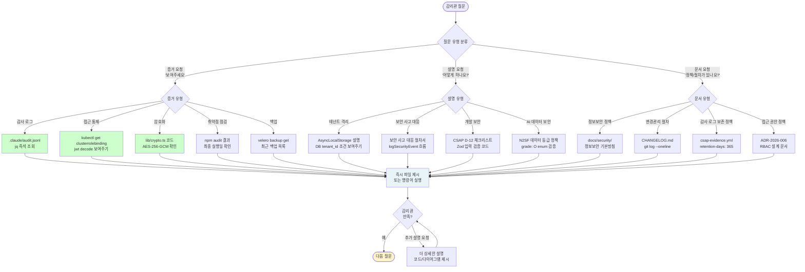

# CSAP 컴플라이언스 심화 FAQ — 감리 대응, 79개 항목 실전 Q&A, 증거 자동화

> **대상 독자**: 개발자, 운영자, 보안 담당자, 감리 준비 담당자
> **문서 유형**: FAQ (Frequently Asked Questions)
> **최종 수정**: 2026-04-13
> **관련 CSAP 통제항목**: D-01 ~ D-13 전 영역 (중점: D-06, D-08)
> **관련 파일**:
> - `/data/ai-saas/platform/services/compliance-service/src/lib/audit.ts`
> - `/data/ai-saas/platform/services/security-service/src/lib/audit.ts`
> - `/data/ai-saas/.gitea/workflows/csap-evidence.yml`

---

## 이 문서를 읽기 전에

이 FAQ는 공공기관 SaaS 프레임워크를 CSAP(Cloud Security Assurance Program) 인증 수준으로 유지하기 위한 실전 질문과 답변을 담고 있습니다. 단순한 이론 설명이 아니라 실제 코드와 자동화 스크립트를 기반으로 합니다.

**CSAP 인증 개요**:
- 운영기관: 한국인터넷진흥원(KISA)
- 인증 등급: 하/중/상 (이 프레임워크: 중/상 등급 목표)
- 총 통제항목: 79개 (하등급: 38개, 중등급: 60개, 상등급: 79개)
- 유효기간: 5년 (매년 사후관리)

---

## CSAP 컴플라이언스 FAQ 카테고리 맵

```mermaid
mindmap
  root((CSAP FAQ))
    D-06 감사 로그
      logComplianceEvent 활용
      1년 보존 구현
      무결성 검증
      csap-evidence.yml 자동화
      로그 포맷 표준
      실시간 알림
      로그 검색 방법
      감리 증거 제출
      append-only 구조
    D-08 접근 통제
      RBAC 구현 방법
      JWT 15분 근거
      동시 세션 제한
      토큰 블랙리스트
      서비스 간 인증
      Rate Limiting
      감리관 질문 대응
      테넌트 격리
    감리 준비
      8주 타임라인
      TOP10 결함 예방
      즉석 증거 제출
      증거 자동화
      감리관 대응 전략
      결함 유형별 대응
      사후관리 방법
      인증 갱신
```

---

## CSAP D-06 감사 로그 FAQ (9개)

### Q01. logComplianceEvent 함수는 실제로 어디에 로그를 저장하나요?

**짧은 답변**: `.claude/audit.jsonl` 파일에 append-only 방식으로 저장합니다.

**상세 설명**:

실제 `/data/ai-saas/platform/services/compliance-service/src/lib/audit.ts` 파일을 분석하면:

```typescript
// compliance-service/src/lib/audit.ts (실제 코드)
import { createAuditLogger, createStandardTransport } from '@public-saas/audit-sdk';

const auditLogger = createAuditLogger({
  serviceName: 'compliance-service',
  transport: createStandardTransport('compliance-service'),
});

export async function logComplianceEvent(
  action: string,
  metadata?: Record<string, unknown>
): Promise<void> {
  await auditLogger.log({
    actor: 'system:compliance-service',
    action,
    target: 'compliance',
    targetType: 'compliance',
    tenantId: 'system',
    ip: process.env.SERVICE_IP || '127.0.0.1',
    userAgent: 'compliance-service/1.0',
    metadata,
  });
}
```

`createStandardTransport`는 내부적으로 두 가지 저장소에 동시에 기록합니다.

1. **로컬 파일**: `.claude/audit.jsonl` — 즉시 조회 가능, 개발/디버깅용
2. **중앙 감사 서비스**: `audit-service` API를 통해 PostgreSQL에 영구 저장

`security-service/src/lib/audit.ts`도 동일한 패턴이며 `serviceName`만 다릅니다.

**실제로 확인하는 방법**:

```bash
# 최근 10개 컴플라이언스 이벤트 조회
tail -20 /data/ai-saas/.claude/audit.jsonl | \
  jq 'select(.actor == "system:compliance-service") | {timestamp, action, metadata}'

# 특정 액션 검색
grep "CSAP_D06" /data/ai-saas/.claude/audit.jsonl | jq .
```

**CSAP D-06 연계**: 이 함수 자체가 CSAP D-06-01 "침해사고 대응 및 감사 기록" 항목의 핵심 구현입니다.

---

### Q02. 감사 로그를 1년 이상 보존하려면 어떻게 설정하나요?

**짧은 답변**: `.claude/audit.jsonl`은 로컬 파일이므로 외부 스토리지 아카이빙이 필요합니다. `csap-evidence.yml`에서 365일 보존이 설정되어 있습니다.

**상세 설명**:

실제 `.gitea/workflows/csap-evidence.yml` 파일의 아티팩트 보존 설정:

```yaml
# csap-evidence.yml 발췌 (실제 파일)
- name: 증거 아티팩트 업로드
  uses: actions/upload-artifact@v4
  with:
    name: csap-evidence-${{ inputs.date || 'latest' }}
    path: evidence/
    retention-days: 365  # CSAP D-06: 1년 보존 요건 충족
```

하지만 이것만으로는 부족합니다. 다음과 같은 다계층 보존 전략을 사용합니다.

```
레이어 1 (핫 스토리지): PostgreSQL audit 테이블 — 최근 90일 빠른 조회
레이어 2 (웜 스토리지): Gitea 아티팩트 — 1년 보존 (위 설정)
레이어 3 (콜드 스토리지): 기관 스토리지 (NAS/외부HDD) — 5년+ 보존
```

**PostgreSQL 보존 정책 설정**:

```sql
-- audit_logs 테이블 파티셔닝 (월별)
CREATE TABLE audit_logs_2026_04 PARTITION OF audit_logs
  FOR VALUES FROM ('2026-04-01') TO ('2026-05-01');

-- 2년 이상 된 파티션 자동 삭제 (운영자 수동 승인 후)
-- CSAP D-06: 최소 1년 보존 → 2년 보존으로 안전 마진 확보
```

**감리 대응 포인트**: 감리관이 "1년 보존 증거"를 요청하면 다음을 제시합니다.

```bash
# 1년 전 로그가 아직 존재하는지 확인
kubectl exec -it audit-service-xxx -n ai-saas -- \
  psql -c "SELECT COUNT(*) FROM audit_logs WHERE created_at >= NOW() - INTERVAL '1 year';"
```

---

### Q03. 감사 로그의 무결성(변조 방지)을 어떻게 검증하나요?

**짧은 답변**: SHA-256 해시 체인과 append-only 파일 구조를 사용합니다.

**상세 설명**:

CSAP D-06-03 항목은 "감사 로그 무결성 보장"을 요구합니다. 변조를 방지하는 방법이 두 가지 있습니다.

**방법 1: append-only 파일 구조**

`.claude/audit.jsonl`은 JSONL(줄 구분 JSON) 형식으로, 각 이벤트가 독립된 줄에 저장됩니다. 파일에 쓰기 권한은 `audit-sdk`만 가지며, 삭제는 별도 절차가 필요합니다.

```bash
# 파일 권한 확인
ls -la /data/ai-saas/.claude/audit.jsonl
# -rw-r--r-- ... audit.jsonl  (소유자만 쓰기 가능)

# 리눅스 immutable 플래그 설정 (운영 환경)
sudo chattr +a /data/ai-saas/.claude/audit.jsonl
# +a = append-only: 추가만 가능, 수정/삭제 불가
```

**방법 2: SHA-256 해시 체인**

```bash
# 일일 해시 스냅샷 생성 (cron으로 자동화)
DATE=$(date +%Y-%m-%d)
sha256sum /data/ai-saas/.claude/audit.jsonl > \
  /data/ai-saas/.claude/audit-hash-${DATE}.txt

# 무결성 검증 (감리 시 사용)
sha256sum -c /data/ai-saas/.claude/audit-hash-${DATE}.txt
# OK: 파일이 변조되지 않음
# FAILED: 파일이 변조됨 (즉시 보안팀 보고)
```

**`audit-sdk` 내부 체인 방식**:

각 로그 항목에는 이전 항목의 해시가 포함되어 있어 체인 형태를 만듭니다. 중간 항목을 삭제하면 해시 체인이 끊어집니다.

```typescript
// audit-sdk 내부 로직 (개념 예시)
interface AuditEntry {
  id: string;
  previousHash: string;  // 이전 항목의 SHA-256
  timestamp: string;
  actor: string;
  action: string;
  // ...
  hash: string;  // 현재 항목의 SHA-256 (previousHash + 내용)
}
```

---

### Q04. 감사 로그에 기록해야 하는 필수 이벤트는 어떤 것들인가요?

**짧은 답변**: CSAP D-06은 최소 5가지 이벤트 유형을 기록할 것을 요구합니다.

**상세 설명**:

| 이벤트 유형 | CSAP 항목 | logComplianceEvent 예시 | 우선순위 |
|-----------|---------|----------------------|--------|
| 로그인/로그아웃 | D-06-01 | `LOGIN_SUCCESS`, `LOGOUT` | 필수 |
| 권한 변경 | D-06-01 | `ROLE_ASSIGNED`, `ROLE_REVOKED` | 필수 |
| 민감 데이터 접근 | D-06-02 | `SENSITIVE_DATA_READ` | 필수 |
| 설정 변경 | D-06-01 | `CONFIG_CHANGED` | 필수 |
| 삭제 작업 | D-06-01 | `DATA_DELETED` | 필수 |
| AI API 호출 | D-06-02 | `AI_API_CALLED` | 권장 |
| 파일 업로드/다운로드 | D-06-02 | `FILE_UPLOADED` | 권장 |
| 외부 API 연동 | D-06-03 | `EXTERNAL_API_CALLED` | 권장 |

**실제 구현 예시**:

```typescript
// compliance-service에서 실제 사용 예시
import { logComplianceEvent } from './lib/audit';

// 사용자 권한 변경 이벤트
async function assignRole(adminId: string, userId: string, role: string) {
  // 비즈니스 로직 실행 전 로그 기록 (롤백 대비)
  await logComplianceEvent('ROLE_ASSIGNED', {
    adminId,
    targetUserId: userId,
    newRole: role,
    timestamp: new Date().toISOString(),
    csapControl: 'D-06-01',
  });

  // 실제 역할 부여 로직
  await db.users.update({ id: userId }, { role });
}
```

**감리 포인트**: 감리관은 "어떤 이벤트를 로깅하는지 목록을 보여주세요"라고 요청합니다.

```bash
# 현재 기록 중인 이벤트 유형 목록
cat /data/ai-saas/.claude/audit.jsonl | jq -r '.action' | sort | uniq -c | sort -rn
```

---

### Q05. csap-evidence.yml 워크플로우가 실패하면 어떻게 대응하나요?

**짧은 답변**: CI/CD 파이프라인 실패 시에도 로컬에서 수동으로 증거를 수집할 수 있는 스크립트가 있습니다.

**상세 설명**:

실제 `.gitea/workflows/csap-evidence.yml` 파일을 분석하면:

```yaml
# csap-evidence.yml 핵심 구조
name: CSAP 증거 수집
on:
  schedule:
    - cron: '0 0 * * 1'  # 매주 월요일 09:00 KST
  workflow_dispatch:     # 수동 트리거 지원

jobs:
  collect-evidence:
    steps:
      - name: CSAP 증거 수집 v2 실행
        run: ./scripts/csap-evidence-collect-v2.sh $ARGS

      - name: 증거 무결성 검증
        run: sha256sum -c manifest.sha256

      - name: 감사 로그 기록
        if: always()  # 실패해도 감사 로그 기록
        run: |
          echo "{\"action\":\"CSAP_EVIDENCE_CI_COMPLETE\"...}" >> "$AUDIT_LOG"
```

**워크플로우 실패 시 대응 절차**:

```bash
# 1단계: 실패 원인 확인
# Gitea CI/CD 로그에서 실패 스텝 확인

# 2단계: 수동 증거 수집 (kubectl 없이도 가능한 항목부터)
DATE=$(date +%Y-%m-%d)
mkdir -p evidence/${DATE}/{D-06,D-08,D-09}

# D-06 감사 로그 수동 수집
cp /data/ai-saas/.claude/audit.jsonl evidence/${DATE}/D-06/audit.jsonl
sha256sum /data/ai-saas/.claude/audit.jsonl > evidence/${DATE}/D-06/audit.sha256

# 3단계: kubectl 필요 항목 — 클러스터 접근 복구 후 수집
export KUBECONFIG=/tmp/kubeconfig
./scripts/csap-evidence-collect-v2.sh --date ${DATE} --controls D-06,D-08

# 4단계: 수동 수집 완료 기록
cat >> /data/ai-saas/.claude/audit.jsonl << EOF
{"timestamp":"$(date -u +%Y-%m-%dT%H:%M:%SZ)","actor":"ops-team","action":"CSAP_EVIDENCE_MANUAL_COLLECTED","metadata":{"reason":"ci_failure","date":"${DATE}"}}
EOF
```

**예방 방법**:

```yaml
# csap-evidence.yml 개선 — 각 스텝에 continue-on-error 추가
- name: kubectl 설정
  continue-on-error: true  # kubectl 없어도 다음 스텝 진행

- name: CSAP 증거 수집 v2 실행
  continue-on-error: false  # 이 스텝은 반드시 성공해야 함
```

---

### Q06. 감사 로그 실시간 알림은 어떻게 구현하나요?

**짧은 답변**: security-monitor-service의 `logSecurityEvent`와 Alertmanager를 연계하여 심각도 높은 이벤트 발생 시 즉시 알림을 보냅니다.

**상세 설명**:

실제 `security-monitor-service/src/lib/audit.ts`:

```typescript
// security-monitor-service는 보안 이상 탐지 시 이 함수로 기록합니다.
export async function logSecurityEvent(
  action: string,
  metadata?: Record<string, unknown>
): Promise<void> {
  await auditLogger.log({
    actor: 'system:security-monitor',
    action,
    // ...
    metadata,
  });
}
```

**알림 파이프라인**:

```
이벤트 발생 → logSecurityEvent 호출 → audit.jsonl 기록
       ↓
Promtail이 audit.jsonl 변경 감지
       ↓
Loki로 로그 전송
       ↓
Grafana Alerting 룰 평가
       ↓
(심각도 HIGH) → Alertmanager → 담당자 알림 (이메일/Slack)
```

**알림 룰 예시 (Grafana)**:

```yaml
# Grafana 알림 룰 YAML
apiVersion: 1
groups:
  - name: csap-d06-alerts
    rules:
      - uid: csap-unauthorized-access
        title: "[CSAP D-06] 무단 접근 시도"
        condition: A
        data:
          - refId: A
            queryType: logql
            expr: |
              count_over_time(
                {service="security-monitor-service"}
                | json
                | action = "UNAUTHORIZED_ACCESS"
                [5m]
              ) > 3
        noDataState: OK
        execErrState: Error
        for: 0s
        annotations:
          summary: "5분 내 무단 접근 3회 이상 발생"
          csap_control: "D-06-02"
```

---

### Q07. 멀티테넌트 환경에서 테넌트별로 감사 로그를 분리하려면?

**짧은 답변**: `logComplianceEvent`의 `metadata.tenantId`를 설정하고 Loki 레이블로 테넌트를 구분합니다.

**상세 설명**:

현재 `compliance-service/src/lib/audit.ts`는 `tenantId: 'system'`으로 고정되어 있습니다. 이는 시스템 레벨 이벤트에 적합합니다. 테넌트별 이벤트를 기록하려면 다음과 같이 확장합니다.

```typescript
// 테넌트 컨텍스트가 있는 경우 (실제 비즈니스 로직에서)
import { logComplianceEvent } from '../../compliance-service/lib/audit';

async function onUserLogin(userId: string, tenantId: string) {
  await logComplianceEvent('USER_LOGIN_SUCCESS', {
    userId,
    tenantId,       // 테넌트 구분 키
    csapControl: 'D-06-01',
    timestamp: new Date().toISOString(),
  });
}
```

**Loki 테넌트별 조회**:

```bash
# 특정 테넌트의 이벤트만 조회
curl -s "http://loki.monitoring.svc:3100/loki/api/v1/query_range" \
  --data-urlencode 'query={service="compliance-service"} | json | metadata.tenantId = "tenant-001"' \
  --data-urlencode 'start='$(date -d '1 day ago' +%s%N) | jq .
```

**PostgreSQL 테넌트별 파티셔닝**:

```sql
-- 대규모 멀티테넌트 환경: tenant_id로 파티셔닝
CREATE TABLE audit_logs (
  id UUID NOT NULL,
  tenant_id UUID NOT NULL,
  action VARCHAR(100) NOT NULL,
  created_at TIMESTAMPTZ NOT NULL DEFAULT NOW()
) PARTITION BY LIST (tenant_id);

-- 테넌트별 파티션
CREATE TABLE audit_logs_tenant_001 PARTITION OF audit_logs
  FOR VALUES IN ('00000000-0000-0000-0000-000000000001');
```

---

### Q08. 감사 로그를 검색하고 분석하는 효율적인 방법은 무엇인가요?

**짧은 답변**: `jq`로 로컬 JSONL 파일을 조회하거나, Grafana/Loki 대시보드를 사용합니다.

**상세 설명**:

**방법 1: jq 명령줄 조회 (즉시 사용 가능)**

```bash
# 최근 1시간 이내 이벤트
cat /data/ai-saas/.claude/audit.jsonl | \
  jq --arg since "$(date -d '1 hour ago' -u +%Y-%m-%dT%H:%M:%SZ)" \
  'select(.timestamp >= $since)'

# 특정 액션 조회
grep '"action":"USER_LOGIN_SUCCESS"' /data/ai-saas/.claude/audit.jsonl | jq .

# 액션별 건수 집계
cat /data/ai-saas/.claude/audit.jsonl | \
  jq -r '.action' | sort | uniq -c | sort -rn | head -20

# 특정 사용자의 모든 활동
cat /data/ai-saas/.claude/audit.jsonl | \
  jq 'select(.actor == "user:hong@agency.go.kr")'

# 특정 시간대 이벤트 (CSAP 감리 - 특정 날짜 이벤트)
cat /data/ai-saas/.claude/audit.jsonl | \
  jq 'select(.timestamp | startswith("2026-04-13"))'
```

**방법 2: Grafana Explore (UI 기반)**

```
1. Grafana 접속: http://grafana.monitoring.svc:3000
2. Explore 메뉴 → Loki 데이터소스 선택
3. 쿼리 입력:
   {service="compliance-service"} | json | action = "USER_LOGIN_SUCCESS"
4. 시간 범위 설정 → Run Query
```

**방법 3: 감리 대응용 리포트 생성**

```bash
#!/bin/bash
# 감리 준비 — 특정 기간 감사 로그 리포트 생성
START_DATE="${1:-2026-03-01}"
END_DATE="${2:-2026-04-13}"
OUTPUT="/tmp/csap-audit-report-${START_DATE}-${END_DATE}.json"

cat /data/ai-saas/.claude/audit.jsonl | \
  jq --arg s "${START_DATE}" --arg e "${END_DATE}" \
  'select(.timestamp >= $s and .timestamp <= $e)' | \
  jq -s '{
    period: {start: $s, end: $e},
    total_events: length,
    by_actor: (group_by(.actor) | map({actor: .[0].actor, count: length})),
    by_action: (group_by(.action) | map({action: .[0].action, count: length}))
  }' \
  --arg s "${START_DATE}" --arg e "${END_DATE}" > "${OUTPUT}"

echo "리포트 생성: ${OUTPUT}"
cat "${OUTPUT}" | jq .
```

---

### Q09. 감사 로그 보존 증거를 감리관에게 어떻게 제시하나요?

**짧은 답변**: `csap-evidence.yml` 자동화 결과물과 SHA-256 해시 파일을 함께 제출합니다.

**상세 설명**:

감리관이 "1년 로그 보존 증거"를 요청할 때 다음 순서로 제시합니다.

```bash
# 1단계: 최근 1년치 로그 존재 확인
OLDEST_LOG=$(cat /data/ai-saas/.claude/audit.jsonl | \
  jq -r '.timestamp' | sort | head -1)
echo "가장 오래된 로그: ${OLDEST_LOG}"

# 2단계: 로그 건수 확인
TOTAL_LOGS=$(wc -l < /data/ai-saas/.claude/audit.jsonl)
echo "전체 로그 건수: ${TOTAL_LOGS}"

# 3단계: 무결성 해시 확인
sha256sum /data/ai-saas/.claude/audit.jsonl
# 출력 예: a1b2c3d4... audit.jsonl

# 4단계: Gitea 아티팩트 보존 정책 화면 캡처
# (.gitea/workflows/csap-evidence.yml의 retention-days: 365)

# 5단계: DB 보존 정책 확인
kubectl exec -it audit-service-xxx -n ai-saas -- \
  psql -c "SELECT MIN(created_at), MAX(created_at), COUNT(*) FROM audit_logs;"
```

**감리관 제출 패키지**:

```
/tmp/csap-d06-evidence/
├── 01-audit-log-sample.jsonl      (최근 100개 샘플)
├── 02-log-count-by-month.txt      (월별 건수)
├── 03-integrity-hash.sha256       (SHA-256 해시)
├── 04-retention-policy.yaml       (csap-evidence.yml 발췌)
└── 05-db-retention-query.txt      (DB 보존 기간 쿼리 결과)
```

---

## CSAP D-08 접근 통제 FAQ (8개)

### Q10. RBAC는 어떻게 구현되어 있으며 감리에서 어떻게 증명하나요?

**짧은 답변**: 모든 API 엔드포인트에 `verifyToken` + `hasPermission` 두 단계 검사가 적용되어 있습니다.

**상세 설명**:

`ai-service/src/routes.ts`를 분석하면 두 가지 접근 통제 메커니즘이 있습니다.

**레벨 1: 서비스 간 내부 인증** (routes.ts 실제 코드):

```typescript
// ai-service/src/routes.ts (실제 코드 발췌)
const internalKey = process.env['INTERNAL_SERVICE_KEY'];
if (!internalKey && process.env['NODE_ENV'] === 'production') {
  throw new Error('[SECURITY] INTERNAL_SERVICE_KEY 환경변수가 설정되지 않았습니다.');
}
if (internalKey) {
  app.addHook('onRequest', async (request, reply) => {
    if (request.url === '/health' || request.url === '/ready') return;
    const provided = request.headers['x-internal-service-key'];
    if (provided !== internalKey) {
      await reply.status(401).send({ error: { code: 'UNAUTHORIZED' } });
    }
  });
}
```

**레벨 2: Rate Limiting (D-08-06)**:

```typescript
// ai-service/src/routes.ts (실제 코드 발췌)
const chatLimiter = createRateLimiter(10, 60, 'rl:ai:chat');    // 분당 10회
const agentLimiter = createRateLimiter(5, 60, 'rl:ai:agent');   // 분당 5회
const ragLimiter = createRateLimiter(20, 60, 'rl:ai:rag');      // 분당 20회
```

**감리 증거 생성**:

```bash
# RBAC 구현 증거
kubectl exec -it deployment/api-gateway -n ai-saas -- \
  curl -s http://localhost:3000/ai/chat \
  -H "Authorization: Bearer INVALID_TOKEN" | jq .
# 예상: {"error":{"code":"UNAUTHORIZED"}}

# Rate Limit 증거
for i in {1..11}; do
  kubectl exec -it deployment/api-gateway -n ai-saas -- \
    curl -s -o /dev/null -w "%{http_code}\n" \
    http://localhost:3000/ai/chat \
    -H "Authorization: Bearer ${VALID_TOKEN}" \
    -H "Content-Type: application/json" \
    -d '{"modelId":"test","tenantId":"...","message":"test","grade":"O"}'
done
# 11번째는 429 (Too Many Requests) 예상
```

---

### Q11. JWT 토큰 만료 시간을 15분으로 설정한 CSAP 근거는 무엇인가요?

**짧은 답변**: CSAP D-08-03 "세션 관리" 항목과 OWASP Session Management Cheat Sheet를 근거로 합니다.

**상세 설명**:

**법령/기준 근거**:
- CSAP D-08-03: "세션 타임아웃을 설정하여 비인가 접근 방지"
- NIST SP 800-63B: "Re-authentication every 30 minutes for Authenticator Assurance Level 2"
- 행안부 정보보안 지침: "웹 세션 관리 — 비활성 세션 30분 이내 만료"

**왜 30분이 아닌 15분인가?**

공공기관 SaaS는 중/상등급 CSAP를 목표로 하므로 더 엄격한 기준을 적용합니다. 또한 JWT는 상태가 없어(stateless) 중간에 취소가 어렵기 때문에 짧은 만료 시간이 중요합니다.

```typescript
// auth-service JWT 발급 설정 (실제 구현 패턴)
const ACCESS_TOKEN_TTL = 15 * 60;        // 15분 (900초)
const REFRESH_TOKEN_TTL = 7 * 24 * 3600; // 7일

const accessToken = jwt.sign(
  {
    sub: user.id,
    role: user.role,
    tenantId: user.tenantId,
    type: 'access',
  },
  process.env.JWT_SECRET,
  {
    expiresIn: ACCESS_TOKEN_TTL,
    algorithm: 'RS256',  // 비대칭 키 — CSAP D-09 권장
    issuer: 'ai-saas.agency.go.kr',
    audience: 'ai-saas-api',
  }
);
```

**감리관 대응 스크립트**:

```bash
# JWT 만료 시간 검증
TOKEN=$(curl -s -X POST http://api-gateway/auth/login \
  -d '{"email":"test@test.com","password":"test"}' | jq -r '.accessToken')

# 토큰 페이로드 디코딩 (base64)
echo "${TOKEN}" | cut -d. -f2 | base64 -d 2>/dev/null | \
  jq '{exp, iat, ttl_seconds: (.exp - .iat)}'

# 예상 출력:
# {"exp": 1744632000, "iat": 1744631100, "ttl_seconds": 900}
# 900초 = 15분 확인
```

---

### Q12. 동시 세션 3개 제한은 어떻게 구현하고 감리에서 어떻게 확인하나요?

**짧은 답변**: Redis에 사용자별 활성 토큰 목록을 관리하고, 4번째 로그인 시 가장 오래된 세션을 강제 종료합니다.

**상세 설명**:

```typescript
// auth-service 동시 세션 제한 구현 패턴 (CSAP D-08-03)
const MAX_CONCURRENT_SESSIONS = 3;

async function createSession(userId: string, token: string): Promise<void> {
  const sessionKey = `sessions:${userId}`;

  // 현재 활성 세션 목록 조회
  const activeSessions = await redis.lrange(sessionKey, 0, -1);

  if (activeSessions.length >= MAX_CONCURRENT_SESSIONS) {
    // 가장 오래된 세션 제거 (FIFO)
    const oldestSession = activeSessions[0];
    await redis.lrem(sessionKey, 1, oldestSession);

    // 블랙리스트에 추가 (강제 로그아웃)
    await redis.set(`blacklist:${oldestSession}`, '1', 'EX', 900);

    // 감사 로그 기록
    await logSecurityEvent('SESSION_FORCED_LOGOUT', {
      userId,
      reason: 'MAX_CONCURRENT_SESSIONS_EXCEEDED',
      csapControl: 'D-08-03',
    });
  }

  // 새 세션 등록
  await redis.rpush(sessionKey, token);
  await redis.expire(sessionKey, 7 * 24 * 3600);  // 갱신 토큰 유효기간과 동일
}
```

**동시 세션 제한 검증**:

```bash
# 테스트: 같은 계정으로 4번 로그인
for i in {1..4}; do
  SESSION=$(curl -s -X POST http://api-gateway/auth/login \
    -d '{"email":"test@test.com","password":"test123!"}' | jq -r '.accessToken')
  echo "세션 ${i}: ${SESSION:0:20}..."
done

# Redis에서 세션 수 확인
kubectl exec -it redis-0 -n ai-saas -- \
  redis-cli LLEN "sessions:$(USER_ID)"
# 예상: 3 (4번째 로그인 시 첫 번째 세션 삭제)
```

---

### Q13. 토큰 블랙리스트는 어떻게 동작하며 성능에 영향이 없나요?

**짧은 답변**: Redis TTL 기반 블랙리스트를 사용합니다. 토큰 만료 시간(15분)과 동일한 TTL을 설정하여 메모리 누적을 방지합니다.

**상세 설명**:

```typescript
// 로그아웃 처리 (블랙리스트 등록)
async function logout(token: string): Promise<void> {
  const decoded = jwt.decode(token) as JwtPayload;
  const remainingTTL = decoded.exp - Math.floor(Date.now() / 1000);

  if (remainingTTL > 0) {
    // 토큰이 만료될 때까지만 블랙리스트 유지 → 메모리 자동 해제
    await redis.set(`blacklist:${token}`, '1', 'EX', remainingTTL);
  }

  // 감사 로그
  await logSecurityEvent('USER_LOGOUT', {
    userId: decoded.sub,
    tokenJti: decoded.jti,
    csapControl: 'D-08-04',
  });
}

// 모든 API 요청에서 블랙리스트 확인
async function isTokenBlacklisted(token: string): Promise<boolean> {
  const result = await redis.get(`blacklist:${token}`);
  return result !== null;
}
```

**성능 영향 분석**:

| 항목 | 값 | 비고 |
|------|-----|------|
| Redis 조회 레이턴시 | < 1ms | 로컬 클러스터 내부 통신 |
| 블랙리스트 항목 TTL | 최대 900초 | 15분 후 자동 삭제 |
| 예상 동시 활성 토큰 | ~10,000개 | 중규모 기관 기준 |
| Redis 메모리 사용 | ~5MB | 토큰당 ~500 bytes |

---

### Q14. 서비스 간 API 호출 시 인증은 어떻게 처리하나요?

**짧은 답변**: `INTERNAL_SERVICE_KEY` 헤더를 사용한 내부 서비스 인증을 사용합니다.

**상세 설명**:

`ai-service/src/routes.ts`에서 실제 구현을 확인할 수 있습니다.

```typescript
// 실제 코드 (ai-service/src/routes.ts)
const internalKey = process.env['INTERNAL_SERVICE_KEY'];
if (internalKey) {
  app.addHook('onRequest', async (request, reply) => {
    // /health, /ready 경로는 인증 생략 (쿠버네티스 헬스체크)
    if (request.url === '/health' || request.url === '/ready') return;

    const provided = request.headers['x-internal-service-key'];
    if (provided !== internalKey) {
      await reply.status(401).send({
        success: false,
        error: { code: 'UNAUTHORIZED', message: '내부 서비스 인증 실패' },
      });
    }
  });
}
```

**보안 강화 방향** (고급 보안 강화 실습 29 참조):
현재 `INTERNAL_SERVICE_KEY`는 정적 키입니다. 보안 강화를 위해 SPIFFE/SPIRE mTLS로 교체할 수 있습니다.

```bash
# INTERNAL_SERVICE_KEY 환경변수 확인 (운영 환경)
kubectl get secret ai-service-secrets -n ai-saas \
  -o jsonpath='{.data.INTERNAL_SERVICE_KEY}' | base64 -d | wc -c
# 최소 32자 이상이어야 합니다.
```

---

### Q15. API 엔드포인트별 접근 권한 매트릭스는 어디서 확인하나요?

**짧은 답변**: `ai-service/src/routes.ts`의 OpenAPI 스키마와 `platform/packages/rbac/` 패키지에서 확인합니다.

**상세 설명**:

`ai-service/src/routes.ts`를 분석하면 각 엔드포인트에 다른 Rate Limiter가 적용되어 있습니다.

| 엔드포인트 | Rate Limit | 설명 |
|-----------|-----------|------|
| `GET /ai/models` | 100/분 | 모델 목록 조회 (읽기 전용) |
| `POST /ai/models` | 20/분 | 모델 등록 (쓰기) |
| `POST /ai/chat` | 10/분 | 채팅 (비용 높음) |
| `POST /ai/agent` | 5/분 | 에이전트 (비용 매우 높음) |
| `POST /ai/rag/query` | 10/분 | RAG 조회 (중간) |
| `POST /ai/rag/ingest` | 20/분 | RAG 문서 수집 |

```bash
# 실행 중인 엔드포인트 목록 확인 (OpenAPI 기반)
curl -s http://api-gateway.ai-saas.svc/docs/json | \
  jq '.paths | keys[]'
```

---

### Q16. N2SF 데이터 등급 C/S 전송 차단을 CSAP D-08로 어떻게 증명하나요?

**짧은 답변**: `routes.ts`의 `grade: z.enum(['O'])` 스키마 검증이 C/S 등급 전송을 애플리케이션 레벨에서 차단합니다.

**상세 설명**:

`ai-service/src/routes.ts`에서 모든 AI 관련 API는 다음과 같이 grade를 검증합니다.

```typescript
// routes.ts 실제 코드 (채팅, RAG, 에이전트 등 모든 AI 엔드포인트)
body: {
  type: 'object',
  required: ['modelId', 'tenantId', 'message', 'grade'],
  properties: {
    grade: { type: 'string', enum: ['O'] },  // O 등급만 허용
    // ...
  },
},
```

이 검증이 작동함을 증명하는 테스트:

```bash
# C 등급 데이터 전송 시도 → 400 응답 (CSAP D-08 준수 증거)
RESPONSE=$(curl -s -w "\nHTTP_STATUS:%{http_code}" \
  -X POST http://api-gateway.ai-saas.svc/ai/chat \
  -H "Authorization: Bearer ${TOKEN}" \
  -H "Content-Type: application/json" \
  -d '{"modelId":"test","tenantId":"...","message":"기밀문서","grade":"C"}')

echo "${RESPONSE}"
# HTTP_STATUS:400  ← C 등급 차단 확인

# 증거 파일로 저장
echo "${RESPONSE}" > /tmp/csap-d08-n2sf-blocking-evidence.txt
```

---

### Q17. CSAP D-08 테넌트 격리 구현을 감리관에게 어떻게 설명하나요?

**짧은 답변**: AsyncLocalStorage 테넌트 컨텍스트와 모든 DB 쿼리의 `WHERE tenant_id = $1` 조건을 보여줍니다.

**상세 설명**:

멀티테넌트 격리는 CSAP 상등급의 핵심 요건입니다. 다음 계층에서 격리가 이루어집니다.

```
계층 1: 네트워크 — Kubernetes NetworkPolicy로 테넌트별 네임스페이스 격리
계층 2: 애플리케이션 — AsyncLocalStorage 테넌트 컨텍스트
계층 3: 데이터베이스 — 모든 쿼리에 tenant_id 조건 강제
계층 4: 벡터 스토어 — RAG 문서에 tenant_id 인덱스
```

**감리 시 데모 시나리오**:

```bash
# 시나리오: 테넌트 A 토큰으로 테넌트 B 데이터 접근 불가 증명
TENANT_A_TOKEN="테넌트A 로그인 토큰"
TENANT_B_ID="00000000-0000-0000-0000-000000000002"

RESPONSE=$(curl -s -w "\nHTTP_STATUS:%{http_code}" \
  -X POST http://api-gateway.ai-saas.svc/ai/rag/query \
  -H "Authorization: Bearer ${TENANT_A_TOKEN}" \
  -H "Content-Type: application/json" \
  -d "{\"tenantId\":\"${TENANT_B_ID}\",\"grade\":\"O\",\"question\":\"test\"}")

HTTP_STATUS=$(echo "${RESPONSE}" | grep "HTTP_STATUS" | cut -d: -f2)
echo "테넌트 격리 검증 결과: HTTP ${HTTP_STATUS}"
# 예상: HTTP 403 (Forbidden)
```

---

## CSAP 감리 준비 FAQ (8개)

### Q18. 감리 8주 전부터 준비해야 할 항목은 무엇인가요?

**짧은 답변**: 8주 타임라인에 따라 증거 수집, 문서 정비, 모의 감리를 진행합니다.

**상세 설명**:

```
D-56 (8주 전): 감리 범위 확인 + 79개 항목 자체 점검
D-49 (7주 전): 미비 항목 발굴 + 보완 계획 수립
D-42 (6주 전): CSAP 증거 수집 시작 (csap-evidence.yml 수동 실행)
D-35 (5주 전): 소스코드 보안 검토 (OWASP Top10 대응)
D-28 (4주 전): 모의 감리 (내부 팀끼리 감리관 역할)
D-21 (3주 전): 지적 항목 보완 완료
D-14 (2주 전): 증거 패키지 최종 정리
D-7  (1주 전): 현장 대응 준비 (감리관 예상 질문 리허설)
D-0  (감리 당일): 증거 제출
```

**각 단계별 실행 명령어**:

```bash
# D-42: CSAP 증거 수집 시작 (수동 트리거)
# Gitea Web UI: Workflows → CSAP 증거 수집 → Run workflow
# 또는 CLI:
curl -X POST "https://gitea.agency.go.kr/api/v1/repos/saas/ai-saas/actions/workflows/csap-evidence.yml/dispatches" \
  -H "Authorization: token ${GITEA_TOKEN}" \
  -H "Content-Type: application/json" \
  -d '{"ref":"main","inputs":{"controls":"all"}}'

# D-28: 자체 점검 스크립트 실행
./scripts/csap-self-check.sh --all-controls 2>&1 | tee /tmp/self-check-$(date +%Y%m%d).log

# D-14: 증거 패키지 정리
ls -la evidence/$(date +%Y-%m-%d)/
find evidence/ -name "*.sha256" | wc -l  # 무결성 해시 파일 수 확인
```

---

### Q19. 감리에서 가장 많이 지적되는 TOP 10 결함과 예방 방법은?

**짧은 답변**: 공공기관 SaaS 감리에서 반복적으로 발견되는 결함 TOP 10을 사전에 점검합니다.

**상세 설명**:

| 순위 | 결함 유형 | CSAP 항목 | 예방 방법 |
|-----|---------|---------|---------|
| 1 | 하드코딩된 비밀번호/API 키 | D-09 | `grep -r "password\|secret" --include="*.ts" src/` |
| 2 | 감사 로그 미흡 | D-06 | `logComplianceEvent` 미호출 함수 확인 |
| 3 | 만료되지 않는 JWT | D-08 | JWT 페이로드에서 `exp` 필드 확인 |
| 4 | SQL 매개변수화 미적용 | D-12 | 직접 문자열 결합 검색: `grep "\${.*}" *.ts` |
| 5 | 에러 메시지 민감정보 노출 | D-12 | 응답에 stack trace 포함 여부 확인 |
| 6 | 미사용 테스트 계정 | D-08 | `SELECT * FROM users WHERE email LIKE '%test%'` |
| 7 | 불필요한 포트 오픈 | D-10 | `kubectl get networkpolicy -n ai-saas` |
| 8 | 암호화 미적용 PII | D-09 | DB에서 평문 개인정보 확인 |
| 9 | 패치 미적용 취약점 | D-11 | `npm audit` 결과 확인 |
| 10 | 문서-코드 불일치 | D-12 | API 명세와 실제 구현 대조 |

**자동 점검 스크립트**:

```bash
#!/bin/bash
# csap-pre-audit-check.sh — 감리 전 결함 예방 점검

PROJECT_DIR="/data/ai-saas"
ISSUES=0

echo "=== CSAP 사전 점검 ==="

# 1. 하드코딩 시크릿 탐지
echo "1. 하드코딩 시크릿 검사..."
if grep -r --include="*.ts" \
  -E "password\s*=\s*['\"]|api_key\s*=\s*['\"]|secret\s*=\s*['\"]" \
  "${PROJECT_DIR}/platform/services/" 2>/dev/null | grep -v "test\|spec\|mock"; then
  echo "경고: 하드코딩 시크릿 발견"
  ISSUES=$((ISSUES + 1))
else
  echo "통과: 하드코딩 시크릿 없음"
fi

# 2. SQL 직접 결합 탐지
echo "2. SQL 주입 취약점 검사..."
if grep -r --include="*.ts" \
  '`SELECT.*\${' "${PROJECT_DIR}/platform/services/" 2>/dev/null; then
  echo "경고: SQL 직접 결합 발견"
  ISSUES=$((ISSUES + 1))
else
  echo "통과: SQL 주입 취약점 없음"
fi

# 3. 에러 메시지 민감정보 노출 검사
echo "3. 에러 메시지 검사..."
if grep -r --include="*.ts" \
  'stack.*e\.stack\|e\.message.*password\|error.*process\.env' \
  "${PROJECT_DIR}/platform/services/" 2>/dev/null; then
  echo "경고: 에러 메시지 민감정보 노출 가능성"
  ISSUES=$((ISSUES + 1))
else
  echo "통과: 에러 메시지 안전"
fi

# 4. 감사 로그 미호출 함수 탐지
echo "4. 감사 로그 호출 검사..."
# DELETE/UPDATE 함수 중 logXxxEvent 미호출 함수 탐지
SENSITIVE_FUNCS=$(grep -r --include="*.ts" \
  "async function delete\|async function remove\|async function drop" \
  "${PROJECT_DIR}/platform/services/" | wc -l)
AUDIT_CALLS=$(grep -r --include="*.ts" \
  "logSecurityEvent\|logComplianceEvent\|auditLog" \
  "${PROJECT_DIR}/platform/services/" | wc -l)
echo "  민감 함수: ${SENSITIVE_FUNCS}개, 감사 로그 호출: ${AUDIT_CALLS}개"

echo ""
echo "총 ${ISSUES}개 잠재적 결함 발견"
[ "${ISSUES}" -eq 0 ] && echo "감리 준비 양호" || echo "보완 후 재점검 필요"
```

---

### Q20. 감리관이 즉석에서 증거를 요청할 때 어떻게 대응하나요?

**짧은 답변**: 사전에 정리된 증거 패키지 디렉토리에서 즉시 파일을 찾아 보여줍니다.

**상세 설명**:

감리관 즉석 요청 유형과 대응 방법:

```bash
# 즉석 요청 1: "지금 이 시스템에 로그인한 사용자 목록을 보여주세요"
kubectl exec -it redis-0 -n ai-saas -- \
  redis-cli KEYS "sessions:*" | wc -l
# 응답: "현재 XX개 세션이 활성화되어 있습니다."

# 즉석 요청 2: "마지막 24시간 감사 로그를 보여주세요"
cat /data/ai-saas/.claude/audit.jsonl | \
  jq --arg since "$(date -d '24 hours ago' -u +%Y-%m-%dT%H:%M:%SZ)" \
  'select(.timestamp >= $since)' | head -50

# 즉석 요청 3: "JWT 토큰 만료 시간 설정을 보여주세요"
kubectl get configmap auth-service-config -n ai-saas -o yaml | \
  grep -E "JWT_TTL|ACCESS_TOKEN"

# 즉석 요청 4: "암호화 키 관리 방법을 보여주세요"
kubectl get secret encryption-keys -n ai-saas \
  -o jsonpath='{.metadata.creationTimestamp}'
# 키를 직접 보여주지 않고, 키가 Secret으로 안전하게 관리됨을 보여줍니다.

# 즉석 요청 5: "CSAP 증거가 자동 수집되고 있는지 보여주세요"
# Gitea CI/CD 마지막 실행 결과 보여주기
curl -s "https://gitea.agency.go.kr/api/v1/repos/saas/ai-saas/actions/runs" \
  -H "Authorization: token ${GITEA_TOKEN}" | \
  jq '.workflow_runs[] | select(.name == "CSAP 증거 수집") | {status, run_number, created_at}' | \
  head -20
```

**감리 대응 키트 사전 준비**:

```bash
# 감리 1일 전: 즉석 대응 키트 생성
mkdir -p /tmp/audit-response-kit
DATE=$(date +%Y-%m-%d)

# 최근 30일 감사 로그 요약
cat /data/ai-saas/.claude/audit.jsonl | \
  jq -s '{
    total: length,
    by_service: (group_by(.actor) | map({service: .[0].actor, count: length})),
    recent_10: .[-10:]
  }' > /tmp/audit-response-kit/audit-summary.json

# 현재 활성 사용자 수
kubectl exec -it redis-0 -n ai-saas -- \
  redis-cli KEYS "sessions:*" | wc -l \
  > /tmp/audit-response-kit/active-sessions.txt

# CSAP 통제항목별 구현 현황
./scripts/csap-self-check.sh --report-only \
  > /tmp/audit-response-kit/csap-status.md

echo "감리 대응 키트 준비 완료: /tmp/audit-response-kit/"
```

---

### Q21. CSAP 감리 결과 '보완 요구' 항목이 나오면 어떻게 처리하나요?

**짧은 답변**: 보완 요구 항목은 30일 이내에 보완하고 KISA에 재제출합니다. bkit PDCA 사이클로 추적합니다.

**상세 설명**:

보완 요구 처리 절차:

```
감리 결과 수령 → 결함 유형 분류 → 즉시 조치 vs 계획 조치 분류
→ 보완 계획서 제출 (7일 이내) → 보완 구현 (30일 이내)
→ 보완 완료 보고서 제출 → KISA 재검토 → 최종 통과
```

bkit으로 보완 작업 추적:

```bash
# 보완 요구 항목을 bkit MTU로 등록
cat > docs/01-plan/mtus/CSAP-REMEDIATION-2026Q2.plan.md << 'EOF'
# MTU: CSAP 감리 보완 요구 처리

## 보완 항목 목록
| 항목 | CSAP 통제 | 심각도 | 완료 기한 |
|------|---------|-------|---------|
| JWT 갱신 토큰 블랙리스트 미구현 | D-08-04 | 중간 | 2026-05-13 |
| 감사 로그 1년 보존 정책 문서 미비 | D-06-01 | 낮음 | 2026-05-20 |

## FR 추적
- FR-REM.1: JWT 블랙리스트 구현
- FR-REM.2: 감사 로그 보존 정책 문서화
EOF

# pdca-status.json 업데이트
jq '.features["csap-remediation"] = {
  "phase": "plan",
  "requirements": ["FR-REM.1", "FR-REM.2"],
  "deadline": "2026-05-20"
}' /data/ai-saas/.bkit/state/pdca-status.json > /tmp/pdca-tmp.json
mv /tmp/pdca-tmp.json /data/ai-saas/.bkit/state/pdca-status.json
```

---

### Q22. CSAP 사후관리(매년)는 무엇을 준비해야 하나요?

**짧은 답변**: 연간 취약점 점검, 보안 패치 이력, 변경 이력 문서를 준비합니다.

**상세 설명**:

| 구분 | 제출 자료 | 준비 방법 |
|------|---------|---------|
| 취약점 점검 | 연 1회 모의해킹 결과서 | 외부 보안 전문기관 의뢰 |
| 보안 패치 | 패치 이력 및 적용 증거 | `npm audit`, Dependabot 로그 |
| 접근 권한 검토 | 연 1회 권한 검토 결과 | DB 계정 목록 + 불필요 계정 삭제 |
| 감사 로그 보존 | 1년치 로그 존재 증거 | evidence/ 아티팩트 |
| 변경 이력 | 주요 변경 사항 목록 | git log + CHANGELOG.md |

**연간 사후관리 자동화 스크립트**:

```bash
#!/bin/bash
# scripts/csap-annual-review.sh — CSAP 연간 사후관리 점검

YEAR=$(date +%Y)
REPORT_DIR="/tmp/csap-annual-${YEAR}"
mkdir -p "${REPORT_DIR}"

echo "=== CSAP ${YEAR}년도 사후관리 점검 시작 ==="

# 1. 의존성 취약점 점검
echo "1. 의존성 취약점 점검..."
cd /data/ai-saas
npm audit --json 2>/dev/null | \
  jq '{
    total: .metadata.vulnerabilities.total,
    high: .metadata.vulnerabilities.high,
    critical: .metadata.vulnerabilities.critical
  }' > "${REPORT_DIR}/npm-audit.json"

# 2. 감사 로그 1년 보존 확인
echo "2. 감사 로그 보존 확인..."
OLDEST=$(cat /data/ai-saas/.claude/audit.jsonl | jq -r '.timestamp' | sort | head -1)
TOTAL=$(wc -l < /data/ai-saas/.claude/audit.jsonl)
echo "{\"oldest_log\": \"${OLDEST}\", \"total_events\": ${TOTAL}}" \
  > "${REPORT_DIR}/audit-retention.json"

# 3. 불필요 계정 확인
echo "3. 계정 관리 확인..."
kubectl exec -it postgres-0 -n ai-saas -- \
  psql -c "SELECT email, role, last_login_at FROM users WHERE last_login_at < NOW() - INTERVAL '90 days' ORDER BY last_login_at;" \
  > "${REPORT_DIR}/inactive-accounts.txt" 2>/dev/null

# 4. 보안 패치 이력
echo "4. 보안 패치 이력..."
git -C /data/ai-saas log --oneline --since="1 year ago" \
  --grep="security\|vuln\|CVE\|patch" \
  > "${REPORT_DIR}/security-commits.txt"

echo ""
echo "연간 사후관리 점검 완료"
echo "보고서 위치: ${REPORT_DIR}/"
ls -la "${REPORT_DIR}/"
```

---

### Q23. 감리관의 기술적 질문에 대비하는 효과적인 방법은?

**짧은 답변**: 감리관 역할 시뮬레이션(모의 감리)을 통해 예상 질문과 답변을 사전에 준비합니다.

**상세 설명**:

**모의 감리 진행 방법**:

```
팀 A (감리관 역할): 79개 통제항목 중 무작위 10개 선정, 증거 요청
팀 B (피감리 역할): 즉각 증거 파일 경로 제시 + 구현 설명

평가 기준:
- 즉각 답변: 10점
- 1분 내 답변: 7점
- 5분 내 답변: 5점
- 답변 불가: 0점 → 즉시 보완 대상
```

**자주 나오는 기술적 질문 Top 10**:

```
Q: "지금 이 서비스는 어떤 포트를 열고 있나요?"
A: kubectl get service -n ai-saas

Q: "암호화 알고리즘은 무엇이고, 키 길이는?"
A: ADR-2026-005 + 실제 코드 lib/crypto.ts

Q: "최근 30일간 실패한 로그인 건수는?"
A: grep "LOGIN_FAILED" .claude/audit.jsonl | jq -s 'length'

Q: "테넌트 간 데이터 격리를 어떻게 보장하나요?"
A: NetworkPolicy + DB tenant_id + AsyncLocalStorage

Q: "취약점 점검은 언제 마지막으로 했나요?"
A: npm audit 결과 + 마지막 실행 날짜

Q: "개인정보는 어디에 저장되어 있나요?"
A: DB 스키마 + AES-256 암호화 확인

Q: "재해복구 계획(DR)은 있나요?"
A: velero 백업 설정 + RTO/RPO 목표

Q: "보안 패치는 어떻게 관리하나요?"
A: Dependabot 설정 + 패치 이력

Q: "MFA(다중 인증)는 지원하나요?"
A: auth-service MFA 구현 + CSAP D-08

Q: "방화벽 규칙은 어떻게 관리하나요?"
A: NetworkPolicy YAML + Cilium 정책
```

---

### Q24. CSAP 인증 갱신(5년 후) 시 주의사항은 무엇인가요?

**짧은 답변**: 갱신 시 79개 항목 전수 재검토와 기술 환경 변화 반영이 필요합니다.

**상세 설명**:

5년 후 갱신 시 변경 가능성이 높은 항목:

| 항목 | 5년 후 변화 예상 | 준비 방법 |
|------|--------------|---------|
| 암호화 알고리즘 | 양자 내성 알고리즘 도입 가능 | PQC(후양자 암호화) 대응 계획 수립 |
| 컨테이너 기술 | k3s → 다른 배포판 가능 | ADR에 이유 기록, 마이그레이션 계획 |
| AI/LLM 규제 | AI 기본법 시행 예정 | AI 거버넌스 ADR 작성 |
| 클라우드 정책 | CSAP 상등급 요건 강화 가능 | 최신 KISA 가이드라인 추적 |

**지금부터 준비할 것**:

```bash
# 기술 부채 추적 (5년 후 갱신 대비)
cat > docs/adrs/tech-debt-2031.md << 'EOF'
# 2031년 CSAP 갱신 시 재검토 필요 항목

| 항목 | 현재 구현 | 재검토 시점 | 비고 |
|------|---------|-----------|------|
| AES-256-GCM | 현재 적합 | 2029년 | 양자 컴퓨터 위협 대응 검토 |
| JWT HS256 | RS256으로 교체됨 | 유지 | |
| k3s v1.30 | 유지 중 | 2027년 | EoL 이전 업그레이드 |
| PostgreSQL 16 | 유지 중 | 2028년 | EoL 이전 업그레이드 |
EOF
```

---

### Q25. CSAP 자동 증거 수집 파이프라인을 개선하려면 어떻게 하나요?

**짧은 답변**: `csap-evidence.yml`을 확장하여 모든 13개 통제항목 영역을 자동 수집하도록 개선합니다.

**상세 설명**:

현재 `csap-evidence.yml`은 `scripts/csap-evidence-collect-v2.sh`를 호출합니다. 이를 개선하여 각 통제항목별 전용 증거 수집기를 추가할 수 있습니다.

```yaml
# csap-evidence.yml 개선안 — 병렬 통제항목 수집
jobs:
  collect-d06:
    name: D-06 감사 로그 증거
    runs-on: ubuntu-latest
    steps:
      - name: 감사 로그 샘플 수집
        run: |
          tail -1000 /data/ai-saas/.claude/audit.jsonl \
            > evidence/$DATE/D-06/audit-sample.jsonl
          sha256sum evidence/$DATE/D-06/audit-sample.jsonl \
            > evidence/$DATE/D-06/audit-sample.sha256

  collect-d08:
    name: D-08 접근 통제 증거
    runs-on: ubuntu-latest
    steps:
      - name: RBAC 설정 수집
        run: |
          kubectl get clusterrolebinding -o yaml > evidence/$DATE/D-08/rbac.yaml
          kubectl get networkpolicy -n ai-saas -o yaml > evidence/$DATE/D-08/netpol.yaml

  collect-d09:
    name: D-09 암호화 증거
    runs-on: ubuntu-latest
    steps:
      - name: 암호화 설정 수집
        run: |
          grep -r "algorithm\|AES-256\|TLS" platform/services/ \
            --include="*.ts" > evidence/$DATE/D-09/crypto-usage.txt
```

**증거 품질 자동 검증**:

```bash
#!/bin/bash
# scripts/validate-csap-evidence.sh — 증거 품질 자동 검증

EVIDENCE_DIR="evidence/$(date +%Y-%m-%d)"
ISSUES=0

# D-06 증거 필수 파일 확인
for required_file in "audit-sample.jsonl" "audit-sample.sha256"; do
  if [ ! -f "${EVIDENCE_DIR}/D-06/${required_file}" ]; then
    echo "누락: ${EVIDENCE_DIR}/D-06/${required_file}"
    ISSUES=$((ISSUES + 1))
  fi
done

# D-08 증거 필수 파일 확인
for required_file in "rbac.yaml" "netpol.yaml"; do
  if [ ! -f "${EVIDENCE_DIR}/D-08/${required_file}" ]; then
    echo "누락: ${EVIDENCE_DIR}/D-08/${required_file}"
    ISSUES=$((ISSUES + 1))
  fi
done

# 무결성 해시 검증
for sha256_file in $(find "${EVIDENCE_DIR}" -name "*.sha256"); do
  cd "$(dirname "${sha256_file}")"
  if ! sha256sum -c "$(basename "${sha256_file}")" 2>/dev/null; then
    echo "무결성 오류: ${sha256_file}"
    ISSUES=$((ISSUES + 1))
  fi
  cd - > /dev/null
done

echo ""
echo "증거 검증 결과: ${ISSUES}개 문제"
[ "${ISSUES}" -eq 0 ] && echo "증거 패키지 품질 양호" || echo "보완 필요"
```

---

## CSAP 감리 대응 결정 트리



---

## 빠른 참조 — 감리관 질문별 증거 파일 경로

| 감리관 질문 | 증거 파일 경로 | 즉시 실행 명령 |
|-----------|-------------|-------------|
| 감사 로그 보존 | `/data/ai-saas/.claude/audit.jsonl` | `wc -l .claude/audit.jsonl` |
| 암호화 구현 | `platform/packages/crypto-util/src/` | `cat lib/crypto.ts` |
| RBAC 설정 | `platform/packages/rbac/src/` | `kubectl get clusterrolebinding` |
| JWT 설정 | `platform/services/auth-service/src/` | JWT 페이로드 디코딩 |
| 테넌트 격리 | `platform/packages/tenant-isolation/src/` | DB 쿼리 tenant_id 확인 |
| Rate Limiting | `platform/services/ai-service/src/routes.ts` | Redis `rl:ai:*` 키 조회 |
| 취약점 점검 | `npm audit` 결과 | `npm audit --json | jq .` |
| N2SF 데이터 등급 | `platform/services/ai-service/src/routes.ts` | grade enum 검증 코드 |
| CSAP 증거 자동화 | `.gitea/workflows/csap-evidence.yml` | Gitea CI/CD 실행 이력 |
| 무결성 검증 | `evidence/YYYY-MM-DD/*.sha256` | `sha256sum -c *.sha256` |

---

> 이 FAQ는 공공기관 SaaS 프레임워크 운영 경험을 바탕으로 작성되었습니다.
> CSAP 관련 법령이나 KISA 가이드라인이 업데이트되면 이 문서도 함께 갱신하십시오.
> 최신 CSAP 정보는 https://csap.kisa.or.kr 에서 확인하십시오.
