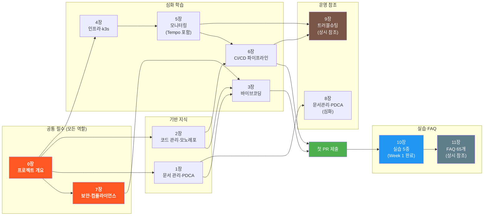

# 공공기관 SaaS 프레임워크 — 신규 직원 온보딩 가이드북

> **문서 ID**: ONBOARD-INDEX
> **버전**: 2.0.0 | **작성일**: 2026-04-12 | **작성자**: Implementer (Sonnet)
> **목적**: 신규 입사자 및 프로젝트 이전 인원의 빠른 온보딩 지원

---

## 가이드북 소개

이 가이드북은 공공기관 SaaS 프레임워크에 합류한 신규 직원이 프로젝트의 기술 체계, 개발 프로세스, 보안 규정을 빠르게 익힐 수 있도록 작성되었습니다.

**프레임워크 핵심 특성**:
- 인증 목표: CSAP 중/상 등급 + 행안부 정보화사업 감리기준 준수
- 런타임: k3s 클러스터 (온프레미스, WSL2 기반)
- CI/CD: Gitea Actions (자체 호스팅)
- 모노레포: pnpm workspace + Node.js 22

**이 가이드북을 읽어야 하는 사람**:
- 신규 입사자 (백엔드, 인프라, 풀스택, PM)
- 타 프로젝트에서 이전한 개발자
- 외부 협력사 직원 (접근 가능한 장만 해당)

---

## 전체 학습 경로 플로우차트

신규 입사자가 프로젝트에 완전히 합류하기까지의 전체 여정을 시각화한 흐름도입니다.


**플로우차트 구성요소 설명**

- **Day 1 (환경 구성)**: 계정 발급, 저장소 클론, `pnpm install`, `.env` 설정으로 시작합니다. `pnpm build`가 성공하는 것을 확인한 후 다음 단계로 진행합니다.
- **0장 필수 선행**: 개별 서비스 코드를 읽기 전에 반드시 전체 아키텍처를 파악해야 합니다. 맥락 없이 마이크로서비스 코드를 보면 방향을 잃기 쉽습니다.
- **7장 2절 조기 숙지**: 보안 규칙을 첫째 날 숙지해야 첫 PR부터 CSAP 위반 없이 작성할 수 있습니다. 나중에 수정하는 것보다 처음부터 올바르게 작성하는 것이 효율적입니다.
- **역할 분기**: 팀원의 역할에 따라 우선 학습할 장이 다릅니다. 그러나 0장, 7장은 모든 역할에 공통 필수입니다.
- **Q-Gate 경험**: 첫 주 안에 G1~G7 전 단계를 직접 통과해 보는 것이 중요합니다. 게이트의 의미를 이해해야 이후 개발에서 자연스럽게 준수할 수 있습니다.

---

## 전체 구조 (3레벨 / 220개 파일 / 177,700줄)

### 루트 파일 — 개요·이력·기여

| 파일 | 주제 | 예상 학습 시간 |
|------|------|--------------|
| [00-overview.md](00-overview.md) | 프로젝트 개요 및 전체 구조 | 30분 |
| [00-project-history.md](00-project-history.md) | 프로젝트 탄생 배경, 기술 선택 이유, ADR-001~010 | 40분 |
| [01-document-management.md](01-document-management.md) | 문서 관리 및 PDCA 사이클 (개요) | 30분 |
| [02-code-management.md](02-code-management.md) | 코드 관리 및 모노레포 (개요) | 30분 |
| [03-vibecoding.md](03-vibecoding.md) | Claude Code 바이브코딩 (개요) | 30분 |
| [04-infrastructure.md](04-infrastructure.md) | 인프라 및 k3s (개요) | 30분 |
| [05-monitoring.md](05-monitoring.md) | 모니터링 및 관측가능성 (개요) | 30분 |
| [06-cicd.md](06-cicd.md) | CI/CD 파이프라인 (개요) | 45분 |
| [07-security-compliance.md](07-security-compliance.md) | 보안 및 컴플라이언스 (개요) | 60분 |
| [00-learning-map.md](00-learning-map.md) | 전체 학습 지도 — 역할별 경로, 선행 관계, 마일스톤, FAQ 색인 | 필독 |
| [12-glossary.md](12-glossary.md) | 용어집 123개 — 가나다 순 전체 프로젝트 용어 | 참조용 |
| [12-glossary-extended.md](12-glossary-extended.md) | 확장 용어집 60개 — 인프라/개발/보안/AI/CSAP 추가 용어 | 참조용 |
| [13-contributing.md](13-contributing.md) | 기여 가이드 — PR, 리뷰, 핫픽스, 신규 서비스 추가 | 30분 |
| [14-quick-reference.md](14-quick-reference.md) | 역할별 1주 학습 플랜, 명령어 치트시트, 보안 체크리스트 | 참조용 |
| [15-onboarding-checklist.md](15-onboarding-checklist.md) | 온보딩 완료 체크리스트 — Week1/2/Month1 + 멘토 서명 | 인쇄용 |

> **3레벨 심화 가이드는 아래 섹션별 폴더를 참조하십시오.**
> 각 폴더의 `README.md`가 해당 섹션의 학습 경로를 안내합니다.

### 01-getting-started/ — 첫 주 시작

신규 입사자가 Day 1에 필요한 모든 내용을 다룹니다.

| 파일 | 주제 | 예상 학습 시간 |
|------|------|--------------|
| [README.md](01-getting-started/README.md) | 섹션 인덱스 | 5분 |
| [01-welcome.md](01-getting-started/01-welcome.md) | 프로젝트 소개, 용어 사전 15개, 역할 설명 | 30분 |
| [02-environment-setup.md](01-getting-started/02-environment-setup.md) | WSL2 + k3s + Claude Code 설치, 오류 7개 해결 | 60분 |
| [03-first-week.md](01-getting-started/03-first-week.md) | Day 1~5 간트 차트, 첫 PR 실습 | 30분 |
| [04-tools-reference.md](01-getting-started/04-tools-reference.md) | CLI 도구 완전 레퍼런스 — kubectl 50개, k9s, flux, linkerd, claude | 참조용 |
| [05-day-one-complete.md](01-getting-started/05-day-one-complete.md) | Day 1 완벽 가이드 — 8시간 타임라인, 계정 발급, 절대 금지 5가지 | 필독 |
| [06-team-practices.md](01-getting-started/06-team-practices.md) | 팀 개발 문화 — 스탠드업, 코드 오너십, PR 문화, 기술 부채 관리 | 30분 |
| [07-real-scenarios.md](01-getting-started/07-real-scenarios.md) | 첫 주 실전 시나리오 5개 — 버그 수정, 기능 추가, 인시던트, PR 리뷰 대응 | 60분 |
| [08-knowledge-sharing.md](01-getting-started/08-knowledge-sharing.md) | 팀 기술 공유 문화 — ADR·RFC·포스트모템 작성법, 스터디, 신규 입사자 참여 가이드 | 30분 |

### 02-architecture/ — 서비스 17개 + 패키지 심화

플랫폼의 전체 서비스 구조와 각 서비스의 역할을 설명합니다.

| 파일/폴더 | 주제 |
|-----------|------|
| [README.md](02-architecture/README.md) | 섹션 인덱스 |
| [01-system-overview.md](02-architecture/01-system-overview.md) | 전체 시스템 아키텍처 (C4 다이어그램) |
| **services/** | **서비스별 상세 설명 (17개 전체)** |
| [services/01-api-gateway.md](02-architecture/services/01-api-gateway.md) | API Gateway — 라우팅, 레이트리밋, 서킷브레이커 |
| [services/02-auth-service.md](02-architecture/services/02-auth-service.md) | Auth Service — JWT RS256, MFA TOTP, CSAP D-08 |
| [services/03-user-service.md](02-architecture/services/03-user-service.md) | User Service — 사용자 관리, 프로필 |
| [services/04-tenant-service.md](02-architecture/services/04-tenant-service.md) | Tenant Service — 멀티테넌시, 격리 |
| [services/05-ai-service.md](02-architecture/services/05-ai-service.md) | AI Service — N2SF 등급 검사, PII 마스킹 |
| [services/06-audit-service.md](02-architecture/services/06-audit-service.md) | Audit Service — SHA-256 체인, append-only |
| [services/07-compliance-service.md](02-architecture/services/07-compliance-service.md) | Compliance Service — CSAP 79항목 |
| [services/08-subscription-service.md](02-architecture/services/08-subscription-service.md) | Subscription Service — 구독 관리 |
| [services/09-billing-service.md](02-architecture/services/09-billing-service.md) | Billing Service — 트랜잭션, 정산 |
| [services/10-catalog-service.md](02-architecture/services/10-catalog-service.md) | Catalog Service — 서비스 카탈로그 |
| [services/11-security-service.md](02-architecture/services/11-security-service.md) | Security Service — 위협 탐지 |
| [services/12-security-monitor-service.md](02-architecture/services/12-security-monitor-service.md) | Security Monitor — 실시간 모니터링 |
| [services/13-notification-service.md](02-architecture/services/13-notification-service.md) | Notification Service — 이메일/SMS/Slack |
| [services/14-file-service.md](02-architecture/services/14-file-service.md) | File Service — AES-256-GCM 암호화 |
| [services/15-crm-service.md](02-architecture/services/15-crm-service.md) | CRM Service — 고객/연락처/계약 |
| [services/16-menu-service.md](02-architecture/services/16-menu-service.md) | Menu Service — RBAC 기반 메뉴 필터링 |
| [services/17-portal-app.md](02-architecture/services/17-portal-app.md) | Portal App — Next.js 15 App Router |
| [services/00-communication-patterns.md](02-architecture/services/00-communication-patterns.md) | 서비스 간 통신 패턴 — REST/이벤트/gRPC, Saga, mTLS, Circuit Breaker |
| [services/additional-01-notification-deep-dive.md](02-architecture/services/additional-01-notification-deep-dive.md) | 알림 서비스 심화 — 실제 코드 분석, 이메일/SMS/Slack 채널, 템플릿 엔진 |
| [services/additional-02-crm-deep-dive.md](02-architecture/services/additional-02-crm-deep-dive.md) | CRM 서비스 심화 — 고객/연락처/계약 실제 코드, 상태 전이, 멀티테넌시 격리 |
| [02-multitenancy.md](02-architecture/02-multitenancy.md) | 멀티테넌시 완전 이해 — 4개 격리 레이어, SUPER_ADMIN |
| [03-data-flow.md](02-architecture/03-data-flow.md) | 5가지 데이터 흐름 — 로그인/API/이벤트/AI/감사 시퀀스 |
| [04-service-interactions.md](02-architecture/04-service-interactions.md) | 비즈니스 시나리오 4개 — 온보딩/AI/청구/보안 서비스 협업 |
| [05-event-driven-architecture.md](02-architecture/05-event-driven-architecture.md) | 이벤트 주도 아키텍처 — Redis Pub/Sub, DLQ, 멱등성, CQRS 입문 |
| [06-adr-deep-dive.md](02-architecture/06-adr-deep-dive.md) | ADR 심화 분석 — 10대 핵심 결정 배경, 대안, 현재 영향 |
| [07-multitenancy-advanced.md](02-architecture/07-multitenancy-advanced.md) | 멀티테넌시 심화 — AsyncLocalStorage 전파, 격리 비용 비교, 라이프사이클 |
| [08-billing-subscription-deep-dive.md](02-architecture/08-billing-subscription-deep-dive.md) | 구독/청구 심화 — 상태 머신, Proration, 이중 결제 방지, CSAP 감사 |
| [09-platform-engineering.md](02-architecture/09-platform-engineering.md) | 플랫폼 엔지니어링 — 골든 패스, 공유 패키지, OTel 표준화, RFC 프로세스 |
| [10-architecture-evolution.md](02-architecture/10-architecture-evolution.md) | 아키텍처 발전 로드맵 — Phase 0→3, 기술 부채 5개, 2026~2027 계획 |
| [11-domain-driven-design.md](02-architecture/11-domain-driven-design.md) | 도메인 주도 설계(DDD) — 바운디드 컨텍스트 맵, 집계 루트, 도메인 이벤트, 실제 코드 분석 |
| [12-new-service-guide.md](02-architecture/12-new-service-guide.md) | 새 마이크로서비스 추가 완전 가이드 — 보일러플레이트, 공통 패키지 연동, K8s/CI/CD 설정, feedback-service 실습 |
| [13-data-architecture.md](02-architecture/13-data-architecture.md) | 데이터 아키텍처 — OLTP 구조, SHA-256 감사 체인, Redis 이벤트, CSAP D-10 보존, ClickHouse 도입 계획 |
| **packages/** | **공유 패키지 심화 (27개)** |
| [packages/README.md](02-architecture/packages/README.md) | 전체 패키지 목록 및 카테고리 |
| [packages/01-core-packages.md](02-architecture/packages/01-core-packages.md) | auth-sdk, rbac, audit-sdk, rate-limit, secret-manager |
| [packages/02-infra-packages.md](02-architecture/packages/02-infra-packages.md) | mesh-ready, health, circuit-breaker, event-bus, feature-flag-sdk, slo-escalation |
| [packages/03-ai-packages.md](02-architecture/packages/03-ai-packages.md) | AI/ML 패키지 심화 — ml-pipeline(ModelCI+DriftDetector), feature-flag-sdk AI A/B 테스트, slo-escalation 정책 |

### 03-development/ — 개발 + 바이브코딩

일상적인 개발 작업과 Claude Code 활용 방법을 다룹니다.

| 파일/폴더 | 주제 |
|-----------|------|
| [README.md](03-development/README.md) | 섹션 인덱스 |
| [01-local-setup.md](03-development/01-local-setup.md) | 로컬 서비스 개발 환경 |
| [02-service-development.md](03-development/02-service-development.md) | 서비스 개발 패턴 |
| [03-testing-guide.md](03-development/03-testing-guide.md) | TDD + 커버리지 80% 달성, Vitest, Q-Gate G4 |
| [04-advanced-patterns.md](03-development/04-advanced-patterns.md) | 고급 패턴 — Fastify 플러그인, Repository, Saga, CQRS |
| [05-prisma-guide.md](03-development/05-prisma-guide.md) | Prisma 완전 가이드 — ORM, 마이그레이션, ERD |
| [06-code-review-guide.md](03-development/06-code-review-guide.md) | 코드 리뷰 — 7체크리스트, CSAP 위반 TOP5, Claude 셀프리뷰 |
| [07-monorepo-navigation.md](03-development/07-monorepo-navigation.md) | 모노레포 네비게이션 — pnpm workspace, Turbo DAG, --filter |
| [08-ai-development-guide.md](03-development/08-ai-development-guide.md) | AI 기능 개발 — N2SF 등급, RAG, 스트리밍, 비용 제어 |
| [09-feature-flags.md](03-development/09-feature-flags.md) | 피처 플래그 SDK — 4유형, 테넌트별 활성화, 카나리 결합, 정리 정책 |
| [10-debugging-advanced.md](03-development/10-debugging-advanced.md) | 심화 디버깅 — VS Code 디버거, 메모리 누수, 실전 3가지 시나리오 |
| [11-test-strategy.md](03-development/11-test-strategy.md) | 테스트 전략 — 피라미드, CSAP 필수 테스트, TDD 사이클, Flaky 방지 |
| [12-api-design-guide.md](03-development/12-api-design-guide.md) | API 설계 가이드 — Fastify 스키마, RBAC, 페이지네이션, 버전 관리 |
| [13-prisma-advanced.md](03-development/13-prisma-advanced.md) | Prisma 고급 — $queryRaw, Full-text 검색, 멀티테넌시 $extends, Saga 트랜잭션 |
| [14-database-design.md](03-development/14-database-design.md) | DB 설계 가이드 — ERD, 멀티테넌시, Expand-Contract, CSAP D-10 보존 |
| [15-redis-patterns.md](03-development/15-redis-patterns.md) | Redis 패턴 심화 — 5가지 용도, 캐싱 전략, 슬라이딩 윈도우, 분산 락 |
| [16-nextjs-portal-guide.md](03-development/16-nextjs-portal-guide.md) | Next.js Portal 가이드 — App Router, 인증 통합, RBAC UI, CSAP 요건 |
| [17-async-patterns.md](03-development/17-async-patterns.md) | 비동기 패턴 심화 — BullMQ 큐, DLQ, SSE 스트리밍 진행률, 배치 처리 |
| [18-environment-management.md](03-development/18-environment-management.md) | 환경 변수 관리 — .env.example 214줄 분석, Vault Agent Sidecar, 환경별 전략 |
| [19-dependency-management.md](03-development/19-dependency-management.md) | 의존성 관리 — pnpm-workspace.yaml, turbo.json DAG, .npmrc, 버전 정책 |
| [20-error-handling.md](03-development/20-error-handling.md) | 중앙화된 에러 핸들링 — AppError 계층, 에러 코드 24개, CSAP D-12 PII 노출 방지, Loki 연동 |
| [21-prisma-migration-strategy.md](03-development/21-prisma-migration-strategy.md) | Prisma 마이그레이션 전략 — Expand-Contract, 대용량 테이블, 멀티테넌시, 프로덕션 안전 체크리스트 |
| [22-typescript-advanced.md](03-development/22-typescript-advanced.md) | TypeScript 고급 패턴 — Branded Type, Discriminated Union, Result 패턴, Zod 통합, 흔한 타입 에러 10가지 |
| [23-websocket-realtime.md](03-development/23-websocket-realtime.md) | WebSocket/SSE 실시간 기능 — Fastify WebSocket, JWT 핸드셰이크, SSE 스트리밍, Next.js 연동, mTLS |
| [vibecoding/](03-development/vibecoding/) | Claude Code 바이브코딩 심화 |
| [vibecoding/04-prompt-engineering.md](03-development/vibecoding/04-prompt-engineering.md) | 프롬프트 엔지니어링 — 작업 유형별 패턴, Cascade 에이전트, 안티패턴 |
| [vibecoding/05-multi-agent-patterns.md](03-development/vibecoding/05-multi-agent-patterns.md) | 멀티 에이전트 패턴 — Cascade 완전 가이드, 5개 에이전트 역할 심화, 비용 최적화, 감리 자동화 |

### 04-infrastructure/ — k3s + 컴포넌트

k3s 클러스터 운영과 Helm, 컴포넌트 관리를 다룹니다.

| 파일/폴더 | 주제 |
|-----------|------|
| [README.md](04-infrastructure/README.md) | 섹션 인덱스 |
| [01-overview.md](04-infrastructure/01-overview.md) | 인프라 아키텍처 개요 |
| **components/** | **인프라 컴포넌트 (6개)** |
| [components/01-traefik.md](04-infrastructure/components/01-traefik.md) | Traefik 인그레스 — TLS, 라우팅 |
| [components/02-cert-manager.md](04-infrastructure/components/02-cert-manager.md) | cert-manager — 인증서 자동 갱신 |
| [components/03-postgresql.md](04-infrastructure/components/03-postgresql.md) | PostgreSQL HA — CNPG, WAL, PITR |
| [components/04-vault.md](04-infrastructure/components/04-vault.md) | HashiCorp Vault — 시크릿 관리, ESO |
| [components/05-redis.md](04-infrastructure/components/05-redis.md) | Redis — JWT 블랙리스트, 캐시, Rate Limit |
| [components/06-linkerd.md](04-infrastructure/components/06-linkerd.md) | Linkerd mTLS — 서비스 메시, Zero Trust |
| [components/07-kyverno-policies.md](04-infrastructure/components/07-kyverno-policies.md) | Kyverno 정책 엔진 — 이미지 서명, 루트 금지, PolicyException |
| [components/08-velero-backup.md](04-infrastructure/components/08-velero-backup.md) | Velero 백업 — PVC 백업 스케줄, 복구 절차, DR 훈련, CSAP D-10 |
| [components/09-service-mesh-advanced.md](04-infrastructure/components/09-service-mesh-advanced.md) | Linkerd 심화 — mTLS, ServerAuthorization, 카나리 배포, 골든 메트릭 |
| [08-disaster-recovery.md](04-infrastructure/08-disaster-recovery.md) | 재해 복구 — PITR, Velero, RPO/RTO, DR 훈련 |
| [10-cost-optimization.md](04-infrastructure/10-cost-optimization.md) | 비용 최적화 — VPA, KEDA 야간 스케일다운, AI 모델 라우팅, 캐싱 |
| [11-capacity-planning.md](04-infrastructure/11-capacity-planning.md) | 용량 계획 — 트래픽 예측, ResourceQuota, k6 시뮬레이션, 계절성 패턴 |
| [12-chaos-engineering.md](04-infrastructure/12-chaos-engineering.md) | 카오스 엔지니어링 — LitmusChaos, 실험 5종, GameDay, CSAP DR 통합 |
| [components/10-keda-advanced.md](04-infrastructure/components/10-keda-advanced.md) | KEDA 심화 — Redis BullMQ 스케일링, Prometheus Scaler, Cron 야간 다운, ScaledJob |
| **kubernetes/** | **k3s 운영 및 관리 (3개)** |
| [kubernetes/01-k3s-basics.md](04-infrastructure/kubernetes/01-k3s-basics.md) | k3s 입문 — Pod, kubectl, k9s |
| [kubernetes/02-helm-charts.md](04-infrastructure/kubernetes/02-helm-charts.md) | Helm 차트 관리 |
| [kubernetes/03-gitops-flux.md](04-infrastructure/kubernetes/03-gitops-flux.md) | Flux GitOps — HelmRelease, sync |

### 05-monitoring/ — 메트릭 + 로그 + 추적 + DORA + 알림 + SLO

관측가능성의 세 기둥(메트릭, 로그, 추적)과 DORA, SLO를 다룹니다.

| 파일/폴더 | 주제 |
|-----------|------|
| [README.md](05-monitoring/README.md) | 섹션 인덱스 |
| **metrics/** | **Prometheus + Grafana (3개)** |
| [metrics/01-prometheus-basics.md](05-monitoring/metrics/01-prometheus-basics.md) | Counter/Gauge/Histogram, PromQL, ServiceMonitor |
| [metrics/02-grafana-guide.md](05-monitoring/metrics/02-grafana-guide.md) | 대시보드 생성, 패널 설정 |
| [metrics/03-custom-metrics.md](05-monitoring/metrics/03-custom-metrics.md) | 커스텀 메트릭 — prom-client, 비즈니스 메트릭 설계, PromQL 12개 예제 |
| [metrics/04-business-metrics-catalog.md](05-monitoring/metrics/04-business-metrics-catalog.md) | 비즈니스 메트릭 카탈로그 — 32개 지표(MAT/DORA/CSAP/AI), PromQL, Grafana 패널, dora-exporter 분석 |
| **logging/** | **Loki 로그 (1개)** |
| [logging/01-loki-guide.md](05-monitoring/logging/01-loki-guide.md) | LogQL 기초, PII 탐지 쿼리 |
| **tracing/** | **분산 추적 (1개)** |
| [tracing/01-tempo-otel.md](05-monitoring/tracing/01-tempo-otel.md) | Tempo + OTel — TraceQL, 서비스 계측 |
| **alerting/** | **AlertManager 알림 (2개)** |
| [alerting/01-alertmanager-guide.md](05-monitoring/alerting/01-alertmanager-guide.md) | 알림 채널 5개, PrometheusRule 작성, 온콜 |
| [alerting/02-alert-runbooks.md](05-monitoring/alerting/02-alert-runbooks.md) | 알림 런북 10개 — HighErrorRate, CrashLoopBackOff, SLO 에러버짓 등 |
| **dora/** | **DORA 4 Keys (1개)** |
| [dora/01-dora-metrics.md](05-monitoring/dora/01-dora-metrics.md) | 배포 빈도, 리드 타임, 변경 실패율, 복구 시간 |
| **slo/** | **SLO/SLI/SLA (1개)** |
| [slo/01-slo-guide.md](05-monitoring/slo/01-slo-guide.md) | 에러 버짓, 에스컬레이션 레벨, PromQL 계산 |
| **profiling/** | **지속적 프로파일링 (1개)** |
| [profiling/01-pyroscope-guide.md](05-monitoring/profiling/01-pyroscope-guide.md) | Pyroscope — Flame Graph, CPU/메모리 누수, Tempo 연결 |
| [08-observability-deep-dive.md](05-monitoring/08-observability-deep-dive.md) | 관측가능성 통합 — M.E.L.T., trace_id 연결, OTel 계측, Exemplar |
| [09-sre-practices.md](05-monitoring/09-sre-practices.md) | SRE 실천 — 에러 버짓 의사결정, 에스컬레이션, DORA, 온콜 핸드오프 |
| [10-log-analysis-advanced.md](05-monitoring/10-log-analysis-advanced.md) | 고급 로그 분석 — LogQL 20개 쿼리, 감사 로그 SHA-256 무결성 검증, PII 탐지 자동화 |
| [11-sre-oncall-guide.md](05-monitoring/11-sre-oncall-guide.md) | SRE 온콜 완전 가이드 — P1~P4 30초 분류법, TOP 10 알림 초동 대응, kubectl 치트시트, CSAP D-06 의무 |
| [12-service-instrumentation.md](05-monitoring/12-service-instrumentation.md) | 서비스 계측 가이드 — OTel SDK 직접 구현, mesh-ready 패키지 분석, DORA 메트릭 수집, N2SF Span 규칙 |

### 06-cicd/ — 파이프라인 + 배포 + DevSecOps

Gitea Actions 기반 CI/CD 파이프라인과 Q-Gate를 다룹니다.

| 파일/폴더 | 주제 |
|-----------|------|
| [README.md](06-cicd/README.md) | 섹션 인덱스 |
| **pipelines/** | **파이프라인 (3개)** |
| [pipelines/01-ci-walkthrough.md](06-cicd/pipelines/01-ci-walkthrough.md) | CI 파이프라인 단계별 해설 |
| [pipelines/02-quality-gate.md](06-cicd/pipelines/02-quality-gate.md) | Q-Gate G1~G7 완전 가이드 |
| [pipelines/03-devsecops.md](06-cicd/pipelines/03-devsecops.md) | DevSecOps — Semgrep, Trivy, Cosign, Falco |
| [pipelines/04-pipeline-optimization.md](06-cicd/pipelines/04-pipeline-optimization.md) | 파이프라인 최적화 — 병렬화, pnpm/Turbo 캐시, BuildKit, 65% 절감 |
| [05-workflow-automation.md](06-cicd/05-workflow-automation.md) | 워크플로우 자동화 — Gitea Actions 15개 워크플로우 전체 해설, Slack 연동 |
| [06-supply-chain-security.md](06-cicd/06-supply-chain-security.md) | 공급망 보안 — SLSA Level 3, Cosign, SBOM(Syft/Grype), Kyverno 검증 |
| [07-release-management.md](06-cicd/07-release-management.md) | 릴리스 관리 — semantic-release, release-pipeline-v2.yaml 해설, CHANGELOG 자동화 |
| [08-blue-green-deployment.md](06-cicd/08-blue-green-deployment.md) | 블루/그린 배포 — Flagger+Linkerd, 3전략 비교, 트래픽 전환 0→50→100%, 롤백 절차, 스테이징 실습 |
| [09-environment-promotion.md](06-cicd/09-environment-promotion.md) | 환경 승격 프로세스 — dev→stg→prod 흐름, 수동 승인 게이트, 핫픽스 긴급 경로, 20개 사전 체크리스트 |
| **deployment/** | **배포 전략 (2개)** |
| [deployment/01-gitops-deploy.md](06-cicd/deployment/01-gitops-deploy.md) | GitOps 배포 — Flux HelmRelease |
| [deployment/02-hotfix-process.md](06-cicd/deployment/02-hotfix-process.md) | 핫픽스 프로세스 — 긴급 배포 |
| [deployment/03-canary-deploy.md](06-cicd/deployment/03-canary-deploy.md) | 카나리 배포 — Flagger + Linkerd, 자동 롤백 |

### 07-security/ — CSAP + N2SF + 보안 코딩 + 감사

CSAP 79개 항목, N2SF 데이터 분류, 보안 코딩 규칙을 다룹니다.

| 파일/폴더 | 주제 |
|-----------|------|
| [README.md](07-security/README.md) | 섹션 인덱스 |
| **csap/** | **CSAP (2개)** |
| [csap/01-what-is-csap.md](07-security/csap/01-what-is-csap.md) | CSAP 입문 — 79개 항목, 개발자 관점 |
| [csap/02-dev-checklist.md](07-security/csap/02-dev-checklist.md) | CSAP 개발자 체크리스트 |
| **n2sf/** | **N2SF 데이터 등급 (1개)** |
| [n2sf/01-data-classification.md](07-security/n2sf/01-data-classification.md) | C/S/O 등급 — PII 마스킹, AI API 규칙 |
| **coding/** | **보안 코딩 (2개)** |
| [coding/01-secure-patterns.md](07-security/coding/01-secure-patterns.md) | RBAC, Zod, SQL 주입 방지, XSS 방지 |
| [coding/02-owasp-patterns.md](07-security/coding/02-owasp-patterns.md) | OWASP Top 10 (2021) — 취약/안전 코드 비교, Semgrep, CSAP D-12 매핑 |
| [coding/03-dependency-security.md](07-security/coding/03-dependency-security.md) | 의존성 보안 — pnpm audit, Trivy, SBOM(Syft+Grype), Cosign Attestation, 라이선스 검사, 공급망 공격 대응 |
| **n2sf/** | **N2SF 심화 (2개)** |
| [n2sf/02-pii-masking-guide.md](07-security/n2sf/02-pii-masking-guide.md) | PII 마스킹 실전 가이드 — N2SF N-05, 5가지 마스킹 방법, AI 전송 전 자동 탐지, CI/CD 통합 |
| **csap/** | **CSAP 심화 (4개)** |
| [csap/04-compliance-automation.md](07-security/csap/04-compliance-automation.md) | 컴플라이언스 자동화 — csap-evidence.yml 해설, Kyverno/Falco 연동, 갭 분석 |
| [05-security-hardening.md](07-security/05-security-hardening.md) | 보안 강화 — Pod Security Standards, NetworkPolicy, Falco, Vault Dynamic Secrets |
| [06-security-incident-response.md](07-security/06-security-incident-response.md) | 보안 인시던트 대응 — TOP 5 시나리오, CSAP D-06 5단계, 72h 보고 의무, 포렌식, 보고서 템플릿 |
| **threat-modeling/** | **위협 모델링 (1개)** |
| [threat-modeling/01-threat-model.md](07-security/threat-modeling/01-threat-model.md) | STRIDE 방법론, 7가지 위협 시나리오, DREAD 평가 |
| **audit/** | **감사 로그 (1개)** |
| [audit/01-audit-logging.md](07-security/audit/01-audit-logging.md) | SHA-256 체인, 감사 이벤트 코드, JSONL |
| **csap/** | **CSAP 심화 (3개)** |
| [csap/03-evidence-collection.md](07-security/csap/03-evidence-collection.md) | D-01~D-13 증거 수집, 자동 파이프라인, 감리 체크리스트 |

### 08-document-management/ — PDCA + MTU + 감리

PDCA 사이클, MTU 관리, 행안부 감리 대응을 다룹니다.

| 파일/폴더 | 주제 |
|-----------|------|
| [README.md](08-document-management/README.md) | 섹션 인덱스 및 학습 맵 |
| **pdca/** | **PDCA 심화 (3개 파일)** |
| [pdca/01-what-is-pdca.md](08-document-management/pdca/01-what-is-pdca.md) | PDCA 완전 이해 — 7단계 사이클, 에이전트 협업 |
| [pdca/02-writing-plan.md](08-document-management/pdca/02-writing-plan.md) | Plan 문서 작성법 — FR ID 체계, 템플릿 |
| [pdca/03-writing-design.md](08-document-management/pdca/03-writing-design.md) | Design 문서 작성법 — API 명세, ERD, 시퀀스 |
| [pdca/04-pdca-checklist.md](08-document-management/pdca/04-pdca-checklist.md) | PDCA 완성 체크리스트 — Plan/Design/Do/Check 65개 항목, PR 템플릿 |
| [05-audit-preparation.md](08-document-management/05-audit-preparation.md) | 감리 준비 — 4주 타임라인, TOP10 결함 예방, 산출물 목록, 질의응답 시뮬레이션 |
| [06-technical-writing.md](08-document-management/06-technical-writing.md) | 기술 문서 작성 — Mermaid 6종 도식, 공공기관 문서 기준, 추적성 매트릭스 작성법 |
| [07-change-management.md](08-document-management/07-change-management.md) | 변경 관리 프로세스 — CR 템플릿, CAB 승인, CSAP D-05, 롤백 계획, DORA Four Keys 연계 |
| **mtu-system/** | **MTU 체계 (2개 파일)** |
| [mtu-system/01-mtu-explained.md](08-document-management/mtu-system/01-mtu-explained.md) | MTU 완전 이해 — 5가지 유형, 의존성 그래프 |
| [mtu-system/02-mtu-templates.md](08-document-management/mtu-system/02-mtu-templates.md) | 즉시 복사 가능한 MTU 템플릿 4종 |
| **standards/** | **작성 표준 (2개 파일)** |
| [standards/01-naming-conventions.md](08-document-management/standards/01-naming-conventions.md) | 명명 규칙 완전 가이드 (파일/코드/브랜치/커밋) |
| [standards/02-review-standards.md](08-document-management/standards/02-review-standards.md) | 행안부 감리기준, Q-Gate 7단계 체크리스트 |

### 09-troubleshooting/ — 오류 해결 + 디버깅 + 성능

개발, 배포, 운영 중 자주 발생하는 문제의 해결법과 성능 최적화 가이드입니다.

| 파일 | 주제 | 예상 학습 시간 |
|------|------|--------------|
| [README.md](09-troubleshooting/README.md) | 트러블슈팅 섹션 인덱스, 빠른 진단 체크리스트 | 5분 |
| [01-common-errors.md](09-troubleshooting/01-common-errors.md) | 23개 오류 해결 — 개발환경/k3s/CI/보안/모니터링 | 60분 |
| [02-debugging-guide.md](09-troubleshooting/02-debugging-guide.md) | 디버깅 방법론 — 5-Why, kubectl, k9s, Tempo | 45분 |
| [03-performance-guide.md](09-troubleshooting/03-performance-guide.md) | 성능 최적화 — DB, Redis, HPA, KEDA, Turbo | 40분 |
| [04-incident-management.md](09-troubleshooting/04-incident-management.md) | 인시던트 관리 — P1~P4 대응, 사후 검토, CSAP D-06 기록 | 30분 |
| [05-network-debugging.md](09-troubleshooting/05-network-debugging.md) | 네트워크 디버깅 — K8s 네트워킹 구조, 오류 패턴 5가지, 3가지 실전 시나리오 | 40분 |
| [06-database-debugging.md](09-troubleshooting/06-database-debugging.md) | DB 전용 디버깅 — EXPLAIN ANALYZE 해석, 락 탐지, 마이그레이션 실패 복구, RLS 오류, N+1 시나리오 | 50분 |
| [07-cicd-debugging.md](09-troubleshooting/07-cicd-debugging.md) | CI/CD 디버깅 — 빌드/테스트/보안 게이트 실패 원인별 해결, Semgrep 오탐 처리, 배포 실패 진단, 4개 시나리오 | 40분 |

### 10-exercises/ — 실습 9종 (핵심 경험)

이론을 직접 체험하는 단계별 실습입니다. 온보딩 Week 1에 완료 권장합니다.

| 파일 | 주제 | 예상 소요 시간 |
|------|------|--------------|
| [README.md](10-exercises/README.md) | 실습 개요, 선행 조건, 완료 체크리스트 | 5분 |
| [01-hello-service.md](10-exercises/01-hello-service.md) | 실습 1: auth-service에 `/health/ping` 추가 | 1~2시간 |
| [02-pdca-mini.md](10-exercises/02-pdca-mini.md) | 실습 2: 미니 PDCA 사이클 (Plan→Report) | 2~3시간 |
| [03-monitoring-lab.md](10-exercises/03-monitoring-lab.md) | 실습 3: Grafana 로그인 성공률 패널 생성 | 1시간 |
| [04-k8s-debug.md](10-exercises/04-k8s-debug.md) | 실습 4: OOMKilled 시뮬레이션 및 복구 | 1시간 |
| [05-security-audit.md](10-exercises/05-security-audit.md) | 실습 5: 취약 코드 찾기 및 수정 (CSAP D-08/D-12) | 1~2시간 |
| [06-end-to-end-scenario.md](10-exercises/06-end-to-end-scenario.md) | 캡스톤 실습: 테넌트 통계 API 처음부터 끝까지 (종합) | 3~5시간 |
| [08-multi-service-coordination.md](10-exercises/08-multi-service-coordination.md) | 실습 8: 구독 플랜 변경 플로우 — 멀티 서비스 협력 (Saga 포함) | 3~4시간 |
| [09-performance-testing.md](10-exercises/09-performance-testing.md) | 실습 9: k6 부하 테스트 → Grafana 분석 → Prisma 최적화 사이클 | 2~3시간 |
| [10-security-audit-exercise.md](10-exercises/10-security-audit-exercise.md) | 실습 10: Semgrep 보안 감사 — 취약점 탐지·수정·Q-Gate G5 자가 평가 | 2~3시간 |
| [11-final-project.md](10-exercises/11-final-project.md) | 졸업 프로젝트: AI 사용량 리포트 API — 전체 PDCA 사이클 혼자 수행 (100점 평가) | 10~16시간 |
| [12-advanced-ai-lab.md](10-exercises/12-advanced-ai-lab.md) | 실습 12: 고급 AI 기능 개발 — RAG 파이프라인, N2SF 검증, 스트리밍 SSE, 비용 제어, 100점 평가 | 4~5시간 |
| [13-security-hardening-lab.md](10-exercises/13-security-hardening-lab.md) | 실습 13: 보안 강화 — Falco 규칙, Vault Dynamic Secrets, NetworkPolicy, Pod Security Standards, 100점 채점 | 3~4시간 |
| [14-full-stack-feature.md](10-exercises/14-full-stack-feature.md) | 실습 14: 풀스택 피처 개발 — 공지사항 CRUD API + SSE 알림 + Next.js UI, RBAC, auditLog, 100점 평가 | 4~5시간 |

### 11-faq/ — 자주 묻는 질문 (140개)

역할별로 분류된 FAQ입니다. 빠른 답변이 필요할 때 참조하십시오.

| 파일 | 주제 | 질문 수 |
|------|------|--------|
| [README.md](11-faq/README.md) | FAQ 인덱스, TOP 10 빠른 답변 | — |
| [01-dev-faq.md](11-faq/01-dev-faq.md) | 개발자 FAQ — pnpm, Turbo, Fastify, Prisma, 테스트 | 25개 |
| [02-infra-faq.md](11-faq/02-infra-faq.md) | 인프라 FAQ — Pod 오류, Flux, Ingress, PVC, kubectl | 20개 |
| [03-csap-faq.md](11-faq/03-csap-faq.md) | CSAP/보안 FAQ — 등급 분류, 감사 로그, AI API, Q-Gate | 20개 |
| [04-ai-faq.md](11-faq/04-ai-faq.md) | AI/LLM 개발 FAQ — RAG, N2SF 규정, 성능 최적화, 트러블슈팅 | 25개 |
| [05-operations-faq.md](11-faq/05-operations-faq.md) | 운영 FAQ — 배포/DB/보안사고/성능 긴급 대응, CSAP 감리관 즉시 대응 | 25개 |
| [06-performance-faq.md](11-faq/06-performance-faq.md) | 성능 최적화 FAQ — API 레이턴시 진단, DB 인덱스, Redis 캐시, K8s 리소스, 모니터링 기반 진단 | 25개 |
| [07-devops-faq.md](11-faq/07-devops-faq.md) | DevOps/인프라 운영 심화 FAQ — K8s 고급 운영, CI/CD, 모니터링, 보안 운영, 비용 최적화 | 25개 |

---

## 역할별 학습 경로

역할에 따라 우선 학습해야 할 장과 예상 소요 시간을 아래 간트 차트로 확인하십시오.

```mermaid
gantt
  title 역할별 온보딩 학습 경로 (단위: 일)
  dateFormat  D
  axisFormat  %d일차

  section 백엔드 개발자
  0장 - 아키텍처 개요        :done,    be1, 1, 1d
  7장 - 보안 규칙 (필수)     :crit,    be2, 2, 1d
  2장 - 코드 관리            :active,  be3, 3, 1d
  1장 - 문서 관리            :         be4, 4, 1d
  6장 - CI/CD                :         be5, 5, 1d
  3장 - 바이브코딩           :         be6, 6, 2d
  실습 - 첫 PR 제출          :         be7, 7, 1d
  4장 5장 - 인프라/모니터링  :         be8, 15, 5d
  9장 - 트러블슈팅 참조      :         be9, 20, 1d

  section 인프라 엔지니어
  0장 - 아키텍처 개요        :done,    ie1, 1, 1d
  4장 - 인프라 및 k3s        :crit,    ie2, 2, 2d
  6장 - CI/CD 파이프라인     :crit,    ie3, 4, 2d
  5장 - 모니터링 (Tempo 포함):active,  ie4, 6, 2d
  7장 - 보안 도구            :         ie5, 8, 1d
  1장 - 문서 관리            :         ie6, 9, 1d
  실습 - 파이프라인 수정 PR  :         ie7, 10, 1d
  9장 - 트러블슈팅 완전 학습 :         ie8, 15, 3d

  section 풀스택 개발자
  0장 - 아키텍처 개요        :done,    fs1, 1, 1d
  7장 - 보안 규칙 (필수)     :crit,    fs2, 2, 1d
  2장 - 코드 관리            :active,  fs3, 3, 1d
  6장 - CI/CD                :         fs4, 4, 1d
  1장 - 문서 관리            :         fs5, 5, 1d
  3장 - 바이브코딩           :         fs6, 6, 1d
  실습 - 첫 PR 제출          :         fs7, 7, 1d
  4장 5장 - 인프라/모니터링  :         fs8, 15, 5d
  9장 - 트러블슈팅 참조      :         fs9, 20, 1d

  section PM / 기획자
  0장 - 아키텍처 개요        :done,    pm1, 1, 1d
  1장 - 문서 관리            :crit,    pm2, 2, 1d
  7장 - 컴플라이언스 개요    :active,  pm3, 3, 1d
  6장 - 파이프라인 개요      :         pm4, 4, 1d
  5장 - 모니터링 지표        :         pm5, 5, 1d
  감리 대비 체크리스트 작성  :         pm6, 15, 5d
```



**간트 차트 범례**

- 짙은 회색 (`done`): 전체 역할 공통 필수 선행 학습
- 빨간색 (`crit`): 역할별 가장 중요한 핵심 장 — 반드시 집중 학습
- 파란색 (`active`): 핵심 다음으로 우선 학습
- 흰색: 첫째 달 내 완료 권장

---

### 백엔드 개발자

프로젝트의 마이크로서비스(`platform/services/`)를 개발하는 역할입니다.

```
Day 1: 0장 → 2장 → 7장 (보안 규칙 — 필수)
Day 2: 1장 → 8장 (PDCA 문서 작성법) → 6장
Week 1: 3장 → 10장 실습 1~2 (서비스 추가 + 미니 PDCA)
Week 2: 10장 실습 3~5 → 4장 → 5장
Month 1: 전체 복습 + 첫 기능 PR 완료
모르는 것: 11장 FAQ → 9장 트러블슈팅 참조
```

**특히 중요한 장**: 7장 (보안 컴플라이언스)
- `7.2절`: RBAC, 암호화, Zod 검증 — 코드에 즉시 적용
- `7.3절`: N2SF 데이터 등급 — AI 기능 개발 시 필수
- `7.4절`: 감사 로그 작성법 — 모든 민감 작업에 적용

**자주 참조할 트러블슈팅 항목**:
- [TypeScript 컴파일 오류](09-troubleshooting/01-common-errors.md#13-typescript-컴파일-오류)
- [Prisma migrate 오류](09-troubleshooting/01-common-errors.md#12-prisma-migrate-오류)
- [N+1 쿼리 최적화](09-troubleshooting/03-performance-guide.md#22-쿼리-최적화-패턴)

### 인프라/DevOps 엔지니어

k3s 클러스터, CI/CD 파이프라인, 모니터링을 담당하는 역할입니다.

```
Day 1: 0장 → 4장 → 6장
Day 2: 5장 (Tempo 포함) → 7장 (보안 도구 절 중심)
Week 1: 1장 → 10장 실습 3~4 (모니터링 + k8s 디버그)
Week 2: 9장 전체 숙지 → 실습 (파이프라인 수정 PR)
Month 1: 2장 → 3장 → 전체 복습
모르는 것: 11장 FAQ (인프라 편) → 9장 참조
```

**특히 중요한 장**: 4장, 5장, 6장, 9장
- `6.5절`: DevSecOps 파이프라인 — Trivy, Semgrep 운영
- `6.7절`: DORA 게이트 — 메트릭 기반 배포 관리
- `7.6절`: CSAP 증거 수집 자동화
- `5장 tracing/`: Tempo 분산 추적 — 병목 찾기
- `9장 전체`: 트러블슈팅 기본 레퍼런스

**자주 참조할 트러블슈팅 항목**:
- [Pod CrashLoopBackOff](09-troubleshooting/01-common-errors.md#21-pod-crashloopbackoff)
- [ImagePullBackOff](09-troubleshooting/01-common-errors.md#22-imagepullbackoff)
- [Prometheus 메트릭 수집 안 됨](09-troubleshooting/01-common-errors.md#51-prometheus-메트릭-수집-안-됨)
- [HPA/KEDA 오토스케일](09-troubleshooting/03-performance-guide.md#5-hpakeda-오토스케일-설정)

### 풀스택 개발자

프런트엔드(`platform/apps/portal/`)와 백엔드를 함께 개발하는 역할입니다.

```
Day 1: 0장 → 7장 (보안 규칙)
Day 2: 2장 → 6장 (CI/CD)
Week 1: 1장 → 3장 → 10장 실습 1~2 (서비스 + PDCA 체험)
Week 2: 10장 실습 5 (보안 감사) → 4장 → 5장
Month 1: 전체 복습 + 첫 기능 PR
모르는 것: 11장 FAQ → 9장 참조
```

**특히 중요한 내용**:
- `7.2.5절`: XSS 방지 (DOMPurify) — 프런트엔드 직접 관련
- `7.2절`: 입력 검증 (Zod) — API와 폼 모두 적용

**자주 참조할 트러블슈팅 항목**:
- [pnpm install 실패](09-troubleshooting/01-common-errors.md#11-pnpm-install-실패)
- [Q-Gate G3/G4 실패](09-troubleshooting/01-common-errors.md#31-q-gate-g3-실패-코드-품질)
- [Redis 캐시 전략](09-troubleshooting/03-performance-guide.md#3-redis-캐시-전략)

### PM / 기술 관리자

프로젝트 계획, 문서 관리, 감리 대응을 담당하는 역할입니다.

```
Day 1: 0장 → 1장 → 8장 (PDCA 심화)
Day 2: 7장 (컴플라이언스) → 11장 FAQ (CSAP 편)
Week 1: 6장 → 5장 → 10장 실습 2 (미니 PDCA 체험)
Month 1: 8장 전체 → 감리 대비 체크리스트
```

**특히 중요한 내용**:
- `7.1절`: 보안 프레임워크 개요 (CSAP, ISMS-P, N2SF)
- `7.6절`: CSAP 증거 수집 — 감리 준비
- `6.7절`: DORA 게이트 — 팀 성과 지표

---

## 가이드북 의존 관계도

어떤 장을 먼저 읽어야 하는지 선행 학습 의존성을 시각화한 그래프입니다.



**의존 관계 설명**

- **0장 (프로젝트 개요)**: 유일한 선행 의존 없음. 모든 장의 시작점입니다. 전체 아키텍처, 17개 서비스, 패키지 구조를 파악합니다.
- **7장 (보안·컴플라이언스)**: 0장 완료 후 즉시 읽어야 합니다. CSAP D-08/D-09/D-12 코딩 규칙을 모르면 첫 PR부터 규정 위반이 발생합니다.
- **1장, 2장 (기반 지식)**: PDCA 문서 사이클과 모노레포 구조 이해는 3장 바이브코딩 실습의 전제 조건입니다.
- **4장 → 5장 → 6장 (인프라 심화)**: 인프라를 이해해야 모니터링을 이해하고, 모니터링을 이해해야 CI/CD 파이프라인의 전체 맥락을 파악할 수 있습니다. 5장에는 Tempo 분산 추적이 포함됩니다.
- **9장 (트러블슈팅)**: 독립 참조 문서로, 문제 발생 시 언제든지 참조합니다. 5장(모니터링)과 6장(CI/CD) 학습 후 더 잘 이해할 수 있습니다.
- **화살표 없는 교차 학습**: 개별 장은 독립적으로 참조할 수 있으나, 화살표로 표시된 의존 관계는 반드시 선행 학습 후 진행을 권장합니다.

---

## 빠른 시작 체크리스트

### Day 1: 첫째 날

```
[ ] 계정 발급 확인 (Gitea, Vault, k3s kubeconfig)
[ ] 저장소 클론: git clone git@gitea.saas.local:public-saas/ai-saas.git
[ ] 의존성 설치: pnpm install --frozen-lockfile
[ ] 0장 읽기: 프로젝트 전체 구조 파악
[ ] 7장 2절 읽기: 코드 레벨 보안 규칙 숙지
[ ] 로컬 환경 변수 설정: cp docs/env.example .env.local
[ ] .env.local에 Vault 개발 환경 시크릿 설정
[ ] 첫 번째 빌드 성공 확인: pnpm run build
```

### Week 1: 첫째 주

```
[ ] 1~7장 전체 읽기 (역할별 우선순위에 따라)
[ ] 간단한 feat/* 브랜치 생성 후 PR 제출 연습
[ ] Q-Gate (G1~G7) 통과 직접 경험
[ ] CI/CD 파이프라인 흐름 이해 (6장 실습 따라하기)
[ ] 7장 보안 체크리스트로 첫 PR 자가 점검
[ ] 팀 코드 리뷰 1회 이상 참여
[ ] 스테이징 환경 배포 확인: kubectl get pods -n saas-platform
```

### Month 1: 첫째 달

```
[ ] 담당 서비스 첫 기능 PR 완료 (feat/* → stg → main)
[ ] Semgrep + Trivy 로컬 실행 경험
[ ] 감사 로그 auditLog() 직접 구현
[ ] DORA 메트릭 현황 파악
[ ] CSAP 증거 수집 파이프라인 수동 실행 경험
[ ] 보안팀과 보안 점검 1회 참여
[ ] 팀 리드와 1:1 면담 (온보딩 피드백)
```

---

## 자주 묻는 질문

### Q. 로컬에서 시크릿을 어떻게 설정하나요?

Vault에서 개발 환경 시크릿을 가져와 `.env.local`에 저장합니다. 절대 시크릿을 코드에 하드코딩하거나 저장소에 커밋하면 안 됩니다.
자세한 내용: [7장 5절 — 환경 변수 및 시크릿 관리](07-security-compliance.md#5-환경-변수-및-시크릿-관리)

### Q. PR을 올렸는데 Q-Gate가 실패했습니다. 어떻게 하나요?

Q-Gate 실패 원인을 Gitea Actions 로그에서 확인하고, [6장 4절 — Q-Gate 실패 시 처리 방법](06-cicd.md#43-q-gate-실패-시-처리-방법)을 참고하십시오.

### Q. 새 API를 만들 때 반드시 해야 하는 것은 무엇인가요?

CSAP D-08, D-12 요건에 따라 다음 세 가지가 필수입니다:
1. `verifyToken()` + `hasPermission()` (인증/인가)
2. Zod 스키마 입력 검증
3. 민감 작업 시 `auditLog()` 호출

자세한 내용: [7장 2절 — 코드 레벨 보안 규칙](07-security-compliance.md#2-코드-레벨-보안-규칙)

### Q. AI 기능을 개발할 때 주의할 점은 무엇인가요?

N2SF 데이터 등급을 반드시 확인해야 합니다. C/S 등급 데이터는 AI API에 절대 전송할 수 없습니다. 또한 외부 AI API를 직접 호출하지 말고 내부 AI Gateway를 경유해야 합니다.
자세한 내용: [7장 3절 — N2SF 데이터 등급 분류](07-security-compliance.md#3-n2sf-데이터-등급-분류)

### Q. 핫픽스가 긴급하게 필요합니다. 어떻게 하나요?

`hotfix/` 접두사 브랜치를 생성하고 push하면 hotfix 전용 파이프라인이 자동 실행됩니다. 스테이징 → 프로덕션 순서로 배포되며 프로덕션 배포 단계에서 수동 승인이 필요합니다.
자세한 내용: [6장 8절 — 핫픽스 프로세스](06-cicd.md#8-핫픽스-프로세스)

### Q. DORA 게이트에서 배포가 차단되었습니다. 어떻게 하나요?

변경 실패율(CFR)이 30%를 초과하면 배포가 차단됩니다. 최근 실패한 배포의 원인을 분석하고 해결한 후 재시도하십시오. 팀 리드와 보안팀에 상황을 보고해야 합니다.
자세한 내용: [6장 7절 — DORA 게이트](06-cicd.md#7-dora-게이트)

### Q. 실수로 .env 파일을 커밋했습니다. 어떻게 하나요?

즉시 해당 시크릿을 폐기 및 재발급하고 보안팀에 보고하십시오.
자세한 내용: [7장 5.4절 — .env 파일 커밋이 금지된 이유](07-security-compliance.md#54-env-파일-커밋이-금지된-이유)

### Q. CSAP 감사 증거는 어떻게 수집하나요?

`csap-evidence.yml` 파이프라인이 매주 월요일 09:00 KST에 자동 실행됩니다. 수동으로 실행하려면 Gitea Actions에서 workflow_dispatch를 사용하거나 스크립트를 직접 실행하십시오.
자세한 내용: [7장 6절 — CSAP 증거 수집 자동화](07-security-compliance.md#6-csap-증거-수집-자동화)

### Q. Pod가 CrashLoopBackOff 상태입니다. 어떻게 하나요?

가장 먼저 `kubectl logs <pod-name> -n saas-platform --previous` 로 이전 컨테이너의 로그를 확인하십시오. 환경 변수 누락, DB 연결 실패, 코드 오류 순서로 확인합니다.
자세한 내용: [9장 1절 — CrashLoopBackOff 해결](09-troubleshooting/01-common-errors.md#21-pod-crashloopbackoff)

### Q. API가 갑자기 느려졌습니다. 원인을 어떻게 찾나요?

Grafana Tempo에서 분산 추적을 확인하십시오. TraceQL 쿼리 `{service.name="<서비스명>"} | duration > 1s` 로 느린 요청을 찾고 Span 워터폴 차트에서 병목 위치를 확인합니다.
자세한 내용: [9장 2절 — 분산 추적으로 병목 찾기](09-troubleshooting/02-debugging-guide.md#4-분산-추적으로-병목-찾기-tempo)

### Q. Q-Gate G4(테스트 커버리지)가 실패했습니다. 어떻게 하나요?

`pnpm test:coverage` 를 실행하여 커버리지 보고서를 확인하십시오. `coverage/index.html` 에서 커버되지 않은 라인(빨간색)을 확인하고 해당 부분에 테스트를 추가합니다.
자세한 내용: [9장 1절 — Q-Gate G4 실패 해결](09-troubleshooting/01-common-errors.md#32-q-gate-g4-실패-테스트-커버리지)

### Q. 서비스 응답이 느린데 DB 문제인지 어떻게 확인하나요?

Prisma 쿼리 로그를 활성화하거나 PostgreSQL에 직접 접속하여 `EXPLAIN ANALYZE` 로 실행 계획을 확인하십시오. "Seq Scan"이 나오면 인덱스가 없는 것입니다.
자세한 내용: [9장 3절 — 데이터베이스 쿼리 최적화](09-troubleshooting/03-performance-guide.md#2-데이터베이스-쿼리-최적화)

---

## 가이드북 기여 방법

이 가이드북은 지속적으로 개선됩니다. 오류 발견, 내용 추가, 개선 제안이 있으면 다음 절차로 기여하십시오.

### 수정 기여 방법

```bash
# 1. docs/ 브랜치 생성
git checkout stg
git checkout -b docs/onboarding-guide-improvement

# 2. 문서 수정
vi docs/guides/onboarding/{장번호}.md

# 3. 커밋 (Conventional Commits)
git commit -m "docs(onboarding): {수정 내용 요약}

- {수정한 이유}
- {추가된 내용}"

# 4. PR 제출 (docs/* 브랜치 PR은 코드 리뷰 1명으로 머지 가능)
git push origin docs/onboarding-guide-improvement
```

### 새 장 추가 방법

새 장을 추가할 때는 다음 형식을 따르십시오.

```markdown
# {번호}장: {제목}

> 공공기관 SaaS 프레임워크 신규 직원 온보딩 가이드북
> 버전: 1.0.0 | 작성일: {날짜} | 대상: {대상 직군}

---

## 목차
...

## 변경 이력

| 버전 | 일자 | 내용 | 작성자 |
|------|------|------|--------|
| 1.0.0 | {날짜} | 초안 작성 | {작성자} |
```

새 장을 추가하면 이 README의 목차 테이블도 함께 업데이트하십시오.

### 기여 원칙

- 모든 문서는 한국어로 작성합니다 (`CLAUDE.md §1`)
- 공공기관 표준 용어를 사용합니다
- 코드 예제는 실제 동작 가능한 코드여야 합니다
- 보안 관련 내용은 보안팀 검토 후 반영합니다

---

## 관련 문서 링크

| 카테고리 | 문서 | 경로 |
|---------|------|------|
| 프로젝트 하네스 | CLAUDE.md | `/data/ai-saas/CLAUDE.md` |
| CSAP 준수 규칙 | csap-compliance.md | `.claude/rules/csap-compliance.md` |
| Dead code 정책 | deadcode-policy.md | `.claude/rules/deadcode-policy.md` |
| 인프라 구성 가이드 | wsl-devops-complete-guide.md | `docs/07-infra/` |
| 보안 파이프라인 | cicd-security-pipeline.md | `docs/security/` |
| Dockerfile 캐시 최적화 | dockerfile-cache-optimization.md | `docs/guides/` |

---

## 변경 이력

| 버전 | 일자 | 내용 | 작성자 |
|------|------|------|--------|
| 1.0.0 | 2026-04-11 | 초안 작성 (6~7장 추가에 따른 인덱스 생성) | Implementer Agent |
| 1.1.0 | 2026-04-11 | Mermaid 다이어그램 3개 추가 — 전체 학습 경로 플로우차트, 역할별 간트 차트, 가이드북 의존 관계도 | Implementer (Sonnet) |
| 1.2.0 | 2026-04-11 | 9장 트러블슈팅 신규 추가, 5장 Tempo 분산 추적 추가, 전체 구조 3레벨 내비게이션 완성 | Implementer (Sonnet) |
| 2.0.0 | 2026-04-12 | 전체 대폭 확장: 서비스 01~17 전체 완성, packages/ (3개), 08-document-management/ PDCA+MTU+Standards (11개), 09-troubleshooting/ 심화 (4개), 10-exercises/ 실습 5종, 11-faq/ FAQ 65개. 총 105파일 52,667줄 | Implementer Team (병렬 에이전트) |
| 2.1.0 | 2026-04-12 | 이터레이션 4 추가: Redis(05), Linkerd(06) 인프라 가이드, 테스팅 가이드, 고급 패턴, Prisma 심화, 데이터 흐름, DevSecOps 파이프라인, N2SF 데이터 분류, 멀티테넌시 심화. 총 115파일 62,056줄 | Implementer Team (병렬 에이전트) |
| 2.2.0 | 2026-04-12 | 이터레이션 5 추가: AlertManager 가이드, SLO/에러버짓, 용어집(123개), 프로젝트 역사·ADR, 기여 가이드, CLI 도구 레퍼런스. 총 123파일 67,681줄 | Implementer Team (병렬 에이전트) |
| 2.3.0 | 2026-04-12 | 이터레이션 6 추가: 카나리 배포, 서비스 상호작용 시나리오(4개), 코드 리뷰 가이드, 위협 모델링(STRIDE), CSAP 증거 수집, Kyverno 정책, 빠른 참조 카드, 모노레포 네비게이션, 캡스톤 실습. 총 133파일 76,282줄 | Implementer Team (병렬 에이전트) |
| 2.4.0 | 2026-04-12 | 이터레이션 7 추가: Pyroscope 연속 프로파일링, AI 개발 가이드(N2SF+RAG+스트리밍), 재해 복구(PITR/Velero/RPO-RTO), 온보딩 체크리스트(Week1/2/Month1), 퀵 레퍼런스 카드, 온보딩 평가(30문항). 총 139파일 82,222줄 | Implementer Team (병렬 에이전트) |
| 2.5.0 | 2026-04-12 | 이터레이션 8 추가: 커스텀 메트릭(PromQL 12예제), OWASP Top10 코딩 패턴, 서비스 간 통신 패턴(REST/이벤트/Saga), Velero 백업, 피처 플래그 SDK, 심화 디버깅, AI/LLM FAQ(25문항), 멀티서비스 실습(Lab8), 성능 테스트 실습(Lab9). 총 148파일 93,002줄 | Implementer Team (병렬 에이전트) |
| 2.6.0 | 2026-04-12 | 이터레이션 9 추가: 알림 런북(10개), CI/CD 최적화(65%절감), PDCA 체크리스트(65개항목), Day1 완벽 가이드, EDA 아키텍처, ADR 심화(10대결정), 테스트 전략, 보안 감사 실습(Lab10), 확장 용어집(60개). 총 157파일 103,600줄 | Implementer Team (병렬 에이전트) |
| 2.7.0 | 2026-04-12 | 이터레이션 10 추가: Linkerd 서비스메시 심화, 비용 최적화(KEDA/VPA/AI라우팅), 인시던트 관리(P1~P4+사후검토), 멀티테넌시 심화(AsyncLocalStorage), CSAP 자동화, 전체 학습 지도, API 설계 가이드, Prisma 고급, 프롬프트 엔지니어링. 총 166파일 113,200줄 | Implementer Team (병렬 에이전트) |
| 2.8.0 | 2026-04-12 | 이터레이션 11 추가: DB 설계(ERD+Expand-Contract), Redis 패턴 심화(5용도+분산락), Gitea 워크플로우 자동화(15개), 관측가능성 통합(MELT), SRE 실천, 용량 계획, 보안 강화(Falco+Vault), 공급망 보안(SLSA3/SBOM), 졸업 프로젝트(Lab11). 총 175파일 123,900줄 | Implementer Team (병렬 에이전트) |
| 2.9.0 | 2026-04-12 | 이터레이션 12 추가: Next.js Portal 가이드, 구독/청구 심화(상태머신+Proration), 운영FAQ(25문항), 팀 개발 문화, 첫주 실전 시나리오(5개), 감리 준비(4주타임라인), 플랫폼 엔지니어링, 카오스 엔지니어링, 아키텍처 발전 로드맵. 총 184파일 133,500줄 | Implementer Team (병렬 에이전트) |
| 3.0.0 | 2026-04-12 | 이터레이션 13 추가: 비동기 패턴 심화(BullMQ+DLQ+SSE), 알림/CRM 서비스 실제 코드 심화, 환경 변수·의존성 관리 실전 가이드, 릴리스 관리(semantic-release), 고급 로그 분석(LogQL 20개+SHA-256 무결성 검증), 네트워크 디버깅, 기술 문서 작성(Mermaid 6종). 총 193파일 141,400줄 | Implementer Team (병렬 에이전트) |
| 3.1.0 | 2026-04-12 | 이터레이션 14 추가: DDD(바운디드 컨텍스트+집계 루트), 새 마이크로서비스 추가 가이드(feedback-service 실습), 에러 핸들링(24개 코드), 블루/그린 배포, SRE 온콜 완전 가이드(TOP 10 알림 초동대응), 보안 인시던트 대응(TOP 5 시나리오), 고급 AI 실습(RAG+스트리밍), 서비스 계측(OTel+DORA), 성능 FAQ(25개). 총 202파일 153,710줄 | Implementer Team (병렬 에이전트) |
| 3.2.0 | 2026-04-12 | 이터레이션 15-A 추가: Prisma 마이그레이션 전략(Expand-Contract+대용량), TypeScript 고급 패턴(Branded Type+Result), 팀 기술 공유 문화(ADR+RFC+포스트모템). 총 205파일 156,810줄 | Implementer Team (병렬 에이전트) |
| 3.3.0 | 2026-04-12 | 이터레이션 15-B/C 추가: KEDA 심화(Redis+Prometheus+Cron Scaler), PII 마스킹 실전(N2SF N-05+5가지 방법), DB 디버깅(EXPLAIN+락+RLS), 변경관리(CR+CAB+CSAP D-05), 멀티 에이전트 패턴(Cascade 심화+감리 자동화), 보안 강화 실습(Falco+Vault+NetworkPolicy). 총 211파일 164,780줄 | Implementer Team (병렬 에이전트) |
| 3.4.0 | 2026-04-12 | 이터레이션 16 추가: 비즈니스 메트릭 카탈로그(32개 지표), 환경 승격 프로세스(dev→stg→prod), CI/CD 디버깅(4개 시나리오), AI/ML 패키지 심화(ml-pipeline+feature-flag), WebSocket/SSE 실시간 기능, 풀스택 실습(공지사항+SSE+Next.js), 의존성 보안(SBOM+Trivy), 데이터 아키텍처(SHA-256+ClickHouse), DevOps FAQ(25개). 총 220파일 177,700줄 | Implementer Team (병렬 에이전트) |
