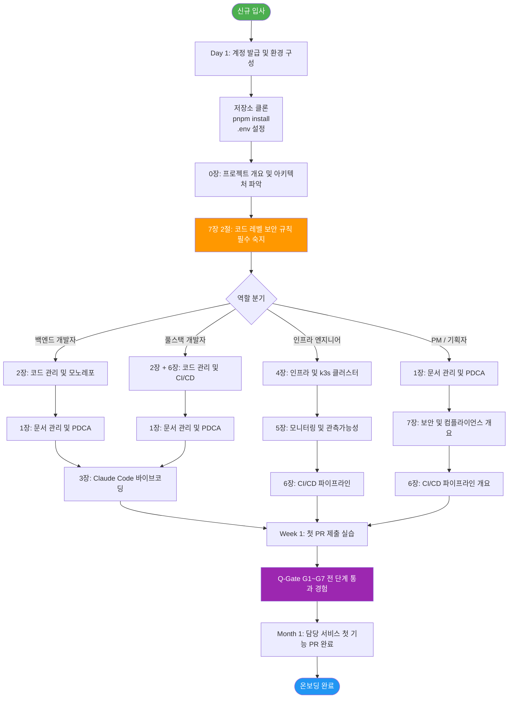
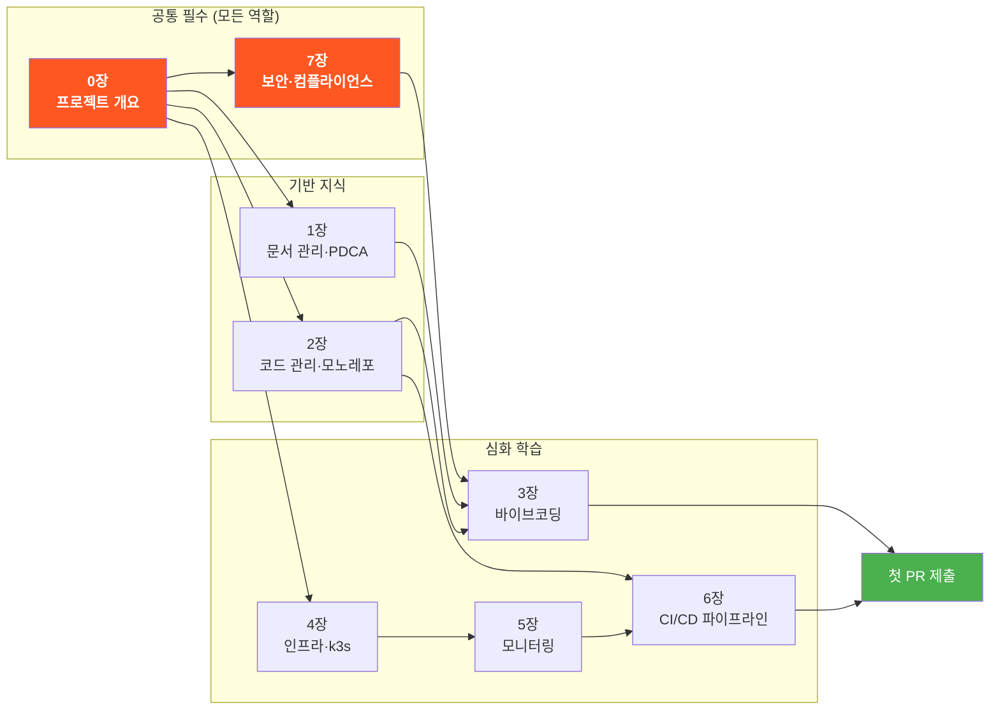

# 공공기관 SaaS 프레임워크 — 신규 직원 온보딩 가이드북

> **문서 ID**: ONBOARD-INDEX
> **버전**: 1.0.0 | **작성일**: 2026-04-11 | **작성자**: Implementer (Sonnet)
> **목적**: 신규 입사자 및 프로젝트 이전 인원의 빠른 온보딩 지원

---

## 가이드북 소개

이 가이드북은 공공기관 SaaS 프레임워크에 합류한 신규 직원이 프로젝트의 기술 체계, 개발 프로세스, 보안 규정을 빠르게 익힐 수 있도록 작성되었습니다.

**프레임워크 핵심 특성**:
- 인증 목표: CSAP 중/상 등급 + 행안부 정보화사업 감리기준 준수
- 런타임: k3s 클러스터 (온프레미스, WSL2 기반)
- CI/CD: Gitea Actions (자체 호스팅)
- 모노레포: pnpm workspace + Node.js 22

**이 가이드북을 읽어야 하는 사람**:
- 신규 입사자 (백엔드, 인프라, 풀스택, PM)
- 타 프로젝트에서 이전한 개발자
- 외부 협력사 직원 (접근 가능한 장만 해당)

---

## 전체 학습 경로 플로우차트

신규 입사자가 프로젝트에 완전히 합류하기까지의 전체 여정을 시각화한 흐름도입니다.



**플로우차트 구성요소 설명**

- **Day 1 (환경 구성)**: 계정 발급, 저장소 클론, `pnpm install`, `.env` 설정으로 시작합니다. `pnpm build`가 성공하는 것을 확인한 후 다음 단계로 진행합니다.
- **0장 필수 선행**: 개별 서비스 코드를 읽기 전에 반드시 전체 아키텍처를 파악해야 합니다. 맥락 없이 마이크로서비스 코드를 보면 방향을 잃기 쉽습니다.
- **7장 2절 조기 숙지**: 보안 규칙을 첫째 날 숙지해야 첫 PR부터 CSAP 위반 없이 작성할 수 있습니다. 나중에 수정하는 것보다 처음부터 올바르게 작성하는 것이 효율적입니다.
- **역할 분기**: 팀원의 역할에 따라 우선 학습할 장이 다릅니다. 그러나 0장, 7장은 모든 역할에 공통 필수입니다.
- **Q-Gate 경험**: 첫 주 안에 G1~G7 전 단계를 직접 통과해 보는 것이 중요합니다. 게이트의 의미를 이해해야 이후 개발에서 자연스럽게 준수할 수 있습니다.

---

## 목차 및 장별 안내

| 장 | 파일 | 주제 | 예상 학습 시간 |
|----|------|------|--------------|
| 0장 | [00-overview.md](00-overview.md) | 프로젝트 개요 및 전체 구조 | 30분 |
| 1장 | [01-document-management.md](01-document-management.md) | 문서 관리 및 PDCA 사이클 | 45분 |
| 2장 | [02-code-management.md](02-code-management.md) | 코드 관리 및 모노레포 | 45분 |
| 3장 | [03-vibecoding.md](03-vibecoding.md) | Claude Code 바이브코딩 | 60분 |
| 4장 | [04-infrastructure.md](04-infrastructure.md) | 인프라 및 k3s 클러스터 운영 | 60분 |
| 5장 | [05-monitoring.md](05-monitoring.md) | 모니터링 및 관측가능성 | 45분 |
| **6장** | **[06-cicd.md](06-cicd.md)** | **CI/CD 파이프라인** | **90분** |
| **7장** | **[07-security-compliance.md](07-security-compliance.md)** | **보안 및 컴플라이언스** | **120분** |

---

## 역할별 학습 경로

역할에 따라 우선 학습해야 할 장과 예상 소요 시간을 아래 간트 차트로 확인하십시오.

```mermaid
gantt
  title 역할별 온보딩 학습 경로 (단위: 일)
  dateFormat  D
  axisFormat  %d일차

  section 백엔드 개발자
  0장 - 아키텍처 개요        :done,    be1, 1, 1d
  7장 - 보안 규칙 (필수)     :crit,    be2, 2, 1d
  2장 - 코드 관리            :active,  be3, 3, 1d
  1장 - 문서 관리            :         be4, 4, 1d
  6장 - CI/CD                :         be5, 5, 1d
  3장 - 바이브코딩           :         be6, 6, 2d
  실습 - 첫 PR 제출          :         be7, 7, 1d
  4장 5장 - 인프라/모니터링  :         be8, 15, 5d

  section 인프라 엔지니어
  0장 - 아키텍처 개요        :done,    ie1, 1, 1d
  4장 - 인프라 및 k3s        :crit,    ie2, 2, 2d
  6장 - CI/CD 파이프라인     :crit,    ie3, 4, 2d
  5장 - 모니터링             :active,  ie4, 6, 1d
  7장 - 보안 도구            :         ie5, 7, 1d
  1장 - 문서 관리            :         ie6, 8, 1d
  실습 - 파이프라인 수정 PR  :         ie7, 9, 1d
  2장 3장 - 코드/바이브코딩  :         ie8, 15, 3d

  section 풀스택 개발자
  0장 - 아키텍처 개요        :done,    fs1, 1, 1d
  7장 - 보안 규칙 (필수)     :crit,    fs2, 2, 1d
  2장 - 코드 관리            :active,  fs3, 3, 1d
  6장 - CI/CD                :         fs4, 4, 1d
  1장 - 문서 관리            :         fs5, 5, 1d
  3장 - 바이브코딩           :         fs6, 6, 1d
  실습 - 첫 PR 제출          :         fs7, 7, 1d
  4장 5장 - 인프라/모니터링  :         fs8, 15, 5d

  section PM / 기획자
  0장 - 아키텍처 개요        :done,    pm1, 1, 1d
  1장 - 문서 관리            :crit,    pm2, 2, 1d
  7장 - 컴플라이언스 개요    :active,  pm3, 3, 1d
  6장 - 파이프라인 개요      :         pm4, 4, 1d
  5장 - 모니터링 지표        :         pm5, 5, 1d
  감리 대비 체크리스트 작성  :         pm6, 15, 5d
```



**간트 차트 범례**

- 짙은 회색 (`done`): 전체 역할 공통 필수 선행 학습
- 빨간색 (`crit`): 역할별 가장 중요한 핵심 장 — 반드시 집중 학습
- 파란색 (`active`): 핵심 다음으로 우선 학습
- 흰색: 첫째 달 내 완료 권장

---

### 백엔드 개발자

프로젝트의 마이크로서비스(`platform/services/`)를 개발하는 역할입니다.

```
Day 1: 0장 → 2장 → 7장 (보안 규칙 — 필수)
Day 2: 1장 → 6장 (CI/CD 파이프라인)
Week 1: 3장 → 실습 (첫 PR 제출)
Month 1: 4장 → 5장 → 전체 복습
```

**특히 중요한 장**: 7장 (보안 컴플라이언스)
- `7.2절`: RBAC, 암호화, Zod 검증 — 코드에 즉시 적용
- `7.3절`: N2SF 데이터 등급 — AI 기능 개발 시 필수
- `7.4절`: 감사 로그 작성법 — 모든 민감 작업에 적용

### 인프라/DevOps 엔지니어

k3s 클러스터, CI/CD 파이프라인, 모니터링을 담당하는 역할입니다.

```
Day 1: 0장 → 4장 → 6장
Day 2: 5장 → 7장 (보안 도구 절 중심)
Week 1: 1장 → 실습 (파이프라인 수정 PR)
Month 1: 2장 → 3장 → 전체 복습
```

**특히 중요한 장**: 4장, 5장, 6장
- `6.5절`: DevSecOps 파이프라인 — Trivy, Semgrep 운영
- `6.7절`: DORA 게이트 — 메트릭 기반 배포 관리
- `7.6절`: CSAP 증거 수집 자동화

### 풀스택 개발자

프런트엔드(`platform/apps/portal/`)와 백엔드를 함께 개발하는 역할입니다.

```
Day 1: 0장 → 7장 (보안 규칙)
Day 2: 2장 → 6장 (CI/CD)
Week 1: 1장 → 3장 → 실습
Month 1: 4장 → 5장
```

**특히 중요한 내용**:
- `7.2.5절`: XSS 방지 (DOMPurify) — 프런트엔드 직접 관련
- `7.2절`: 입력 검증 (Zod) — API와 폼 모두 적용

### PM / 기술 관리자

프로젝트 계획, 문서 관리, 감리 대응을 담당하는 역할입니다.

```
Day 1: 0장 → 1장
Day 2: 7장 (컴플라이언스 개요)
Week 1: 6장 (파이프라인 개요) → 5장 (모니터링)
Month 1: 전체 복습 + 감리 대비 체크리스트
```

**특히 중요한 내용**:
- `7.1절`: 보안 프레임워크 개요 (CSAP, ISMS-P, N2SF)
- `7.6절`: CSAP 증거 수집 — 감리 준비
- `6.7절`: DORA 게이트 — 팀 성과 지표

---

## 가이드북 의존 관계도

어떤 장을 먼저 읽어야 하는지 선행 학습 의존성을 시각화한 그래프입니다.



**의존 관계 설명**

- **0장 (프로젝트 개요)**: 유일한 선행 의존 없음. 모든 장의 시작점입니다. 전체 아키텍처, 17개 서비스, 패키지 구조를 파악합니다.
- **7장 (보안·컴플라이언스)**: 0장 완료 후 즉시 읽어야 합니다. CSAP D-08/D-09/D-12 코딩 규칙을 모르면 첫 PR부터 규정 위반이 발생합니다.
- **1장, 2장 (기반 지식)**: PDCA 문서 사이클과 모노레포 구조 이해는 3장 바이브코딩 실습의 전제 조건입니다.
- **4장 → 5장 → 6장 (인프라 심화)**: 인프라를 이해해야 모니터링을 이해하고, 모니터링을 이해해야 CI/CD 파이프라인의 전체 맥락을 파악할 수 있습니다.
- **화살표 없는 교차 학습**: 개별 장은 독립적으로 참조할 수 있으나, 화살표로 표시된 의존 관계는 반드시 선행 학습 후 진행을 권장합니다.

---

## 빠른 시작 체크리스트

### Day 1: 첫째 날

```
[ ] 계정 발급 확인 (Gitea, Vault, k3s kubeconfig)
[ ] 저장소 클론: git clone git@gitea.saas.local:public-saas/ai-saas.git
[ ] 의존성 설치: pnpm install --frozen-lockfile
[ ] 0장 읽기: 프로젝트 전체 구조 파악
[ ] 7장 2절 읽기: 코드 레벨 보안 규칙 숙지
[ ] 로컬 환경 변수 설정: cp docs/env.example .env.local
[ ] .env.local에 Vault 개발 환경 시크릿 설정
[ ] 첫 번째 빌드 성공 확인: pnpm run build
```

### Week 1: 첫째 주

```
[ ] 1~7장 전체 읽기 (역할별 우선순위에 따라)
[ ] 간단한 feat/* 브랜치 생성 후 PR 제출 연습
[ ] Q-Gate (G1~G7) 통과 직접 경험
[ ] CI/CD 파이프라인 흐름 이해 (6장 실습 따라하기)
[ ] 7장 보안 체크리스트로 첫 PR 자가 점검
[ ] 팀 코드 리뷰 1회 이상 참여
[ ] 스테이징 환경 배포 확인: kubectl get pods -n saas-platform
```

### Month 1: 첫째 달

```
[ ] 담당 서비스 첫 기능 PR 완료 (feat/* → stg → main)
[ ] Semgrep + Trivy 로컬 실행 경험
[ ] 감사 로그 auditLog() 직접 구현
[ ] DORA 메트릭 현황 파악
[ ] CSAP 증거 수집 파이프라인 수동 실행 경험
[ ] 보안팀과 보안 점검 1회 참여
[ ] 팀 리드와 1:1 면담 (온보딩 피드백)
```

---

## 자주 묻는 질문

### Q. 로컬에서 시크릿을 어떻게 설정하나요?

Vault에서 개발 환경 시크릿을 가져와 `.env.local`에 저장합니다. 절대 시크릿을 코드에 하드코딩하거나 저장소에 커밋하면 안 됩니다.
자세한 내용: [7장 5절 — 환경 변수 및 시크릿 관리](07-security-compliance.md#5-환경-변수-및-시크릿-관리)

### Q. PR을 올렸는데 Q-Gate가 실패했습니다. 어떻게 하나요?

Q-Gate 실패 원인을 Gitea Actions 로그에서 확인하고, [6장 4절 — Q-Gate 실패 시 처리 방법](06-cicd.md#43-q-gate-실패-시-처리-방법)을 참고하십시오.

### Q. 새 API를 만들 때 반드시 해야 하는 것은 무엇인가요?

CSAP D-08, D-12 요건에 따라 다음 세 가지가 필수입니다:
1. `verifyToken()` + `hasPermission()` (인증/인가)
2. Zod 스키마 입력 검증
3. 민감 작업 시 `auditLog()` 호출

자세한 내용: [7장 2절 — 코드 레벨 보안 규칙](07-security-compliance.md#2-코드-레벨-보안-규칙)

### Q. AI 기능을 개발할 때 주의할 점은 무엇인가요?

N2SF 데이터 등급을 반드시 확인해야 합니다. C/S 등급 데이터는 AI API에 절대 전송할 수 없습니다. 또한 외부 AI API를 직접 호출하지 말고 내부 AI Gateway를 경유해야 합니다.
자세한 내용: [7장 3절 — N2SF 데이터 등급 분류](07-security-compliance.md#3-n2sf-데이터-등급-분류)

### Q. 핫픽스가 긴급하게 필요합니다. 어떻게 하나요?

`hotfix/` 접두사 브랜치를 생성하고 push하면 hotfix 전용 파이프라인이 자동 실행됩니다. 스테이징 → 프로덕션 순서로 배포되며 프로덕션 배포 단계에서 수동 승인이 필요합니다.
자세한 내용: [6장 8절 — 핫픽스 프로세스](06-cicd.md#8-핫픽스-프로세스)

### Q. DORA 게이트에서 배포가 차단되었습니다. 어떻게 하나요?

변경 실패율(CFR)이 30%를 초과하면 배포가 차단됩니다. 최근 실패한 배포의 원인을 분석하고 해결한 후 재시도하십시오. 팀 리드와 보안팀에 상황을 보고해야 합니다.
자세한 내용: [6장 7절 — DORA 게이트](06-cicd.md#7-dora-게이트)

### Q. 실수로 .env 파일을 커밋했습니다. 어떻게 하나요?

즉시 해당 시크릿을 폐기 및 재발급하고 보안팀에 보고하십시오.
자세한 내용: [7장 5.4절 — .env 파일 커밋이 금지된 이유](07-security-compliance.md#54-env-파일-커밋이-금지된-이유)

### Q. CSAP 감사 증거는 어떻게 수집하나요?

`csap-evidence.yml` 파이프라인이 매주 월요일 09:00 KST에 자동 실행됩니다. 수동으로 실행하려면 Gitea Actions에서 workflow_dispatch를 사용하거나 스크립트를 직접 실행하십시오.
자세한 내용: [7장 6절 — CSAP 증거 수집 자동화](07-security-compliance.md#6-csap-증거-수집-자동화)

---

## 가이드북 기여 방법

이 가이드북은 지속적으로 개선됩니다. 오류 발견, 내용 추가, 개선 제안이 있으면 다음 절차로 기여하십시오.

### 수정 기여 방법

```bash
# 1. docs/ 브랜치 생성
git checkout stg
git checkout -b docs/onboarding-guide-improvement

# 2. 문서 수정
vi docs/guides/onboarding/{장번호}.md

# 3. 커밋 (Conventional Commits)
git commit -m "docs(onboarding): {수정 내용 요약}

- {수정한 이유}
- {추가된 내용}"

# 4. PR 제출 (docs/* 브랜치 PR은 코드 리뷰 1명으로 머지 가능)
git push origin docs/onboarding-guide-improvement
```

### 새 장 추가 방법

새 장을 추가할 때는 다음 형식을 따르십시오.

```markdown
# {번호}장: {제목}

> 공공기관 SaaS 프레임워크 신규 직원 온보딩 가이드북
> 버전: 1.0.0 | 작성일: {날짜} | 대상: {대상 직군}

---

## 목차
...

## 변경 이력

| 버전 | 일자 | 내용 | 작성자 |
|------|------|------|--------|
| 1.0.0 | {날짜} | 초안 작성 | {작성자} |
```

새 장을 추가하면 이 README의 목차 테이블도 함께 업데이트하십시오.

### 기여 원칙

- 모든 문서는 한국어로 작성합니다 (`CLAUDE.md §1`)
- 공공기관 표준 용어를 사용합니다
- 코드 예제는 실제 동작 가능한 코드여야 합니다
- 보안 관련 내용은 보안팀 검토 후 반영합니다

---

## 관련 문서 링크

| 카테고리 | 문서 | 경로 |
|---------|------|------|
| 프로젝트 하네스 | CLAUDE.md | `/data/ai-saas/CLAUDE.md` |
| CSAP 준수 규칙 | csap-compliance.md | `.claude/rules/csap-compliance.md` |
| Dead code 정책 | deadcode-policy.md | `.claude/rules/deadcode-policy.md` |
| 인프라 구성 가이드 | wsl-devops-complete-guide.md | `docs/07-infra/` |
| 보안 파이프라인 | cicd-security-pipeline.md | `docs/security/` |
| Dockerfile 캐시 최적화 | dockerfile-cache-optimization.md | `docs/guides/` |

---

## 변경 이력

| 버전 | 일자 | 내용 | 작성자 |
|------|------|------|--------|
| 1.0.0 | 2026-04-11 | 초안 작성 (6~7장 추가에 따른 인덱스 생성) | Implementer Agent |
| 1.1.0 | 2026-04-11 | Mermaid 다이어그램 3개 추가 — 전체 학습 경로 플로우차트, 역할별 간트 차트, 가이드북 의존 관계도 | Implementer (Sonnet) |
